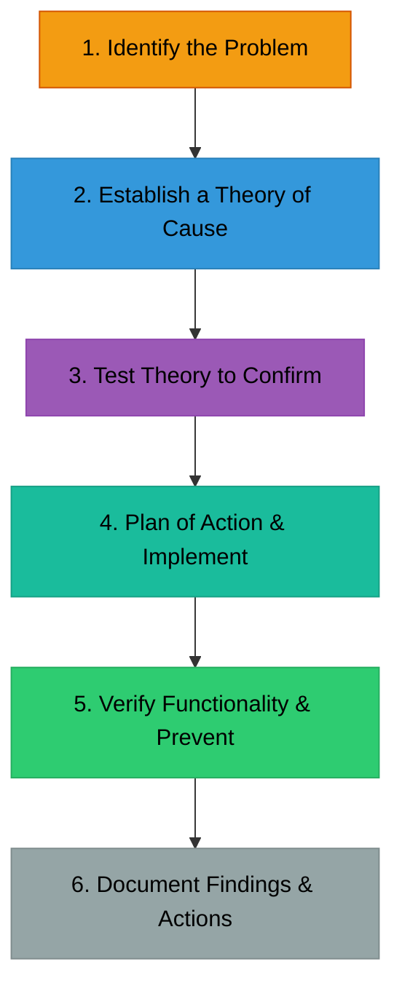

# 🔧 1.3 OS-Independent Troubleshooting
> **Tag:** #it-skills #troubleshooting #methodology #module-1

## 📌 The Logic of Troubleshooting
Troubleshooting is not about guessing; it is a logical, systematic process of elimination. Whether you are running Windows, Linux, macOS, or troubleshooting a network intrusion, the core diagnostic mindset remains exactly the same.

---

## 🛠️ The 6-Step CompTIA Troubleshooting Methodology

This structured process is the industry standard for resolving technical issues:

### 1. Identify the Problem
* Gather information from the user (what isn't working? did it work before?).
* Look for error codes, symptoms, and check logs.
* Determine if anything has changed recently (new updates, new hardware, configuration changes).

### 2. Establish a Theory of Probable Cause
* Brainstorm possible reasons for the issue.
* **Start with the simple things**: Is it plugged in? Is it turned on? Is the network cable connected? (Known as checking Layer 1 of the OSI model).

### 3. Test the Theory to Determine Cause
* Test your theory. If your theory is "the internet is down because the cable is unplugged," check the cable.
* If your theory is disproved, establish a new theory and test it.

### 4. Establish a Plan of Action & Implement the Solution
* Plan how you will fix the issue without causing other problems.
* Implement the solution. (If you need administrator permissions, obtain them).

### 5. Verify Full System Functionality
* Make sure the system is fully working now.
* Implement preventative measures so the issue doesn't happen again (e.g., updating software, replacing weak cables, setting up alerts).

### 6. Document Findings, Actions, and Outcomes
* Write down what the problem was, what caused it, and how you fixed it.
* *Why?* So next time you (or a teammate) run into this issue, you can resolve it instantly!

---

## ⚡ OS-Independent Hardware Issues

If a computer won't boot into any operating system, the issue is hardware-related:

* **POST (Power-On Self-Test)**: A diagnostic test run by the computer's BIOS/UEFI firmware when it first boots up. It checks if the CPU, RAM, and storage are working.
* **Beep Codes**: If the screen is black but the motherboard is beeping, those beeps are Morse-code-like error messages. (e.g., 3 long beeps often means a RAM failure).
* **BIOS/UEFI**: The firmware built into the motherboard that starts the OS. You can configure boot priorities and hardware security settings (like **Secure Boot**) here.

---

## 🧠 Connection to Cybersecurity
In cybersecurity, when a breach occurs, you follow this exact methodology to investigate and contain the incident:
1. **Identify**: Find out which systems are compromised.
2. **Theory**: How did the attacker get in? (e.g., phishing link or open port).
3. **Test**: Confirm the access point.
4. **Plan/Execute**: Isolate the machine (Containment) and delete the malware (Eradication).
5. **Verify**: Ensure the systems are clean and functioning.
6. **Document**: Write an incident response report.
