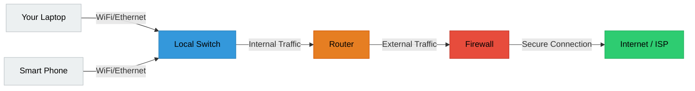

# 🌐 1.5 Basics of Computer Networking
> **Tag:** #it-skills #networking #basics #module-1

## 📌 Networking: The Connecting Tissue
A network is simply two or more computers connected together so they can share resources and communicate. In cyber security, understanding how data travels across the network is essential, as most attacks happen remotely over network connections.

---

## 🗺️ Types of Networks (Geographical Scale)
* **LAN (Local Area Network)**: A network confined to a small geographic area, like a single home, office, or school.
* **WLAN (Wireless LAN)**: A LAN that relies on wireless connections (Wi-Fi).
* **WAN (Wide Area Network)**: A network that spans a large geographic area (e.g., connecting offices in different cities). The Internet is the largest WAN in the world.
* **MAN (Metropolitan Area Network)**: Spans a physical town or city (e.g., a university campus network or smart-city network).

---

## 🛠️ Essential Network Devices

To understand how data flows, you must know what the hardware does:

1. **Switch**: Connects devices *inside* the same local network (LAN). It uses **MAC Addresses** to send data packets directly to the correct computer on the local floor.
2. **Router**: Connects different networks together (e.g., connecting your local office network to the Internet). It uses **IP Addresses** to route data across different networks.
3. **Firewall**: A security device that monitors incoming and outgoing network traffic and decides whether to allow or block it based on a defined set of security rules.
4. **Access Point (AP)**: Transmits wireless signals (Wi-Fi) so wireless devices can connect to the wired network.

---

## 📇 IP Address vs. MAC Address (Simplified)
* **MAC Address (Media Access Control)**:
  * *What it is*: A unique physical identifier burned into your network interface card (NIC) at the factory.
  * *Analogy*: Your government-issued Social Security Number or national ID card. It never changes.
* **IP Address (Internet Protocol)**:
  * *What it is*: A logical address assigned to your device when it connects to a network.
  * *Analogy*: Your current home mailing address. If you move houses (or change Wi-Fi networks), your mailing address changes.

---

## 🧠 Diagnostic Practice
If your computer cannot connect to the internet, you can use these simple diagnostic commands to isolate where the connection breaks:

1. **Ping your loopback address (`ping 127.0.0.1`)**:
   * If this succeeds, it means your computer's local network software (TCP/IP stack) is working properly.
2. **Ping your local router (`ping 192.168.1.1` - replace with your default gateway IP)**:
   * If this succeeds, it means your computer is successfully talking to the local router. The issue is further out (ISP or external internet).
3. **Ping an internet server by IP (`ping 8.8.8.8`)**:
   * If this succeeds, you have internet access! If you still can't open websites, the issue is **DNS** (your computer cannot translate domain names like `google.com` to IP addresses).
