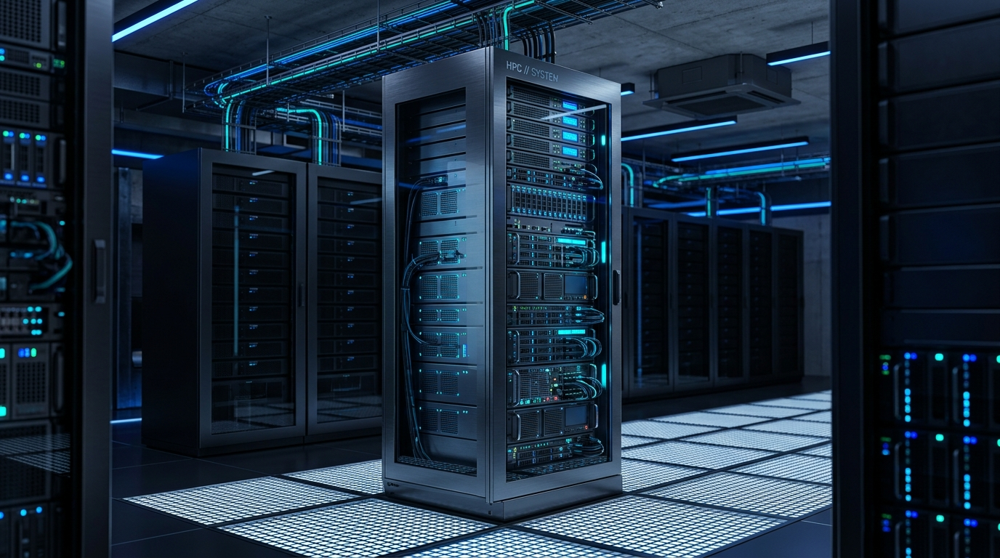
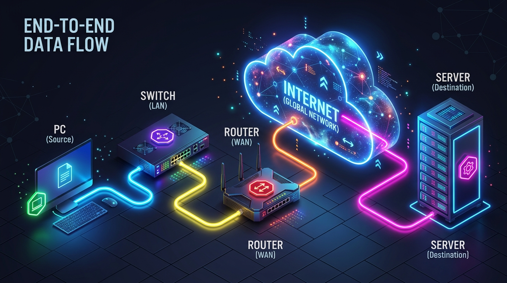
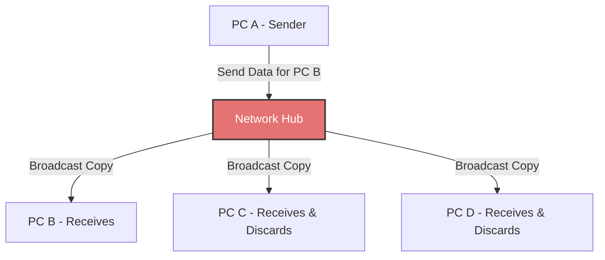
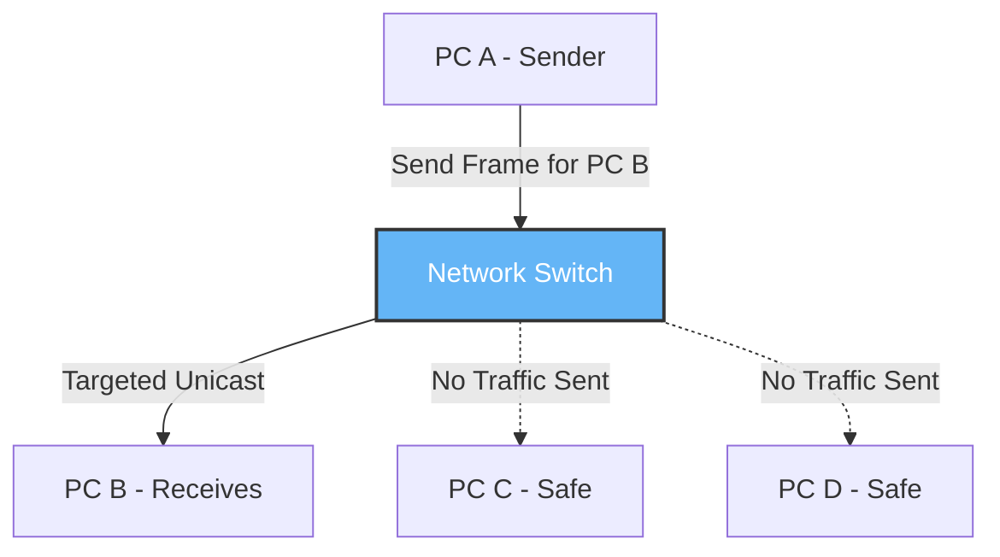
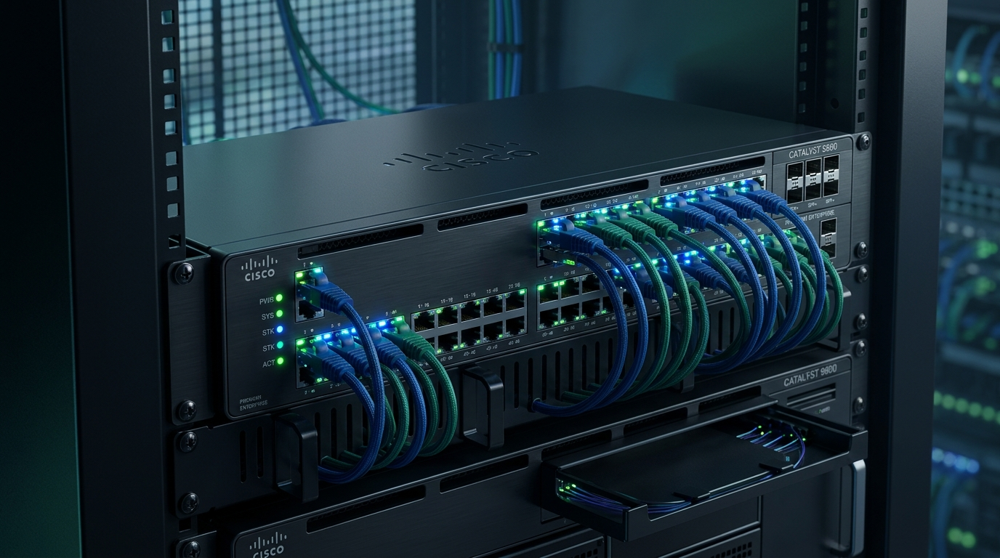
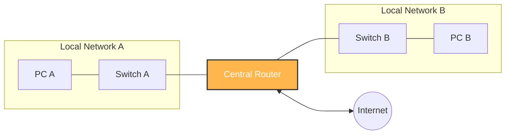
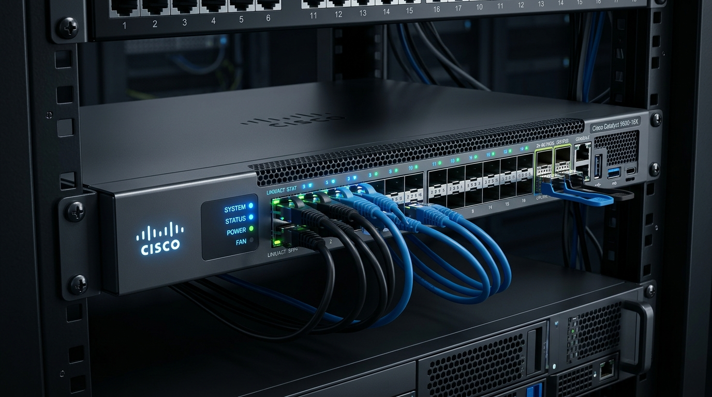
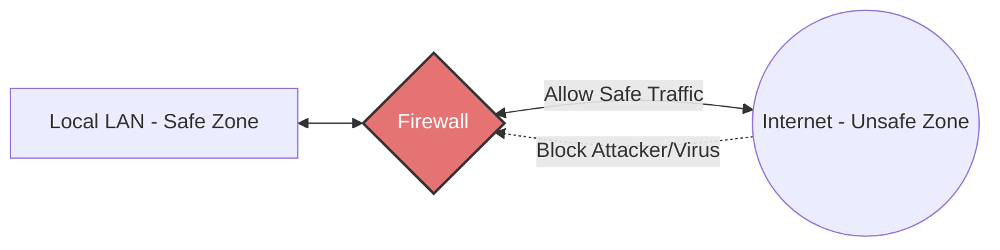
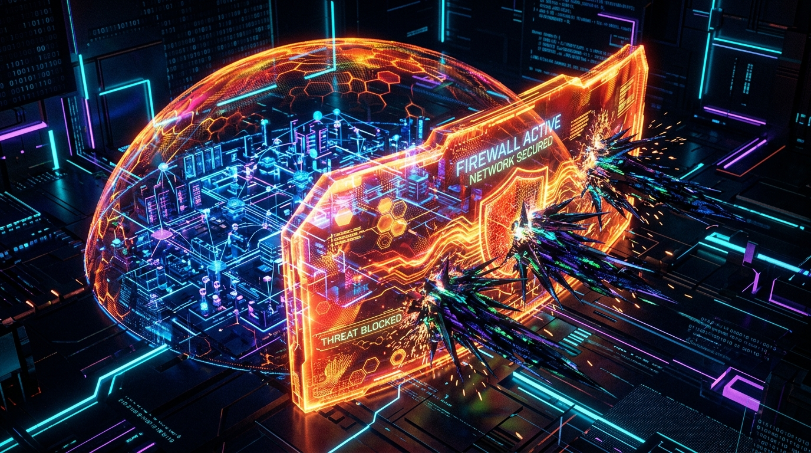

← [[Course on CCNA|Go Back to Course Hub]]

# 🔌 Day 01: Network Devices & Packet Tracer Lab

Welcome to the notes for **Day 1: Network Devices & Packet Tracer Introduction** of Jeremy's IT Lab CCNA Course! Ye note aapko network devices ke roles, real-world examples, visual diagrams, aur Cisco Packet Tracer software chalane ke steps pure Hinglish language mein samjhayega.

---

## 🌐 1. Network Basics (Network ke Buniyaadi Concepts)

### What is a Network?
Jab do ya do se zyada devices (hosts/nodes) aapas mein connect hote hain taaki wo data, services, aur resources (jaise printer, internet) share kar sakein, use hum **Network** kehte hain.

*   **Client:** Wo device jo service ya resource ko request karta hai (Jaise web page kholte waqt aapka phone).
*   **Server:** Wo device jo services ya resources provide karta hai (Jaise Google, YouTube ya Facebook ke servers).

    

*   **End Hosts (Hosts):** Wo network endpoints jo data send ya receive karte hain (PC, Laptop, Server, Smart TV, IP Printer).
*   **Intermediate Devices:** Network ke beech ke routing aur switching devices jo traffic flow ko guide aur transfer karte hain (Switch, Router, Firewall).

### 🛣️ End-to-End Data Flow Path (PC -> Switch -> Router -> Internet -> Server)
Data jab ek device se doosre network ke server tak jata hai, toh wo is sequential path ko follow karta hai:
`PC (Client) -> Switch (LAN) -> Router (Gateway) -> Internet (WAN) -> Server`

---

## 🔌 2. Deep Dive: Core Network Devices, Diagrams, & Examples

### A. Network Hub (Layer 1 - Physical Layer Device)
Hub ek legacy (purana) device hai jiske paas data forward karne ki koi intelligence nahi hoti. 

#### 📊 Hub Working Diagram:
Jab Computer A sirf Computer B ko data bhejna chahta hai, toh Hub use sabhi connected ports par broadcast kar deta hai:

#### 💡 Real-world Example (Udaharan):
*   **Megaphone Example:** Imagine kijiye ek class mein ek teacher ko kisi ek student (Rohan) se baat karni hai, par wo megaphone lekar poori class ke saamne chillakar bolti hai. Rohan toh sunega hi, par baaki ke students ko bhi zabardasti sunna padega. Hub bilkul isi megaphone ki tarah hai!

---

### B. Network Switch (Layer 2 - Data Link Layer Device)
Switch ek intelligent local device hai jo ek hi local area network (LAN) ke devices ko connect karta hai. Ye local traffic forward karne ke liye **MAC Address Table** ka use karta hai.

#### 📊 Switch Working Diagram:
Jab PC A kisi specific frame ko PC B ke liye bhejta hai, toh Switch use filter karke sirf PC B ke port par forward karta hai:

#### 💡 Real-world Example (Udaharan):
*   **Postman or Private Courier:** Jab postman aapke ghar par koi personal letter lekar aata hai, toh wo use seedhe aapke address par deliver karta hai, na ki poore mohalle mein copy baantta hai. Switch bilkul isi tarah targeted delivery karta hai.

---

### C. Network Router (Layer 3 - Network Layer Device)
Router ka main kaam hota hai alag-alag networks (jaise different LANs ya LAN to WAN/Internet) ko connect karna aur data packet ke liye best route select karna. Ye routing ke liye **IP Addresses** ka use karta hai.

#### 📊 Router Working Diagram:
Router local network (LAN) ke data packets ko forward karke doosre network ya Internet tak pahunchata hai:

#### 💡 Real-world Example (Udaharan):
*   **Airport Sorting Center:** Agar aap Delhi se New York koi parcel bhej rahe hain, toh Delhi ka post office (Switch) use seedhe New York nahi pahuchega. Wo use international sorting hub (Router) par bhejega, jo decide karega ki packet ko flight A se bhejna hai ya flight B se.

---

### D. Firewall (Network Security Shield)
Firewall network security ka guard hai jo set rules (ACLs - Access Control Lists) ke basis par safe traffic ko allow aur unsafe traffic ko block karta hai.

#### 📊 Firewall Working Diagram:
Firewall clean traffic ko local LAN se internet tak jane deta hai aur internet se aane wale malicious scans ko block kar deta hai:

#### 💡 Real-world Example (Udaharan):
*   **Building Security Guard:** Ek building ke gate par security guard khada hota hai. Wo sirf unhi logon ko andar aane deta hai jinke paas ID card (Safe Traffic) hota hai, aur suspicious logon (Hacker/Virus) ko gate par hi rok deta hai.

---

### E. Access Point (AP) & Wireless LAN Controller (WLC)
*   **Access Point (AP):** Wi-Fi signals transmit karta hai taaki devices wirelessly network se connect ho sakein.
*   **Wireless LAN Controller (WLC):** Multiple Access Points ko centralized place se manage aur configure karne wala controller device.

#### 💡 Real-world Example (Udaharan):
*   **Hotel Wi-Fi System:** Jab aap kisi hotel mein jate hain, toh har floor aur corridor mein alag-alag Access Points (APs) lage hote hain. Lekin un sabhi APs ko hotel ka IT department ek single controller (WLC) se manage karta hai taaki aapko pure hotel mein seamless roaming mil sake.

---

## 🧪 3. Day 01 Lab: Cisco Packet Tracer Introduction

**Cisco Packet Tracer** ek network simulation program hai jiska use network topology design karne aur config test karne ke liye kiya jata hai.

### Key Workspaces:
1.  **Logical Workspace:** Yahan hum network topology ka logical diagram (devices select karna aur unhe connect karna) design karte hain. (Most of the time yahi workspace use hota hai).
2.  **Physical Workspace:** Yahan hum geographic visual layout (city, building, office rooms, wiring closets) dekh sakte hain.

### Step-by-Step Lab Execution:
1.  **Select & Place Devices:** 
    *   Left-bottom corner se **Network Devices -> Switches** mein jayein aur ek Cisco **2960 Switch** select karke workspace par drag & drop karein.
    *   **End Devices** mein jayein aur teen **PCs** (PC0, PC1, PC2) workspace par drop karein.
2.  **Connect Devices:**
    *   Connections tool (lightning bolt icon) par click karein.
    *   PC se Switch ko connect karne ke liye **Copper Straight-Through cable** select karein.
    *   PC ke **FastEthernet0** port ko select karein aur use Switch ke kisi bhi **FastEthernet** port (e.g., Fa0/1) se connect karein.
3.  **Link Lights (Cables ka Status Color):**
    *   🔴 **Red Link Light:** Link down hai (Cables connect nahi hain ya administrative down hai).
    *   🟠 **Amber/Orange Link Light:** Link state transition (Spanning Tree Protocol - STP loop checking phase) mein hai. Kuch seconds wait karein.
    *   🟢 **Green Link Light:** Link active aur operational hai.
4.  **Configure IP Addresses (Logical IP Config):**
    *   PC0 par click karein -> **Desktop** tab -> **IP Configuration** par jayein.
    *   IP Address set karein: `192.168.1.1` aur Subnet Mask set karein: `255.255.255.0`.
    *   Isi tarah PC1 ko IP: `192.168.1.2` aur PC2 ko IP: `192.168.1.3` assign karein (same subnet mask ke sath).
5.  **Test Connectivity:**
    *   PC0 par click karein -> **Desktop** tab -> **Command Prompt** kholin.
    *   Ping run karein: `ping 192.168.1.2`
    *   Agar settings sahi hain, toh aapko response milega: `Reply from 192.168.1.2: bytes=32...`

---

## 📝 4. CCNA Day 01 Practice Questions (Self-Practice Quiz)

Aap yahan questions ko read karke answers verify kar sakte hain (Answer dekhne ke liye click karein):

1.  **Q1: Kis Layer 1 device ke paas forwarding intelligence nahi hoti aur wo aane wale traffic ko sabhi ports par copy (broadcast) kar deta hai?**
    

    
🔓 Click to Reveal Answer

    **Answer:** **Hub**
    

2.  **Q2: Switch (Layer 2 device) local LAN network ke devices ko identify aur forward karne ke liye kis address ka use karta hai?**
    

    
🔓 Click to Reveal Answer

    **Answer:** **MAC Address (Physical Address)**
    

3.  **Q3: Router (Layer 3 device) alag-alag networks ke beech path selection aur forwarding ke liye kis address ka use karta hai?**
    

    
🔓 Click to Reveal Answer

    **Answer:** **IP Address (Logical Address)**
    

4.  **Q4: Ek safe internal LAN network aur unsafe external Internet network ke border par traffic control karne ke liye kis network device ka use hota hai?**
    

    
🔓 Click to Reveal Answer

    **Answer:** **Firewall**
    

5.  **Q5: SOHO (Small Office / Home Office) router mein kaun-kaun se devices integrated hote hain?**
    

    
🔓 Click to Reveal Answer

    **Answer:** **Switch, Router, Access Point (AP), aur basic Firewall.**
    

6.  **Q6: Enterprise network mein multiple Access Points (APs) ko centralized portal se control aur manage karne ke liye kis device ka use hota hai?**
    

    
🔓 Click to Reveal Answer

    **Answer:** **WLC (Wireless LAN Controller)**
    

7.  **Q7: Cisco Packet Tracer mein local device link cable lagane par immediate "Amber/Orange" color dikhane ka kya reason hota hai?**
    

    
🔓 Click to Reveal Answer

    **Answer:** **Spanning Tree Protocol (STP) loop protection check phase chal raha hota hai (usually takes 30-50 seconds).**
    

8.  **Q8: PC0 aur PC1 ke beech network layer connectivity check karne ke liye standard tool (command line utility) kaun sa hai?**
    

    
🔓 Click to Reveal Answer

    **Answer:** **ping command (ICMP request/reply protocol)**
    

9.  **Q9: PC se switch ko connect karne ke liye kis class/type ki copper cable use ki jati hai?**
    

    
🔓 Click to Reveal Answer

    **Answer:** **Copper Straight-Through Cable**
    

10. **Q10: Packet Tracer UI mein "Logical" aur "Physical" workspaces ke beech kya difference hai?**
    

    
🔓 Click to Reveal Answer

    **Answer:** **Logical workspace** network topology design aur configurations ke liye use hota hai. **Physical workspace** network components ko geography layout, floor mapping, aur network rack cabinet view mein dikhata hai.
    

