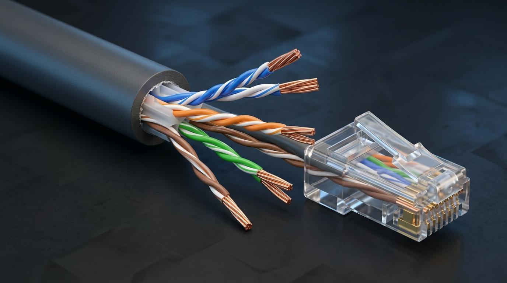
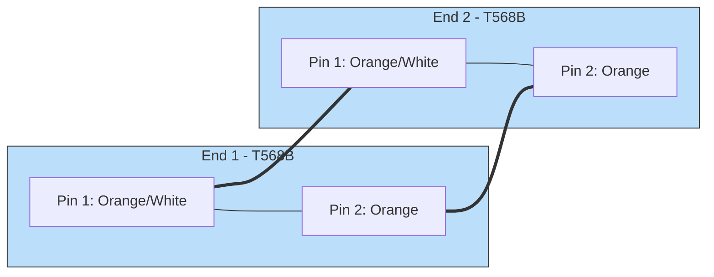
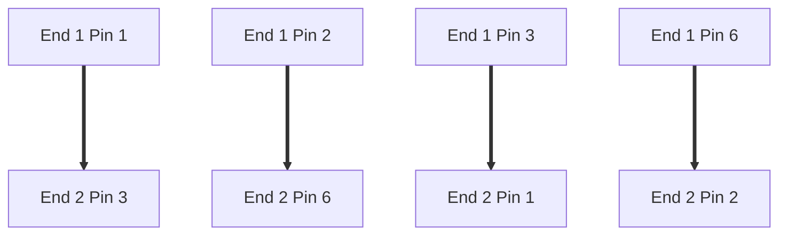
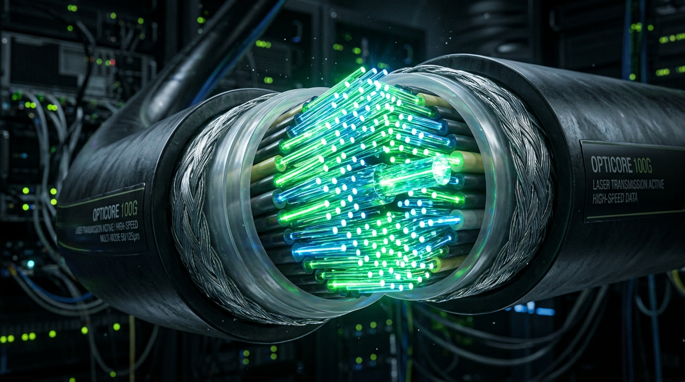
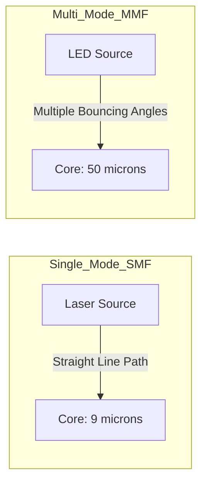
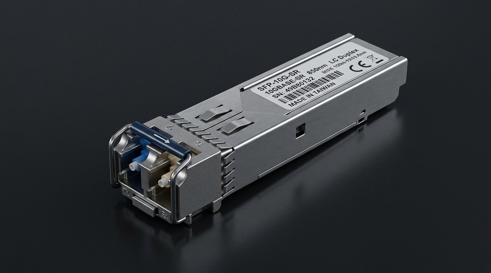

← [[Course on CCNA|Go Back to Course Hub]]

# 🔌 Day 02: Interfaces and Cables

Welcome to the notes for **Day 2: Interfaces and Cables** of Jeremy's IT Lab CCNA Course! Ye note aapko networking cables (Copper vs Fiber), wiring standards (Straight-Through vs Crossover), interface naming schemes, aur standards ko detailed visual diagrams aur real-world examples ke sath pure Hinglish language mein samjhayega.

---

## 🎚️ 1. Bits, Bytes, aur Transmission Speeds

Computer networks mein data transmission ko hamesha **bits per second (bps)** mein measure kiya jata hai.

*   **Bit (b):** Smallest unit of data (0 ya 1).
*   **Byte (B):** 8 bits ka group (`1 Byte = 8 bits`).
*   *Note:* File sizes ko hamesha **Bytes** (e.g., MB, GB) mein measure kiya jata hai, jabki Internet bandwidth/speed ko hamesha **bits** (e.g., Mbps, Gbps) mein measure kiya jata hai.

### Speed Metric Units:
*   **1 Kbps (Kilobit per second):** 1,000 bps
*   **1 Mbps (Megabit per second):** 1,000,000 bps
*   **1 Gbps (Gigabit per second):** 1,000,000,000 bps

---

## 🔌 2. Copper Cabling (Twisted-Pair Cables)

Copper cables electrical signals ke zariye data carry karte hain. Inme copper wires aapas mein twisted hoti hain.



### Twisting Kyun Ki Jati Hai?
*   **EMI (Electromagnetic Interference):** Bahar ke electrical lines ya appliances se aane wale external noise ko filter karne ke liye.
*   **Crosstalk:** Ek hi cable ke andar aapas mein parallel chalne wali do wires ke magnetic fields ek doosre ke signals ko corrupt na karein, use prevent karne ke liye wires ko twist kiya jata hai.

### UTP vs STP Cables:
*   **UTP (Unshielded Twisted Pair):** Wires twisted hoti hain par koi extra shield nahi hoti. Sasta aur common.
*   **STP (Shielded Twisted Pair):** Har twisted wire pair par ek foil/shielding hoti hai jo external noise se protection deti hai. Expensive aur highly industrial environments mein use hota hai.

#### 📊 UTP Category Standards Table:
| Category | Max Speed | Max Distance | Common Use |
| :--- | :--- | :--- | :--- |
| **Cat 3** | 10 Mbps | 100 meters | Legacy Ethernet / Old telephone |
| **Cat 5** | 100 Mbps | 100 meters | Fast Ethernet (Obsolete) |
| **Cat 5e** | 1 Gbps (1000 Mbps) | 100 meters | Gigabit Ethernet (Very common) |
| **Cat 6** | 10 Gbps (10 Gbps @ 55m) | 55-100 meters | Gigabit / 10G Ethernet |
| **Cat 6a** | 10 Gbps | 100 meters | 10G Ethernet (Highly recommended) |

---

## 🌐 3. RJ45 Wiring Standards (T568A vs T568B)

Copper twisted-pair cables mein ends par **RJ45 (Registered Jack 45)** connectors lagaye jate hain. Wires ke pin connections ke liye do standards hote hain:

```
T568A Pins: Green-White, Green, Orange-White, Blue, Blue-White, Orange, Brown-White, Brown
T568B Pins: Orange-White, Orange, Green-White, Blue, Blue-White, Green, Brown-White, Brown
```

### A. Straight-Through Cable (Pins 1-to-1)
*   **Wiring:** Dono ends par same standard hota hai (Dono ends par T568A ya dono ends par T568B).
*   **When to Use:** **Different (heterogeneous) devices** ko connect karne ke liye:
    *   PC/Host to Switch
    *   Switch to Router
    *   Router to Switch



---

### B. Crossover Cable (Pins Crossed)
*   **Wiring:** Ek end par T568A aur dusre end par T568B wiring standard hota hai (Pin 1 go to Pin 3, Pin 2 go to Pin 6).
*   **When to Use:** **Same (homogeneous) devices** ko connect karne ke liye:
    *   Switch to Switch
    *   Router to Router
    *   PC to PC
    *   PC to Router (Exceptions: Dono Layer 3 category logic devices hote hain).



### C. Auto-MDIX (Medium Dependent Interface Crossover)
Modern network devices mein ek automatic feature hota hai jise **Auto-MDIX** kehte hain. Ye automatically detect kar leta hai ki kis type ki cable lagayi gayi hai aur electronic configuration ko adjust kar leta hai. 
*   *Imp:* Agar Auto-MDIX enabled hai, toh aap straight-through cable se same devices ko bhi connect karenge toh wo connectivity normal chalegi.

---

## ⚡ 4. Fiber-Optic Cabling (Light-based Transmission)

Fiber-optic cables glass ya plastic ke thin strands hote hain jo light signals ke zariye data travel karwate hain. Inke benefits ye hain ki inme **EMI interference bilkul zero** hoti hai aur inki range copper se kahin zyada hoti hai.



### Single-Mode Fiber (SMF) vs Multi-Mode Fiber (MMF):

#### 1. Single-Mode Fiber (SMF)
*   **Working:** Iska glass core bohot thin (approx **9 microns**) hota hai aur light ke liye sirf **single path** (mode) hota hai. Light source ke liye **Laser** use hoti hai.
*   **Distance:** Bohot lambi range (up to 10 km to 40 km+).
*   **Cost:** Cable aur transceivers (laser-based) bohot expensive hote hain.
*   **Analogy:** Ek narrow corridor jisme light bilkul straight travel karti hai bina diwaron se takraye.

#### 2. Multi-Mode Fiber (MMF)
*   **Working:** Iska core thoda broad (**50 to 62.5 microns**) hota hai aur light multiple paths/modes mein travel karti hai. Light source ke liye sasta **LED** light use hoti hai.
*   **Distance:** Choti range (usually up to 550 meters).
*   **Cost:** Sasta option (cables and transceivers light emitting diode wale hote hain).
*   **Analogy:** Ek broad hall jahan light diwaron par bounce (reflect) karte huye aage badhti hai.



---

## 🎛️ 5. Cisco Interface Naming & Transceivers

Cisco devices par physical ports ko configure aur identify karne ke liye unke speeds aur positions ke basis par names hote hain.

### Interface Speed Naming Standards:
1.  **Ethernet (e0, e1):** 10 Mbps speed.
2.  **FastEthernet (Fa0/1, Fa0/2):** 100 Mbps speed.
3.  **GigabitEthernet (Gi0/1, Gi0/2):** 1 Gbps (1000 Mbps) speed.
4.  **TenGigabitEthernet (Te0/1, Te0/2):** 10 Gbps speed.

### SFP (Small Form-Factor Pluggable) Transceivers:
Modern routers/switches par raw slots hote hain jise SFP kehte hain. Inme pluggable transceivers insert kiye jate hain.
*   **SFP:** Up to 1 Gbps connections (can support copper RJ45 or fiber LC connectors).
*   **SFP+:** Up to 10 Gbps connections.
*   **Hot-Swappable:** In transceivers ko insert ya remove karne ke liye device ko power off karne ki zaroorat nahi hoti.



---

## 🧪 6. Day 02 Lab: Connecting Devices Walkthrough

Day 2 ke Cisco Packet Tracer lab mein hum crossover aur straight-through cabling ki practice karte hain:

1.  **Router to Router:** Connect karne ke liye **Copper Crossover cable** use karein (FastEthernet0/0 to FastEthernet0/0).
2.  **Switch to Switch:** Connect karne ke liye **Copper Crossover cable** use karein (FastEthernet0/1 to FastEthernet0/1).
3.  **PC to Switch:** Connect karne ke liye **Copper Straight-Through cable** use karein (FastEthernet0 to FastEthernet0/1).
4.  **PC to Router (Direct):** Connect karne ke liye **Copper Crossover cable** use karein (PC to Router direct requires crossover cable because both act as Layer 3 logic endpoints).
5.  **Auto-MDIX Testing:** Packet Tracer configuration console par interface ke andar `no mdix auto` command run karke physical pins check kar sakte hain.

---

## 📝 7. CCNA Day 02 Practice Questions (Self-Practice Quiz)

Aap yahan questions ko read karke answers verify kar sakte hain (Answer dekhne ke liye click karein):

1.  **Q1: Network bandwidth speed metric mein 1 Gbps (Gigabit per second) kitne bits per second ke barabar hota hai?**
    <details>
    <summary>🔓 Click to Reveal Answer</summary>
    **Answer:** **1,000,000,000 bps (1 Billion bits per second or 1,000 Mbps)**
    </details>

2.  **Q2: Copper cable wires ko aapas mein twist karne ka core scientific reason kya hota hai?**
    <details>
    <summary>🔓 Click to Reveal Answer</summary>
    **Answer:** **EMI (Electromagnetic Interference) aur Crosstalk (adjacent wires aapas mein signal disrupt na karein) ko kam/cancel karne ke liye.**
    </details>

3.  **Q3: Fast Ethernet aur Gigabit Ethernet ko support karne wale standard RJ-45 copper cables (UTP) ke minimum category standards (Cat ratings) kya hain?**
    <details>
    <summary>🔓 Click to Reveal Answer</summary>
    **Answer:** Fast Ethernet ke liye **Cat 5** (100 Mbps) aur Gigabit Ethernet ke liye **Cat 5e** (1 Gbps) minimum standards hain.
    </details>

4.  **Q4: Ek Switch ko Router se physical connection provide karne ke liye hume kis type ki Ethernet cable use karni chahiye?**
    <details>
    <summary>🔓 Click to Reveal Answer</summary>
    **Answer:** **Copper Straight-Through Cable** (Kyunki Switch aur Router different categories ke devices hain).
    </details>

5.  **Q5: Ek PC ko doosre PC se direct local connectivity dene ke liye kis type ki Ethernet cable use hoti hai?**
    <details>
    <summary>🔓 Click to Reveal Answer</summary>
    **Answer:** **Copper Crossover Cable** (Kyunki PC aur PC identical/same type ke network interfaces share karte hain).
    </details>

6.  **Q6: Modern Cisco devices par physical cables bina kisi problem ke aapas mein correct work karti hain (same devices par straight-through bhi chal jati hai). Is security/auto-sensing feature ka naam kya hai?**
    <details>
    <summary>🔓 Click to Reveal Answer</summary>
    **Answer:** **Auto-MDIX (Medium Dependent Interface Crossover)**
    </details>

7.  **Q7: Laser light source aur 9-micron core size ke sath 10 km se 40 km tak distance travel karne wali high-speed fiber-optic cable ka type kya hai?**
    <details>
    <summary>🔓 Click to Reveal Answer</summary>
    **Answer:** **Single-Mode Fiber (SMF)**
    </details>

8.  **Q8: LED light source aur 50/62.5 micron core size wali fiber-optic cable jo shorter distances (upto 550m) ke liye use hoti hai, use kya kehte hain?**
    <details>
    <summary>🔓 Click to Reveal Answer</summary>
    **Answer:** **Multi-Mode Fiber (MMF)**
    </details>

9.  **Q9: Cisco Switch par "FastEthernet 0/5" interface aur "GigabitEthernet 0/2" interface ke port hardware speeds mein kya difference hai?**
    <details>
    <summary>🔓 Click to Reveal Answer</summary>
    **Answer:** FastEthernet interface maximum speed **100 Mbps** support karta hai, jabki GigabitEthernet interface maximum speed **1 Gbps (1000 Mbps)** support karta hai.
    </details>

10. **Q10: SFP aur SFP+ ports transceivers ke design mein "Hot-Swappable" keyword ka kya matlab hota hai?**
    <details>
    <summary>🔓 Click to Reveal Answer</summary>
    **Answer:** Iska matlab hai ki in components/modules ko active router ya switch panel par tab bhi insert ya remove kiya ja sakta hai jab device powered ON (running state mein) ho, bina system reboot kiye.
    </details>
