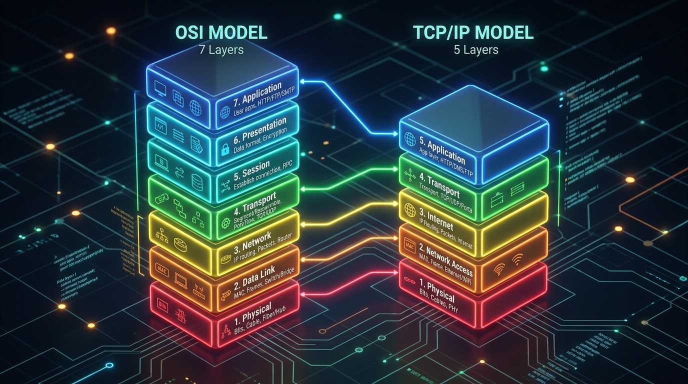
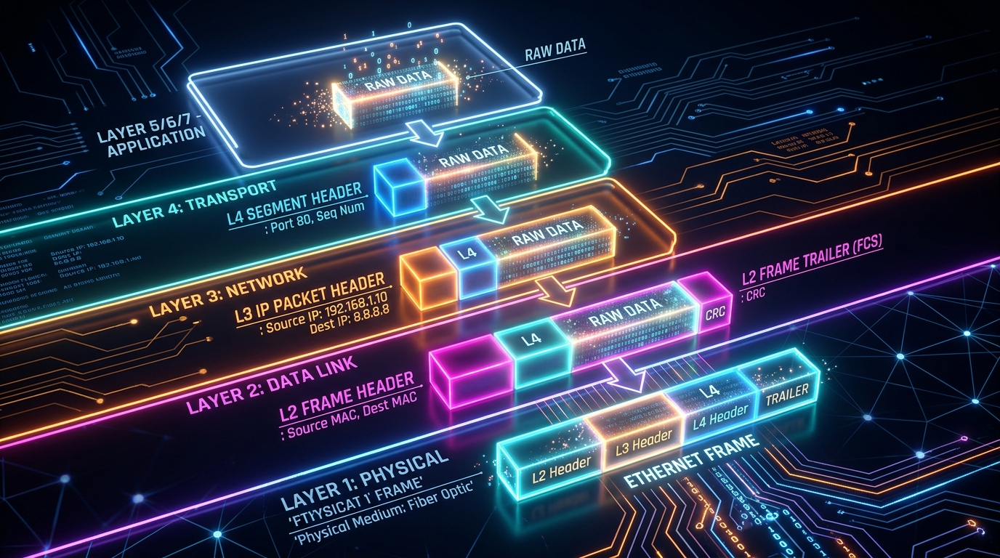
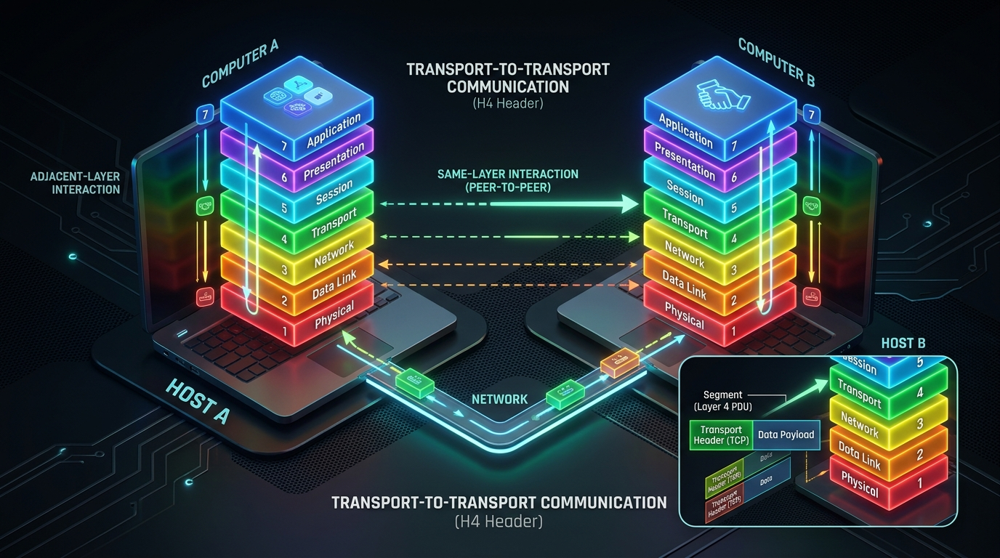

← [[Course on CCNA|Go Back to Course Hub]]

# 🔌 Day 03: OSI Model and TCP-IP Suite

Welcome to the notes for **Day 3: OSI Model & TCP/IP Suite** of Jeremy's IT Lab CCNA Course! Ye note aapko networks ke standard models (OSI and TCP/IP), data encapsulation process, aur communication interactions ko premium visual illustrations, diagrams, aur real-world examples ke sath pure Hinglish language mein samjhayega.

---

## 🧭 1. Networking Model Kya Hota Hai? (What is a Networking Model?)

Ek **Networking Model** standard rules, protocols, aur features ka ek group hota hai jo network devices aur software ko aapas mein communicate karne ka structure provide karta hai.

> [!IMPORTANT]
> **Protocols** logical rules hote hain jo batate hain ki device data kaise send, receive, aur process karega. Kisi single company (jaise sirf Cisco ya Microsoft) ke standard par chalne ke bajaye poori duniya standard protocols (jaise HTTP, IP, TCP) use karti hai taaki har brand ka device aapas mein bina rukawat ke connect ho sake.

---

## 🧱 2. OSI Model vs TCP/IP Suite

Duniya mein do sabse popular models use hote hain:
1.  **OSI Model (7 Layers):** Conceptual and educational reference model (created by ISO in 1984).
2.  **TCP/IP Suite (4 or 5 Layers):** Real-world model jo actual internet aur networks mein run hota hai.

### A. OSI Model ki 7 Layers:
Niche se upar (Layer 1 se Layer 7) order yaad rakhne ka mnemonic: 
*   *"Please Do Not Throw Sausage Pizza Away"*
*   (*P*hysical, *D*ata Link, *N*etwork, *T*ransport, *S*ession, *P*resentation, *A*pplication)

| Layer Number | Layer Name | Key Function (Kaam) | Core Protocols / Standards | PDU Name |
| :--- | :--- | :--- | :--- | :--- |
| **Layer 7** | **Application** | User aur software applications (jaise browser) ke beech interaction. | HTTP, HTTPS, DNS, FTP, SMTP | Data |
| **Layer 6** | **Presentation** | Data formatting, compression, aur Encryption/Decryption. | JPEG, GIF, SSL/TLS, ASCII | Data |
| **Layer 5** | **Session** | Connections (sessions) ko start, manage, aur terminate karna. | NetBIOS, PPTP | Data |
| **Layer 4** | **Transport** | End-to-end reliable or fast connection, segmenting, flow control. | TCP (Reliable), UDP (Fast) | **Segment** |
| **Layer 3** | **Network** | Logical routing, path determination, aur IP addressing. | IPv4, IPv6, ICMP, OSPF | **Packet** |
| **Layer 2** | **Data Link** | Physical layer par data errors check karna aur MAC address validation. | Ethernet (802.3), Wi-Fi (802.11), PPP | **Frame** |
| **Layer 1** | **Physical** | Cable signals aur electrical bits (0s & 1s) transport karna. | RJ45, Fiber Optic, Coaxial cables | **Bits** |

---

### B. TCP/IP Model (Original 4-Layer vs Modern 5-Layer)
TCP/IP model actual implementation model hai.
*   **Original 4-Layer Model:** Application, Transport, Internet, Network Interface (Link).
*   **Modern 5-Layer Model:** Application, Transport, Network (Internet), Data Link, Physical. (Modern model OSI ke lower 2 layers ko separate karke represent karta hai, jo network engineers ke liye troubleshoot karna aasan banata hai).

---

## 📦 3. Data Encapsulation & De-encapsulation

Jab data network par travel karta hai, toh wo layers ke through process hota hai.

### A. Data Encapsulation (Top-to-Bottom):
Jab aap ek host se data send karte hain, toh data top layer se bottom layer ki taraf aata hai. Har layer apna metadata/rules add karti hai jise **Header** (aur Layer 2 mein **Trailer**) kehte hain.
1.  **L5-L7:** Aapka application raw **Data** generate karta hai.
2.  **Layer 4 (Transport):** Data chunks ko **Segments** mein toda jata hai aur aage **L4 Header (TCP/UDP port info)** attach hota hai.
3.  **Layer 3 (Network):** Segment ke aage **L3 Header (Source & Destination IP addresses)** add hota hai. Ab ye **Packet** ban jata hai.
4.  **Layer 2 (Data Link):** Packet ke aage **L2 Header (Source & Destination MAC addresses)** aur peeche **L2 Trailer (FCS - Frame Check Sequence for error checking)** lagta hai. Ab ye **Frame** ban jata hai.
5.  **Layer 1 (Physical):** Frame ko physical electrical/light signals (**Bits**) mein convert karke wire par bhej diya jata hai.

#### 💡 Real-world Analogy (Udaharan):
*   **Postal Mail Example:** Imagine kijiye aapko apne friend ko ek confidential letter (Data) bhejna hai. 
    1.  Aap letter ko write karte hain (Data creation).
    2.  Aap use ek cover envelope mein dalte hain aur us par request tag lagate hain (L4 Segment Header).
    3.  Aap is inner envelope ko ek bade envelope mein rakhte hain aur us par target friend ka complete city post address aur pincode likhte hain (L3 IP Packet Header).
    4.  Post office is par barcode aur delivery router tag lagata hai taaki local postman use trace kar sake (L2 Frame Header & Trailer).
    5.  Parcel post vehicle ke physical road (L1 Physical Cable) par travel karta hai.
    *   Yahi sequence of placing envelopes inside envelopes **Data Encapsulation** hai!

### B. De-encapsulation (Bottom-to-Top):
Receiver host par data niche se upar (L1 se L7) travel karta hai. Har layer corresponding header ko read karti hai, use strip (remove) karti hai, aur remaining payload ko upar wali layer ko de deti hai jab tak raw data application tak na pahunch jaye.
*   **Analogy:** Jab friend ko parcel milta hai, toh wo pehle delivery box kholta hai (L2 strip), fir main packet address check karke envelope kholta hai (L3 strip), fir inner security cover remove karta hai (L4 strip), aur finally letter read karta hai (Data access).

---

## 🔄 4. Same-Layer aur Adjacent-Layer Interaction

### A. Same-Layer Interaction (Host-to-Host Communication):
Do alag-alag computers par same layer aapas mein logically communicate karti hain. Ye headers ke information exchange se hota hai.
*   *Example:* Sender ki Layer 4 ka TCP header receiver ki Layer 4 read aur process karegi (Jaise connection control aur sequence sync numbers check karna).
*   #### 💡 Real-world Analogy (Udaharan):
    *   **CEO-to-CEO Meeting:** Imagine kijiye do companies ke CEOs (Layer 7) aapas mein business deal (rules/deals) discuss kar rahe hain. Un dono ke beech ka interaction logical hai, aur wo ek hi status level par ho raha hai.

### B. Adjacent-Layer Interaction (Local Layer Communication):
Ek hi computer par chalne wali aapas ki adjoining layers (jaise Layer 3 aur Layer 2) aapas mein data exchange aur help karti hain.
*   *Example:* Network Layer (L3) packet ko niche Data Link Layer (L2) ko deti hai taaki wo use frame mein convert kar sake.
*   #### 💡 Real-world Analogy (Udaharan):
    *   **CEO and Manager Flow:** Ek hi company ke andar, CEO (L7) deal finalized karke Manager (L6) ko instructions deta hai, manager use format karke Secretary (L5) ko report deta hai. Ye upar se neeche dynamic system **Adjacent-layer interaction** hai.

---

## 📝 5. CCNA Day 03 Practice Questions (Self-Practice Quiz)

Aap yahan questions ko read karke answers verify kar sakte hain (Answer dekhne ke liye click karein):

1.  **Q1: OSI Model ke Transport layer par jab header add hota hai, toh us refined protocol data unit (PDU) ka technical name kya hota hai?**
    

    
🔓 Click to Reveal Answer

    **Answer:** **Segment**
    

2.  **Q2: Layer 3 (Network Layer) ke PDU ko kya kehte hain, jisme IP Addresses save hote hain?**
    

    
🔓 Click to Reveal Answer

    **Answer:** **Packet**
    

3.  **Q3: Kon si layer communication errors (jaise byte alignment) ko check karne ke liye Header ke sath sath Trailer (FCS) bhi lagati hai?**
    

    
🔓 Click to Reveal Answer

    **Answer:** **Layer 2 (Data Link Layer)**
    

4.  **Q4: Sender PC par Layer 7 se Layer 1 tak headers add karne ke process ko kya kehte hain?**
    

    
🔓 Click to Reveal Answer

    **Answer:** **Data Encapsulation**
    

5.  **Q5: Original 4-layer TCP/IP model mein standard "Network Access Layer" (ya Link Layer) OSI model ki kin layer standards ke barabar hoti hai?**
    

    
🔓 Click to Reveal Answer

    **Answer:** **Layer 2 (Data Link)** and **Layer 1 (Physical)** layers ke combined settings ke barabar.
    

6.  **Q6: Dynamic encryption, decryption aur compression (jaise SSL/TLS secure session protocols) OSI model ki kis layer par execute hote hain?**
    

    
🔓 Click to Reveal Answer

    **Answer:** **Layer 6 (Presentation Layer)**
    

7.  **Q7: Host A ki Layer 4 ka host B ki Layer 4 se communicate karna kis type ke interaction ka example hai?**
    

    
🔓 Click to Reveal Answer

    **Answer:** **Same-Layer Interaction**
    

8.  **Q8: OSI Model ke layers ko correct sequential order (top to bottom) mein yaad rakhne ka basic mnemonic kya hai?**
    

    
🔓 Click to Reveal Answer

    **Answer:** **All People Seem To Need Data Processing** (Application, Presentation, Session, Transport, Network, Data Link, Physical). Alternately, bottom-to-top is **Please Do Not Throw Sausage Pizza Away**.
    

9.  **Q9: Transport layer par packets segment break hone ka primary benefit kya hota hai?**
    

    
🔓 Click to Reveal Answer

    **Answer:** Agar transmission ke dauran koi bit corrupt ho jaye, toh poore heavy network data ko redownload nahi karna padta; sirf wahi specific single segment duplicate request se resend ho jata hai.
    

10. **Q10: Receiver end par incoming raw signals (bits) ko readable format mein translate aur headers strip-off karne ke process ko kya kehte hain?**
    

    
🔓 Click to Reveal Answer

    **Answer:** **De-encapsulation** (Bottom-to-Top processing).
    

