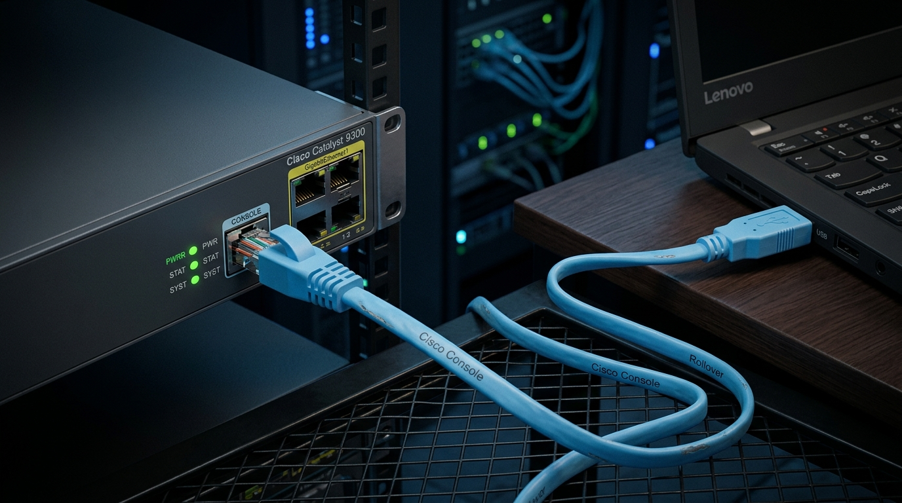
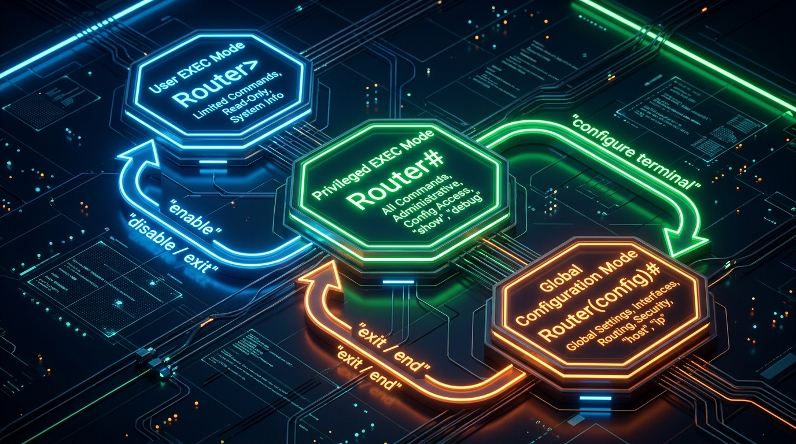
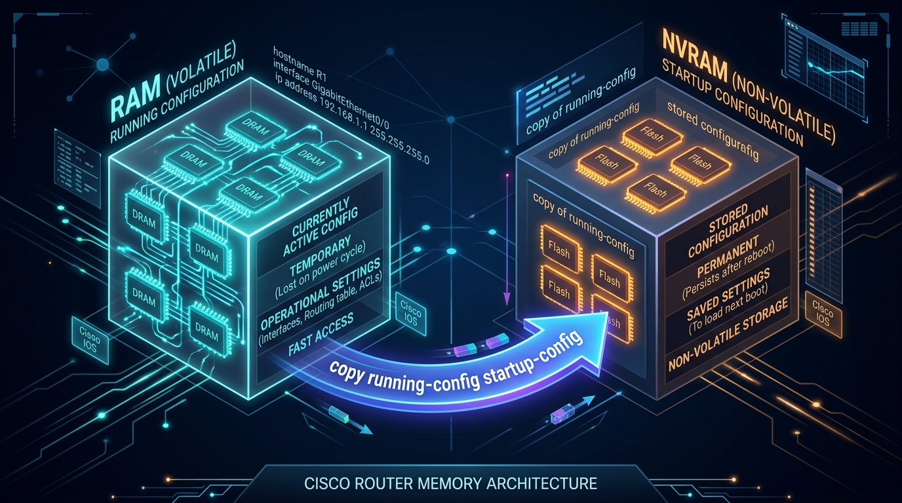

← [[Course on CCNA|Go Back to Course Hub]]

# 🔌 Day 04: Introduction to the CLI

Welcome to the notes for **Day 4: Intro to the CLI** of Jeremy's IT Lab CCNA Course! Ye note aapko Cisco IOS Command-Line Interface (CLI) ke basics, console connectivity, CLI modes navigation, configuration management, aur shortcuts ko detailed visual illustrations aur real-world examples ke sath pure Hinglish language mein samjhayega.

---

## 💻 1. Cisco Device se Kaise Connect Karein? (Connecting to CLI)

Cisco switch ya router ko configure karne ke liye hum **Command-Line Interface (CLI)** ka use karte hain. Naye device ke initial setup ke liye koi default IP address ya web screen nahi hoti, isliye hume console port ke zariye physical connection banana padta hai.

### Requirements:
1.  **Console Cable (Rollover Cable):** Standard sky-blue color ki cable hoti hai jiske ek side RJ45 connector hota hai (jo device ke console port par lagta hai) aur doosri side DB9/USB connector hota hai (jo laptop par lagta hai).
2.  **Terminal Emulator:** Ek software jo device ke system commands ko console line ke zariye hamare computer keyboard par show karta hai (Jaise PuTTY, Tera Term, SecureCRT).



### Default Serial Connection Settings:
Terminal emulator mein serial connection start karte waqt niche diye gaye standard parameters match hone chahiye:
*   **Baud Rate (Speed):** `9600` bits/second
*   **Data Bits:** `8` data bits
*   **Stop Bits:** `1` stop bit
*   **Parity:** None
*   **Flow Control:** None

---

## 🧭 2. Cisco CLI Modes & Navigation

Cisco IOS CLI security aur command limitation ke liye alag-alag level structure par chalta hai jise **Modes** kehte hain.



### A. User EXEC Mode
*   **Prompt:** `Router>` ya `Switch>`
*   **Kaam:** Ye basic login screen hai jisme security level sabse lowest hoti hai. Aap sirf basic monitoring commands (jaise ping, traceroute) run kar sakte hain, configurations change nahi kar sakte.
*   **Navigation:** Is mode se upar jane ke liye type karein: `enable`.

### B. Privileged EXEC Mode (Enable Mode)
*   **Prompt:** `Router#` ya `Switch#`
*   **Kaam:** Is mode mein network engineer ke paas troubleshooting aur show details check karne ki full permissions hoti hain. Aap settings dekh sakte hain aur save kar sakte hain, par modify nahi kar sakte.
*   **Navigation:**
    *   Niche User mode mein wapas jaane ke liye: `disable`.
    *   Upar configurations change karne wale mode mein jaane ke liye: `configure terminal` (ya shortcut `conf t`).

### C. Global Configuration Mode
*   **Prompt:** `Router(config)#` ya `Switch(config)#`
*   **Kaam:** Is mode mein kiye gaye badlav poore network device par globally implement hote hain (jaise hostname badalna ya banner add karna).
*   **Navigation:**
    *   Privileged EXEC mode mein drop karne ke liye: `exit` type karein.
    *   Direct Privileged EXEC mode (root level) par aane ke liye press karein: `end` ya shortcut `Ctrl + Z`.

### D. Sub-Configuration Modes (Specific Modes)
Global configuration se hum specific components ke details ko modify karne ke liye sub-modes mein jate hain:
*   **Interface Configuration Mode:** Specific interfaces (jaise port g0/1) configure karne ke liye.
    *   *Command:* `interface gigabitethernet 0/1` (shortcut `int g0/1`) -> Prompt: `Router(config-if)#`
*   **Line Configuration Mode:** Management access interfaces (jaise console terminal, virtual SSH line access) configure karne ke liye.
    *   *Command:* `line console 0` -> Prompt: `Router(config-line)#`

---

## ⚡ 3. Useful CLI Features & Shortcuts

Cisco CLI ko fast aur error-free chalane ke liye system mein shortcuts hotey hain:

### A. Help and Completion:
*   **Tab Key:** Kisi bhi half-written command ko complete karne ke liye (Jaise `conf` likh kar Tab dabane par wo `configure` ho jayega).
*   **Question Mark (?) Help:**
    *   `?` : Sabhi available commands ki list dekhne ke liye.
    *   `sh?` : Un sabhi commands ko list karega jo 'sh' se start hote hain (jaise show).
    *   `show ?` : `show` command ke sath aane wale parameters aur variables ki list show karega.

### B. Common Error Messages:
*   `% Ambiguous command:` CLI ko samajh nahi aaya ki aap kaun si command run karna chahte hain kyunki us short phrase se multiple commands start hoti hain (e.g. `c` likhne par clear, configure dono ho sakte hain).
*   `% Incomplete command:` Command toh sahi hai par aapne requirements ke according aage ke parameters (e.g., interface ID) nahi likhe.
*   `% Invalid input detected at '^' marker:` Command syntax mein error hai. '^' marker exact point show karta hai jahan typing error hui hai.

---

## 💾 4. Configuration Management: RAM vs NVRAM

Cisco devices mein switch/router settings do main positions par store hoti hain:



### 1. Running Configuration:
*   **Location:** RAM (Random Access Memory).
*   **Status:** Volatile (temporarily loaded). Agar device switch off (reboot) ho jaye, toh saara content delete ho jayega.
*   **File Name:** `running-config`

### 2. Startup Configuration:
*   **Location:** NVRAM (Non-Volatile RAM).
*   **Status:** Non-volatile (persistently saved). Device restart hone par bhi data delete nahi hota. Boot process par system is file ko select karke execute karta hai.
*   **File Name:** `startup-config`

### Configurations Save Kaise Karein?
Configurations ko modify karne ke baad, use save karne ke liye hum running-config ke data ko startup-config mein copy karte hain:
*   *Command:* `copy running-config startup-config` (shortcut `copy run start`)
*   *Legacy/Common Alternate:* `write` (shortcut `wr`)

---

## 🧪 5. Day 04 Lab: CLI Mode Navigation Commands Cheat-Sheet

Day 4 ke Packet Tracer lab mein hum switch configurations set up karne ki commands seekhte hain:

```ios
Switch> enable                                   ! User EXEC mode se Privileged EXEC mode mein jaane ke liye
Switch# configure terminal                      ! Global Configuration mode mein jaane ke liye
Switch(config)# hostname CCNA_Switch            ! Device ka hostname badalne ke liye
CCNA_Switch(config)# interface FastEthernet 0/1 ! Port config mode mein jaane ke liye
CCNA_Switch(config-if)# description Link_To_PC1 ! Port description set karne ke liye
CCNA_Switch(config-if)# exit                    ! Interface mode se exit karke global config mode mein aane ke liye
CCNA_Switch(config)# exit                       ! Global config mode se exit karke privileged mode mein aane ke liye
CCNA_Switch# copy running-config startup-config  ! Apne changes ko device memory (NVRAM) mein permanently save karne ke liye
```

---

## 📝 6. CCNA Day 04 Practice Questions (Self-Practice Quiz)

Aap yahan questions ko read karke answers verify kar sakte hain (Answer dekhne ke liye click karein):

1.  **Q1: Naye Cisco device ko initial level par configure karne ke liye use hone wali rollover cable laptop ke USB port se switch ke kis port par connect hoti hai?**
    <details>
    <summary>🔓 Click to Reveal Answer</summary>
    **Answer:** **Console Port**
    </details>

2.  **Q2: Terminal Emulator software mein Cisco device console connection access karne ke liye standard Baud Rate speed default settings kya hoti hai?**
    <details>
    <summary>🔓 Click to Reveal Answer</summary>
    **Answer:** **9600 bits per second (9600 baud)**
    </details>

3.  **Q3: Cisco CLI system ko boot karte hi screen par `Switch>` prompt dikhai deta hai. Ye prompt kis mode ko represent karta hai?**
    <details>
    <summary>🔓 Click to Reveal Answer</summary>
    **Answer:** **User EXEC Mode**
    </details>

4.  **Q4: User EXEC mode se Privileged EXEC mode (`Switch#`) mein switch-over karne ke liye hum console par kis command ka use karte hain?**
    <details>
    <summary>🔓 Click to Reveal Answer</summary>
    **Answer:** **enable command**
    </details>

5.  **Q5: Global Configuration Mode (`Switch(config)#`) se drop-down hokar direct Privileged EXEC Mode (`Switch#`) par aane ke liye keyboard shortcut kya hai?**
    <details>
    <summary>🔓 Click to Reveal Answer</summary>
    **Answer:** **Ctrl + Z** ya **end command** typing.
    </details>

6.  **Q6: Console par write karte waqt kisi unknown spelling error par CLI console screen par `% Invalid input detected at '^' marker` show karta hai. Is error mein '^' sign ka kya purpose hai?**
    <details>
    <summary>🔓 Click to Reveal Answer</summary>
    **Answer:** Ye marker precise location show karta hai jahan syntax error (typing mistake) hui hai.
    </details>

7.  **Q7: RAM mein loaded temporary active settings (running-config) ko device reboots se save karne ke liye hum use kis memory location par copy karte hain?**
    <details>
    <summary>🔓 Click to Reveal Answer</summary>
    **Answer:** **NVRAM (Non-Volatile RAM)**, jahan **startup-config** save hota hai.
    </details>

8.  **Q8: Cisco Switch configuration settings ko RAM se NVRAM mein save karne ka standard standard syntax command kya hai?**
    <details>
    <summary>🔓 Click to Reveal Answer</summary>
    **Answer:** **`copy running-config startup-config`** (ya simple shortcut `write`/`wr`).
    </details>

9.  **Q9: Cisco IOS command line editor par command typing shortcut `conf t` se access hone wala CLI configuration level kaun sa hai?**
    <details>
    <summary>🔓 Click to Reveal Answer</summary>
    **Answer:** **Global Configuration Mode** (`configure terminal`).
    </details>

10. **Q10: `Switch(config-line)#` aur `Switch(config-if)#` prompts Cisco CLI ke kis level of structure command modes ke parts hain?**
    <details>
    <summary>🔓 Click to Reveal Answer</summary>
    **Answer:** **Sub-Configuration Modes** (Line Configuration mode aur Interface Configuration mode).
    </details>
