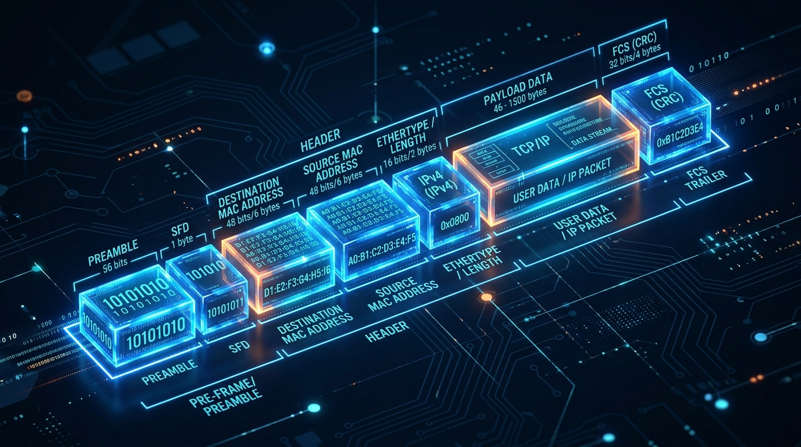
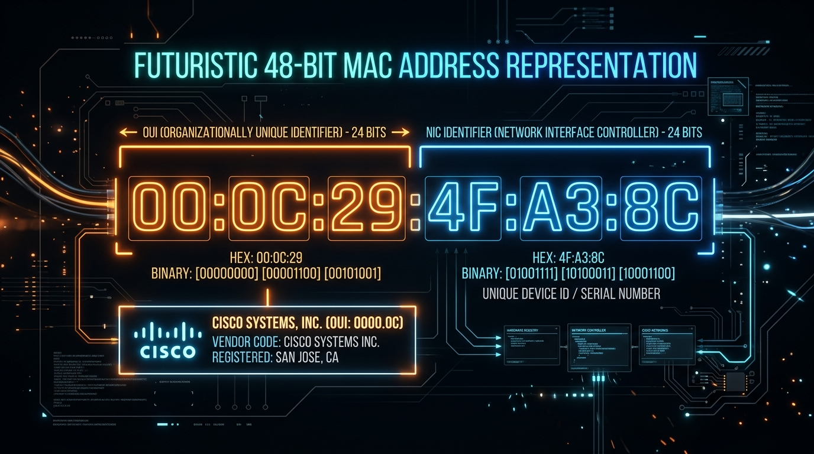
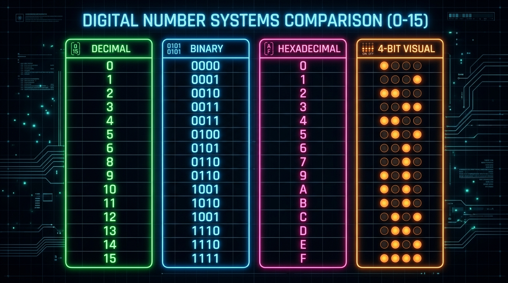
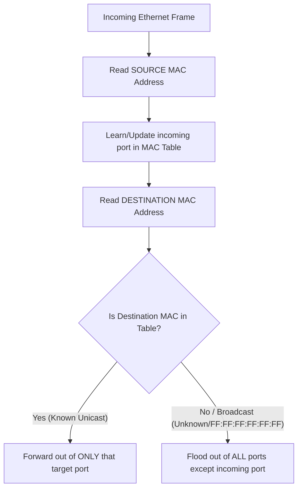

← [[Course on CCNA|Go Back to Course Hub]]

# 🔌 Day 05: Ethernet LAN Switching - Part 1

Welcome to the notes for **Day 5: Ethernet LAN Switching - Part 1** of Jeremy's IT Lab CCNA Course! Ye note aapko Layer 2 switching ke basics, Ethernet frame structure, MAC addressing, hexadecimal math, aur switch learning/forwarding logic ko detailed real-world analogies aur premium illustrations ke sath pure Hinglish language mein samjhayega.

---

## 🏢 1. LAN (Local Area Network) Kya Hota Hai?

Ek **LAN (Local Area Network)** limited aur chhote geographic area (jaise aapka ghar, office, ya school building) ke devices ka connection hota hai. 

#### 💡 Real-world Analogy (Udaharan):
*   **Housing Society Example:** Imagine kijiye ek residential housing society (LAN). Society ke andar sabhi ghar (PCs/hosts) aapas mein inner gates aur roads ke zariye bina kisi main highway (Router) ke direct communicate/travel kar sakte hain. Lekin agar kisi ko doosri door ki society (alag LAN) mein jaana hai, toh use main outer highway connection (**Router**) ka use karna padega.

---

## 📦 2. Ethernet Frame Structure (Detailed Breakdown)

OSI Model ki Layer 2 (Data Link Layer) par jo data package travel karta hai, use **Ethernet Frame** kehte hain. Frame data ke aage Header aur peeche Trailer lagta hai.

### A. The Ethernet Header (5 Fields)
Header mein total 14 bytes ka actual metadata aur 8 bytes ka synchronizing system hota hai:

#### 1. Preamble (7 Bytes - 56 bits)
*   **Kaam:** Alternating `10101010` bits ki series hoti hai jo receiver network card ko signal alert bhejti hai taaki wo incoming frame ki speed ke sath apni frequency synchronize kar sake.
*   **💡 Analogy:** **VIP Entry Drum-roll:** Jaise kisi function mein guest ke aane se pehle announce kiya jata hai ya drums play kiye jate hain taaki sabhi log alert ho jayein.

#### 2. Start Frame Delimiter - SFD (1 Byte - 8 bits)
*   **Kaam:** Preamble ke theek baad `10101011` bits aate hain. Iska aakhiri `11` bit receiver ko batata hai ki synchronization over ho gaya hai, aur ab iske turant baad actual ethernet header details (Destination MAC) start hone wali hain.
*   **💡 Analogy:** **Green Flag Drop:** Drums bajne ke baad jaise hi signal flag drop hota hai, log samajh jate hain ki real show ab start ho raha hai.

#### 3. Destination MAC Address (6 Bytes - 48 bits)
*   **Kaam:** Us device ka physical hardware address jise data bheja ja raha hai.

#### 4. Source MAC Address (6 Bytes - 48 bits)
*   **Kaam:** Data send karne wale active device ka physical hardware address.

#### 5. Type / Length (2 Bytes - 16 bits)
*   **Kaam:** Ye field do tarike se kaam karti hai:
    *   Agar iski value **1500 ya usse kam** hai, toh ye payload (data block) ki length ko show karta hai.
    *   Agar iski value **1536 ya usse zyada** (0x0600 in hex) hai, toh ye encapsulated Packet ke dynamic protocol type ko batata hai.
    *   *Examples:* IPv4 packet ke liye `0x0800` aur IPv6 ke liye `0x86DD` display hota hai.
*   **💡 Analogy:** **Delivery Package Label:** Jaise parcel box par likha hota hai ki box ke andar kya content hai (Jaise: Books ya Electronics), taaki receiver use sahi room (IPv4 stack ya IPv6 stack) mein route kar sake.

---

### B. Data / Payload (46 to 1500 Bytes)
*   **Kaam:** Ye actual data packet hota hai (L3 IP Packet) jo upar ki layers se niche transfer hota hai.
*   **Padding Rule:** Ethernet rule ke according, payload ka size **minimum 46 bytes** hona chahiye. Agar actual packet 46 bytes se chhota hai, toh extra empty bits (zeros) add kiye jate hain jise **Padding** kehte hain. Maximum payload size 1500 bytes hota hai (jise Standard MTU - Maximum Transmission Unit kehte hain).
*   **💡 Analogy:** **Amazon Minimum Box Filler:** Jaise Amazon se chhota memory card order karne par wo use bade box mein packing bubble wrap ke sath bhejte hain taaki parcel transmission process mein gum na ho jaye.

---

### C. The Ethernet Trailer (FCS - 4 Bytes)
Frame ke sabse end mein **FCS (Frame Check Sequence)** field hoti hai:
*   **Kaam:** Frame verification aur error detection ke liye cyclic redundancy check (CRC) algorithm code save karta hai. Sender poore frame par mathematical calculation karke ek hash value code generate karta hai aur use FCS mein save karta hai. Receiver incoming frame par same algorithm run karta hai. Agar dono match ho gaye toh data accept hota hai, warna reject.
*   **💡 Analogy:** **Packaging Security Seal:** Jaise package par security sticker seal hoti hai. Agar delivery ke time seal tuti hui milti hai (FCS mismatch), toh customer use drop/reject kar deta hai.
*   > [!IMPORTANT]
    > **CCNA Exam Tip:** Ethernet Layer 2 sirf **Error Detection** karti hai, **Error Correction** nahi. Agar frame damaged hai, toh switch use drop kar dega par re-transmission request nahi karega. (Re-transmission ka kaam Layer 4 TCP ka hota hai).

---

## 🔢 3. MAC Addresses aur Hexadecimal System

### A. MAC Address (Physical Address) Structure
MAC (Media Access Control) address ek unique 48-bit (6 bytes) physical hardware address hai jo network card (NIC) par manufacturing ke time permanently burn kiya jata hai (isliye ise BIA - Burned-In Address bhi kehte hain).

*   **Format:** 12 Hexadecimal characters (e.g., `00:1A:2B:3C:4D:5E` ya `001a.2b3c.4d5e`).
*   **OUI (Organizationally Unique Identifier):** Pehle 24 bits (3 bytes) manufacturer organization (Jaise Cisco, Intel, Realtek) ka signature code hota hai jo IEEE assign karta hai.
*   **UAA (Universally Administered Address):** Aakhiri 24 bits (3 bytes) manufacturer khud device NIC ko uniquely identify karne ke liye serial code ke roop mein deta hai.
*   **💡 Analogy:** **VIN (Vehicle Identification Number):** Car ke VIN number ki tarah, jisme starting digits batate hain ki manufacturer kaun hai (Jaise Tata ya Hyundai), aur end digits particular unique chassis model ko denote karte hain.

---

### B. Hexadecimal System (Base 16)
Hexadecimal numbers ko samajhna IP address configuration, subnetting (specifically IPv6), aur MAC address structures ko read karne ke liye zaroori hai.

*   Hexadecimal mein total **16 symbols** hote hain: `0` se `9` aur `A` se `F`.
*   Kyunki hum double-digit values (jaise 10, 11) ko single space mein nahi likh sakte, isliye:
    *   `10 = A`, `11 = B`, `12 = C`, `13 = D`, `14 = E`, `15 = F`
*   Ek single Hex character exactly **4 bits (Nybble)** ko store karta hai. Do hex characters milkar **8 bits (1 Byte)** banate hain.
    *   *Example:* Decimal `255` = Binary `11111111` = Hexadecimal `FF`.

---

### 🧮 C. Decimal to Hexadecimal Conversion (Kaise badlein?)

Decimal se Hexadecimal mein convert karne ke **do main methods** hote hain:

#### 1. Method 1: Division by 16 Method (Purana aur standard method)
*   **Rule:** Decimal number ko 16 se divide karte rahein, quotient (bhagfal) ko niche likhein, aur remainder (sheshfal) ko side mein note karein. Jab quotient 0 ho jaye, toh remainders ko **niche se upar (Reverse order)** mein likh dein.
*   **💡 Example: Convert Decimal `203` to Hexadecimal:**
    1.  `203` ko 16 se divide karein:
        *   \(203 \div 16 = 12\) (Quotient)
        *   Remainder = **11** (Hex code mein 11 ko hum **`B`** likhte hain).
    2.  Ab Quotient `12` ko 16 se divide karein:
        *   \(12 \div 16 = 0\) (Quotient)
        *   Remainder = **12** (Hex code mein 12 ko hum **`C`** likhte hain).
    3.  Quotient 0 ho gaya, process stops!
    4.  Remainders ko bottom-to-top (reverse) read karein: **`C`** pehle, fir **`B`**.
    *   **Result:** Decimal `203` = Hexadecimal **`CB`** (Commonly written as `0xCB`).

#### 2. Method 2: Binary Bridge Shortcut (NIC cards/8-bit values ke liye sabse fast)
*   **Rule:** Pehle decimal number ko standard 8-bit binary mein badlein. Fir us 8-bit binary ko **4-bit ke do parts (Nybbles)** mein split kar dein. Dono 4-bit binary values ko alag-alag hex character mein convert karke aapas mein combine kar dein.
*   **💡 Example: Convert Decimal `185` to Hexadecimal:**
    1.  `185` ko Binary mein badlein (using 128, 64, 32, 16, 8, 4, 2, 1 table):
        *   \(128 + 32 + 16 + 8 + 1 = 185\)
        *   Binary = `10111001`
    2.  Binary ko 4-bit ke do groups mein divide karein:
        *   Left Group: `1011`
        *   Right Group: `1001`
    3.  Dono groups ko individually evaluate karein:
        *   `1011` = \(8 + 0 + 2 + 1 = 11\) (Decimal 11 = Hex **`B`**)
        *   `1001` = \(8 + 0 + 0 + 1 = 9\) (Decimal 9 = Hex **`9`**)
    4.  Combine karein: **`B9`**
    *   **Result:** Decimal `185` = Hexadecimal **`B9`** (Written as `0xB9`).

---

### 🧮 D. Hexadecimal to Decimal Conversion (Kaise badlein?)

Hexadecimal se Decimal mein convert karne ke liye hum positional multipliers (base 16) ka use karte hain. Right-to-left chalte hue har digit ko \(16^0\), \(16^1\), \(16^2\) and so on se multiply karte hain aur results ko add kar dete hain.

*   **Rule Formula:**
    \[\text{Value} = (\text{Digit}_2 \times 16^2) + (\text{Digit}_1 \times 16^1) + (\text{Digit}_0 \times 16^0)\]

#### 💡 Example 1: Convert Hex `2F` to Decimal:
1.  Right-most digit is `F` (value = 15). Position power is \(16^0 = 1\).
    *   \(15 \times 1 = 15\)
2.  Next digit to left is `2`. Position power is \(16^1 = 16\).
    *   \(2 \times 16 = 32\)
3.  Dono ko add karein: \(32 + 15 = 47\).
*   **Result:** Hex `2F` = Decimal **`47`**.

#### 💡 Example 2: Convert Hex `1A3` to Decimal:
1.  Right-most digit is `3`. Position power is \(16^0 = 1\).
    *   \(3 \times 1 = 3\)
2.  Next digit is `A` (value = 10). Position power is \(16^1 = 16\).
    *   \(10 \times 16 = 160\)
3.  Left-most digit is `1`. Position power is \(16^2 = 256\).
    *   \(1 \times 256 = 256\)
4.  Sabhi ko add karein: \(256 + 160 + 3 = 419\).
*   **Result:** Hex `1A3` = Decimal **`419`**.

---

## 🔄 4. Basic Switch Operation: Learning & Forwarding Logic

Switches hub ki tarah dumb collision zones nahi hote. Ye smart decisions lete hain Layer 2 MAC addresses ko check karke. Har switch apne RAM mein ek **MAC Address Table (CAM Table)** maintain karta hai.

### A. The Learning Process (Source MAC check):
Switch table entries ko fill karne ke liye incoming frame ke **Source MAC Address** ko dekhta hai.
*   Jab port Fa0/1 par connect device frame bhejta hai, toh switch check karta hai ki kya uska Source MAC table mein hai? Agar nahi hai, toh switch dynamic mapping entry store kar leta hai (`Fa0/1` = `MAC-A`).
*   **💡 Analogy:** **Visitor Gate Register:** Jaise society security guard gate register lekar baitha hai. Jab koi visitor building se bahar nikalta hai ya enter hota hai, toh guard uske face aur entry card (Source MAC) ko dekhta hai aur register mein note kar leta hai ki ye visitor kis apartment (Port) par rehta hai.

### B. The Forwarding Process (Destination MAC check):
Switch forwarding decision lene ke liye frame ke **Destination MAC Address** ko dekhta hai:
1.  **Known Unicast:** Agar destination address MAC table mein registered hai, toh switch use directly usi specific single port par forward karega.
    *   *Analogy:* Guard ko pata hai ki packet Mr. Sharma ko dena hai jo Flat 101 (Fa0/1) mein rehte hain, toh courier directly unhi ke paas jayega.
2.  **Flooding (Unknown Unicast / Broadcast):** Agar destination MAC table mein nahi hai (Unknown Unicast) ya frame broadcast address (`FF:FF:FF:FF:FF:FF`) par hai, toh switch use **incoming port ko chhodkar baki sabhi ports par flood (send) kar deta hai**.
    *   *Analogy:* Guard ko agar nahi pata ki target recipient kis room mein hai, toh wo reception central mic par aawaz lagata hai (flooding) taaki sabhi apartments tak sound jaye, aur jiska name match hoga sirf wahi reply karega.

---

## 📝 5. CCNA Day 05 Practice Questions

Aap yahan questions ko read karke answers verify kar sakte hain (Answer dekhne ke liye click karein):

1.  **Q1: Ethernet Frame ke header mein synchronization clock frequency setup karne wale 7-byte field ko kya kehte hain?**
    

    
🔓 Click to Reveal Answer

    **Answer:** **Preamble**
    

2.  **Q2: Start Frame Delimiter (SFD) field kis exact binary code bit series par end hoti hai jo header details start hone ka indication deti hai?**
    

    
🔓 Click to Reveal Answer

    **Answer:** **`10101011`** (aakhiri ke 11 bits indication set karte hain).
    

3.  **Q3: Standard Ethernet frame spec ke according minimum payload data limit limit kitni honi chahiye, jiske niche zeros padding lagayi jati hai?**
    

    
🔓 Click to Reveal Answer

    **Answer:** **46 bytes**.
    

4.  **Q4: Frame transmission ke time standard error detection verification check algorithms data block logic kis trailer block ke andar check hote hain?**
    

    
🔓 Click to Reveal Answer

    **Answer:** **FCS (Frame Check Sequence)** jo CRC mathematical verification code store karta hai.
    

5.  **Q5: MAC Address structure ke pehle 24 bits kis dynamic term name code standard ko show karte hain jo manufacturer brand ko represent karta hai?**
    

    
🔓 Click to Reveal Answer

    **Answer:** **OUI (Organizationally Unique Identifier)**.
    

6.  **Q6: Switch dynamic database structure mein MAC addresses ko interface port location mappings ke sath save karne wali RAM table ko kya kehte hain?**
    

    
🔓 Click to Reveal Answer

    **Answer:** **MAC Address Table (ya CAM - Content Addressable Memory Table)**.
    

7.  **Q7: Switch incoming packet port lines learn karne ke liye input frame ke kis MAC Address field (Source ya Destination) ko inspect karta hai?**
    

    
🔓 Click to Reveal Answer

    **Answer:** **Source MAC Address** (Learning process humesha source information par execute hoti hai).
    

8.  **Q8: Agar Switch ke paas destination MAC address database table entries memory mein registered na ho, toh wo frame ko forward karne ke liye kaun sa action lega?**
    

    
🔓 Click to Reveal Answer

    **Answer:** **Flooding** (Frame ko incoming port ko chhodkar baki sabhi interfaces par flood bhej diya jayega).
    

9.  **Q9: Hexadecimal notation byte standard parameter `C` integer representation standard decimal base 10 value kya show karegi?**
    

    
🔓 Click to Reveal Answer

    **Answer:** **12** (A=10, B=11, C=12).
    

10. **Q10: Layer 2 Ethernet standard frame check checks ke time agar calculations mismatch ho jayein, toh switch frame ko drop karne ke sath aur kya response alert trigger karega?**
    

    
🔓 Click to Reveal Answer

    **Answer:** **Kuch nahi (Silently Drop).** Layer 2 ke paas re-transmission control features nahi hote.
    

