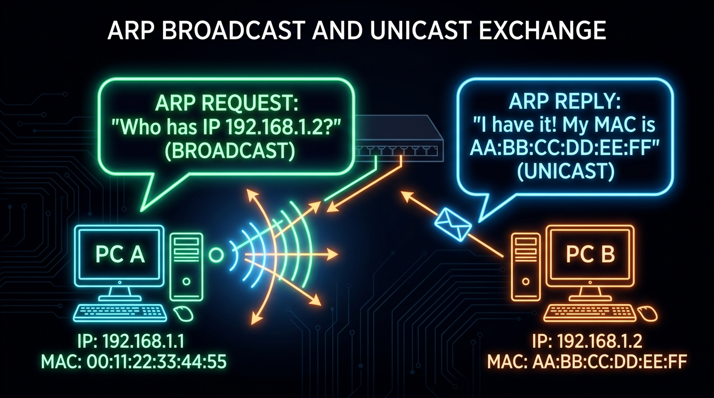
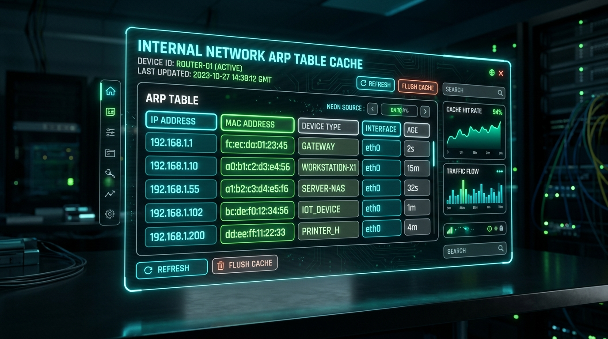
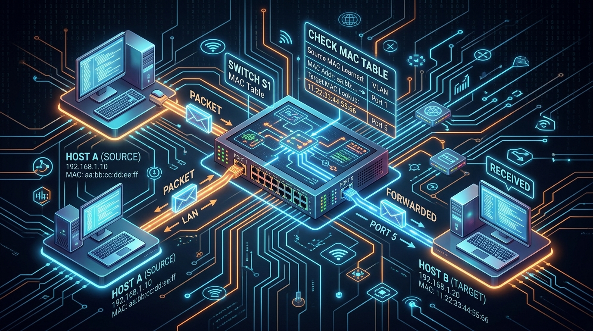
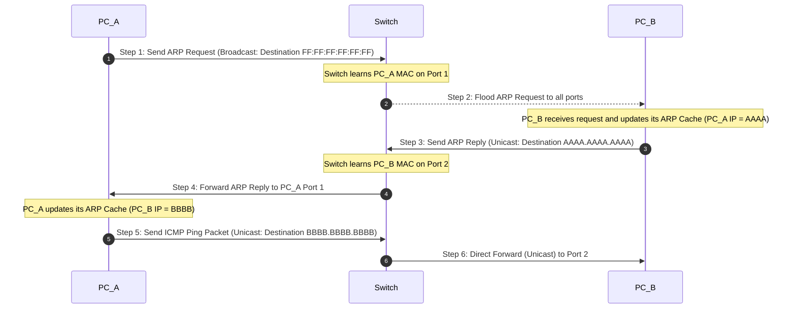

← [[Course on CCNA|Go Back to Course Hub]]

# 🔌 Day 06: Ethernet LAN Switching - Part 2

Welcome to the notes for **Day 6: Ethernet LAN Switching - Part 2** of Jeremy's IT Lab CCNA Course! Ye note aapko network mein dynamic IP-to-MAC translation (ARP), minimum frame sizes calculations, aur dynamic Packet Walk trace ko detailed real-world analogies aur premium illustrations ke sath pure Hinglish language mein samjhayega.

---

## 📐 1. Ethernet Frame Sizes & Padding Calculations

Pichle session (Day 5) mein humne padha tha ki Ethernet Frame mein minimum payload requirements hoti hain. Chaliye iska detail mathematical mapping aur criteria samajhte hain:

*   **Ethernet Header + Trailer Size:** **18 Bytes** (excluding Preamble & SFD).
    *   *Calculation:* Destination MAC (6B) + Source MAC (6B) + Type/Length (2B) + FCS (4B) = 18 Bytes.
*   **Minimum Ethernet Frame Size:** **64 Bytes**.
    *   Cisco aur IEEE standards ke according ek valid frame ka total size minimum 64 bytes hona mandatory hai taaki lines par collision errors trace ho sakein.
*   **Minimum Data Payload Size:** **46 Bytes**.
    *   *Formula:* \[\text{Minimum Frame (64 Bytes)} - \text{Header/Trailer (18 Bytes)} = \text{Minimum Payload (46 Bytes)}\]
*   **Padding Rule:** Agar network layer se aane wala packet (L3 IP Packet) 46 bytes se chhota hai (Jaise 40 bytes ka TCP Ack packet), toh Ethernet Data Link layer aakhir mein 6 bytes ki extra empty bits (zeros) attach kar deti hai taaki size exactly 46 bytes ho sake. Ise **Padding** kehte hain.

---

## 🔍 2. ARP (Address Resolution Protocol) Deep Dive

Jab do devices local network (LAN) par communicate karte hain, toh sender device ko destination ka **IP Address** (Layer 3) aur **MAC Address** (Layer 2) dono pata hone chahiye. IP address toh domain name ya configuration se mil jata hai, par MAC address kaise pata chale? Iske liye hum **ARP** protocol ka use karte hain.

### A. ARP Request (Broadcast):
*   **Kaam:** Jab host A ko host B ka IP address pata hai par MAC address nahi pata, toh host A pure local network par ek **ARP Request** frame bhejta hai. 
*   **Format:** Ye frame ek **Broadcast** frame hota hai, jisme Destination MAC Address **`FF:FF:FF:FF:FF:FF`** hota hai. Switch is frame ko incoming port ko chhodkar baki sabhi connected ports par flood (forward) kar deta hai.
*   **💡 Real-world Analogy (Udaharan):**
    *   **Classroom Announcement Example:** Imagine kijiye ek teacher class mein aakar zor se bolta hai (Broadcast): *"Rahul kis bench par hai? Mujhe apna roll number/seat location (MAC) batao!"* Class ke saare bacche (all hosts) is message ko sunenge, par Rahul ko chhodkar baki sabhi ise ignore kar denge.

### B. ARP Reply (Unicast):
*   **Kaam:** Jis host ka IP address message se match hota hai, wo host A ko response bhejta hai jise **ARP Reply** kehte hain.
*   **Format:** Ye message ek **Unicast** message hota hai, jisme directly host A ka MAC address destination set kiya jata hai. Switch ise kisi aur port par flood nahi karta, directly host A ke interface port par bhej deta hai.
*   **💡 Real-world Analogy (Udaharan):**
    *   **Rahul's Response:** Rahul khada hokar directly teacher ko dekhkar bolta hai (Unicast): *"Sir, main Rahul hoon aur main Seat Number 5 (MAC) par baitha hoon."* Ye response sirf teacher (Source Host) tak jata hai, baaki class ke bacche isse interrupt nahi hote.

---

## 💾 3. ARP Cache / ARP Table (Local Contacts List)

Har networking device (PC, Switch, Router) bar-bar ARP requests bhejkar network bandwidth waste na kare, iske liye wo aapas mein learn kiye gaye IP-to-MAC mappings ko dynamic RAM memory mein temporarily store kar lete hain. Ise **ARP Cache** ya **ARP Table** kehte hain.

*   **💡 Real-world Analogy (Udaharan):**
    *   **Phone Contact List:** Jaise aap jab kisi naye person ko call karte hain, toh pehli baar unse number mangte hain (ARP Request). Lekin baad mein call karne ke liye aap use apne phone ki contact book (ARP Cache) mein save kar lete hain taaki dobara poori society se unka address na puchna pade.
*   **Dynamic Expiration:** ARP cache entries permanent nahi hoti. Agar device kuch time tak (Cisco routers par default **4 hours**) communicate nahi karta, toh dynamic cleanup system in entries ko flush kar deta hai.
*   *Windows Command to check ARP Table:* `arp -a`
*   *Cisco Router Command to check ARP Table:* `show arp`

---

## 🚶 4. Packet Walk: End-to-End Delivery Logic

Chaliye ek real network scenario ko step-by-step trace karte hain jise **Packet Walk** kehte hain.

**Scenario:** PC-A (`192.168.1.1` | MAC: `AAAA.AAAA.AAAA`) ko PC-B (`192.168.1.2` | MAC: `BBBB.BBBB.BBBB`) ko ping karna hai. Dono ek switch se connected hain. Pehle dono ke ARP Tables blank hain.

### Packet Walk Steps in Detail:
1.  **ARP Table Check:** PC-A ping packet generate karta hai par check karta hai ki use PC-B ka MAC address nahi pata. Wo ICMP packet ko buffer (hold) karta hai.
2.  **ARP Request Broadcast:** PC-A ek ARP Request frame banata hai (Source IP: `.1`, Source MAC: `AAAA`, Dest IP: `.2`, Dest MAC: `FF:FF:FF:FF:FF:FF`). Ye frame Switch ke paas jata hai.
3.  **Switch Learning:** Switch incoming port 1 se dynamic MAC `AAAA` learn karke entry map kar leta hai. Fir switch destination address `FF:FF:FF:FF:FF:FF` ko flood kar deta hai.
4.  **PC-B Processing:** PC-B is frame ko receive karta hai. Wo check karta hai ki target IP (`192.168.1.2`) uski apni hai. PC-B apne local ARP Table mein update kar leta hai: `192.168.1.1` = `AAAA.AAAA.AAAA`.
5.  **ARP Reply Unicast:** PC-B response frame banata hai (Source IP: `.2`, Source MAC: `BBBB`, Dest IP: `.1`, Dest MAC: `AAAA`). Ye Switch ke paas jata hai.
6.  **Switch Learning Part 2:** Switch port 2 se incoming MAC `BBBB` learn karta hai. Ab target MAC `AAAA` switch ki table mein already port 1 par mapped hai, isliye switch is reply ko sirf port 1 par forward (unicast) karta hai.
7.  **Ping Transmission:** PC-A response read karke cache table file update kar leta hai. Ab buffered ICMP ping packet ko wrap kiya jata hai (Dest MAC: `BBBB`) aur directly Switch ke zariye PC-B ko unicast format mein bhej diya jata hai.

---

## 📝 5. CCNA Day 06 Practice Questions

Aap yahan questions ko read karke answers verify kar sakte hain (Answer dekhne ke liye click karein):

1.  **Q1: Minimum Ethernet Frame specification criteria ke according, total frame size kitne bytes se chhota nahi hona chahiye?**
    

    
🔓 Click to Reveal Answer

    **Answer:** **64 Bytes**.
    

2.  **Q2: Agar network layer se aane wale data payload packet ka size 40 bytes hai, toh Ethernet layer 64-byte limit complete karne ke liye kitne bytes padding lagayegi?**
    

    
🔓 Click to Reveal Answer

    **Answer:** **6 Bytes padding**. (Payload limit 46 bytes honi chahiye, so \(46 - 40 = 6\) bytes padding lagti hai).
    

3.  **Q3: Layer 3 Address (IP) ko uske corresponding Layer 2 Address (MAC) mein resolve karne wale protocol ko kya kehte hain?**
    

    
🔓 Click to Reveal Answer

    **Answer:** **ARP (Address Resolution Protocol)**.
    

4.  **Q4: ARP Request frame ka destination MAC address field configuration parameter kya set kiya jata hai?**
    

    
🔓 Click to Reveal Answer

    **Answer:** **`FF:FF:FF:FF:FF:FF`** (Broadcast Address).
    

5.  **Q5: Switch ARP Request (Broadcast) frame receive karne par active database settings ke dynamic forwarding rules ke according kya response action trigger karta hai?**
    

    
🔓 Click to Reveal Answer

    **Answer:** Frame ko **Flooding** kar deta hai (incoming port ko chhodkar baki sabhi ports par forward kar deta hai).
    

6.  **Q6: Target host PC-B jab ARP Request ka answer back bhejta hai (ARP Reply), toh us message frame ka transport mode kya hota hai?**
    

    
🔓 Click to Reveal Answer

    **Answer:** **Unicast** (Kyunki PC-B ko sender PC-A ka MAC address request header se pehle hi pata chal chuka hota hai).
    

7.  **Q7: Switch, PC-B ke ARP Reply frame ko target destination host PC-A tak forward karte waqt flood kyu nahi karta?**
    

    
🔓 Click to Reveal Answer

    **Answer:** Kyunki pehli ARP request ke dauran hi switch ne PC-A ka MAC address `AAAA` port 1 par map karke table mein dynamic entry save kar li thi (Known Unicast routing).
    

8.  **Q8: RAM ke andar store hone wali IP-to-MAC association mapping temporary table database sheet memory location ko kya kehte hain?**
    

    
🔓 Click to Reveal Answer

    **Answer:** **ARP Cache** ya **ARP Table**.
    

9.  **Q9: Windows operating system Command Prompt terminal par dynamic cache mappings verify karne ke liye kaun si network command run hoti hai?**
    

    
🔓 Click to Reveal Answer

    **Answer:** **`arp -a`**.
    

10. **Q10: Cisco routers par dynamically saved local ARP cache table mapping entries ka default idle aging time limit kitna hota hai?**
    

    
🔓 Click to Reveal Answer

    **Answer:** **4 Hours** (240 minutes) ke baad dynamic entry flush ho jati hai.
    

