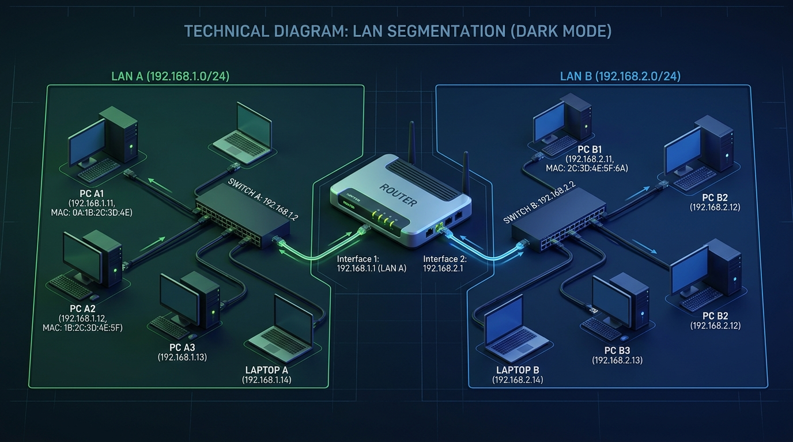
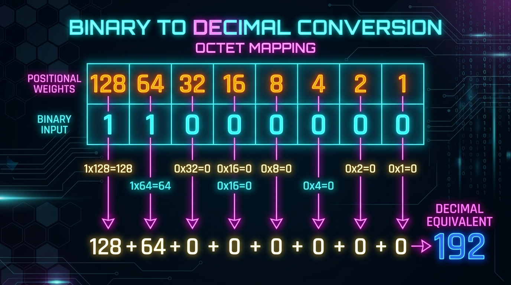
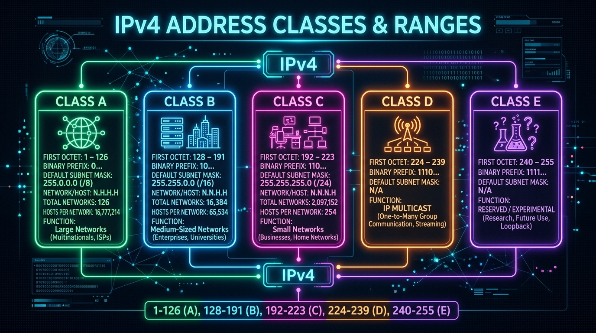

← [[Course on CCNA|Go Back to Course Hub]]

# 🔌 Day 07: IPv4 Addressing - Part 1

Welcome to the notes for **Day 7: IPv4 Addressing - Part 1** of Jeremy's IT Lab CCNA Course! Ye note aapko Layer 3 logical addressing basics, binary-decimal conversions, router boundaries, aur Classful IP addressing structure ko detailed real-world analogies aur premium illustrations ke sath pure Hinglish language mein samjhayega.

---

## 🌐 1. Network Layer (Layer 3) & Routing Basics

OSI Model ki **Network Layer (Layer 3)** alag-alag local area networks (LANs) ke beech connection aur data transfer (routing) ke liye kaam karti hai.

*   **Key Functions (Kaam):**
    *   **Logical Addressing:** Har device ko ek customizable virtual address (IP address) dena.
    *   **Path Determination / Routing:** Source se Destination tak packet transfer karne ke liye best route find karna.
*   **Switches vs Routers:**
    *   **Switches (Layer 2):** Ek hi network ke andar devices ko connect karte hain aur network ko expand karte hain. Ye broad-cast packets ko block nahi karte, balki flood karte hain.
    *   **Routers (Layer 3):** Alag-alag networks ko aapaas mein connect karte hain. Routers logical network boundaries banate hain aur broadcast frames ko forward nahi karte (block karte hain).

#### 💡 Real-world Analogy (Udaharan):
*   **Housing Blocks vs Main Highway Post Office:** 
    *   **Switch** ek housing block ke andar ki paths hain. Aap aapas mein bina permission ke kisi bhi flat (PC) par cycle chala kar ja sakte hain. 
    *   **Router** ek state line toll booth aur post office hub hai. Agar aapko doosre state ya city (alag network) mein post bhejni hai, toh use post office ke main courier vehicle (Router interface) ke zariye hi pass karwana padega.

---

## 🧱 2. IPv4 Address Structure

IPv4 (Internet Protocol version 4) address ek **32-bit logical address** hota hai jise humans ke padhne ke liye dot (`.`) se separate kiya jata hai, jise **Dotted Decimal Format** kehte hain.

*   *Example:* `192.168.1.1`
*   **Octets:** 32-bit address ko 8-bit ke 4 groups mein toda jata hai. Har group ko **Octet** kehte hain (1 Octet = 8 bits = 1 Byte).
    *   *Binary format:* `11000000 . 10101000 . 00000001 . 00000001`

### A. Network Portion vs Host Portion:
IP address ke do parts hote hain (jise Subnet Mask define karta hai):
1.  **Network Portion:** Batata hai ki device kis network/society ka part hai. Kisi ek LAN ke sabhi devices ka network portion same hona chahiye.
2.  **Host Portion:** Network ke andar specific individual device ka unique identity number.
*   **💡 Analogy (Zip Code vs House Number):** Jaise aapke address mein **Zip Code/Area Code** (Network Portion) pure colony ke liye common hota hai, par colony ke andar har ghar ka **House Number** (Host Portion) unique hota hai.

### B. Default Gateway:
*   **Kaam:** Jab local network ke PC ko internet ya kisi bahar ke network se communicate karna hota hai, toh wo packet ko router ke local interface IP par bhejta hai. Router ke is interface IP ko PC ka **Default Gateway** kehte hain.
*   **💡 Analogy:** **Society Main Exit Gate:** Jaise aapki colony ka main boundary exit gate. Agar aapko colony se bahar kisi doosre city jaana hai, toh aapko isi main gate (Default Gateway) ke raste hi nikalna padega.

---

## 🧮 3. Binary-Decimal Conversions

IP addressing and subnetting seekhne ke liye binary (Base 2) aur decimal (Base 10) conversions solid hone chahiye.

### Position Weights in an Octet (8 bits):
Binary number mein right-to-left har bit ki positional value double hoti jati hai:
| Bit Position | 8 (Left) | 7 | 6 | 5 | 4 | 3 | 2 | 1 (Right) |
| :--- | :--- | :--- | :--- | :--- | :--- | :--- | :--- | :--- |
| **Weight Value** | **128** | **64** | **32** | **16** | **8** | **4** | **2** | **1** |

---

### A. Binary to Decimal Conversion (Kaise badlein?)
*   **Rule:** Binary bits (`0` or `1`) ko upar di gayi weight table par map karein. Jahan `1` hai, un weights ko aapas mein add kar lein.
*   **💡 Example: Convert Binary `10001111` to Decimal:**
    1.  Weights check karein jahan bit status 1 hai:
        *   Position 128 = **1**
        *   Position 8 = **1**
        *   Position 4 = **1**
        *   Position 2 = **1**
        *   Position 1 = **1**
    2.  Add weights: \(128 + 8 + 4 + 2 + 1 = 143\).
    *   **Result:** Binary `10001111` = Decimal **`143`**.

---

### B. Decimal to Binary Conversion (Kaise badlein?)
*   **Rule:** Weight table (128 down to 1) ke numbers ko use karke check karein ki kin numbers ko add karne par humara decimal number banega. Un values par `1` likhein aur baaki par `0`.
*   **💡 Example: Convert Decimal `221` to Binary:**
    1.  Check karein ki kya 221 mein 128 fit hota hai? Yes. (Bit value = **1**, balance = \(221 - 128 = 93\)).
    2.  Kya 93 mein 64 fit hota hai? Yes. (Bit value = **1**, balance = \(93 - 64 = 29\)).
    3.  Kya 29 mein 32 fit hota hai? No. (Bit value = **0**).
    4.  Kya 29 mein 16 fit hota hai? Yes. (Bit value = **1**, balance = \(29 - 16 = 13\)).
    5.  Kya 13 mein 8 fit hota hai? Yes. (Bit value = **1**, balance = \(13 - 8 = 5\)).
    6.  Kya 5 mein 4 fit hota hai? Yes. (Bit value = **1**, balance = \(5 - 4 = 1\)).
    7.  Kya 1 mein 2 fit hota hai? No. (Bit value = **0**).
    8.  Kya 1 mein 1 fit hota hai? Yes. (Bit value = **1**, balance = 0).
    *   **Result:** Decimal `221` = Binary **`11011101`**.

---

## 📊 4. IPv4 Classful Addressing

Jab IPv4 standard launch hua tha, toh IP address allocation ko manage karne ke liye addresses ko **5 Classes** (Class A, B, C, D, E) mein divide kiya gaya tha. Pehle octet ki range se hum IP address ki class identify kar sakte hain:

### IP Classes Reference Table:

| Class | First Octet Range | Default Subnet Mask | Prefix | Purpose / Host Capacity |
| :--- | :--- | :--- | :--- | :--- |
| **Class A** | `1` to `126` | `255.0.0.0` | `/8` | Very Large Networks (up to 16,777,214 hosts/net). |
| **Class B** | `128` to `191` | `255.255.0.0` | `/16` | Medium/Large Networks (up to 65,534 hosts/net). |
| **Class C** | `192` to `223` | `255.255.255.0` | `/24` | Small Networks (up to 254 hosts/net). |
| **Class D** | `224` to `239` | None (No Mask) | N/A | **Multicast Addresses** (Group communications). |
| **Class E** | `240` to `255` | None (No Mask) | N/A | **Experimental / Reserved** for research. |

---

### ⚠️ Special Addresses & Boundaries:
1.  **Loopback Addresses (`127.0.0.0` to `127.255.255.255`):** 
    *   Ye range loopback testing ke liye reserved hai (jaise local machine testing `127.0.0.1`). Is range ke packets physically wire par send nahi hote, ye network card level par return ho jate hain.
    *   **💡 Analogy:** **Speaking to Yourself:** Khud se aawaz lagana/apna throat status check karna bina kisi aur ko call lagaye.
2.  **`0.0.0.0` Range:** Reserved hai (unknown source ya default routing definitions ke liye).

---

## 📝 5. CCNA Day 07 Practice Questions

Aap yahan questions ko read karke answers verify kar sakte hain (Answer dekhne ke liye click karein):

1.  **Q1: Alag-alag network domains (LANs) ke beech traffic filter aur path routing control karne wali hardware device kis layer par operate hoti hai?**
    

    
🔓 Click to Reveal Answer

    **Answer:** **Layer 3 (Network Layer)** par **Routers** operate hote hain.
    

2.  **Q2: Router interfaces par dynamic broadcast packets hit hone par router unke sath kya action leta hai?**
    

    
🔓 Click to Reveal Answer

    **Answer:** Router local **broadcast frames ko forward nahi karta (block kar deta hai)**, jisse broadcast domain divide ho jata hai.
    

3.  **Q3: IP address ke kis portion part ko change karne par device automatically network switch (change) kar leta hai?**
    

    
🔓 Click to Reveal Answer

    **Answer:** **Network Portion**.
    

4.  **Q4: Local PC se outside network (jaise internet) par packets transfer karne ke liye configure kiya jane wala default gateway address physical terms mein kya hota hai?**
    

    
🔓 Click to Reveal Answer

    **Answer:** Local subnet se connect **Router ke interface port ka IP address**.
    

5.  **Q5: Binary number sequence `11001100` ko decimal base 10 value format mein convert karne par kya numeric value milegi?**
    

    
🔓 Click to Reveal Answer

    **Answer:** **204** (\(128 + 64 + 8 + 4 = 204\)).
    

6.  **Q6: Decimal number format `173` ko standard 8-bit binary number system mein kaise write kiya jayega?**
    

    
🔓 Click to Reveal Answer

    **Answer:** **`10101101`** (\(128 + 32 + 8 + 4 + 1 = 173\)).
    

7.  **Q7: IP Address `172.16.85.10` kis address class ka default part hai, aur iska default subnet mask prefix kya hoga?**
    

    
🔓 Click to Reveal Answer

    **Answer:** **Class B** address (First octet 172 range), default mask **`255.255.0.0`** (prefix `/16`).
    

8.  **Q8: Special IP Address range `127.0.0.1` networking systems par kis operational check ke liye use hoti hai?**
    

    
🔓 Click to Reveal Answer

    **Answer:** **Loopback / Local Host testing** (Device ke networking software stack integrity check karne ke liye).
    

9.  **Q9: Class C address network systems par default dynamic configuration subnet mask settings maximum kitne usable host addresses support karti hain?**
    

    
🔓 Click to Reveal Answer

    **Answer:** **254 usable hosts** (\(2^8 - 2 = 254\)). (IP network and broadcast addresses excluding logic).
    

10. **Q10: Class D IP addresses range `224.0.0.0` to `239.255.255.255` kis specific purpose transmission use-case ke liye reserve hai?**
    

    
🔓 Click to Reveal Answer

    **Answer:** **Multicast transmission** (One-to-many select group device communication).
    

