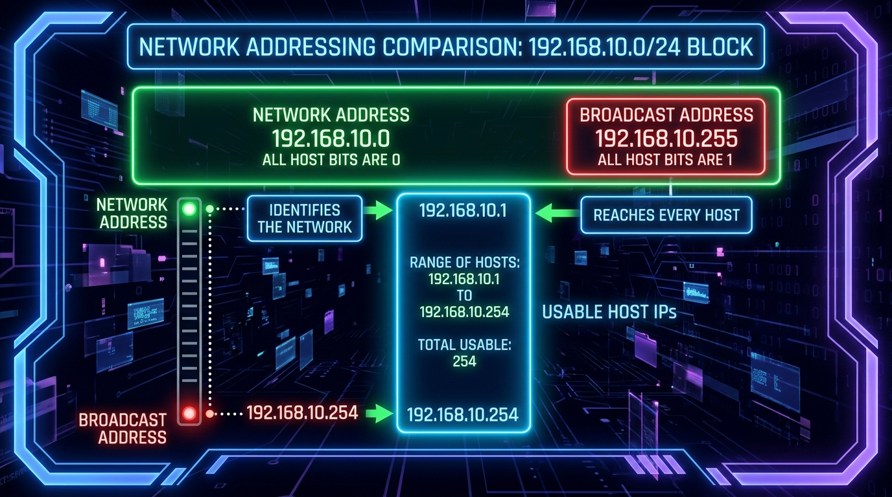
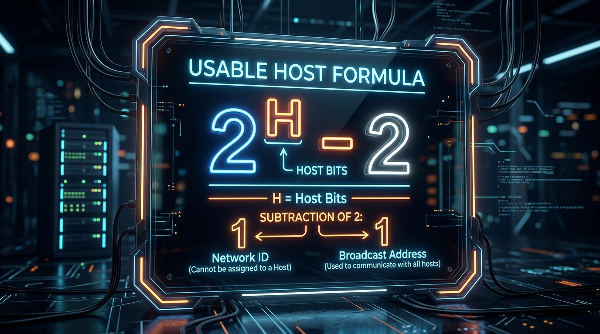
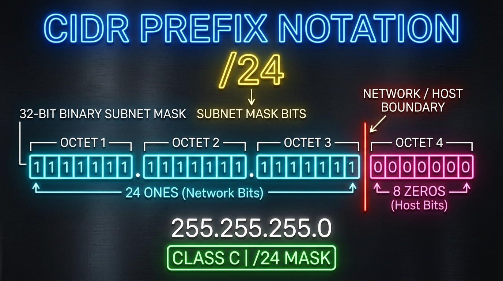

← [[Course on CCNA|Go Back to Course Hub]]

# 🔌 Day 08: IPv4 Addressing - Part 2

Welcome to the notes for **Day 8: IPv4 Addressing - Part 2** of Jeremy's IT Lab CCNA Course! Ye note aapko network size calculations, IP Range boundaries (Network vs Broadcast addresses), usable host math formula, aur CIDR prefix notations ko detailed real-world analogies aur premium illustrations ke sath pure Hinglish language mein samjhayega.

---

## 🚏 1. Network Address vs Broadcast Address vs Usable Host Range

Kisi bhi IP subnet network boundary range mein do addresses hamesha special purpose ke liye **reserved (block)** hote hain, aur unhe hum kisi host device (jaise printer ya PC) ko assign nahi kar sakte:

### A. Network Address (Network ID):
*   **Kaam:** Pure network domain ko physically represent karne wala sabse pehla address. Is address mein **saare host bits `0` hote hain**.
*   **💡 Real-world Analogy (Udaharan):**
    *   **Street Name Example:** Imagine kijiye ek society ka name hai *"Cisco Street"*. Ye street name (Network ID) batata hai ki aap kis area/colony mein hain. Lekin aap street name board par ghar banakar reh nahi sakte; rehne ke liye aapko specific house blocks chahiye.

### B. Broadcast Address:
*   **Kaam:** Us range ka sabse aakhiri address jiska use network ke sabhi hosts ko ek sath message bhejne ke liye hota hai. Is address mein **saare host bits `1` hote hain**.
*   **💡 Real-world Analogy (Udaharan):**
    *   **Society Megaphone Announcement:** Jaise society management office central loudspeaker/megaphone par aawaz lagata hai. Ye sound pure street par rehne wale har ek resident (all hosts) ke ghar tak pahunchti hai.

### C. Usable Host Addresses Range:
*   Network Address aur Broadcast Address ke beech ke jitne bhi IP address ranges hote hain, unhe **Usable IPs** kehte hain. Inhe hi hosts (PCs, Servers) par configure kiya jata hai.

---

## 🧮 2. The Usable Host Calculation Formula

Kisi bhi IP network mein usable host count check karne ka mathematical formula niche diya gaya hai:

### The Formula:
\[\text{Usable Hosts} = 2^H - 2\]
*   Jahan **`H`** = Subnet ke **Host Bits** ki total count.
*   **Why subtract 2?** Kyunki hum total range me se **Network Address** (first IP) aur **Broadcast Address** (last IP) ko minus kar dete hain.

---

### 📏 Calculations across Address Classes:

#### A. Class C Network (Example: `192.168.1.0/24`)
*   **Prefix /24** ka matlab hai ki 24 bits Network ke hain, aur bache hue **8 bits Host** ke hain (\(32 - 24 = 8\)).
*   *Total Host Bits (H) = 8*
*   *Calculation:* \(2^8 - 2 = 256 - 2 = 254\) usable hosts.
*   *Range:*
    *   Network ID: `192.168.1.0`
    *   First Usable IP: `192.168.1.1` (Network ID + 1)
    *   Last Usable IP: `192.168.1.254` (Broadcast ID - 1)
    *   Broadcast ID: `192.168.1.255`

#### B. Class B Network (Example: `172.16.0.0/16`)
*   **Prefix /16** ka matlab hai ki 16 bits Network ke hain, aur **16 bits Host** ke hain.
*   *Total Host Bits (H) = 16*
*   *Calculation:* \(2^{16} - 2 = 65,536 - 2 = 65,534\) usable hosts.
*   *Range:*
    *   Network ID: `172.16.0.0`
    *   First Usable IP: `172.16.0.1`
    *   Last Usable IP: `172.16.255.254`
    *   Broadcast ID: `172.16.255.255`

#### C. Class A Network (Example: `10.0.0.0/8`)
*   **Prefix /8** ka matlab hai ki 8 bits Network ke hain, aur **24 bits Host** ke hain.
*   *Total Host Bits (H) = 24*
*   *Calculation:* \(2^{24} - 2 = 16,777,216 - 2 = 16,777,214\) usable hosts.
*   *Range:*
    *   Network ID: `10.0.0.0`
    *   First Usable IP: `10.0.0.1`
    *   Last Usable IP: `10.255.255.254`
    *   Broadcast ID: `10.255.255.255`

---

## 🏷️ 3. CIDR (Classless Inter-Domain Routing) Prefix Notation

Classful subnetting mein hum standard `/8`, `/16`, aur `/24` use karte hain. Lekin IP addresses ko waste hone se bachane ke liye hum custom masks use karte hain, jise **CIDR** (ya Slash `/` notation) kehte hain.

*   **Prefix Length (e.g. `/24`):** Subnet mask mein binary level par consecutively **`1` bits** ki total count ko show karta hai.
    *   `/24` ka binary mask: `11111111.11111111.11111111.00000000` (24 ones, 8 zeros).
    *   Dotted Decimal Equivalent: `255.255.255.0`
*   **💡 Analogy:** **Moveable Garden Fence:** Subnet mask ek aisi physical boundary wall (fence) hai jo boundary split karti hai. Fencing wall ko jitna left drag karenge (jaise `/8` ya `/16`), dynamic host yard area utna bada hoga. Agar right shift karenge (jaise `/28` ya `/30`), toh host area chhota ho jayega.

---

## 📈 4. First and Last Usable IP Kaise Nikalein?

Subnet range determine karne ke rules:
1.  **First Usable IP:** Network Address ke aakhiri octet value mein **`+ 1`** kar dein.
2.  **Last Usable IP:** Broadcast Address ke aakhiri octet value mein **`- 1`** kar dein.

---

## 📝 5. CCNA Day 08 Practice Questions

Aap yahan questions ko read karke answers verify kar sakte hain (Answer dekhne ke liye click karein):

1.  **Q1: IP Network ke kis specific reserved address mein host portion ke saare binary bits strictly zero (`0`) hote hain?**
    

    
🔓 Click to Reveal Answer

    **Answer:** **Network Address (Network ID)**.
    

2.  **Q2: Usable host calculation formula \(2^H - 2\) mein hum hamesha 2 subtract kyu karte hain?**
    

    
🔓 Click to Reveal Answer

    **Answer:** Kyunki pehla address (**Network ID**) aur aakhiri address (**Broadcast Address**) standard rules ke according dynamic device configuration ke liye usable nahi hote.
    

3.  **Q3: Class C network `192.168.10.0/24` range mein sabse pehla dynamic host assignable (First Usable) IP address kaun sa hoga?**
    

    
🔓 Click to Reveal Answer

    **Answer:** **`192.168.10.1`** (Network Address + 1).
    

4.  **Q4: Class B network `172.20.0.0/16` range mein network ka final segment dynamic Broadcast Address IP kya hoga?**
    

    
🔓 Click to Reveal Answer

    **Answer:** **`172.20.255.255`** (Saare host bits 1 set karne par).
    

5.  **Q5: Kisi network segment range mein total host bits count agar **10 bits** hai, toh maximum network size usable hosts capacity kitni hogi?**
    

    
🔓 Click to Reveal Answer

    **Answer:** **1022 hosts** (\(2^{10} - 2 = 1024 - 2 = 1022\)).
    

6.  **Q6: CIDR prefix length notation standard `/16` kis dotted decimal subnet mask equivalent settings ko represent karta hai?**
    

    
🔓 Click to Reveal Answer

    **Answer:** **`255.255.0.0`** (16 consecutive binary 1s).
    

7.  **Q7: Subnet Mask `255.255.255.0` binary formatting standards check ke according kis CIDR slash prefix notation ko map karta hai?**
    

    
🔓 Click to Reveal Answer

    **Answer:** **`/24`**.
    

8.  **Q8: Class B network range `172.30.0.0/16` segment range mein last dynamically configure hone wala host IP address (Last Usable IP) kya hoga?**
    

    
🔓 Click to Reveal Answer

    **Answer:** **`172.30.255.254`** (Broadcast Address - 1).
    

9.  **Q9: Class A network range `/8` default parameters mein host logic address fields calculations ke liye kitne host bits total empty load milte hain?**
    

    
🔓 Click to Reveal Answer

    **Answer:** **24 Host Bits** (\(32 - 8 = 24\)).
    

10. **Q10: Classless Inter-Domain Routing (CIDR) standard slash notation kis base configuration boundary check system ke alternate setup ke roop mein network standard banaya gaya?**
    

    
🔓 Click to Reveal Answer

    **Answer:** **Dotted Decimal Subnet Masks** (representing subnet parameters clearly).
    

