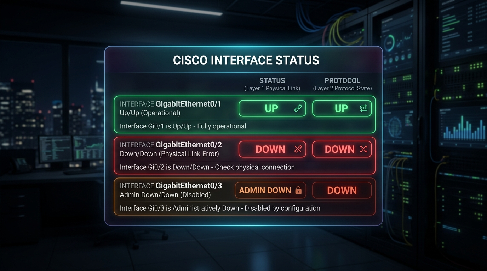
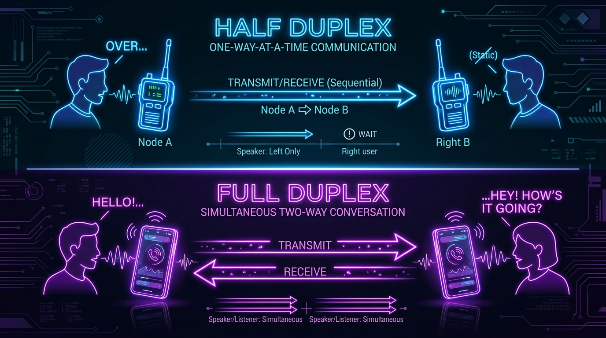
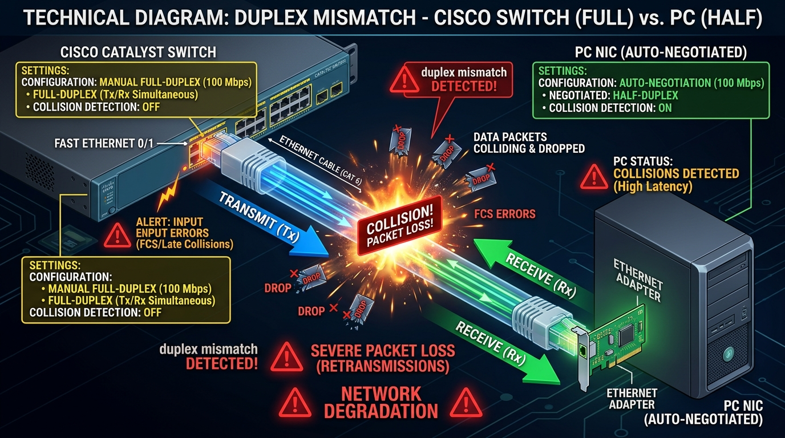

← [[Course on CCNA|Go Back to Course Hub]]

# 🔌 Day 09: Switch Interfaces

Welcome to the notes for **Day 9: Switch Interfaces** of Jeremy's IT Lab CCNA Course! Ye note aapko switch interfaces configuration, physical/logical status codes, speed aur duplex modes, auto-negotiation, input/output interface errors, aur duplex mismatches ko detailed real-world analogies aur premium illustrations ke sath pure Hinglish language mein samjhayega.

---

## 🚦 1. Switch Interface Status Mappings (Layer 1 vs Layer 2 States)

Cisco devices par ports ki live running conditions check karne ke liye do primary commands use hoti hain:
1.  `show ip interface brief` (Port state summary dikhane ke liye).
2.  `show interfaces status` (Speed, Duplex, aur Port mode check karne ke liye).

Cisco IOS par interface status do alag-alag columns mein state show karta hai: **`Status`** (Layer 1 Physical status) aur **`Protocol`** (Layer 2 Data Link status).



### Status Interpretation Table:

| Command Status | Protocol Status | Operational State | Meaning / Reason (Kaam/Kyun) |
| :--- | :--- | :--- | :--- |
| **up** | **up** | **connected** | Port bilkul operational hai aur data traffic forward kar raha hai. |
| **down** | **down** | **notconnected** | Port enabled hai par physical connection break hai (Jaise cable disconnected ho, ya samne wala device shut down ho). |
| **administratively down** | **down** | **disabled** | Network Engineer ne manually CLI par ja kar port ko switch-off (`shutdown`) kiya hua hai. |
| **down** | **down** | **err-disabled** | Port security features (Jaise Port Security violation) ke chalte switch firmware ne port ko auto shut-down kar diya hai. |

#### 💡 Real-world Analogy (Udaharan):
*   **Electrical Light Bulb Check:** 
    *   *Administratively Down (Disabled):* Jaise aapne board se switch manually **off** kiya hai. Bulb thik hai, wire thik hai, par current flow humne hi block kiya hai.
    *   *Down/Down (Not connected):* Jaise switch toh **on** hai, par bulb fused ho gaya hai ya holder se wire loose hai (Physical link missing).
    *   *Err-disabled:* Jaise power fluctuation ya short-circuit hone par MCB/Circuit Breaker trip ho jaye (System protection shut-down).

---

## 🛠️ 2. Switch Interfaces Configuration (CLI commands)

### A. Basic Interface Commands:
Switch interface par descriptions config karne aur port ko manual turn-on/off karne ke commands:
```ios
SW1# configure terminal
SW1(config)# interface fastethernet 0/1         ! Fast Ethernet Port fa0/1 select karein
SW1(config-if)# description ## Link_To_PC-A ##  ! Description label add karein
SW1(config-if)# shutdown                        ! Port ko switch-off karein (L1 state: admin down)
SW1(config-if)# no shutdown                     ! Port ko switch-on karein (L1 state: up)
```
> [!NOTE]
> Cisco routers ke ports default `shutdown` state mein hote hain, lekin Cisco switches ke saare ports default **`no shutdown` (enabled)** state mein aate hain.

### B. Interface Range Selection:
Agar multiple unused interfaces ko ek sath secure karne ke liye shut-down karna ho, toh hum `range` feature use karte hain:
```ios
SW1(config)# interface range fastethernet 0/5 - 12  ! Ports 5 se lekar 12 tak sabhi select karein
SW1(config-if-range)# shutdown                      ! Sabhi ports ko ek sath turn-off karein
SW1(config-if-range)# description ## Unused Ports ##
```

---

## 🔄 3. Duplex Modes: Half-Duplex vs Full-Duplex

Ethernet cables par communication flow controls do tarike se execute ho sakte hain:



### A. Half-Duplex:
*   **Kaam:** Devices ek waqt par ya toh data bhej (Transmit) sakte hain ya receive kar sakte hain, par **dono kaam ek sath nahi ho sakte**. 
*   **CSMA/CD Active:** Is mode mein network shared medium ki tarah kaam karta hai. Collision se bachne ke liye CSMA/CD check active rehta hai. Agar do devices ek sath data send kar dein, toh data crash (**Collision**) ho jata hai.
*   **💡 Real-world Analogy:** **Walkie-Talkie Communication:** Jaise walkie-talkie par jab tak ek person bol kar *"Over"* nahi kehta, tab tak doosra person nahi bol sakta. Agar dono ek sath bolenge, toh kisi ki aawaz sunai nahi degi.

### B. Full-Duplex:
*   **Kaam:** Devices ek hi time par data send aur receive dono kar sakte hain. Isme separate physical path channels use hote hain, isliye collisions physically impossible hain. CSMA/CD disabled ho jata hai.
*   **💡 Real-world Analogy:** **Modern Mobile Phone Call:** Jaise phone call par dono log bina ruke ek sath aapas mein baat kar sakte hain aur dono ki aawaz clean sunai deti hai.

---

## ⚡ 4. Speed & Duplex Auto-Negotiation

Modern Cisco devices default standard par **Auto-Negotiation (IEEE 802.3u)** support karte hain.

*   **Negotiation Process:** Jab do devices aapas mein plug hote hain, toh wo aapas mein speed aur duplex capabilities share karte hain aur automatically **sabse fast common standard** select kar lete hain.
*   **Negotiation Defaults (If Auto-Negotiation fails):**
    *   **Speed:** Cisco switch interface ports incoming electrical signal pulses se automatic speed detect kar lete hain. Agar speed fail ho jaye, toh slowest support (mostly `10 Mbps`) set hoti hai.
    *   **Duplex:** Speed ke according duplex default decide hota hai:
        *   Agar speed **10 Mbps ya 100 Mbps** par negotiate hui hai, toh duplex **`Half-Duplex`** par automatic set ho jayega.
        *   Agar speed **1000 Mbps (Gigabit) ya fast** hai, toh duplex **`Full-Duplex`** set hoga.

---

### ⚠️ Duplex Mismatch (Mismatch Error State)

Jab network link ke ek end par setting manually hardcode **Full-Duplex** par set ho, aur dusre end par status **Auto-Negotiation** par chhod diya jaye, tab **Duplex Mismatch** error hota hai.



*   **Mismatch Process:**
    1.  End-A manually set hai `Full-Duplex` par, isliye wo negotiation pulses bhejta hi nahi hai.
    2.  End-B auto-negotiation mode par hai. Kyunki use koi signal pulse nahi milta, wo speed toh detect kar leta hai (e.g. 100 Mbps) par duplex negotiate na hone ke chalte default default rules se khud ko **`Half-Duplex`** par set kar leta hai.
    3.  Ab End-A full-duplex par chal raha hai (CSMA/CD inactive) aur End-B half-duplex par (CSMA/CD active).
*   **Logical Mismatch Result:** End-A bina link check kiye packets continuous bhejta rahega. End-B ise collision error samjhega. Isse dynamic frame drops, packet loss, aur very slow connection speed generate hogi.
*   **💡 Analogy:** **One Phone Call vs Walkie-Talkie:** Ek person call par continuous bol raha hai (Full-Duplex), par doosra person use walkie-talkie mode (Half-Duplex) par sun raha hai. Wo tabhi bolna shuru karta hai jab link free dikhe, par call par continuous aawaz aane ke chalte message baar-baar interrupt ho jata hai.

---

## 📈 5. Switch Interface Error Counters

Cisco switch par errors check karne ke liye command run karte hain: `show interfaces [interface-id]` (e.g., `show interfaces f0/1`). Niche errors counters ka status mapping bataya gaya hai:

1.  **Runts:** Wo frames jo standard minimum size limit (**64 bytes**) se chote hote hain aur unka FCS test fail hota hai. (Mostly collision errors ke chalte hotey hain).
2.  **Giants:** Wo frames jo maximum standard frame limits (**1518 bytes**) se bade hote hain aur unka FCS validation fail hota hai.
3.  **Input Errors:** Total count of errors (including runts, giants, and CRC) jo interface par receive hue hain.
4.  **Output Errors:** Wo frames jo device ne ready kiye par transmit standard errors ke chalte forward nahi ho paye.
5.  **CRC Errors:** Incoming frames jinka frame check sequence checksum verification formula matches fail ho gaya. (Bad cables, hardware noise, ya duplex mismatch iska common reason hai).
6.  **Collisions:** Half-duplex operations ke dauran data signals crash count. (Full-duplex links par collisions hamesha 0 hona chahiye).
7.  **Late Collisions:** Collisions jo frame transmission start hone ke **first 64 bytes** (512 bits slot time) send hone ke baad hotey hain. Iska primary cause **duplex mismatch** ya **cable limits exceeding (greater than 100m)** hota hai.

---

## 📝 6. CCNA Day 09 Practice Questions

Aap yahan questions ko read karke answers verify kar sakte hain (Answer dekhne ke liye click karein):

1.  **Q1: Switch port status checking commands `show ip interface brief` mein agar output status "administratively down" show kare, toh iska operational meaning kya hai?**
    <details>
    <summary>🔓 Click to Reveal Answer</summary>
    **Answer:** Port ko network administrator ne configure terminal console se manually **`shutdown`** command se switch-off kiya hua hai.
    </details>

2.  **Q2: Cisco Switches par dynamic interfaces control startup default configurations check ke according ports kis configuration (shutdown ya no shutdown) state mein aate hain?**
    <details>
    <summary>🔓 Click to Reveal Answer</summary>
    **Answer:** **`no shutdown`** (by default enabled).
    </details>

3.  **Q3: CLI configuration mode mein 10 switch ports ko ek sath select karke config execute karne ke liye kaun sa keyword parameter use kiya jata hai?**
    <details>
    <summary>🔓 Click to Reveal Answer</summary>
    **Answer:** **`interface range`** command (e.g., `interface range f0/1 - 10`).
    </details>

4.  **Q4: Half-Duplex transmission systems par collisions detect aur check rules run karne ke liye Layer 2 par kaun sa collision detection protocol activate kiya jata hai?**
    <details>
    <summary>🔓 Click to Reveal Answer</summary>
    **Answer:** **CSMA/CD** (Carrier Sense Multiple Access with Collision Detection).
    </details>

5.  **Q5: Full-Duplex communication logic system run hone par line interfaces par collisions limit count kitni hoti hai, aur kya CSMA/CD check enable rehta hai?**
    <details>
    <summary>🔓 Click to Reveal Answer</summary>
    **Answer:** Collisions **always 0** hoti hain aur CSMA/CD check **disabled** ho jata hai.
    </details>

6.  **Q6: Cisco Switch interfaces auto-negotiation settings fail hone par agar speed 100 Mbps check status detect karti hai, toh duplex parameter defaults rules ke according kya set hoga?**
    <details>
    <summary>🔓 Click to Reveal Answer</summary>
    **Answer:** **`Half-Duplex`** (10 Mbps aur 100 Mbps speeds par default duplex half set hota hai).
    </details>

7.  **Q7: Cisco Switch auto-negotiation fail hone par agar physical interface port standard speed 1 Gbps (1000 Mbps) detect kare, toh default duplex parameter kya configure hoga?**
    <details>
    <summary>🔓 Click to Reveal Answer</summary>
    **Answer:** **`Full-Duplex`** (1000 Mbps ya usse upar ki interfaces par default duplex full set hota hai).
    </details>

8.  **Q8: Duplex Mismatch issue network links check par execute hone par communication errors ke bad network properties par kya structural effect padta hai?**
    <details>
    <summary>🔓 Click to Reveal Answer</summary>
    **Answer:** Data packets frames drops exceed hotey hain, dynamic collisions generate hoti hain, aur communication link line output speed very slow (sluggish performance) ho jati hai.
    </details>

9.  **Q9: Switch port statistics checking counters `show interfaces` console output par standard minimum size limit 64-bytes se chote corrupt frames ko kya term name diya jata hai?**
    <details>
    <summary>🔓 Click to Reveal Answer</summary>
    **Answer:** **Runts**.
    </details>

10. **Q10: Interface counters mein 64 bytes parameter data transmit ho jaane ke baad late collision generate hone ka primary physical/cabling error reason kya hota hai?**
    <details>
    <summary>🔓 Click to Reveal Answer</summary>
    **Answer:** **Duplex Mismatch** ya fir segment physical cable lengths target standard limit **100 meters** se exceed kar chuki ho.
    </details>
