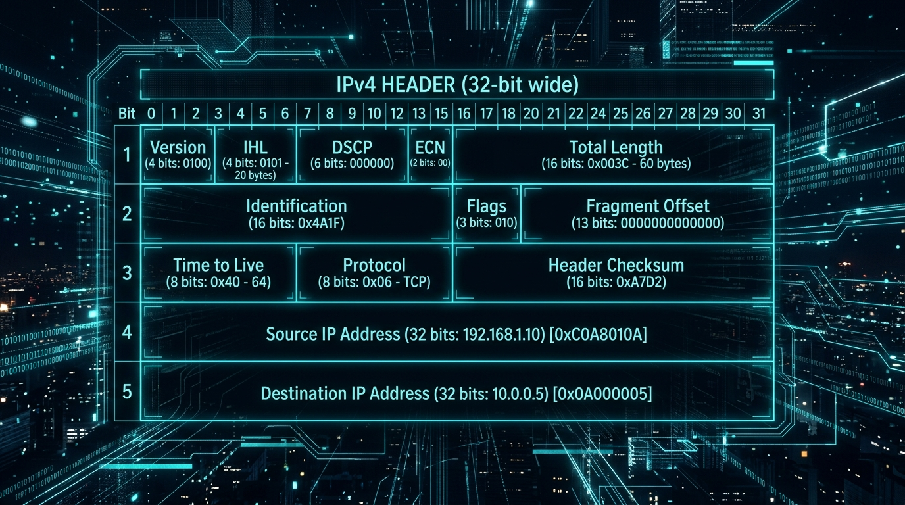
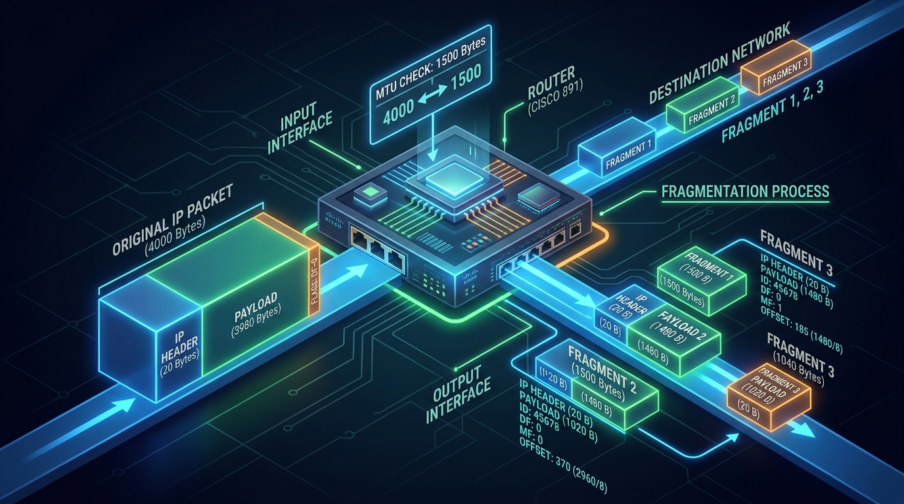
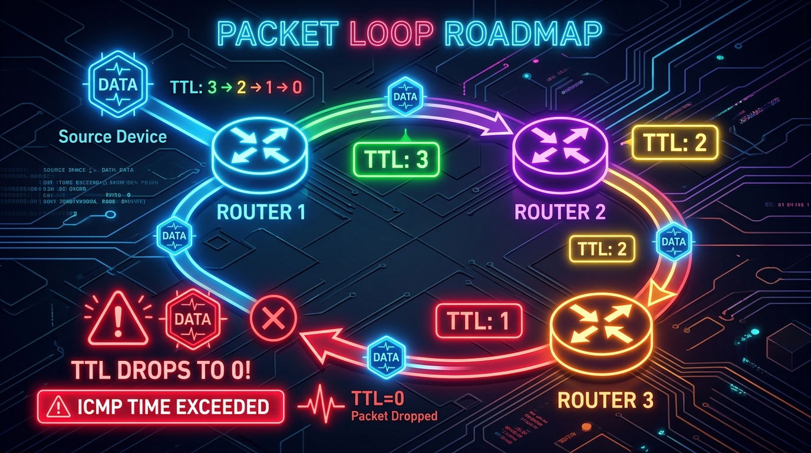

← [[Course on CCNA|Go Back to Course Hub]]

# 🔌 Day 10: The IPv4 Header

Welcome to the notes for **Day 10: The IPv4 Header** of Jeremy's IT Lab CCNA Course! Ye note aapko Layer 3 IPv4 header fields, packet fragmentation mechanisms, dynamic loop prevention (TTL), aur header error checking systems ko detailed real-world analogies aur premium illustrations ke sath pure Hinglish language mein samjhayega.

---

## 🧭 1. IPv4 Header Overview

Jab Layer 4 (Transport Layer) se aane wale Segment ko Layer 3 (Network Layer) par encapsulate kiya jata hai, toh use aage ek **IPv4 Header** lagaya jata hai jo use alag-alag networks ke beech route hone mein help karta hai.

*   **Header Size:** 
    *   **Minimum size:** **20 Bytes** (Options field empty hone par).
    *   **Maximum size:** **60 Bytes** (Options field full use hone par).

---

## 🗃️ 2. IPv4 Header Fields Table (32-Bit Grid)

IPv4 Header data ko 32-bit (4-byte) wide grid format mein structure kiya jata hai:

| Field Name (Kaam) | Bits Size | Purpose / Meaning (Kyun/Kaam) |
| :--- | :--- | :--- |
| **Version** | 4 bits | IP Version identify karta hai (IPv4 ke liye binary code `0100` = 4). |
| **IHL (Internet Header Length)** | 4 bits | Header ka total size batata hai in 4-byte words increments. (Min = 5, Max = 15). |
| **DSCP (Differentiated Services)** | 6 bits | Quality of Service (QoS) prioritizations set karta hai (VoIP/Video traffic priority). |
| **ECN (Explicit Congestion Notification)** | 2 bits | Packet drop kiye bina network congestion notification send karta hai. |
| **Total Length** | 16 bits | Pure packet (Header + Payload) ka size in bytes batata hai (Max = 65,535 Bytes). |
| **Identification** | 16 bits | Fragmented packets ko identify aur group karne ke liye unique ID tag. |
| **Flags** | 3 bits | Fragmentation limits control: Bit 0 (Reserved), Bit 1 (DF - Don't Fragment), Bit 2 (MF - More Fragments). |
| **Fragment Offset** | 13 bits | Original packet mein is specific fragment ka serial position location. |
| **TTL (Time to Live)** | 8 bits | Routing loops prevent karne ke liye automatic hop counter. |
| **Protocol** | 8 bits | Upper-layer payload protocol ID batata hai (ICMP = 1, TCP = 6, UDP = 17, OSPF = 89). |
| **Header Checksum** | 16 bits | Shift verification ke time header level integrity error checks. |
| **Source IP Address** | 32 bits | Sender device ka logical IP address. |
| **Destination IP Address** | 32 bits | Receiver device ka logical IP address. |
| **Options** | Variable | Special diagnostics testing parameters (CCNA lab tests mein rarely used). |

---

## 💡 3. Detailed Explanations & Real-world Analogies

### A. IHL (Internet Header Length)
*   **Concept:** Kyunki Options field variable size ki hoti hai, isliye receiver ko batana padta hai ki header kahan khatam ho raha hai aur actual payload data kahan se start ho raha hai. IHL header length ko **4-byte increments (multiplier)** mein batata hai.
*   *Default IHL value:* `5` (means \(5 \times 4\text{-bytes} = 20\text{ bytes}\)).
*   **💡 Analogy:** **Delivery Box Lid Guide:** Jaise kisi parcel box ke dhakkan (lid) ki height. Box kholne wale ko batana padta hai ki dhakkan kitna deep hai taaki wo samajh sake ki actual material box mein kis gehrai (depth) par milega.

---

### B. DSCP / QoS (Quality of Service)
*   **Concept:** Delay-sensitive traffic (jaise live phone call voice ya video stream) ko simple web browsing ya email download traffic se pehle priority route dene ke liye use hota hai.
*   **💡 Analogy:** **Airport Priority Boarding Pass:** Business class passengers (Voice traffic) ke paas priority pass hota hai, isliye unhe line mein khade hue economy class passengers (normal data) se pehle security check aur plane boarding ki permission milti hai.

---

### C. Packet Fragmentation: Identification, Flags & Offset
Jab router ke pass aane wale packet ka size us link ke maximum supported size (**MTU - Maximum Transmission Unit**, default `1500 bytes`) se bada hota hai, toh router packet ko pieces mein tod deta hai jise **Fragmentation** kehte hain.

1.  **Identification (16 bits):** Sabhi split fragments par ek hi same sequence number tag lagaya jata hai taaki receiver ko pata chale ki ye saare pieces ek hi original packet ke parts hain.
2.  **Flags (3 bits):**
    *   **DF (Don't Fragment):** Agar `DF = 1` hai aur packet MTU se bada hai, toh router use drop kar dega aur ICMP error bhejega. Agar `DF = 0` hai, toh fragmentation allowed hai.
    *   **MF (More Fragments):** Agar `MF = 1` hai, toh receiver samajh jata hai ki abhi is packet ke aur pieces aane baaki hain. Agar `MF = 0` hai, toh ye aakhiri fragment piece hai.
3.  **Fragment Offset (13 bits):** Batata hai ki is split piece ko original packet mein kis serial order position par fit karna hai.
*   **💡 Analogy:** **Large Bookshelf Delivery:** Imagine kijiye aapne ek badi bookshelf order ki jiska parcel box delivery vehicle ki capacity (MTU) se bada hai. Post office use 3 alag boxes (Fragments) mein split karega:
    *   Sari boxes par ek hi **Order ID** (Identification) likh di jayegi.
    *   Box 1 and Box 2 par likha hoga: *"More boxes coming"* (**MF = 1**). Aakhiri Box 3 par likha hoga: *"Final box"* (**MF = 0**).
    *   Har box par instruction tag hoga ki kaun sa piece top, middle, ya bottom fit hoga (**Fragment Offset**).

---

### D. TTL (Time to Live) - Routing Loop Prevention
*   **Concept:** Network par routing loops ke chalte data packets endless ghumte na rahein (jisse router crash ho sake), isliye TTL use hota hai. 
*   **Working:** Sender PC packet par ek default initial TTL value (Jaise `64` ya `128`) set karta hai. Har router jo is packet ko forward karta hai, wo TTL value ko **`-1`** se minus kar deta hai. Agar kisi router par TTL value `0` ho jati hai, toh router packet ko drop kar deta hai aur sender ko ek **ICMP Time Exceeded** packet return bhejta hai.

*   **💡 Analogy:** **Parcel Expiration Date:** Jaise kisi perishable parcel par 10 days ki expiration date likhi hai. Har courier office (Router hop) par aane par 1 day minus ho jata hai. Agar date 0 ho jaye, toh parcel ko self-destruct (drop) karke company ko report bhej di jati hai ki parcel address loop mein fas gaya tha.

---

### E. Protocol (8 bits)
*   **Concept:** Header ke baad aane wale payload data ka layer 4 protocol category check.
*   *Values:* TCP ke liye code `6` aur UDP ke liye code `17` set hota hai.
*   **💡 Analogy:** **Office Department Delivery:** Jaise delivery boy main office security gate cross karke packet ko label check ke bad direct specific department (Jaise: TCP finance department ya UDP sales department) mein deliver kar deta hai.

---

### F. Header Checksum (16 bits)
*   **Concept:** Kyunki har router par hop-by-hop travel karte waqt TTL value change/decrement hoti hai, isliye har hop par complete IP Header recalculate aur verify kiya jata hai check sum formula se.

---

## 📝 4. CCNA Day 10 Practice Questions

Aap yahan questions ko read karke answers verify kar sakte hain (Answer dekhne ke liye click karein):

1.  **Q1: Options field empty hone par, standard IPv4 Header ka minimum length size kitne bytes ka hota hai?**
    

    
🔓 Click to Reveal Answer

    **Answer:** **20 Bytes**.
    

2.  **Q2: Internet Header Length (IHL) field parameters check ke according agar value console par numeric integer value "6" show ho rahi hai, toh total header size kitne bytes hoga?**
    

    
🔓 Click to Reveal Answer

    **Answer:** **24 Bytes** (\(6 \times 4\text{-byte increments} = 24\text{ bytes}\)).
    

3.  **Q3: VoIP aur digital streaming audio data traffic ko standard network lines par priority routing dene ke liye header ki kis field ka use hota hai?**
    

    
🔓 Click to Reveal Answer

    **Answer:** **DSCP (Differentiated Services Code Point)** field (Quality of Service - QoS).
    

4.  **Q4: Router level connectivity par network loop limits block karne ke liye source PC se add hone wale kis hop counter parameter check data check field ka use hota hai?**
    

    
🔓 Click to Reveal Answer

    **Answer:** **TTL (Time to Live)** field.
    

5.  **Q5: Routing loop check execution ke dauran agar kisi router par incoming packet ka TTL value decrement ke baad 0 ho jaye, toh router kya response trigger karega?**
    

    
🔓 Click to Reveal Answer

    **Answer:** Router packet ko **drop (discard)** kar dega aur source PC ko **ICMP Time Exceeded (Type 11 Code 0)** message generate karke bhejega.
    

6.  **Q6: Packet fragmentation control flags data block mein "DF" (Don't Fragment) bit flag 1 set hone par router target links par MTU limits exceed hone par kya action lega?**
    

    
🔓 Click to Reveal Answer

    **Answer:** Router packet ko split (fragment) nahi karega, use direct **drop** kar dega aur source host ko ICMP unreachable error notification bhejega.
    

7.  **Q7: Receiver computer fragmented packets receive karte waqt kis flag bit "MF" (More Fragments) data parameters check se confirm karta hai ki ab iske baad aur pieces nahi aane wale?**
    

    
🔓 Click to Reveal Answer

    **Answer:** **`MF = 0`** (More Fragments zero bit sets denote the final packet segment).
    

8.  **Q8: Receiver end par incoming fragmented elements ko assemble karte waqt split frame parts ki positions track karne ke liye kis field ka use hota hai?**
    

    
🔓 Click to Reveal Answer

    **Answer:** **Fragment Offset** field.
    

9.  **Q9: IPv4 Header check verification parameters ke under, layer 4 payload transport target protocols TCP ke liye protocol field code decimal value kya use hoti hai?**
    

    
🔓 Click to Reveal Answer

    **Answer:** **6** (TCP dynamic identification code is 6, while UDP is 17).
    

10. **Q10: Layer 3 header processing time par routers incoming checksum value har hop stop par recalculate kyu karte hain?**
    

    
🔓 Click to Reveal Answer

    **Answer:** Kyunki har router packet forward karte waqt **TTL value ko decrement (modify) karta hai**, jisse header checksum value change ho jati hai.
    

