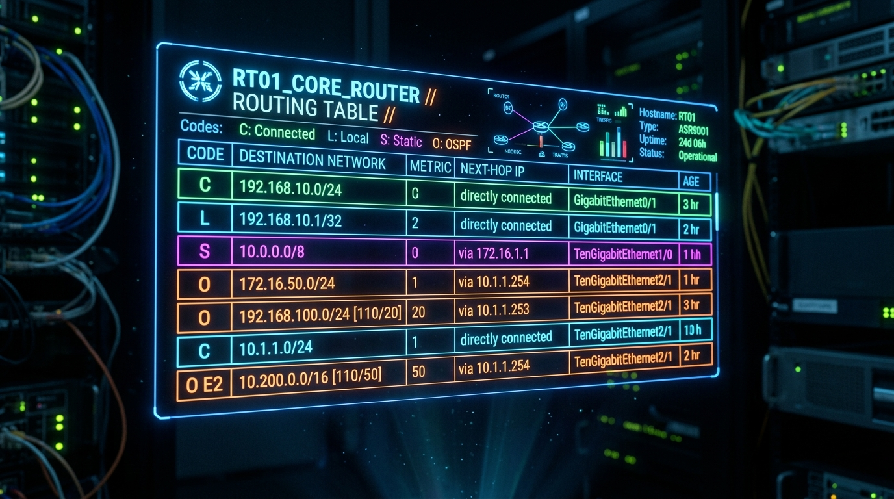
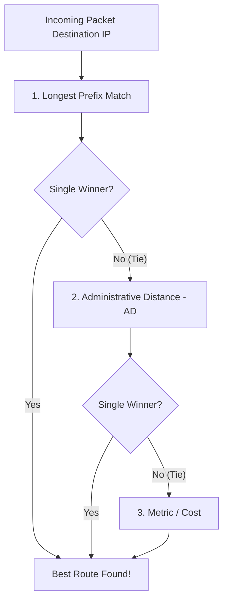
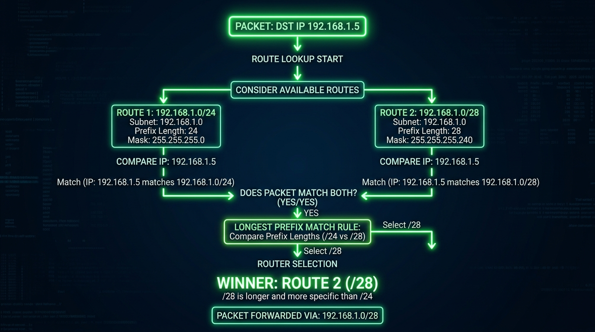
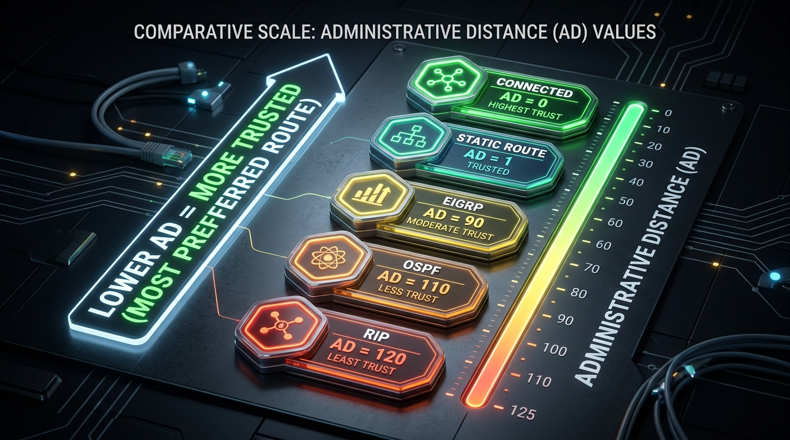

← [[Course on CCNA|Go Back to Course Hub]]

# 🔌 Day 11: Routing Fundamentals

Welcome to the notes for **Day 11: Routing Fundamentals** of Jeremy's IT Lab CCNA Course! Ye note aapko routers ke path selection logic, routing table structure, longest prefix match rules, aur Administrative Distance (AD) ko detailed real-world analogies aur premium illustrations ke sath pure Hinglish language mein samjhayega.

---

## 🧭 1. Routing & Routing Table Kya Hai?

**Routing** ek aisa process hai jiske zariye routers Layer 3 IP packets ko source se destination tak sahi path par forward karte hain.

*   **Routing Table:** Router apne RAM mein ek database maintain karta hai jise **Routing Table** kehte hain. Is table mein router ke paas maujood sabhi known networks aur un tak pahunchne ke raste (Paths) store hote hain.
*   **💡 Real-world Analogy (Udaharan):**
    *   **GPS Map / Highway Signboard:** Imagine kijiye aap road trip par hain. Har intersection (Router) par ek bada signboard (Routing Table) laga hai jo batata hai ki: *"Delhi jaane ke liye left lein, Mumbai jaane ke liye straight jayein."* Router har incoming packet ka destination IP check karke is signboard se match karta hai aur sahi interface par forward kar deta hai.

---

## 🗂️ 2. Router Raste Kaise Seekhta Hai? (Types of Routes)

Routing table mein routes 4 main sources se aate hain:

### A. Connected Routes (C):
*   **Kaam:** Jab hum router ke kisi physical port interface par IP address configure karte hain aur use turn-on (`no shutdown`) karte hain, toh wo network directly router se connect ho jata hai. Router ise automatically learn kar leta hai.
*   **💡 Analogy:** **Rooms in Your Own House:** Aapko apne ghar ke kitchen ya bedroom (connected networks) mein jaane ke liye kisi map ya guide ki zaroorat nahi hoti. Aap wahan direct enter kar sakte hain kyunki wo aapse directly connected hain.

### B. Local Routes (L):
*   **Kaam:** (Cisco IOS 15 ke baad introduced) Ye router ke apne interface ki specific host IP address ko represent karta hai. Iska subnet prefix hamesha `/32` (IPv4) ya `/128` (IPv6) hota hai, jiska matlab hai ki ye sirf usi ek single device IP ko denote karta hai.
*   **💡 Analogy:** **Your Own Physical Seat:** Ghar ke andar aapki apni specific study chair jahan aap khud baithe hain.

### C. Static Routes (S):
*   **Kaam:** Network Administrator manually router par ja kar command type karta hai ki: *"Is network par jaane ke liye is gate (next-hop) ka use karo."*
*   **💡 Analogy:** **Custom Tour Guide Detour:** Jaise road par temporary block hone par koi tour guide aapko manually batata hai ki: *"Gully number 4 se shortcut le lo."*

### D. Dynamic Routes (D, O, R):
*   **Kaam:** Routers aapas mein routing protocols (Jaise OSPF, EIGRP, RIP) ke zariye automatically raste share karte hain aur changes hone par table ko auto-update kar lete hain.
*   **💡 Analogy:** **Google Maps / Waze App:** Jaise live traffic status dekhkar app automatically aapka route change kar deta hai agar aage block ya heavy jam ho.

---

## ⚡ 3. Route Selection Logic (Router Sahi Rasta Kaise Chunta Hai?)

Agar Routing Table mein ek hi destination par jaane ke multiple raste maujood hon, toh router kis raste ko select karega? Iske liye Cisco routers **3-Step filtering logic** use karte hain:

---

### Step 1: Longest Prefix Match (Most Specific Match) - Highest Priority!
*   **Rule:** Router check karta hai ki destination IP address kis route ke subnet mask (prefix length) se sabse zyada match karta hai. **Jiska prefix length (Slash `/` number) sabse bada hoga, wahi jeetega.**
*   **💡 Example:** Imagine kijiye target destination IP hai: `192.168.1.5`. Routing table mein do routes hain:
    *   Route 1: `192.168.1.0/24` (Network mask range: `.0` to `.255`)
    *   Route 2: `192.168.1.0/28` (Network mask range: `.0` to `.15`)
    *   *Result:* Target IP `192.168.1.5` dono ranges mein aata hai. Lekin router **Route 2 (`/28`)** ko select karega kyunki `/28` is longer (more specific) than `/24`.
*   **💡 Analogy:** **Postal Address Matching:** Agar kisi letter par address likha hai: *"Delhi, Connaught Place, Block-A, Flat 5"*. Postman use directly Connaught Place block-A target karega, na ki use simple poore Delhi (generic `/24`) ke main post office bag mein drop karega. Specific detail ko hamesha priority milti hai.

---

### Step 2: Administrative Distance - AD (Trustworthiness)
*   **Rule:** Agar prefix length identical hai (tie ho gaya), toh router check karta hai ki rasta seekha kahan se gaya hai. **Jiski AD value sabse kam hoti hai, wo source sabse zyada trusted hota hai aur wahi route install hota hai.**

#### Standard AD Values Table:
| Route Source Protocol | Default AD Value | Trust Level (Kaise hai?) |
| :--- | :--- | :--- |
| **Directly Connected** | **0** | Absolute Trust (Sabse trusted). |
| **Static Route** | **1** | Highly Trusted (Admin ne set kiya hai). |
| **EIGRP Route** | **90** | Cisco proprietary fast routing. |
| **OSPF Route** | **110** | Open standard link state protocol. |
| **RIP Route** | **120** | Old protocol (Low trust). |

*   **💡 Analogy:** **Source Reliability Check:** Agar aapko rasta dhoondhna hai:
    *   *AD = 0 (Connected):* Aap apni aankhon se dekh rahe hain (100% true).
    *   *AD = 1 (Static):* Aapke trusted father (Admin) ne aapko phone karke rasta bataya (Very high trust).
    *   *AD = 120 (RIP):* Kisi random stranger ne tea stall par rasta bataya (Low trust). Aap humesha father ki baat manenge!

---

### Step 3: Metric (Cost / Value)
*   **Rule:** Agar prefix length aur AD dono same hain (e.g. OSPF se hi do raste mile hain), toh router metric check karta hai. Metric basically network path ki **cost (distance/bandwidth speed)** ko batata hai. **Sabse kam metric wala rasta select hota hai.**
*   **💡 Analogy:** **Google Maps Toll/Time comparison:** Dono raste same highway par hain, par ek raste par distance 10km hai (Metric 10) aur dusre par 15km (Metric 15). Aap humesha shorter cost (Metric 10) wala select karenge.

---

## 🚪 4. Gateway of Last Resort (Default Route)

*   **Kaam:** Agar routing table mein incoming packet ke destination IP ka koi matching route nahi milta, toh router packet ko drop karne ke bajaye ek backup path par bhej deta hai jise **Default Route** (ya Gateway of Last Resort) kehte hain.
*   **Format:** Routing table mein ise **`0.0.0.0/0`** se show kiya jata hai.
*   **💡 Analogy:** **Airport International Exit Gate:** Agar security officer ko nahi pata ki aapki ticket par likha remote village kis state mein hai, toh wo aapko bolta hai: *"Aap main International Terminal board (Default Gate) par chale jao, wo plane aapko main sorting hub tak le jayega, wahan se check ho jayega."*

---

## 📝 5. CCNA Day 11 Practice Questions

Aap yahan questions ko read karke answers verify kar sakte hain (Answer dekhne ke liye click karein):

1.  **Q1: Router packets forward karne ka routing path decision select karne ke liye dynamic RAM memory mein kis table database ka use karta hai?**
    

    
🔓 Click to Reveal Answer

    **Answer:** **Routing Table** (IP Routing Table).
    

2.  **Q2: Cisco routing table code check ke under symbol prefix character "C" aur "L" kis type ke routes ko represent karte hain?**
    

    
🔓 Click to Reveal Answer

    **Answer:** **`C`** represents **Connected** (Directly Connected networks) aur **`L`** represents **Local** (Router ka apna interface Host IP address).
    

3.  **Q3: Local interfaces status routes code "L" ka standard default subnet mask mask value (IPv4 check) prefix parameter length kya hota hai?**
    

    
🔓 Click to Reveal Answer

    **Answer:** **`/32`** (Single host IP mapping setup).
    

4.  **Q4: Network Administrator dwara manual CLI script se set kiye jane wale routes ko kis category ka route bolte hain?**
    

    
🔓 Click to Reveal Answer

    **Answer:** **Static Route** (denoted by symbol `S`).
    

5.  **Q5: Router ke samne agar ek hi target IP range ke do routes `10.10.10.0/24` aur `10.10.10.0/28` show ho rahe hain, toh priority logic criteria ke according router kis path ko best route select karega?**
    

    
🔓 Click to Reveal Answer

    **Answer:** **`10.10.10.0/28`** (Longest Prefix Match rule: `/28` is longer than `/24`).
    

6.  **Q6: Administrative Distance (AD) value parameter CCNA logic ke according kis physical attribute feature ko measure karti hai?**
    

    
🔓 Click to Reveal Answer

    **Answer:** Route source ki **Trustworthiness (reliability)** ko.
    

7.  **Q7: Cisco routers standard database mappings ke according manual Static route ki default Administrative Distance (AD) value kya hoti hai?**
    

    
🔓 Click to Reveal Answer

    **Answer:** **1** (Connected ki 0 hoti hai).
    

8.  **Q8: OSPF dynamic routing protocol ke liye CCNA standards parameter specifications default AD value kya defined hai?**
    

    
🔓 Click to Reveal Answer

    **Answer:** **110** (EIGRP ki 90, RIP ki 120 hoti hai).
    

9.  **Q9: Routing Table lookup parameters ke time agar destination address ka koi match entries display na ho, toh router packet backup exit ke liye kis default settings route check ko select karta hai?**
    

    
🔓 Click to Reveal Answer

    **Answer:** **Gateway of Last Resort** (Default Route: `0.0.0.0/0`).
    

10. **Q10: OSPF protocol ke aapas ke do routes ka prefix match length aur AD tie ho jaane par best path select karne ke liye router teesra filtration check kis value criteria par run karta hai?**
    

    
🔓 Click to Reveal Answer

    **Answer:** **Metric (Cost)** value par. Sabse low metric check jeetega.
    

