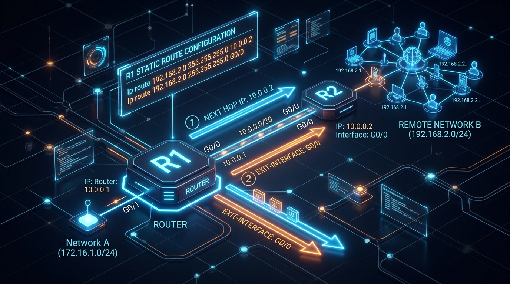
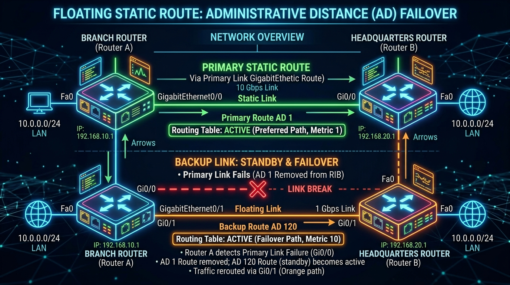

← [[Course on CCNA|Go Back to Course Hub]]

# 🔌 Day 11: Static Routing

Welcome to the notes for **Day 11 (Part 2): Static Routing** of Jeremy's IT Lab CCNA Course! Ye note aapko Cisco routers par static routes configure karne ke processes, next-hop IP vs exit interface configurations, default routes, summary routes, aur floating static routes (backup routes) ko detailed real-world analogies aur premium illustrations ke sath pure Hinglish language mein samjhayega.

---

## 🛣️ 1. Static Routing Kya Hai?

**Static Routing** ek manual process hai jisme Network Administrator manually routers par ja kar target destination networks aur un tak jaane ke paths define karta hai.

*   **Why use Static Routing?**
    *   **Control:** Network engineer ke paas forwarding path ka full control hota hai.
    *   **Resource Friendly:** Routers ke beech CPU/RAM aur network bandwidth waste nahi hoti (jaise dynamic routing protocols ke dynamic messages mein hoti hai).
    *   **Security:** Routes automatic change nahi hote, jisse dynamic path hijacking secure rehti hai.

---

## 🛠️ 2. Static Route Configuration (Cisco CLI Syntax)

Cisco IOS par static route configure karne ka basic command syntax niche diya gaya hai:

```ios
Router(config)# ip route [destination-network] [subnet-mask] [next-hop-IP | exit-interface]
```



### A. Next-Hop IP vs Exit Interface:
Static route set karte waqt aap rasta do tarike se define kar sakte hain:
1.  **Next-Hop IP Address:** Padosi (next) router ke interface ka IP address jahan packet drop karna hai (e.g. `10.0.0.2`).
2.  **Exit Interface:** Local router ka apna physical interface port jahan se packet bahar send karna hai (e.g. `GigabitEthernet0/0`).

> [!IMPORTANT]
> **CCNA Selection Rule:**
> *   **Point-to-Point Links (e.g., Serial Connection):** Aap **Exit Interface** ka use kar sakte hain kyunki us port se nikla data seedhe doosre end par connect single device tak hi jayega.
> *   **Ethernet / Multi-access Links (e.g., RJ45 Ethernet):** Aapko **Next-Hop IP** ka use karna chahiye. Agar aap exit interface select karenge, toh router ko destination IP ke liye MAC address trace karne ke liye ARP check run karna padega, jisse memory aur CPU utilization exceed ho jayegi.

#### 💡 Real-world Analogy (Udaharan):
*   **Shared Taxi Stand vs Private Elevator:**
    *   **Exit Interface (Serial Link):** Jaise ek private elevator. Agar aap elevator mein enter karte hain (Exit Interface), toh bina kisi confusion ke aap seedhe target floor (dest host) par hi rukenge.
    *   **Next-Hop IP (Ethernet Link):** Jaise ek shared taxi stand jahan bohot saari taxis (routers) khadi hain. Agar aap wahan ja kar bas bolenge *"Main bahar ja raha hoon"* (Exit Interface), toh driver ko samajh nahi aayega ki kaun si gadi mein baithna hai. Aapko specific target address ya driver name (**Next-Hop IP**) specify karna hoga taaki sahi destination direction mile.

---

## 🚀 3. Types of Static Routes

CCNA syllabus ke under hume 4 key types ke static routes seekhne hain:

### A. Standard Static Route:
*   Kisi specific remote subnet network tak jaane ka manual rasta.
*   *Example:* `ip route 192.168.2.0 255.255.255.0 10.0.0.2` (Target subnet `.2.0` par jaane ke liye data `10.0.0.2` router ko bhej do).

---

### B. Default Static Route (Gateway of Last Resort):
*   **Kaam:** Jab routing table mein destination IP ka koi match na mile, toh packet ko internet ya main server router par forward karne ka backup path.
*   **Syntax:**
    ```ios
    Router(config)# ip route 0.0.0.0 0.0.0.0 [next-hop-IP | exit-interface]
    ```
*   **💡 Analogy:** **International Mail Box:** Jaise post office mein agar check verification ke baad letter ka country code nahi milta, toh postman use drop/discard karne ke bajaye directly "International Mail Box" (Default Route) mein daal deta hai taaki wo central sorting terminal par check ho sake.


---

### C. Summary Static Route:
*   **Kaam:** Routing table ka size chhota karne ke liye contiguous subnets (ek jaise serial networks) ko combine karke ek single route block mein convert karna.
*   *Example:* Agar router ke paas 4 networks hain: `192.168.0.0/24`, `192.168.1.0/24`, `192.168.2.0/24`, `192.168.3.0/24`.
    *   Inhe combine karke ek single route banaya ja sakta hai: **`192.168.0.0/22`** (jiski range `.0.0` se `.3.255` tak cover hogi).
*   **💡 Analogy:** **Packing Cardboard Box:** Jaise shopkeeper 4 alag-alag medicine boxes (subnets) ko ek badhe single packing box (Summary Route) mein daal deta hai aur us par likh deta hai: *"Medicines Inside"*, taaki transport manager ko har box alag se register na karna pade.

---

### D. Floating Static Route (Backup Route):
*   **Kaam:** Ye ek backup static route hota hai jo routing table mein normal conditions mein hidden (inactive) rehta hai. Ye tabhi active hota hai jab primary routing link (OSPF/Static) physically block ya disconnect ho jaye.
*   **Working (AD Override):** Primary static route ki AD default `1` hoti hai. Floating static route set karte waqt hum uski AD manually badha dete hain (e.g. `120` or `250`). Kyunki lower AD preferred hoti hai, isliye router primary link use karta hai. Primary down hone par dynamic table check higher AD link ko fallback setup de deta hai.
*   **Syntax:**
    ```ios
    Router(config)# ip route 192.168.2.0 255.255.255.0 10.0.0.2 120   ! Set AD to 120 (Floating static)
    ```
*   **💡 Analogy:** **Standby Diesel Generator:** Jaise hospital mein main electrical line (Primary route - AD 1) active rehti hai. Par backup diesel generator (Floating static - AD 120) standby mode par rehta hai. Jaise hi main electricity cut off hoti hai, generator automatically start hokar power backup de deta hai.



---

## 🔍 4. Verification & Troubleshooting Commands

Configurations check karne ke liye yeh commands use hoti hain:

*   **Static routes table validation check:**
    ```ios
    Router# show ip route static
    ```
*   **Checking gateway status:**
    ```ios
    Router# show ip route
    ```
*   **Testing path hops live flow:**
    ```ios
    Router# traceroute 192.168.2.1
    ```
    *(Ye check karta hai ki path routers mein packet exact kis hop par drop ho raha hai).*

---

## 📝 5. CCNA Day 11 (Part 2) Practice Questions

Aap yahan questions ko read karke answers verify kar sakte hain (Answer dekhne ke liye click karein):

1.  **Q1: Static route configure karne ka basic global configuration mode standard command syntax kya hai?**
    <details>
    <summary>🔓 Click to Reveal Answer</summary>
    **Answer:** **`ip route [destination-network] [subnet-mask] [next-hop-IP / exit-interface]`**.
    </details>

2.  **Q2: Ethernet multi-access links par exit-interface ke badle next-hop IP use karna preferred kyu kiya jata hai?**
    <details>
    <summary>🔓 Click to Reveal Answer</summary>
    **Answer:** Exit interface configure karne par router ko local ARP checks run karne padte hain jo processing memory CPU utilization badhata hai. Next-hop directly Target MAC resolve kar leta hai.
    </details>

3.  **Q3: Gateway of Last Resort (Default Static Route) ko routing table address fields mein kis logical value format mein represent kiya jata hai?**
    <details>
    <summary>🔓 Click to Reveal Answer</summary>
    **Answer:** **`0.0.0.0 0.0.0.0`** (or prefix notation `/0`).
    </details>

4.  **Q4: Dynamic routing protocol default cost backup check ke roop mein floating static route configure karte waqt hum kis parameter ko modify karte hain?**
    <details>
    <summary>🔓 Click to Reveal Answer</summary>
    **Answer:** **Administrative Distance (AD)** value ko, jo primary interface AD value se hamesha high set ki jati hai.
    </details>

5.  **Q5: Static route configure karte waqt agar destination network command ke end mein `10.0.0.2 125` likha ho, toh isme numeric value "125" kis check parameter ko represent karti hai?**
    <details>
    <summary>🔓 Click to Reveal Answer</summary>
    **Answer:** Route ki manual **Administrative Distance (AD)** value ko (floating backup route config).
    </details>

6.  **Q6: Dynamic routing table structures check ke under multiple consecutive subnets (Jaise `192.168.0.0/24` se `.3.0/24`) ko ek single path route mein group karne ko kya bolte hain?**
    <details>
    <summary>🔓 Click to Reveal Answer</summary>
    **Answer:** **Summary Route** (Route Summarization).
    </details>

7.  **Q7: Routing Table mein configuration status verify karne ke liye hum routing table check command `show ip route static` chalate hain. Agar route yahan display ho raha hai par check fail ho raha hai, toh iska troubleshooting step kya hoga?**
    <details>
    <summary>🔓 Click to Reveal Answer</summary>
    **Answer:** **`traceroute`** run karke check karein ki data next hop ke kis specific interface drop block state par fasa hua hai.
    </details>

8.  **Q8: Point-to-Point WAN links (Jaise legacy serial links) par static route set karte waqt exit interface parameter use karna safe kyu mana jata hai?**
    <details>
    <summary>🔓 Click to Reveal Answer</summary>
    **Answer:** Kyunki serial point-to-point path par **sirf ek hi target padosi connected hota hai**, jisse ARP mapping queries chalane ki physical requirements nahi hoti.
    </details>

9.  **Q9: Routing table mein normal active condition mein floating static route hume `show ip route` command screen par visible kyu nahi hota?**
    <details>
    <summary>🔓 Click to Reveal Answer</summary>
    **Answer:** Kyunki uski Administrative Distance (AD) primary routing source (Static/OSPF) se high hoti hai, aur router table mein lower AD route ko hi active rakhta hai.
    </details>

10. **Q10: Primary static routing link physically disconnect ya failure state check trigger hone par standby floating route table mein kab update hota hai?**
    <details>
    <summary>🔓 Click to Reveal Answer</summary>
    **Answer:** **Immediately.** Jaise hi primary path interface link active state "down" status trigger karta hai, router higher AD floating route ko dynamic table updates mein automatic active kar deta hai.
    </details>
