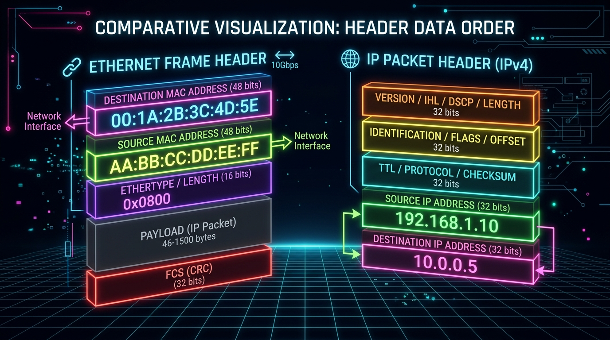
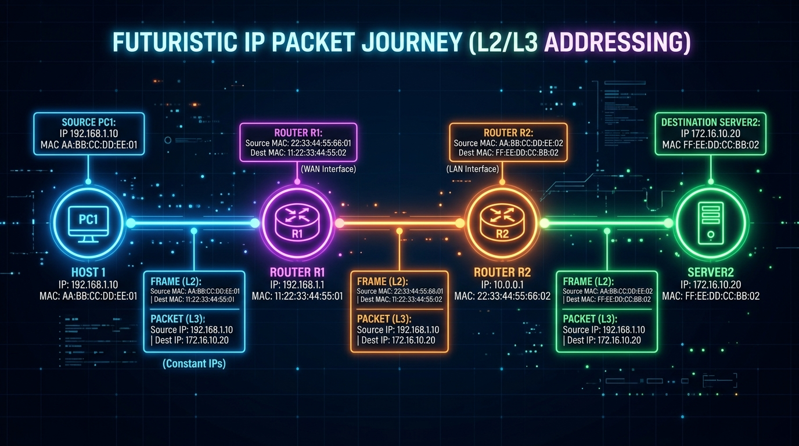
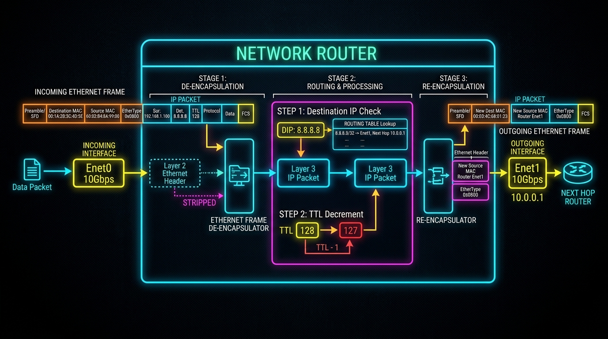

← [[Course on CCNA|Go Back to Course Hub]]

# 🔌 Day 12: The Life of a Packet

Welcome to the notes for **Day 12: The Life of a Packet** of Jeremy's IT Lab CCNA Course! Ye note aapko end-to-end routing processes, switches/routers par Layer 2/Layer 3 fields changes, encapsulation/de-encapsulation transitions, aur dynamic header parameters modification ko detailed real-world analogies aur premium illustrations ke sath pure Hinglish language mein samjhayega.

---

## 🗺️ 1. The Scenario & Network Topology

Hum ek simple network topology structure use karenge jisse hum pure packet flow ko step-by-step trace kar sakein:

*   **PC-A (Source Host):**
    *   IP Address: `192.168.1.10 /24`
    *   MAC Address: `aaaa.aaaa.aaaa`
*   **Router 1 (R1 - Default Gateway for PC-A):**
    *   LAN Interface (g0/0) IP: `192.168.1.1` \| MAC: `1111.1111.1111`
    *   WAN Interface (g0/1) IP: `10.0.0.1 /30` \| MAC: `1111.1111.2222`
*   **Router 2 (R2 - Next-Hop for R1):**
    *   WAN Interface (g0/1) IP: `10.0.0.2 /30` \| MAC: `2222.2222.1111`
    *   LAN Interface (g0/0) IP: `192.168.2.1 /24` \| MAC: `2222.2222.2222`
*   **PC-B (Destination Host):**
    *   IP Address: `192.168.2.10 /24`
    *   MAC Address: `bbbb.bbbb.bbbb`

---

## 🔍 2. Header Structure Difference

Packet flow trace karne se pehle ye important dynamic rule dhyan rakhein:

*   **IP Header (Layer 3):**
    *   **Source IP Address** comes **BEFORE** **Destination IP Address** in sequence.
*   **Ethernet Header (Layer 2):**
    *   **Destination MAC Address** comes **BEFORE** **Source MAC Address** in sequence (Taaki switches incoming frame receive hote hi destination check karke forwarding decision fast le sakein).

---

## 🚶‍♂️ 3. Step-by-Step Packet Walkthrough

---

### 🟢 Phase 1: PC-A Generates the Packet (Origin)

1.  **Subnet Match Check:** PC-A target destination IP `192.168.2.10` ko apne subnet mask (`/24`) aur local IP `192.168.1.10` se check karta hai. PC-A dekhta hai ki target IP local subnet ka part nahi hai, balki ek **Remote Network** par hai.
2.  **Path Choice:** Kyunki target remote network par hai, PC-A packet ko directly PC-B ko nahi bhej sakta. Ise packet apne **Default Gateway (Router R1)** ke physical interface IP `192.168.1.1` par bhejna hoga.
3.  **ARP Lookup:** PC-A ko default gateway ka IP toh pata hai, par layer 2 switch check bypass karne ke liye **R1 ke g0/0 port ka MAC address** chahiye:
    *   PC-A apne internal **ARP Table** (ARP Cache) check karta hai.
    *   Agar ARP table mein target IP `192.168.1.1` ka MAC address nahi hai, toh PC-A ek **ARP Request** (Layer 2 Broadcast) send karta hai.
    *   R1 use respond karke apni **ARP Reply** (Layer 2 Unicast) bhejta hai. PC-A use process karke gateway ka MAC `1111.1111.1111` seekh leta hai.
4.  **Layer 2/3 Encapsulation:** PC-A data packet encapsulate karta hai:
    *   **IP Header:** Source IP = `192.168.1.10` \| Destination IP = `192.168.2.10`
    *   **Ethernet Header:** Destination MAC = `1111.1111.1111` (R1) \| Source MAC = `aaaa.aaaa.aaaa` (PC-A)
5.  **Transmission:** Frame wire par electrical/optical signal bankar local switch ke zariye Router R1 tak pahunchti hai.

*   **💡 Real-world Analogy:** **Outside City Courier Post:** 
    *   Aapne ek parcel box packing (IP Packet) kiya. Us par target receiver ka house address (Destination IP) aur aapka apna address (Source IP) permanent ink se likh diya. 
    *   Kyunki receiver doosre city (remote LAN) mein rehta hai, aap use direct delivery nahi kar sakte. Aapne delivery courier vehicle ko bulaya aur use bolne ke liye parcel box ke upar ek extra envelope cover bag (Ethernet Header) lagaya, jis par deliver address local post sorting office (Default Gateway R1 MAC) likha hai.

---

### 🟡 Phase 2: Router R1 Processes & Forwards (First Hop)

1.  **FCS Validation:** R1 interface g0/0 frame receive karta hai aur FCS (Frame Check Sequence) check karta hai taaki link error check confirm ho sake.
2.  **MAC Destination Match:** R1 check karta hai ki Ethernet header mein destination MAC address `1111.1111.1111` uske apne interface g0/0 se match karta hai.
3.  **De-encapsulation:** R1 Layer 2 Ethernet header aur trailer (FCS) ko **strip (tear open)** kar deta hai, aur Layer 3 IP Packet ko processing ke liye extract karta hai.
4.  **Routing Table Lookup:** R1 packet ke destination IP address `192.168.2.10` ko dekhta hai aur apne dynamic/static routing table mein matching entry check karta hai:
    *   Routing table check entries show: *"To reach 192.168.2.0/24, send via next-hop 10.0.0.2 (R2) using exit interface g0/1."*
5.  **IP Header Modification (Crucial step):**
    *   R1 IP Header ke **TTL (Time to Live)** parameter value ko **1 se decrease (decrement)** kar deta hai (e.g. from 64 to 63).
    *   Kyunki TTL change hua hai, isliye R1 packet ka **Header Checksum recalculate** karta hai.
6.  **Layer 2 Re-encapsulation:** R1 ko ab link line par packet forward karne ke liye next-hop router R2 ka interface MAC address chahiye:
    *   R1 apna ARP Table check karta hai `10.0.0.2` (R2) ke liye. ARP entries match hone par MAC `2222.2222.1111` extract karta hai.
    *   R1 ab original IP packet ke upar **ek bilkul naya Ethernet Header** encapsulate karta hai:
        *   **IP Header (Unchanged):** Source IP = `192.168.1.10` \| Destination IP = `192.168.2.10`
        *   **Ethernet Header (New):** Destination MAC = `2222.2222.1111` (R2) \| Source MAC = `1111.1111.2222` (R1's g0/1 exit interface)
7.  **Transmission:** Packet ko electrical signals format mein link par R2 ki taraf send kiya jata hai.

*   **💡 Real-world Analogy:** **Sorting Hub Hub-to-Hub transit:** 
    *   Local post sorting station (R1) par parcel truck receive hua. Unhone purana local post cover bag (Old L2 Header) phaad kar phek diya. 
    *   Unhone main box par target address (PC-B IP) check kiya aur status ledger list (Routing table) mein dekha ki is block ko highway highway route se R2 main warehouse hub par bhejenge. 
    *   Unhone box par check stamp update kiya (TTL - 1) aur use ek naye state cargo truck bag (New L2 Header) mein daal diya, jis par delivery direction state cargo address R2 (Next-hop MAC) likha hai.

---

### 🔵 Phase 3: Router R2 Delivers to Target (Final Hop)

1.  **Frame Check & De-encapsulation:** R2 frame check validate karke Layer 2 header ko tear-down kar deta hai aur internal IP packet extract karta hai.
2.  **Routing Table check:** R2 destination IP `192.168.2.10` check karta hai. Routing table use batata hai ki target network `192.168.2.0/24` uske apne interface g0/0 par **Directly Connected** hai.
3.  **TTL & Checksum Update:** R2 TTL ko ek bar phir **`-1`** se update karta hai (e.g., from 63 to 62) aur Checksum re-calculate karta hai.
4.  **Final Segment Encapsulation:** R2 apne LAN ARP table check se PC-B ka actual physical MAC address `bbbb.bbbb.bbbb` extract karta hai.
5.  **Final Ethernet Header:**
    *   **IP Header (Unchanged):** Source IP = `192.168.1.10` \| Destination IP = `192.168.2.10`
    *   **Ethernet Header (Final):** Destination MAC = `bbbb.bbbb.bbbb` (PC-B) \| Source MAC = `2222.2222.2222` (R2's g0/0 interface)
6.  **Transmission:** Frame wire physical link line par client PC-B tak pahunchti hai.

---

### 🏁 Phase 4: PC-B Receives & Processes (Destination)

1.  PC-B frame receive karke checking run karta hai. Destination MAC check se match hone par L2 frame de-encapsulates karke Layer 3 packet checks pass kar leta hai.
2.  Packet check pass hone par, IP header verify kiya jata hai aur internal payload (Layer 4 Segment segments) ko processing app data ports par handle kar diya jata hai.

---

## ⚖️ 4. Golden Rules of Packet Forwarding

Network paths par data travel karte waqt yeh do rules hamesha absolute sach rehte hain:

| Parameter (Header Field) | Path Travel Behavior (Safarnama check) | Reason (Kyun?) |
| :--- | :--- | :--- |
| **Layer 3 IP Addresses** (Source & Destination) | **Never Change** (Humesha same rehte hain) | Kyunki network devices ko origin sender aur final receiver ka address path trace karne ke liye end-to-end common rakhna padta hai. |
| **Layer 2 MAC Addresses** (Source & Destination) | **Change at EVERY Hop** (Har router check-post par badal jate hain) | Kyunki MAC address local link boundaries (LAN blocks) tak hi valid hote hain. Har router link cross karne par physical wire segment parameters naye set hote hain. |

---

## 📝 5. CCNA Day 12 Practice Questions

Aap yahan questions ko read karke answers verify kar sakte hain (Answer dekhne ke liye click karein):

1.  **Q1: End-to-end packet travel process ke dauran, Layer 3 Source aur Destination IP addresses ke values mein kya changes aate hain?**
    

    
🔓 Click to Reveal Answer

    **Answer:** **IP addresses never change.** Source aur Destination IP pooray path mein exact same (constant) rehte hain.
    

2.  **Q2: Layer 2 Ethernet Frame header ke under dynamic traffic check settings mein source aur destination MAC addresses mein routing jumps ke dauran kya transformation hota hai?**
    

    
🔓 Click to Reveal Answer

    **Answer:** **MAC addresses badal jate hain.** Har router hop (L3 node interface transition) cross karte waqt naya Source aur Destination MAC configure kiya jata hai.
    

3.  **Q3: Ethernet standard header formatting sequence check ke coordinates according, standard layout format mein Destination MAC address ko Source MAC address se pehle kyu rakha jata hai?**
    

    
🔓 Click to Reveal Answer

    **Answer:** Taaki switch ports incoming data streams receive hote hi target check complete kar sakein aur frame forwarding decision fast execute kar skein (bina pooray frame structure scan ka wait kiye).
    

4.  **Q4: Jab source PC-A destination host PC-B ko packet bhej raha ho jo ki alag network par ho, toh PC-A layer 2 frame wrapper par destination MAC address kis device ka map karega?**
    

    
🔓 Click to Reveal Answer

    **Answer:** PC-A apne local **Default Gateway (R1 interface port g0/0)** ka MAC address write karega.
    

5.  **Q5: Router dynamic path verification ke dauran incoming Layer 2 frame ko strip (tear open) karne ke process ko technical language mein kya bolte hain?**
    

    
🔓 Click to Reveal Answer

    **Answer:** **De-encapsulation**.
    

6.  **Q6: Router routing table check complete hone ke baad jab packet forward karne ke liye naya Ethernet wrapper lagata hai, toh is network step ko kya term diya jata hai?**
    

    
🔓 Click to Reveal Answer

    **Answer:** **Encapsulation (Re-encapsulation)**.
    

7.  **Q7: Router path calculations time par Layer 3 packet process karte waqt IP header ke kis specific field value ko decrement (-1) karta hai?**
    

    
🔓 Click to Reveal Answer

    **Answer:** **TTL (Time to Live)** field.
    

8.  **Q8: TTL value decrease karne ke baad, router ko packet forward karne se pehle IP header check configurations verify karne ke liye kis parameter field ko recalculate karna padta hai?**
    

    
🔓 Click to Reveal Answer

    **Answer:** **Header Checksum** field.
    

9.  **Q9: Target PC se default router interface tak IP configurations change na hone ke baad bhi router next hop tak link frames forward karne ke liye MAC address trace karne ke liye kis protocol map cache tables check run karta hai?**
    

    
🔓 Click to Reveal Answer

    **Answer:** **ARP (Address Resolution Protocol)** Table checks.
    

10. **Q10: Packet jab destination network switch final segment router par hits hota hai, toh router target physical link drop mapping se pehle destination host interface ka physical address kahan se search karta hai?**
    

    
🔓 Click to Reveal Answer

    **Answer:** Apne local **ARP Table** database se (jis IP range se directly connected interface map target hota hai).
    

