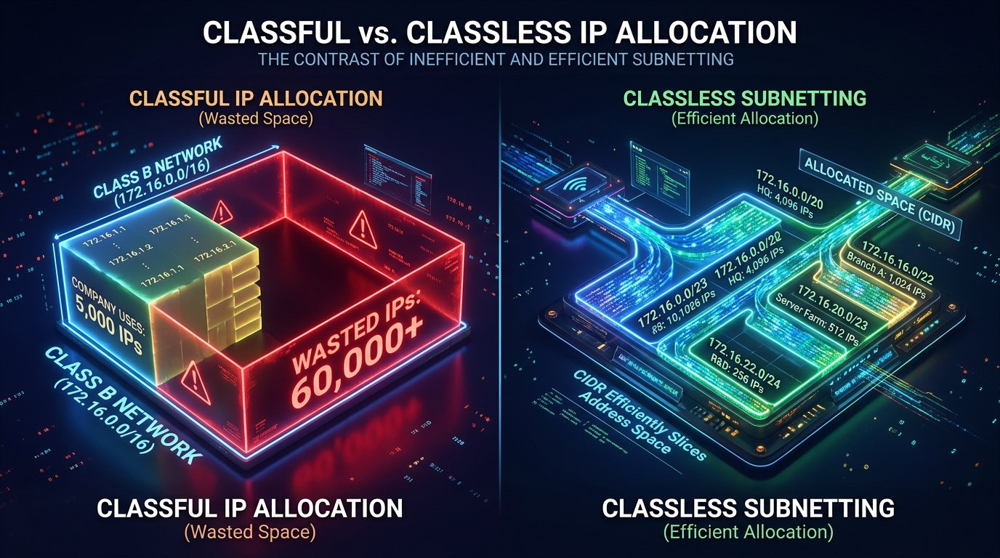
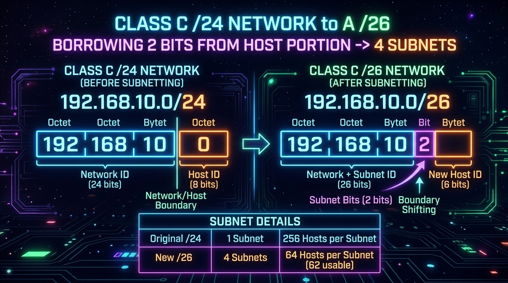
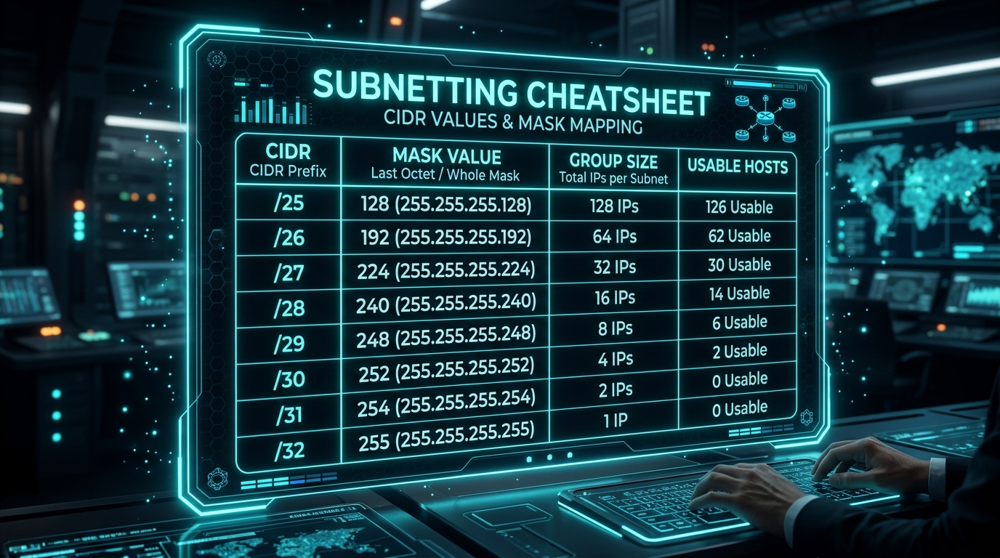

← [[Course on CCNA|Go Back to Course Hub]]

# 🔌 Day 13: Subnetting - Part 1

Welcome to the notes for **Day 13: Subnetting - Part 1** of Jeremy's IT Lab CCNA Course! Ye note aapko sub-networks (subnets) banane ke criteria, Classful vs CIDR structures, borrowing bits logic, host formulas, aur Subnetting Cheatsheet grid ko detailed real-world analogies aur premium illustrations ke sath pure Hinglish language mein samjhayega.

---

## 🌐 1. Subnetting Kya Hai Aur Kyun Zaruri Hai?

Pehle ke **Classful Addressing** system mein address allocation bohot wasteful tha (Jaise Class B network direct assign karne par company ko 65,536 IPs milte the, bhale hi unhe sirf 5,000 IPs ki zaroorat ho). Is wastage ko rokne ke liye IETF ne 1993 mein **CIDR (Classless Inter-Domain Routing)** introduce kiya.

*   **Subnetting:** Ek bade single Classful IP network range ko small logical networks (**Subnets**) mein divide karne ki dynamic technique.
*   **Benefits:**
    *   **Broadcast Limits:** Broadcast traffic ka boundary scope chhota karke network throughput performance behtar banana.
    *   **Security:** Alag-alag departments ke devices ko security boundary rules ke chalte isolation controls dena.
    *   **Save IPs:** IP addresses ke logical wastage ko block karna.

#### 💡 Real-world Analogy (Udaharan):
*   **Large Warehouse Partitioning:** Imagine kijiye aapke paas ek bada warehouse (Network IP block) hai. Agar aap bina koi wall/partition banaye saara stock ek sath dump kar denge:
    *   *Wastage:* Chhota sa stock manage karne ke liye pura space reserve block ho jayega.
    *   *Noise/Interference:* Kisi ek product ki search queries pure room mein shor (Broadcast) failayengi.
    *   *Solution:* Hum warehouse ko partition walls (Subnet Mask) se chhote sections (**Subnets**) mein divide kar dete hain, taaki har section ka storage orderly aur independent rahe.

---

## 🧮 2. Borrowing Bits & Mathematical Formulas

Subnetting karte waqt hum **Host Portion** ke bits ko borrow karke **Network Portion** ko expand karte hain.

1.  **Formula for Subnets Created:**
    \[\text{Number of Subnets} = 2^S\]
    *   Jahan **`S`** = Subnet bits (Host portion se borrow kiye gaye bits ki sankhya).
2.  **Formula for Usable Hosts per Subnet:**
    \[\text{Usable Hosts} = 2^H - 2\]
    *   Jahan **`H`** = Remaining Host bits. (Minus 2 dynamic rules: Network ID aur Broadcast ID).

---

## 📝 3. Step-by-Step Worked Examples (Class C Subnetting)

Chaliye starting range `192.168.1.0/24` standard network se subnetting start karte hain:

### ⚡ Example A: Borrowing 1 Bit (`/25` Subnetting)
*   **Original Prefix:** `/24` (24 network bits, 8 host bits).
*   **New Prefix:** `/25` (25 network bits, 7 host bits). Humne **1 bit borrow** kiya.
*   **Subnet Mask Binary:** `11111111.11111111.11111111.10000000` = **`255.255.255.128`**
*   **Calculations:**
    *   *Subnets Created:* \(2^1 = 2\) subnets.
    *   *Usable Hosts:* \(2^7 - 2 = 128 - 2 = 126\) hosts per subnet.
    *   *Block Size (Increment):* \(256 - 128 = 128\).
*   **Subnet Ranges Chart:**
    1.  **Subnet 1:** `192.168.1.0/25`
        *   Network IP: `192.168.1.0`
        *   First Usable IP: `192.168.1.1`
        *   Last Usable IP: `192.168.1.126`
        *   Broadcast IP: `192.168.1.127`
    2.  **Subnet 2:** `192.168.1.128/25`
        *   Network IP: `192.168.1.128`
        *   First Usable IP: `192.168.1.129`
        *   Last Usable IP: `192.168.1.254`
        *   Broadcast IP: `192.168.1.255`

---

### ⚡ Example B: Borrowing 2 Bits (`/26` Subnetting)
*   **New Prefix:** `/26` (26 network bits, 6 host bits). Humne **2 bits borrow** kiye.
*   **Subnet Mask Binary:** `11111111.11111111.11111111.11000000` = **`255.255.255.192`**
*   **Calculations:**
    *   *Subnets Created:* \(2^2 = 4\) subnets.
    *   *Usable Hosts:* \(2^6 - 2 = 64 - 2 = 62\) hosts per subnet.
    *   *Block Size (Increment):* \(256 - 192 = 64\).
*   **Subnet Ranges Chart:**
    1.  **Subnet 1:** Network = `.0` \| Usable = `.1` to `.62` \| Broadcast = `.63`
    2.  **Subnet 2:** Network = `.64` \| Usable = `.65` to `.126` \| Broadcast = `.127`
    3.  **Subnet 3:** Network = `.128` \| Usable = `.129` to `.190` \| Broadcast = `.191`
    4.  **Subnet 4:** Network = `.192` \| Usable = `.193` to `.254` \| Broadcast = `.255`

---

## 📊 4. Master Subnetting Cheatsheet Grid

Subnet calculations ko seconds mein perform karne ke liye aap is scale cheatsheet ko directly use kar sakte hain:

| Group Size (Block size) | **128** | **64** | **32** | **16** | **8** | **4** | **2** | **1** |
| :--- | :--- | :--- | :--- | :--- | :--- | :--- | :--- | :--- |
| **Subnet Mask Value** | **128** | **192** | **224** | **240** | **248** | **252** | **254** | **255** |
| **4th Octet Prefix** | `/25` | `/26` | `/27` | `/28` | `/29` | `/30` | `/31` | `/32` |
| **3rd Octet Prefix** | `/17` | `/18` | `/19` | `/20` | `/21` | `/22` | `/23` | `/24` |
| **2nd Octet Prefix** | `/9` | `/10` | `/11` | `/12` | `/13` | `/14` | `/15` | `/16` |
| **1st Octet Prefix** | `/1` | `/2` | `/3` | `/4` | `/5` | `/6` | `/7` | `/8` |

---

## 📝 5. CCNA Day 13 Practice Questions

Aap yahan questions ko read karke answers verify kar sakte hain (Answer dekhne ke liye click karein):

1.  **Q1: Classful addressing network systems ke IP allocation wastage issues ko solve karne ke liye IETF ne kis classless architecture protocol ko launch kiya?**
    

    
🔓 Click to Reveal Answer

    **Answer:** **CIDR (Classless Inter-Domain Routing)**.
    

2.  **Q2: Subnetting perform karte waqt hum network area block size ko expand karne ke liye kis segment ke bits ko borrow (udhaar) karte hain?**
    

    
🔓 Click to Reveal Answer

    **Answer:** **Host Portion** ke bits ko borrow kiya jata hai.
    

3.  **Q3: Subnet mask value `255.255.255.128` classless IP addressing systems checks ke coordinates kis CIDR prefix length (slash notation) ko represent karti hai?**
    

    
🔓 Click to Reveal Answer

    **Answer:** **`/25`**.
    

4.  **Q4: Class C network `192.168.10.0/24` range ke under agar hum 2 bits borrow karein, toh total number of subnets kitne banenge?**
    

    
🔓 Click to Reveal Answer

    **Answer:** **4 subnets** (\(2^2 = 4\)).
    

5.  **Q5: CIDR prefix `/26` configuration check mask ke under configure hone wale har ek subnet segment mein maximum usable host addresses count kitni hogi?**
    

    
🔓 Click to Reveal Answer

    **Answer:** **62 usable hosts** (\(2^6 - 2 = 64 - 2 = 62\)).
    

6.  **Q6: CIDR Subnet range `203.0.113.128/25` network segment ka physical Broadcast Address IP kya hoga?**
    

    
🔓 Click to Reveal Answer

    **Answer:** **`203.0.113.255`** (ye subnet ka aakhiri address hai).
    

7.  **Q7: Subnet mask value `255.255.255.240` kis CIDR slash prefix notation configurations check ko map karti hai?**
    

    
🔓 Click to Reveal Answer

    **Answer:** **`/28`** (last octet is `11110000` which contains four 1s. \(24 + 4 = 28\)).
    

8.  **Q8: Subnet segment mask `/28` range configuration checks ke under har block size network segment ka dynamic host group size increment integer number kya hoga?**
    

    
🔓 Click to Reveal Answer

    **Answer:** **16** (calculations: \(256 - 240 = 16\)).
    

9.  **Q9: Subnet mask parameters checking systems ke coordinates according, standard CIDR mask prefix `/30` kis last octet mask decimal value ko show karegi?**
    

    
🔓 Click to Reveal Answer

    **Answer:** **`255.255.255.252`** (containing six 1s in the 4th octet).
    

10. **Q10: Subnet calculations sheet rules ke coordinates checks bypass karte waqt block range increments find karne ke liye 256 number constant se kis value ko subtract kiya jata hai?**
    

    
🔓 Click to Reveal Answer

    **Answer:** Subnet Mask ke last non-zero octet ki decimal value ko (e.g., for `/26`, \(256 - 192 = 64\)).
    

