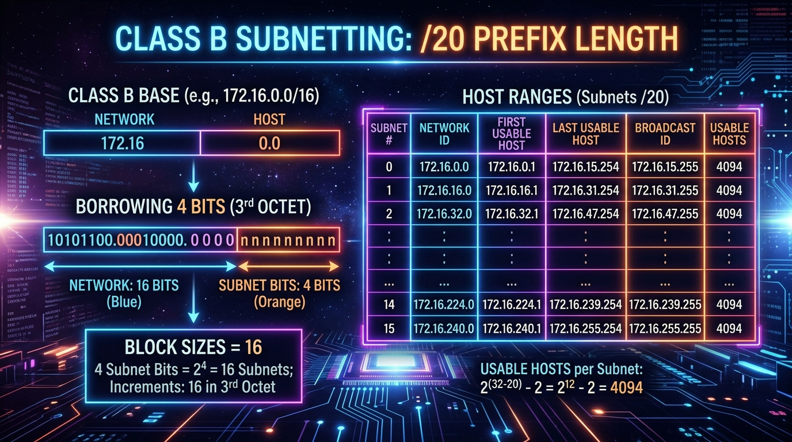
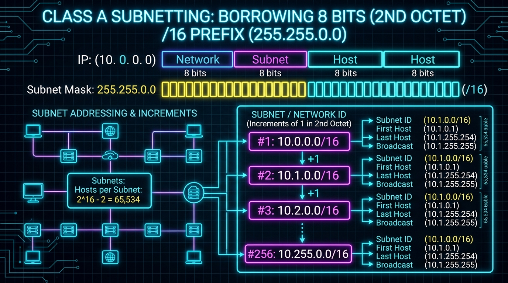
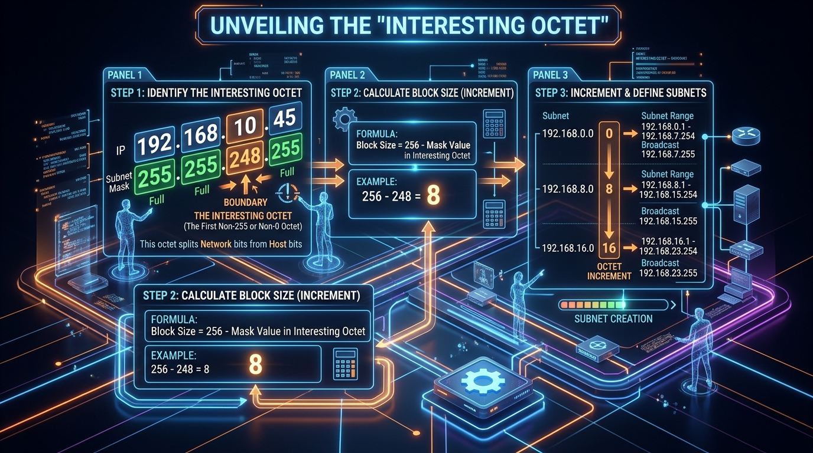

← [[Course on CCNA|Go Back to Course Hub]]

# 🔌 Day 13-14: Subnetting - Part 2

Welcome to the notes for **Day 14: Subnetting - Part 2** of Jeremy's IT Lab CCNA Course! Ye note aapko Class B aur Class A networks ki subnetting, multi-octet subnet boundaries, "Interesting Octet" rule, aur subnet ranges calculations ko detailed real-world analogies aur premium illustrations ke sath pure Hinglish language mein samjhayega.

---

## 🌐 1. Class B vs Class A Subnetting Overview

Day 13 mein humne Class C networks (`/24` default) ki subnetting seekhi jisme sabhi calculations sirf aakhiri 4th octet tak limited thi. Lekin jab hum bade networks (Class B `/16` ya Class A `/8` defaults) ki subnetting karte hain, toh hum **3rd aur 2nd octets** ke bits ko borrow karte hain.

*   **Difference:** 
    *   Subnet range increments (Block size) ab last octet ke bajaye **3rd ya 2nd octet** par reflect hote hain.
    *   Last octet (4th octet) mein mostly `0` to `255` ka poora range cover hota hai.

---

## 📊 2. Class B Subnetting Calculations

Class B networks default standard prefix `/16` (Mask `255.255.0.0`) use karte hain. Host portion ke liye last do octets (16 bits) available hote hain.

---

### ⚡ Example A: Class B `/20` Subnetting (Mask: `255.255.240.0`)
*   **Original network:** `172.16.0.0/16`
*   **Subnet Mask Binary:** `11111111.11111111 . 11110000 . 00000000` = **`255.255.240.0`**
*   **Calculations:**
    *   *Subnet bits borrowed (S):* 4 bits (in 3rd octet). Subnets created = \(2^4 = 16\).
    *   *Remaining Host bits (H):* \(32 - 20 = 12\) bits. Usable hosts = \(2^{12} - 2 = 4096 - 2 = 4094\) hosts per subnet.
    *   *Interesting Octet:* **3rd Octet** (Kyunki boundary 3rd octet mein exist karti hai).
    *   *Block Size (Increment):* \(256 - 240 = 16\) (in the **3rd Octet**!).
*   **Subnet Ranges Chart:**
    1.  **Subnet 1:**
        *   Network IP: `172.16.0.0 /20`
        *   First Usable IP: `172.16.0.1` (Network ID + 1)
        *   Last Usable IP: `172.16.15.254` (Broadcast ID - 1)
        *   Broadcast IP: `172.16.15.255` (Kyunki next subnet `.16.0` hai, toh isse pehle ka aakhiri address `.15.255` hoga).
    2.  **Subnet 2:**
        *   Network IP: `172.16.16.0 /20`
        *   First Usable IP: `172.16.16.1`
        *   Last Usable IP: `172.16.31.254`
        *   Broadcast IP: `172.16.31.255`
    3.  **Subnet 3:** Network = `172.16.32.0` \| Usable = `172.16.32.1` to `172.16.47.254` \| Broadcast = `172.16.47.255`

---

### 💡 Real-world Analogy (Udaharan):
*   **Multi-storey Building Apartments:**
    *   Imagine kijiye ek badi society tower hai jisme floors (3rd octet) aur flats numbers (4th octet) hain.
    *   Agar hum block size 16 set karte hain, toh floor ranges `0 se 15`, `16 se 31` ke blocks mein divide hoti hain.
    *   Pehli block registry range `0.0` se start hokar Floor 15 ke flat number 255 (`15.255`) par khatam hoti hai. Jaise hi Floor 16 start hoga (`16.0`), doosra block block start ho jayega.

---

## 📈 3. Class A Subnetting Calculations

Class A networks default standard prefix `/8` (Mask `255.0.0.0`) use karte hain. Host portion ke liye last teen octets (24 bits) available hote hain.

---

### ⚡ Example: Class A `/16` Subnetting (Mask: `255.255.0.0`)
*   **Original network:** `10.0.0.0/8`
*   **Subnet Mask:** **`255.255.0.0`**
*   **Calculations:**
    *   *Subnet bits borrowed (S):* 8 bits (in 2nd octet). Subnets created = \(2^8 = 256\) subnets.
    *   *Remaining Host bits (H):* 16 bits (3rd and 4th octet). Usable hosts = \(2^{16} - 2 = 65,534\) hosts per subnet.
    *   *Interesting Octet:* **2nd Octet** (Kyunki boundary 2nd octet mein hai).
    *   *Block Size (Increment):* \(256 - 255 = 1\) (in the **2nd Octet**!).
*   **Subnet Ranges Chart:**
    1.  **Subnet 1:**
        *   Network IP: `10.0.0.0 /16`
        *   First Usable IP: `10.0.0.1`
        *   Last Usable IP: `10.0.255.254`
        *   Broadcast IP: `10.0.255.255`
    2.  **Subnet 2:**
        *   Network IP: `10.1.0.0 /16`
        *   First Usable IP: `10.1.0.1`
        *   Last Usable IP: `10.1.255.254`
        *   Broadcast IP: `10.1.255.255`

---

## ⚡ 4. The "Interesting Octet" Shortcut Method

Agar CCNA exam mein kisi unique IP Address (Jaise `172.16.35.45/20`) ka Network ID aur Broadcast ID nikalna ho, toh ye simple **3-Step process** use karein:

1.  **Find the Interesting Octet:** Mask prefix check karein. `/20` ka mask `255.255.240.0` hai. Kyunki boundary 3rd octet par hai, isliye **3rd octet** humara interesting octet hai.
2.  **Calculate Block Size:** Interesting octet mask value ko 256 se subtract karein:
    \[256 - 240 = 16\]
    *(Block size = 16)*
3.  **Find the Network ID Range:**
    *   Interesting octet value check karein IP mein: `35`.
    *   16 ke increments likhein: `0, 16, 32, 48, 64...`
    *   Check karein ki `35` kis group ke beech aata hai: `32` aur `48` ke beech.
    *   Lower value (`32`) ko interesting octet mein rakh kar baaki right octets zero kar dein: **`172.16.32.0`** (Network ID).
    *   Next block (`48`) se 1 subtract karke broadcast IP banayein: **`172.16.47.255`** (Broadcast Address).
    *   Usable range: **`172.16.32.1` to `172.16.47.254`**.

---

## 📝 5. CCNA Day 14 Practice Questions

Aap yahan questions ko read karke answers verify kar sakte hain (Answer dekhne ke liye click karein):

1.  **Q1: Multi-octet subnetting calculations ke dauran, subnet boundary position determine karne wale specific octet ko kis technical name se jana jata hai?**
    

    
🔓 Click to Reveal Answer

    **Answer:** **Interesting Octet**.
    

2.  **Q2: Class B IP network `172.16.0.0/16` ke under agar hum `/20` subnet mask configure karein, toh block size kis octet mein increment karega?**
    

    
🔓 Click to Reveal Answer

    **Answer:** **3rd Octet** mein (Kyunki mask parameters `255.255.240.0` hai, jahan boundaries 3rd octet par divide hoti hain).
    

3.  **Q3: Subnet mask parameters `255.255.248.0` standard CIDR notation rules ke coordinates kis prefix length (slash length) ko map karti hai?**
    

    
🔓 Click to Reveal Answer

    **Answer:** **`/21`** (first octet = 8, second octet = 8, third octet 248 value has 5 ones. \(8 + 8 + 5 = 21\)).
    

4.  **Q4: Class A IP address range `10.0.0.0/8` ke under default prefix `/16` (Mask `255.255.0.0`) configure karne par total subnets kitne ban sakte hain?**
    

    
🔓 Click to Reveal Answer

    **Answer:** **256 subnets** (\(2^8 = 256\) subnets because we borrow 8 bits in 2nd octet).
    

5.  **Q5: Subnet network range `172.16.32.0/20` segment ka dynamic Broadcast Address IP kya hoga?**
    

    
🔓 Click to Reveal Answer

    **Answer:** **`172.16.47.255`** (Kyunki block size 16 hai, next subnet start `.48.0` par hoga).
    

6.  **Q6: Dynamic address calculations mein IP `192.168.10.85/29` kis network ID group ka part hoga?**
    

    
🔓 Click to Reveal Answer

    **Answer:** **`192.168.10.80`** (Block size 8 for `/29`. Increments: `80, 88...` so 85 falls under `.80` range).
    

7.  **Q7: Subnet mask prefix `/22` (`255.255.252.0`) segment configurations ke details parameters coordinates block increment size kya reflect karenge?**
    

    
🔓 Click to Reveal Answer

    **Answer:** **4** (in the 3rd octet, calculated as \(256 - 252 = 4\)).
    

8.  **Q8: Dynamic IP `172.16.55.10/22` subnet segment range ka default Broadcast Address kya hoga?**
    

    
🔓 Click to Reveal Answer

    **Answer:** **`172.16.55.255`** (Block size 4 in 3rd octet. Increments: `48, 52, 56...` so network is `.52.0` and next network is `.56.0`. Broadcast is `.55.255`).
    

9.  **Q9: Class B network range `/23` prefix standard configurations check parameters total usable host count kitni deta hai?**
    

    
🔓 Click to Reveal Answer

    **Answer:** **510 hosts** (\(2^9 - 2 = 512 - 2 = 510\) hosts).
    

10. **Q10: Subnetting calculations shortcut calculations check ke bypass rule ke according, standard prefix `/19` (`255.255.224.0`) ka block size kya aayega?**
    

    
🔓 Click to Reveal Answer

    **Answer:** **32** (in the 3rd octet, calculated as \(256 - 224 = 32\)).
    

