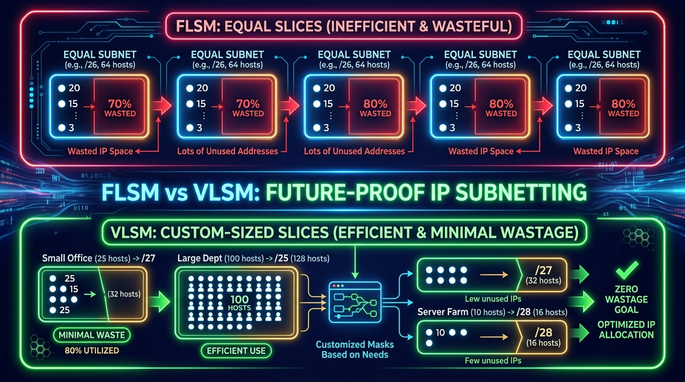
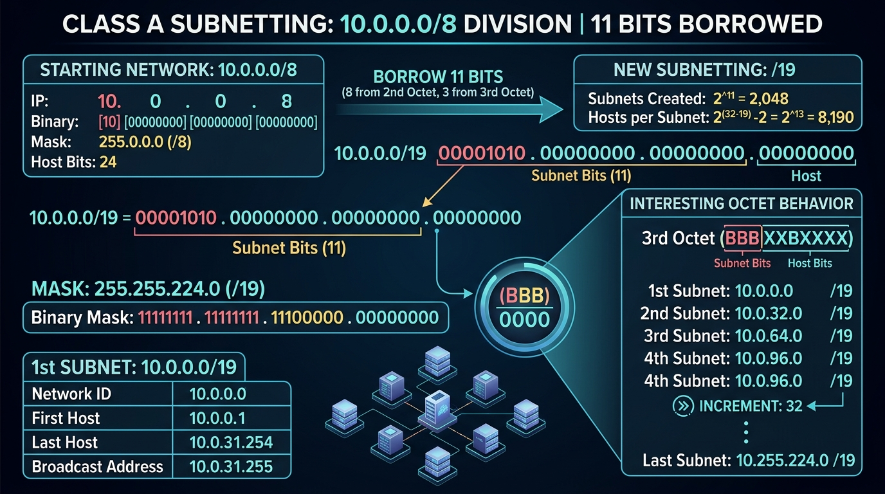
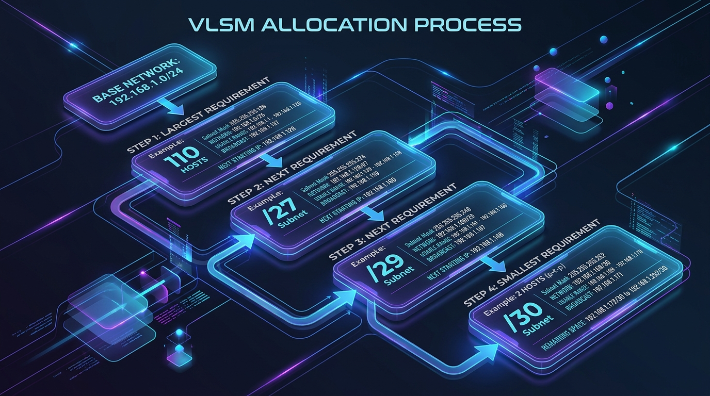

← [[Course on CCNA|Go Back to Course Hub]]

# 🔌 Day 15: Subnetting - Part 3 (VLSM)

Welcome to the notes for **Day 15: Subnetting - Part 3 (VLSM)** of Jeremy's IT Lab CCNA Course! Ye note aapko Class A subnet design problems, FLSM (Fixed-Length) vs VLSM (Variable-Length) subnet masks ke differences, subnetting-the-subnets methodology, aur step-by-step custom size ranges calculations ko detailed real-world analogies aur premium illustrations ke sath pure Hinglish language mein samjhayega.

---

## 🆚 1. FLSM (Fixed-Length) vs VLSM (Variable-Length)

Humne pehle seekha ki hum ek block ko subnet mask se slice karte hain. Lekin un slices (subnets) ke size par kya limit hoti hai, ye FLSM aur VLSM define karte hain:

### A. FLSM (Fixed-Length Subnet Mask):
*   **Concept:** Kisi network ke sabhi subnets ke liye **ek hi same subnet mask prefix** use karna.
*   *Example:* `192.168.1.0/24` ko 4 equal subnets mein kaatna, sabhi ke liye `/26` use karke.
*   **Wastage Problem:** Agar humare paas alag-alag host requirements hain (Jaise LAN-A mein 50 hosts chahiye, par Router-to-Router link par sirf 2 usable IPs chahiye), toh dono ko `/26` (62 hosts) milenge. Isse Router link par **60 IPs physically waste** ho jayenge!

---

### B. VLSM (Variable-Length Subnet Mask):
*   **Concept:** Subnetting a subnet (ek subnet ko dobara chhota subnet banana)! Isme hum requirement ke according **alag-alag sized prefix masks** (/25, /26, /27, /30) use karte hain taaki wastage 0 ho sake.
*   **💡 Real-world Analogy (Udaharan):**
    *   **Equal Bread Slices vs Custom Meal Portions:**
        *   *FLSM (Fixed):* Jaise aapne ek badi bread ko 10 barabar slices (FLSM subnets) mein kaat diya. Ab chahe kisi ko chhota sa bite khana ho ya kisi ko bada sandwich banana ho, sabko ek hi size ki slice milegi. Chhota bite khane wala baaki bread waste kar dega.
        *   *VLSM (Variable):* Jaise custom cake cutting. Aap requirements check karte hain. Badi family (110 hosts) ko bada piece mila, single person (2 hosts for Router link) ko chhota sa piece mila. Kisi bhi space ki barbadi nahi hoti.

---

## 📊 2. Class A Subnetting Problem (Worked Example)

Class A networks (`10.0.0.0/8`) mein host bits 24 hote hain, jise subnetting ke liye borrow kiya jata hai.

### ❓ Problem Scenario:
**"Given a `10.0.0.0/8` network, you must create 2000 subnets. What prefix length and mask must you use?"**

### ✍️ Step-by-Step Solution:
1.  **Calculate Borrowed Bits (S):**
    *   Formula for subnets = \(2^S \ge 2000\).
    *   Check powers of 2:
        *   \(2^{10} = 1024\) (Not enough)
        *   \(2^{11} = 2048\) (Enough!)
    *   *S = 11 bits* (Humne host portion se **11 bits borrow** kiye).
2.  **Determine New Prefix Length:**
    *   New Prefix = Default Prefix + Borrowed Bits
    *   \(\text{Prefix} = /8 + 11 = \mathbf{/19}\)
3.  **Find Subnet Mask:**
    *   Binary Mask: `11111111 . 11111111 . 11100000 . 00000000` = **`255.255.224.0`**
4.  **Calculate Usable Hosts per Subnet:**
    *   Remaining host bits (H) = \(32 - 19 = 13\) bits.
    *   Usable hosts = \(2^{13} - 2 = 8192 - 2 = \mathbf{8190}\) hosts/subnet.

---

## 🛠️ 3. Step-by-Step VLSM Allocation Workflow

VLSM design karte waqt hamesha is **Golden Rule** ko follow karein:
> [!IMPORTANT]
> **VLSM Golden Rule:**
> Hamesha subnet design **Largest Host Requirement se start karein** aur decrease hote hue sabse **Smallest Host Requirement par end karein**. Agar aapne order mix kiya, toh subnets overlapping (collision) ho jayenge.

---

### ❓ Practical Scenario (JITL Example):
*   **Base Network:** `192.168.1.0/24`
*   **Subnet Requirements:**
    1.  Tokyo LAN A: 110 hosts
    2.  Toronto LAN B: 45 hosts
    3.  Toronto LAN A: 29 hosts
    4.  Tokyo LAN B: 8 hosts
    5.  Router Link (Point-to-Point): 2 hosts

---

---

### 🟢 Step 1: Tokyo LAN A (110 Hosts) - Largest First!
*   *Need:* 110 Usable IPs.
*   *Formula check:* \(2^H - 2 \ge 110\) -> \(2^7 - 2 = 126 \ge 110\) (fits!). Host bits = 7. Prefix = `/25` (`32 - 7 = 25`).
*   **Subnet 1:** **`192.168.1.0/25`**
    *   Network ID: `192.168.1.0` \| Mask: `255.255.255.128`
    *   Usable Range: `192.168.1.1` to `192.168.1.126`
    *   Broadcast IP: `192.168.1.127`

---

### 🔵 Step 2: Toronto LAN B (45 Hosts)
*   *Next available IP:* `192.168.1.128`.
*   *Need:* 45 Usable IPs.
*   *Formula check:* \(2^H - 2 \ge 45\) -> \(2^6 - 2 = 62 \ge 45\) (fits!). Host bits = 6. Prefix = `/26` (`32 - 6 = 26`).
*   **Subnet 2:** **`192.168.1.128/26`**
    *   Network ID: `192.168.1.128` \| Mask: `255.255.255.192`
    *   Usable Range: `192.168.1.129` to `192.168.1.190`
    *   Broadcast IP: `192.168.1.191`

---

### 🟡 Step 3: Toronto LAN A (29 Hosts)
*   *Next available IP:* `192.168.1.192`.
*   *Need:* 29 Usable IPs.
*   *Formula check:* \(2^H - 2 \ge 29\) -> \(2^5 - 2 = 30 \ge 29\) (fits!). Host bits = 5. Prefix = `/27` (`32 - 5 = 27`).
*   **Subnet 3:** **`192.168.1.192/27`**
    *   Network ID: `192.168.1.192` \| Mask: `255.255.255.224`
    *   Usable Range: `192.168.1.193` to `192.168.1.222`
    *   Broadcast IP: `192.168.1.223`

---

### 🟠 Step 4: Tokyo LAN B (8 Hosts)
*   *Next available IP:* `192.168.1.224`.
*   *Need:* 8 Usable IPs.
*   *Formula check:* \(2^H - 2 \ge 8\) -> \(2^4 - 2 = 14 \ge 8\) (fits!). Host bits = 4. Prefix = `/28` (`32 - 4 = 28`).
*   **Subnet 4:** **`192.168.1.224/28`**
    *   Network ID: `192.168.1.224` \| Mask: `255.255.255.240`
    *   Usable Range: `192.168.1.225` to `192.168.1.238`
    *   Broadcast IP: `192.168.1.239`

---

### 🔴 Step 5: Router Link (2 Hosts)
*   *Next available IP:* `192.168.1.240`.
*   *Need:* 2 Usable IPs.
*   *Formula check:* \(2^H - 2 \ge 2\) -> \(2^2 - 2 = 2 \ge 2\) (fits!). Host bits = 2. Prefix = `/30` (`32 - 2 = 30`).
*   **Subnet 5:** **`192.168.1.240/30`**
    *   Network ID: `192.168.1.240` \| Mask: `255.255.255.252`
    *   Usable Range: `192.168.1.241` to `192.168.1.242`
    *   Broadcast IP: `192.168.1.243`

---

## 📊 Summary of Allocated Subnets:

| Subnet Name | Host Requirement | CIDR Prefix | Subnet Mask | Usable Host Range | Broadcast IP |
| :--- | :--- | :--- | :--- | :--- | :--- |
| **Tokyo LAN A** | 110 | `/25` | `255.255.255.128` | `.1` to `.126` | `.127` |
| **Toronto LAN B** | 45 | `/26` | `255.255.255.192` | `.129` to `.190` | `.191` |
| **Toronto LAN A** | 29 | `/27` | `255.255.255.224` | `.193` to `.222` | `.223` |
| **Tokyo LAN B** | 8 | `/28` | `255.255.255.240` | `.225` to `.238` | `.239` |
| **Router Link** | 2 | `/30` | `255.255.255.252` | `.241` to `.242` | `.243` |

---

## 📝 4. CCNA Day 15 Practice Questions

Aap yahan questions ko read karke answers verify kar sakte hain (Answer dekhne ke liye click karein):

1.  **Q1: Alag-alag host sizes requirements ke according, ek hi base network block se customized different-sized (variable) subnet prefixes banane ke process ko kya kehte hain?**
    

    
🔓 Click to Reveal Answer

    **Answer:** **VLSM (Variable-Length Subnet Masking)**.
    

2.  **Q2: VLSM design start karte waqt subnetting calculations hamesha kis requirements sequence order (largest first ya smallest first) se start karni chahiye?**
    

    
🔓 Click to Reveal Answer

    **Answer:** Hamesha **Largest Host Requirement se start** karni chahiye (Largest First).
    

3.  **Q3: Class A network `10.0.0.0/8` se 2000 subnets create karne ke liye hume minimum kitne subnet bits borrow karne padenge?**
    

    
🔓 Click to Reveal Answer

    **Answer:** **11 bits** (\(2^{11} = 2048 \ge 2000\)).
    

4.  **Q4: Class A network `10.0.0.0/8` se 11 bits borrow karne par, new subnet mask standard CIDR notation value kya aayegi?**
    

    
🔓 Click to Reveal Answer

    **Answer:** **`/19`** (\(8 + 11 = 19\)).
    

5.  **Q5: Prefix length `/19` configuration check default status mapping mein standard dotted-decimal subnet mask value kya hogi?**
    

    
🔓 Click to Reveal Answer

    **Answer:** **`255.255.224.0`** (first 19 bits are 1s).
    

6.  **Q6: Router-to-Router Point-to-Point links par jahan sirf 2 usable IP addresses ki requirements hoti hai, wahan standard VLSM design ke under kaun sa prefix length chuna jata hai?**
    

    
🔓 Click to Reveal Answer

    **Answer:** **`/30`** (Formula: \(2^2 - 2 = 2\) usable hosts. Mask = `255.255.255.252`).
    

7.  **Q7: Subnet mask `/30` configuration segment range mein network increment value size (block size) kitni hoti hai?**
    

    
🔓 Click to Reveal Answer

    **Answer:** **4** (increments blocks: `.240, .244, .248...`).
    

8.  **Q8: Agar hum sabhi subnets ke liye strictly ek hi single prefix length (Jaise sabhi subnets `/26` standard mask follow karein) use karein, toh is process ko kya bolenge?**
    

    
🔓 Click to Reveal Answer

    **Answer:** **FLSM (Fixed-Length Subnet Masking)**.
    

9.  **Q9: Base Network `192.168.1.0/24` range ke under, first subnet design agar `192.168.1.0/25` (/25) ho, toh dynamic segment ka Broadcast Address kya hoga?**
    

    
🔓 Click to Reveal Answer

    **Answer:** **`192.168.1.127`** (Usable range: `.1` to `.126`).
    

10. **Q10: VLSM allocations chart check ke coordinates, `/27` subnet mask prefix length kitne usable hosts provide karti hai?**
    

    
🔓 Click to Reveal Answer

    **Answer:** **30 usable hosts** (\(2^5 - 2 = 32 - 2 = 30\) hosts. Mask = `255.255.255.224`).
    

