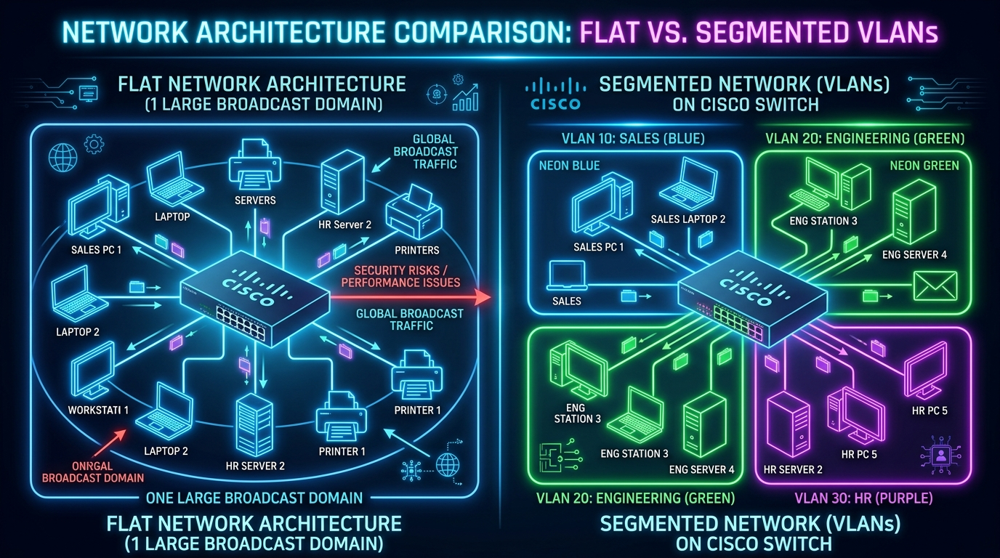
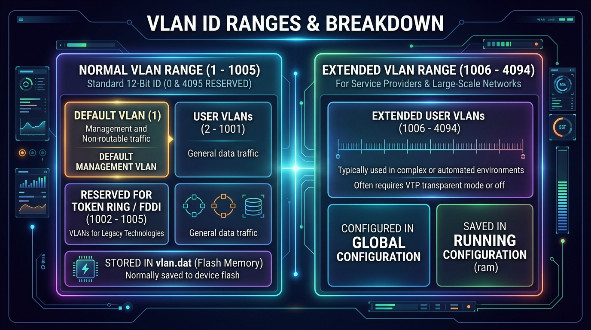
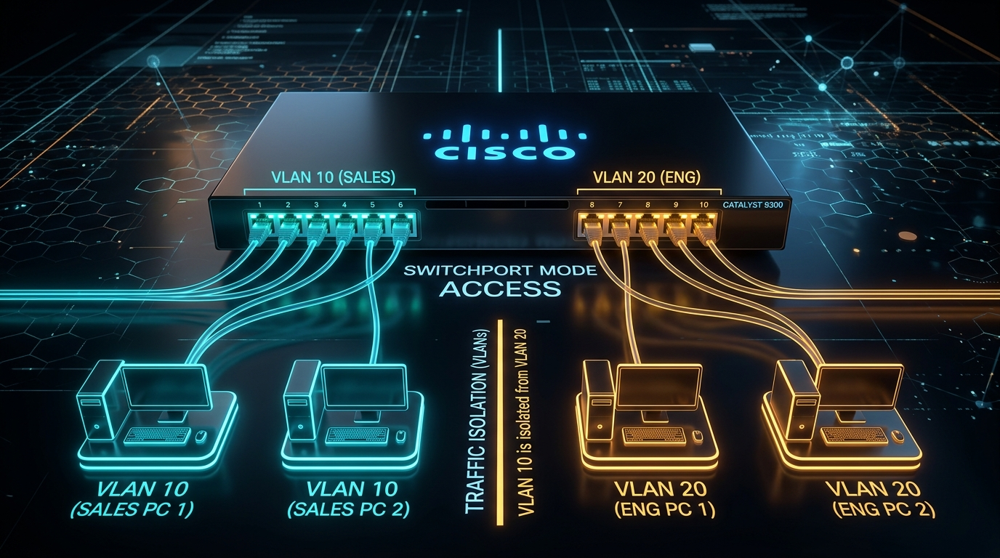

← [[Course on CCNA|Go Back to Course Hub]]

# 🔌 Day 16: VLANs - Part 1

Welcome to the notes for **Day 16: VLANs (Virtual Local Area Networks) - Part 1** of Jeremy's IT Lab CCNA Complete Course! Ye note aapko Broadcast Domains ki problems, VLANs ka purpose aur architecture, VLAN ID ranges aur `vlan.dat` flash storage, aur Cisco IOS par Access Ports configure/verify karne ko detailed real-world analogies aur premium illustrations ke sath pure Hinglish language mein samjhayega.

---

## 🏢 1. Flat Networks vs Segmented Networks

Default setting par, jab aap kisi Cisco switch ko kholte hain, toh switch ke saare physical ports **VLAN 1** ke member hote hain. Iska matlab hai ki poora switch ek single **Broadcast Domain** hota hai, jise **Flat Network** kehte hain.



### Flat Network ke Nuksaan (Problems):
1.  **Broadcast Storms / Congestion:** Jab koi PC ARP request ya DHCP broadcast bhejta hai, toh switch use har port par flood karta hai. Jitne zyada devices honge, utna zyada broadcast traffic network ko slow karega.
2.  **Security Risks:** Sales, HR, aur IT ke saare devices ek hi layer 2 network par hote hain. Ek packet sniffer (jaise Wireshark) use karke koi bhi employee doosre department ka unencrypted data capture kar sakta hai.
3.  **CPU Overhead:** Har connected PC/Server ke network card (NIC) ko har broadcast frame process karna padta hai, jisse devices ki CPU performance down hoti hai.

#### 💡 Real-world Analogy (Udaharan):
*   **One Huge Open Office Hall without Walls:**
    *   Imagine kijiye ek bada hall hai jisme bina kisi deewar ya partition ke 500 employees (Sales, HR, Engineering) baithe hain.
    *   Agar kisi ek bande ko loudspeaker par chillana pade (*Broadcast*), toh poore 500 logon ko sunna padega aur unka kaam disturb hoga.
    *   HR ki confidential baatein bhi sabhi sun sakte hain (*Security risk*).
    *   **Solution:** Hum hall ke andar soundproof glass cabins/rooms (**VLANs**) bana dete hain!

---

## 🌐 2. VLANs Kya Hain? (Virtual Local Area Networks)

**VLAN (Virtual LAN)** ek aisi Layer 2 technology hai jo ek single physical switch ko multiple logical (virtual) switches mein tod deti hai.

*   **1 VLAN = 1 Broadcast Domain = 1 IP Subnet**
*   **Layer 2 Isolation:** Ek VLAN ke devices doosre VLAN ke devices se directly Layer 2 par baat **nahi kar sakte** (bhale hi wo same physical switch se connected hon).
*   **Inter-VLAN Communication:** Agar VLAN 10 (Sales) ke PC ko VLAN 20 (Engineering) se baat karni hai, toh traffic ko **Layer 3 Device (Router ya Layer 3 Switch)** se hokar jaana padega.

---

## 🗂️ 3. VLAN ID Ranges & Storage Architecture

VLAN ID ek **12-bit binary number** hota hai (jisse total \(2^{12} = 4096\) IDs banti hain: 0 se 4095).



### VLAN ID Categories:

| Range Category | VLAN IDs | Purpose / Description | Storage Location |
| :--- | :--- | :--- | :--- |
| **Reserved** | `0` and `4095` | System use aur 802.1Q tagging ke liye reserved (Users use nahi kar sakte). | N/A |
| **Normal Range** | `1` to `1005` | Standard small & medium enterprise networks ke liye. | **`flash:vlan.dat`** |
| ↳ *Default VLAN* | `1` | Cisco switches par factory default VLAN. Sabhi ports iske member hote hain. Ise **delete ya rename nahi kiya ja sakta**. | `flash:vlan.dat` |
| ↳ *User VLANs* | `2` to `1001` | Engineers normal data traffic ke liye create/delete karte hain. | `flash:vlan.dat` |
| ↳ *Legacy Reserved* | `1002` to `1005` | Purani Token Ring aur FDDI technologies ke liye reserved. Inhe **delete nahi kiya ja sakta**. | `flash:vlan.dat` |
| **Extended Range** | `1006` to `4094` | Service Providers aur very large enterprise networks ke liye. | **`running-config` / NVRAM** |

> [!IMPORTANT]
> **VLAN Database Storage (`vlan.dat`):**
> Normal range VLANs (`1 - 1005`) switch ke **Flash Memory** mein `vlan.dat` naam ki file mein save hote hain. Agar aap switch par `erase startup-config` chalakar reload karenge, tab bhi VLANs delete nahi honge! VLANs delete karne ke liye aapko command chalani padti hai:
> `delete flash:vlan.dat`

---

## 🛠️ 4. Access Ports Configuration on Cisco Switches

Switch ke ports do modes mein operate karte hain:
1.  **Access Port:** Sirf ek single VLAN ka member hota hai. Ye hamesha end devices (PC, Laptop, Server, Printer) se connect hota hai aur **untagged frames** send/receive karta hai.
2.  **Trunk Port:** Multiple VLANs ke traffic ko carry karta hai (Switches ke beech ya Switch aur Router ke beech). *(Day 17 mein detail se aayega).*



---

### A. Cisco CLI Commands (Step-by-Step):

#### Step 1: VLAN Create karein aur Name dein
```ios
Switch# configure terminal
Switch(config)# vlan 10                     ! VLAN ID 10 create karein
Switch(config-vlan)# name Sales             ! VLAN ko descriptive name dein
Switch(config-vlan)# vlan 20
Switch(config-vlan)# name Engineering
Switch(config-vlan)# exit
```

#### Step 2: Interface ko Access Port banayein aur VLAN Assign karein
```ios
Switch(config)# interface gigabitethernet0/1
Switch(config-if)# switchport mode access           ! Port ko explicitly access mode dein
Switch(config-if)# switchport access vlan 10        ! Port ko VLAN 10 (Sales) ka member banayein
Switch(config-if)# exit
```

#### Step 3: Multiple Interfaces ko ek sath Assign karein (`range` command)
```ios
Switch(config)# interface range fastethernet 0/1 - 10
Switch(config-if-range)# switchport mode access
Switch(config-if-range)# switchport access vlan 20  ! Ports fa0/1 se fa0/10 ko VLAN 20 assign karein
Switch(config-if-range)# exit
```

> [!TIP]
> Agar aap kisi interface par direct `switchport access vlan 30` run kar dete hain (aur VLAN 30 pehle se create nahi kiya hai), toh Cisco switch automatically **VLAN 30 create kar deta hai**!

---

## 🔍 5. Verification Commands

VLAN configuration verify karne ke liye teen crucial commands:

1.  **`show vlan brief`**
    *   Switch par maujood sabhi active VLANs, unke names, aur unse jude physical ports ki table dikhata hai.
2.  **`show interfaces [interface-id] switchport`**
    *   Specific port ki Layer 2 switchport properties (Administrative mode, Operational mode, Access VLAN) detail mein show karta hai.
3.  **`show interfaces status`**
    *   Sabhi ports ka speed, duplex, link status aur unka assigned VLAN number ek clean tabular format mein dikhata hai.

---

## 📝 6. CCNA Day 16 Practice Questions

Aap yahan questions ko read karke answers verify kar sakte hain (Answer dekhne ke liye click karein):

1.  **Q1: Default factory configuration par, Cisco switch ke saare physical interfaces kis default VLAN ke member hote hain?**
    <details>
    <summary>🔓 Click to Reveal Answer</summary>
    **Answer:** **VLAN 1**.
    </details>

2.  **Q2: Cisco Catalyst switches par VLAN 1 aur legacy VLANs 1002 se 1005 ko delete karne par CLI kya response degi?**
    <details>
    <summary>🔓 Click to Reveal Answer</summary>
    **Answer:** In default/reserved VLANs ko **delete ya rename nahi kiya ja sakta**; switch error throw karega.
    </details>

3.  **Q3: Normal Range VLANs (1 to 1005) switch ke kis memory location aur kis specific file format mein save hote hain?**
    <details>
    <summary>🔓 Click to Reveal Answer</summary>
    **Answer:** Switch ki **Flash memory** mein **`flash:vlan.dat`** file ke roop mein save hote hain.
    </details>

4.  **Q4: Switch par `erase startup-config` chala kar reload karne ke baad bhi purane VLANs gayab kyu nahi hote?**
    <details>
    <summary>🔓 Click to Reveal Answer</summary>
    **Answer:** Kyunki VLANs startup-config (NVRAM) ke bajaye **`vlan.dat` (Flash memory)** mein store hote hain.
    </details>

5.  **Q5: End devices (PC, Laptop, Printer) se connect hone wale switch interface port ko standard configuration ke according kis mode mein set kiya jata hai?**
    <details>
    <summary>🔓 Click to Reveal Answer</summary>
    **Answer:** **Access Mode** (`switchport mode access`).
    </details>

6.  **Q6: Ek single physical switch par bane hue do alag-alag VLANs (Jaise VLAN 10 aur VLAN 20) ke beech direct Layer 2 communication kyu possible nahi hai?**
    <details>
    <summary>🔓 Click to Reveal Answer</summary>
    **Answer:** Kyunki alag-alag VLANs **alag-alag isolated Broadcast Domains** hote hain; unke beech traffic pass karne ke liye **Layer 3 device (Router/L3 Switch)** ki zaroorat hoti hai.
    </details>

7.  **Q7: Agar koi Network Engineer switchport par aisi VLAN ID assign karta hai jo pehle se switch par create nahi thi, toh Cisco IOS kya action lega?**
    <details>
    <summary>🔓 Click to Reveal Answer</summary>
    **Answer:** Switch automatically us **VLAN ID ko create kar dega** aur port ko uska member bana dega.
    </details>

8.  **Q8: Switch par sabhi active VLANs, unke names aur assigned ports ki quick summary check karne ke liye kaun si verification command use hoti hai?**
    <details>
    <summary>🔓 Click to Reveal Answer</summary>
    **Answer:** **`show vlan brief`**.
    </details>

9.  **Q9: Standard 802.1Q specification ke according VLAN ID field kitne bits ki hoti hai aur maximum theoretical VLAN IDs kitni ho sakti hain?**
    <details>
    <summary>🔓 Click to Reveal Answer</summary>
    **Answer:** **12 bits** (Total \(2^{12} = 4096\) IDs: 0 se 4095 tak).
    </details>

10. **Q10: Extended Range VLANs (1006 se 4094) normal range se alag kahan save hote hain?**
    <details>
    <summary>🔓 Click to Reveal Answer</summary>
    **Answer:** **Running configuration / Startup configuration** (NVRAM) mein save hote hain, `vlan.dat` mein nahi.
    </details>
