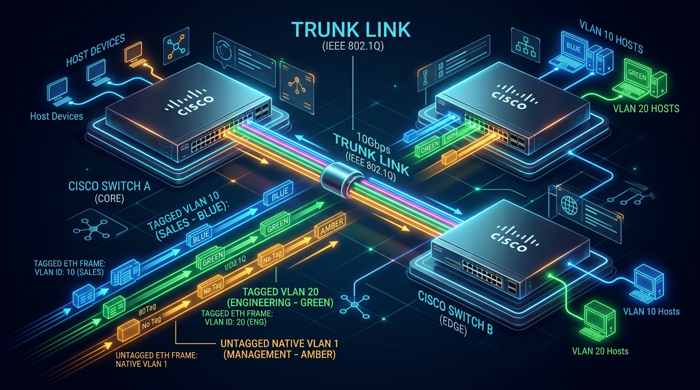
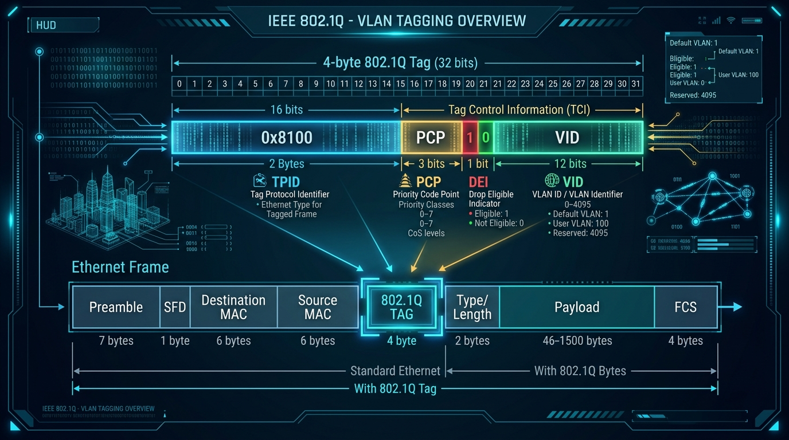
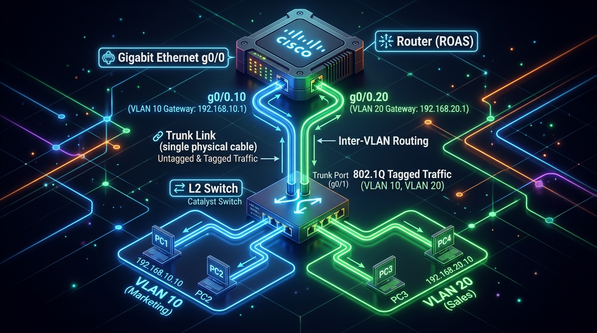

← [[Course on CCNA|Go Back to Course Hub]]

# 🔌 Day 17: VLANs - Part 2

Welcome to the notes for **Day 17: VLANs (Part 2) - Trunking, 802.1Q, Native VLAN & ROAS** of Jeremy's IT Lab CCNA Complete Course! Ye note aapko Trunk Ports ka concept, IEEE 802.1Q VLAN Tagging anatomy, Native VLAN rules aur unke security hazards, aur **Router on a Stick (ROAS)** ke zariye Inter-VLAN routing configure karne ko detailed real-world analogies aur premium illustrations ke sath pure Hinglish language mein samjhayega.

---

## 🌉 1. Trunk Ports vs Access Ports

Day 16 mein humne seekha ki **Access Ports** sirf ek single VLAN ka member hote hain aur unpar end devices (PCs/Printers) connect hote hain. Lekin jab do switches ke beech multiple VLANs ka traffic pass karwana ho, toh hum **Trunk Ports** use karte hain:



### A. Trunk Port Kyu Chahiye?
*   Agar humare paas 5 alag-alag VLANs hain, aur do switches ko connect karna hai:
    *   *Access Ports approach:* Hume dono switches ke beech 5 alag-alag physical cables lagani padengi (jo ports aur cables ka bohot bada wastage hai).
    *   *Trunk Port approach:* Hum dono switches ke beech **sirf 1 physical cable** lagate hain aur use **Trunk Mode** bana dete hain. Ye single link sabhi VLANs ke traffic ko simultaneously carry karta hai!

#### 💡 Real-world Analogy (Udaharan):
*   **Single-Lane Driveway vs Multi-Lane Highway Bridge:**
    *   *Access Port:* Jaise aapke ghar ka private driveway jahan sirf aapki car (single VLAN) chal sakti hai.
    *   *Trunk Port:* Jaise ek bada inter-state express highway bridge jahan alag-alag companies ki gaadiyan (VLAN 10, VLAN 20, VLAN 30) ek sath travel karti hain.

---

## 🏷️ 2. IEEE 802.1Q VLAN Tagging (Header Anatomy)

Jab koi frame trunk link par travel karta hai, toh receiving switch ko kaise pata chalega ki ye frame kis VLAN ka hai? Iske liye switch frame ke andar ek chhota sa label (**VLAN Tag**) insert karta hai. Is open-standard protocol ko **IEEE 802.1Q** (ya simply **Dot1Q**) kehte hain.



### 802.1Q Tag Structure (4 Bytes / 32 Bits Total):
Standard Ethernet frame ke andar Source MAC aur Type/Length field ke beech mein 4 bytes ka tag insert hota hai:

| Field Name | Bit Size | Purpose / Meaning (Kaam) |
| :--- | :--- | :--- |
| **TPID (Tag Protocol Identifier)** | **16 bits** | Hamesha hexadecimal value **`0x8100`** hoti hai. Ye receiving switch ko batata hai ki ye ek 802.1Q tagged frame hai. |
| **TCI (Tag Control Information)** | **16 bits** | Iske andar 3 sub-fields hoti hain: |
| ↳ **PCP (Priority Code Point)** | *3 bits* | Quality of Service (QoS) aur Class of Service (CoS) priority (0 to 7) set karta hai. |
| ↳ **DEI (Drop Eligible Indicator)** | *1 bit* | Congestion hone par kya ye frame drop kiya ja sakta hai (1 = Yes, 0 = No). |
| ↳ **VID (VLAN Identifier)** | *12 bits* | **Actual VLAN ID** specify karta hai (0 se 4095 range). |

> [!NOTE]
> Purane Cisco proprietary standard ko **ISL (Inter-Switch Link)** kehte the, jo poore frame ko 30-byte ke naye header/trailer se encapsulate karta tha. Modern networks mein ISL completely deprecated ho chuka hai aur sirf **IEEE 802.1Q** use hota hai.

#### 💡 Real-world Analogy:
*   **Airport Baggage Carousel Luggage Tags:**
    *   Jab airport par luggage conveyor belt (Trunk link) par ghumta hai, toh har bag par ek color-coded **Airline Flight Tag (802.1Q Tag)** laga hota hai.
    *   Sorting worker (Receiving Switch) tag padhta hai (VLAN 10) aur bag ko sahi airplane/gate (Access port) par bhej deta hai. Jab bag passenger ko milta hai, toh tag utaar diya jata hai (*Untagged delivery to host*).

---

## 🍂 3. The Native VLAN (Concept & Security Hazards)

By default, Cisco switches par **VLAN 1** ko **Native VLAN** banaya gaya hai.

*   **Native VLAN Rule:** Trunk link par travel karte waqt **Native VLAN ke frames par 802.1Q tag NAHI lagaya jata (Untagged bheje jaate hain)**.
*   **Receiving Logic:** Agar receiving switch ko trunk port par koi aisa frame milta hai jispar koi 802.1Q tag nahi laga hai, toh switch automatically maan leta hai ki ye frame **Native VLAN** ka part hai.

### ⚠️ Native VLAN Mismatch (Security Alert):
Agar Switch-A par Native VLAN = 10 set hai, aur Switch-B par Native VLAN = 20 set hai:
1.  Switch-A VLAN 10 ka frame bina tag ke trunk par bhejega.
2.  Switch-B untagged frame receive karke sochega ki ye uski Native VLAN (VLAN 20) ka frame hai!
3.  **Result:** VLAN 10 ka data leak hokar VLAN 20 ke PCs tak pahunch jayega (Cross-VLAN data leak & security violation). Cisco ka CDP (Cisco Discovery Protocol) turant console par **Native VLAN Mismatch Error** generate karta hai.

---

## 🍢 4. Router on a Stick (ROAS) - Inter-VLAN Routing

Alag-alag VLANs ke beech traffic route karne ke liye hume ek Layer 3 device (Router) ki zaroorat hoti hai.



### ROAS Concept:
Router par har ek VLAN ke liye alag physical port lagane ke bajaye, hum router ke **ek single physical interface ko multiple logical sub-interfaces mein tod dete hain**. Is architecture ko **Router on a Stick (ROAS)** kehte hain.

---

### 🛠️ Configuration Steps:

#### Step 1: Switch par Trunk Port Configure karein
```ios
Switch# configure terminal
Switch(config)# interface gigabitethernet0/1       ! Router se connected switch port select karein
Switch(config-if)# switchport mode trunk          ! Port ko trunk mode mein set karein
Switch(config-if)# exit
```

#### Step 2: Router par Sub-interfaces Configure karein
```ios
Router# configure terminal
Router(config)# interface gigabitethernet0/0
Router(config-if)# no shutdown                   ! Main physical interface ko turn on karein (No IP assigned)
Router(config-if)# exit

! Sub-interface for VLAN 10 (Marketing)
Router(config)# interface gigabitethernet0/0.10   ! Logical sub-interface create karein
Router(config-subif)# encapsulation dot1q 10     ! 802.1Q tagging VLAN 10 bind karein
Router(config-subif)# ip address 192.168.10.1 255.255.255.0  ! VLAN 10 ka Default Gateway IP
Router(config-subif)# exit

! Sub-interface for VLAN 20 (Sales)
Router(config)# interface gigabitethernet0/0.20
Router(config-subif)# encapsulation dot1q 20     ! 802.1Q tagging VLAN 20 bind karein
Router(config-subif)# ip address 192.168.20.1 255.255.255.0  ! VLAN 20 ka Default Gateway IP
Router(config-subif)# exit
```

> [!IMPORTANT]
> Sub-interface par `ip address` command chalane se pehle **`encapsulation dot1q [vlan_id]`** command chalana compulsory hai, warna Cisco router error dega!

---

## 🔍 5. Verification Commands

*   `show interfaces trunk` — Switch par active trunk links, unka encapsulation mode, native VLAN, aur allowed VLANs list check karne ke liye.
*   `show ip interface brief` — Router par physical aur sub-interfaces ka IP aur Up/Up status dekhne ke liye.
*   `show ip route` — Router ki routing table mein dono VLANs ke directly connected subnets verify karne ke liye.

---

## 📝 6. CCNA Day 17 Practice Questions

Aap yahan questions ko read karke answers verify kar sakte hain (Answer dekhne ke liye click karein):

1.  **Q1: Switch-to-Switch aur Switch-to-Router links par multiple VLANs ka data traffic ek sath carry karne wale port mode ko kya bolte hain?**
    <details>
    <summary>🔓 Click to Reveal Answer</summary>
    **Answer:** **Trunk Port** (`switchport mode trunk`).
    </details>

2.  **Q2: IEEE 802.1Q standard ke according, Ethernet frame ke andar insert kiya jane wala VLAN tag kitne bytes (ya bits) ka hota hai?**
    <details>
    <summary>🔓 Click to Reveal Answer</summary>
    **Answer:** **4 Bytes (32 Bits)**.
    </details>

3.  **Q3: 802.1Q tag ke Tag Protocol Identifier (TPID) field ki fixed 16-bit hexadecimal value kya hoti hai?**
    <details>
    <summary>🔓 Click to Reveal Answer</summary>
    **Answer:** **`0x8100`**.
    </details>

4.  **Q4: 802.1Q tag ke andar actual VLAN ID specify karne wale VID field ka bit size kitna hota hai?**
    <details>
    <summary>🔓 Click to Reveal Answer</summary>
    **Answer:** **12 Bits** (0 to 4095 range).
    </details>

5.  **Q5: Trunk link par travel karte waqt kis specific VLAN ke Ethernet frames par koi 802.1Q tag nahi lagaya jata (untagged bheje jaate hain)?**
    <details>
    <summary>🔓 Click to Reveal Answer</summary>
    **Answer:** **Native VLAN** (by default VLAN 1).
    </details>

6.  **Q6: Trunk link ke dono ends par Native VLAN IDs alag-alag configure hone par network security par kya asar padta hai?**
    <details>
    <summary>🔓 Click to Reveal Answer</summary>
    **Answer:** **Native VLAN Mismatch:** Ek VLAN ka data leak hokar doosre VLAN mein deliver ho jata hai aur CDP console error messages generate karta hai.
    </details>

7.  **Q7: Router on a Stick (ROAS) architecture mein router ke physical interface ko multiple logical parts mein divide karne ko kya kehte hain?**
    <details>
    <summary>🔓 Click to Reveal Answer</summary>
    **Answer:** **Sub-interfaces** (e.g. `g0/0.10`, `g0/0.20`).
    </details>

8.  **Q8: Cisco Router ke sub-interface par IP address configure karne se pehle kaun si command chalana anivarya (mandatory) hai?**
    <details>
    <summary>🔓 Click to Reveal Answer</summary>
    **Answer:** **`encapsulation dot1q [vlan_id]`**.
    </details>

9.  **Q9: Switch par active trunk interfaces, unka trunking protocol, aur native VLAN number verify karne ke liye sabse best command kaun si hai?**
    <details>
    <summary>🔓 Click to Reveal Answer</summary>
    **Answer:** **`show interfaces trunk`**.
    </details>

10. **Q10: Legacy Cisco proprietary trunking encapsulation protocol jo 30-byte overhead add karta tha aur ab deprecated ho chuka hai, uska kya naam hai?**
    <details>
    <summary>🔓 Click to Reveal Answer</summary>
    **Answer:** **Cisco ISL (Inter-Switch Link)**.
    </details>
