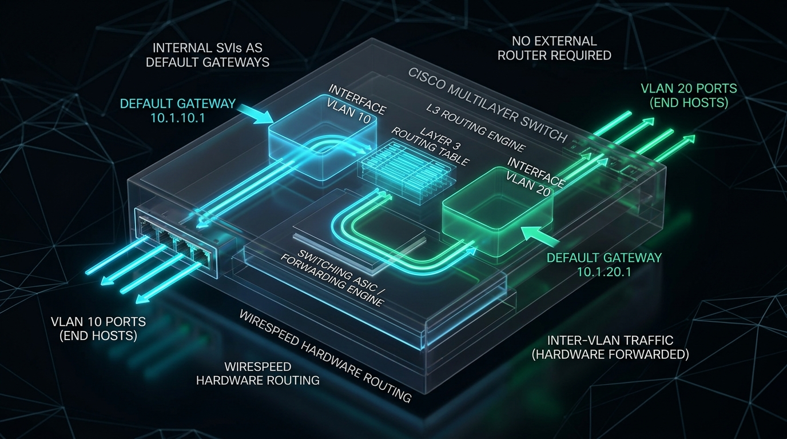
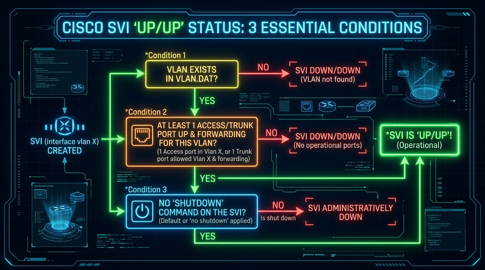
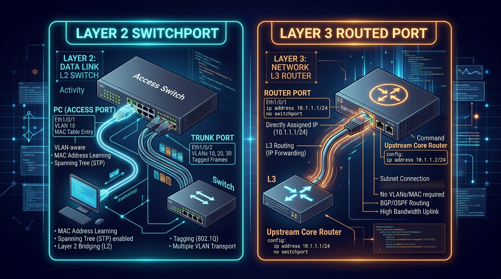

← [[Course on CCNA|Go Back to Course Hub]]

# 🔌 Day 18: VLANs - Part 3 (Multilayer Switching, SVIs & Routed Ports)

Welcome to the notes for **Day 18: VLANs (Part 3) - Multilayer Switching, Switch Virtual Interfaces (SVIs) & Routed Ports** of Jeremy's IT Lab CCNA Complete Course! Ye note aapko Layer 3 Multilayer Switches ki internal architecture, Switch Virtual Interfaces (SVIs) ke rules aur UP/UP status conditions, Layer 3 Routed Ports (`no switchport`), aur wire-speed Inter-VLAN routing configure karne ko detailed real-world analogies aur premium illustrations ke sath pure Hinglish language mein samjhayega.

---

## ⚡ 1. Multilayer Switching (Layer 3 Switches) Kyu Chahiye?

Day 17 mein humne **Router-on-a-Stick (ROAS)** seekha tha, jahan inter-VLAN traffic switch se router tak ek single trunk cable par jaata hai aur wapas aata hai.



### ROAS ki Limitations (Khamiyan):
1.  **Traffic Bottleneck:** Jab hazaron devices aapas mein data exchange karte hain, toh single router link choke ho jata hai (*Traffic Jam*).
2.  **Single Point of Failure:** Agar router ya router ka link down hua, toh sabhi VLANs ka aapsi communication ruk jata hai.

---

### Layer 3 Multilayer Switches ka Solution:
*   **Multilayer Switch (MLS):** Ek aisa advanced switch jo **Layer 2 Switching aur Layer 3 IP Routing dono ek sath** perform karta hai.
*   **Hardware Wire-Speed Forwarding:** Multilayer switches routing software ke bajaye specialized **ASICs (Application-Specific Integrated Circuits)** aur **CEF (Cisco Express Forwarding)** use karte hain, jisse routing bina kisi lag/delay ke switch ke andar hi ho jaati hai!

#### 💡 Real-world Analogy (Udaharan):
*   **Courier Delivery Bike vs In-Building High-Speed Pneumatic Tube:**
    *   *ROAS (Router on a Stick):* 5th floor (VLAN 10) ke employee ko 2nd floor (VLAN 20) par document bhejna hai. Pehle document building ke bahar khade courier bike wale (External Router) ke paas jata hai, wo stamp lagata hai aur wapas 2nd floor par deliver karta hai. Isme time aur traffic lagta hai.
    *   *Multilayer Switch (SVI):* Building ke andar hi ek ultra-fast internal pneumatic tube system (**SVI Routing Engine**) laga hai. Document building ke bahar gaye bina direct floor-to-floor instantly transfer ho jata hai!

---

## 🌐 2. Switch Virtual Interfaces (SVIs)

Ek **SVI (Switch Virtual Interface)** Layer 3 switch par bana hua ek **Virtual Layer 3 Interface** hota hai jo kisi specific VLAN ko represent karta hai (Jaise `interface vlan 10`, `interface vlan 20`).

*   **Role:** SVI us VLAN mein maujood sabhi end devices (PCs, Laptops) ke liye **Default Gateway** ka kaam karta hai!
*   **Global IP Routing Enable karna:** Cisco Layer 3 switches par routing by default disabled hoti hai. Ise activate karne ke liye sabse pehle **`ip routing`** command chalana anivarya (mandatory) hai.

---

### 🛠️ SVI Configuration Commands:

```ios
! Step 1: Global Routing Enable karein
Switch(config)# ip routing

! Step 2: VLANs Create karein
Switch(config)# vlan 10
Switch(config-vlan)# name Engineering
Switch(config-vlan)# vlan 20
Switch(config-vlan)# name Marketing
Switch(config-vlan)# exit

! Step 3: SVI for VLAN 10 (Default Gateway for VLAN 10)
Switch(config)# interface vlan 10
Switch(config-if)# ip address 192.168.10.1 255.255.255.0
Switch(config-if)# no shutdown
Switch(config-if)# exit

! Step 4: SVI for VLAN 20 (Default Gateway for VLAN 20)
Switch(config)# interface vlan 20
Switch(config-if)# ip address 192.168.20.1 255.255.255.0
Switch(config-if)# no shutdown
Switch(config-if)# exit
```

---

## 🚦 3. SVI UP/UP Status: 3 Essential Conditions

Agar aapne SVI bana diya, lekin wo `show ip interface brief` mein `up/up` nahi dikha raha, toh yaad rakhein ki SVI ko **UP/UP (Operational)** hone ke liye ye **3 conditions** poori hona zaroori hai:



1.  **Condition 1: VLAN Exists in VLAN Database**
    *   VLAN `vlan.dat` mein create hona chahiye (sirf SVI banane se VLAN create nahi hota).
2.  **Condition 2: At Least One Active Port for this VLAN**
    *   Kam se kam **ek physical access port** jo is VLAN ka member ho `up` hona chahiye, YA kam se kam **ek trunk port** jo is VLAN ko allow karta ho `up` aur STP Forwarding state mein hona chahiye.
3.  **Condition 3: No Shutdown on SVI**
    *   SVI interface administratively down nahi hona chahiye (`no shutdown` applied ho).

---

## 🔌 4. Layer 3 Routed Ports (`no switchport`)

Default taur par switch ka physical interface Layer 2 port (**Switchport**) hota hai. Lekin Cisco Multilayer switches par aap kisi physical interface ko **Layer 3 Routed Port** (ek normal router port ki tarah) bana sakte hain!



### A. Kaise banayein? (`no switchport` Command):
Jab aap interface configuration mode mein jakar **`no switchport`** command chalate hain, toh port L2 Switching band karke L3 Routing mode mein aa jata hai. Iske baad aap us physical port par directly IP address assign kar sakte hain!

```ios
Switch(config)# interface gigabitethernet0/1
Switch(config-if)# no switchport                    ! L2 switchport disable karein (L3 Routed Port banayein)
Switch(config-if)# ip address 10.0.0.1 255.255.255.252  ! Point-to-Point Link IP dein
Switch(config-if)# no shutdown
Switch(config-if)# exit
```

### B. Routed Ports Kab Use Hote Hain?
*   Layer 3 Switches ke aapas mein point-to-point connections banane ke liye.
*   Multilayer Switch se Core Router ya Firewall connect karne ke liye.
*   Isme Spanning Tree Protocol (STP) ki zaroorat nahi hoti kyunki ye Layer 3 link ban jata hai.

---

## 📊 5. Summary: ROAS vs SVIs vs Routed Ports

| Feature / Property | Router-on-a-Stick (ROAS) | Switch Virtual Interface (SVI) | Routed Port (`no switchport`) |
| :--- | :--- | :--- | :--- |
| **Layer Level** | Layer 3 Router + L2 Switch | Layer 3 Switch (Internal) | Layer 3 Switch Physical Port |
| **Hardware Performance** | Software / Router CPU | Hardware ASICs (Wire-speed) | Hardware ASICs (Wire-speed) |
| **STP Overhead** | Yes (Trunk link par STP active) | Yes (Access/Trunk ports par STP) | **No STP** (Pure Layer 3 link) |
| **IP Assignment** | Logical Sub-interface (`g0/0.10`) | Logical Virtual Interface (`vlan 10`) | Directly on Physical Port (`g0/1`) |
| **Primary Use Case** | Small Networks (Budget setups) | Enterprise Inter-VLAN Routing | Core Switch / Router Interconnects |

---

## 🔍 6. Verification Commands

*   **`show ip route`** — Switch ki routing table mein dono SVIs aur connected subnets ko verify karein.
*   **`show ip interface brief`** — SVIs (`Vlan10`, `Vlan20`) aur Routed physical ports ka IP aur Up/Up status check karein.
*   **`show interfaces [id] switchport`** — Agar port Routed Port ban chuka hai, toh ye **"Switchport: Disabled"** show karega.

---

## 📝 7. CCNA Day 18 Practice Questions

Aap yahan questions ko read karke answers verify kar sakte hain (Answer dekhne ke liye click karein):

1.  **Q1: Cisco Layer 3 Multilayer Switch par global level par IP routing functionality activate karne ke liye kaun si command chalana anivarya (mandatory) hai?**
    <details>
    <summary>🔓 Click to Reveal Answer</summary>
    **Answer:** **`ip routing`** (Global configuration mode).
    </details>

2.  **Q2: Layer 3 Switch par kisi specific VLAN ke sabhi devices ke liye Default Gateway banne wale virtual layer 3 interface ko kya kehte hain?**
    <details>
    <summary>🔓 Click to Reveal Answer</summary>
    **Answer:** **Switch Virtual Interface (SVI)** (e.g. `interface vlan 10`).
    </details>

3.  **Q3: Multilayer switches par Inter-VLAN routing software ke bajaye ultra-fast hardware wire-speed par kiske through perform hoti hai?**
    <details>
    <summary>🔓 Click to Reveal Answer</summary>
    **Answer:** **ASICs (Application-Specific Integrated Circuits)** aur **CEF (Cisco Express Forwarding)**.
    </details>

4.  **Q4: Cisco Layer 3 switch par bani hui SVI (`interface vlan 20`) kab tak `UP/UP` status achieve nahi karegi agar switch par VLAN 20 ka koi bhi physical port active na ho?**
    <details>
    <summary>🔓 Click to Reveal Answer</summary>
    **Answer:** SVI ko `UP/UP` hone ke liye kam se kam **1 active port (Access port ya Trunk port)** us VLAN mein UP aur Forwarding state mein hona zaroori hai.
    </details>

5.  **Q5: Cisco Switch ke physical interface ko Layer 2 switchport se Layer 3 routed port mein convert karne ke liye interface configuration mode mein kaun si command di jaati hai?**
    <details>
    <summary>🔓 Click to Reveal Answer</summary>
    **Answer:** **`no switchport`**.
    </details>

6.  **Q6: Layer 3 Routed Port (`no switchport`) par Spanning Tree Protocol (STP) ka kya behavior hota hai?**
    <details>
    <summary>🔓 Click to Reveal Answer</summary>
    **Answer:** Routed Port par **STP completely disable** ho jata hai kyunki wo pure Layer 3 interface ban jata hai.
    </details>

7.  **Q7: Kisi interface par `show interfaces gig0/1 switchport` command chalane par agar output "Switchport: Disabled" dikhaye, toh iska kya arth hai?**
    <details>
    <summary>🔓 Click to Reveal Answer</summary>
    **Answer:** Iska arth hai ki ye interface **Layer 3 Routed Port** ke roop mein configured hai.
    </details>

8.  **Q8: Agar kisi switch par `vlan 30` database mein exist nahi karta, lekin engineer ne `interface vlan 30` par IP assign kar di, toh SVI ka line status kya hoga?**
    <details>
    <summary>🔓 Click to Reveal Answer</summary>
    **Answer:** SVI **`Down/Down`** rahegi jab tak `vlan 30` manually create na kiya jaye.
    </details>

9.  **Q9: Router on a Stick (ROAS) ke muqable Multilayer Switch (SVI) Inter-VLAN routing ka sabse bada faayda (advantage) kya hai?**
    <details>
    <summary>🔓 Click to Reveal Answer</summary>
    **Answer:** High bandwidth, **wire-speed hardware routing (ASICs)**, aur external single link bottleneck/failure ka khatam hona.
    </details>

10. **Q10: Layer 3 Switch par sabhi active SVIs, unke assigned IP addresses aur line protocol status ki quick summary dekhne ke liye kaun si command use hoti hai?**
    <details>
    <summary>🔓 Click to Reveal Answer</summary>
    **Answer:** **`show ip interface brief`**.
    </details>
