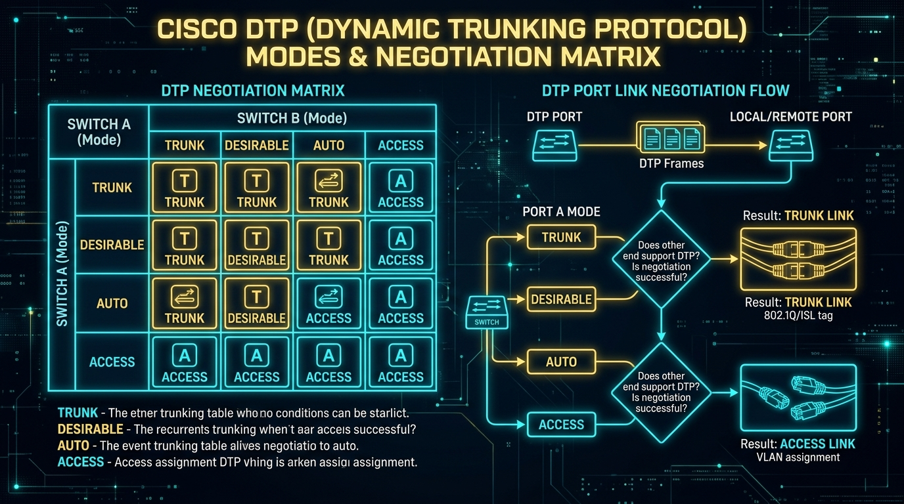
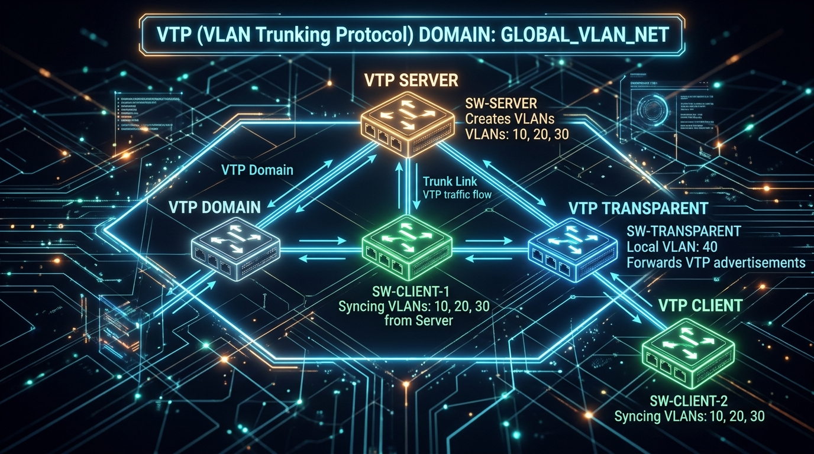
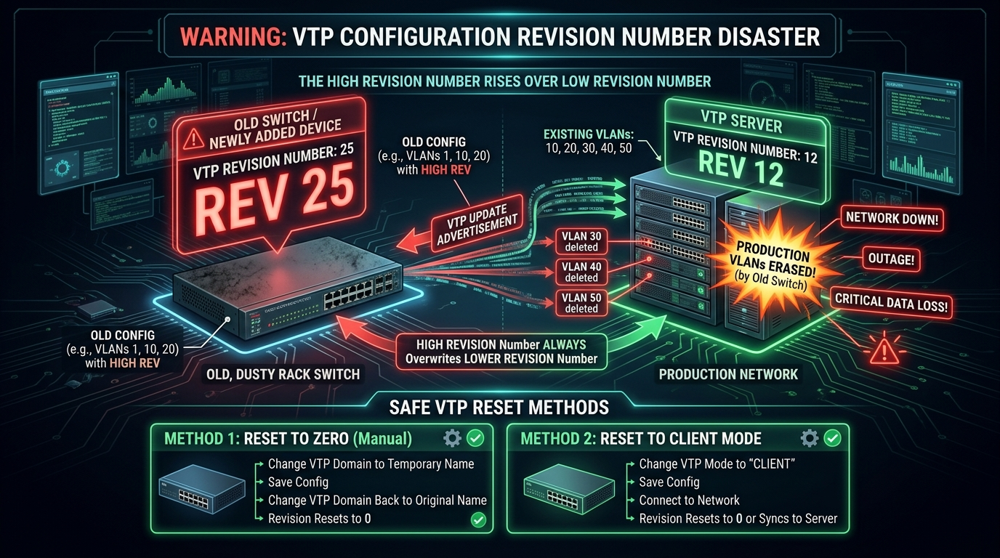

← [[Course on CCNA|Go Back to Course Hub]]

# 🔌 Day 19: DTP (Dynamic Trunking Protocol) & VTP (VLAN Trunking Protocol)

Welcome to the notes for **Day 19: DTP & VTP** of Jeremy's IT Lab CCNA Complete Course! Ye note aapko Cisco proprietary protocols—**DTP (Dynamic Trunking Protocol)** ke negotiation modes, matrix rules, aur security best practices, aur **VTP (VLAN Trunking Protocol)** ke modes (Server, Client, Transparent), **Configuration Revision Number disaster hazards**, aur VTP Pruning ko detailed real-world analogies aur premium illustrations ke sath pure Hinglish language mein samjhayega.

---

## 🤝 1. Cisco DTP (Dynamic Trunking Protocol)

**DTP (Dynamic Trunking Protocol)** ek Cisco-proprietary Layer 2 protocol hai jo do switches ke interconnected ports ke beech automatically negotiate karta hai ki unke beech ka link **Access Port** banega ya **Trunk Port**.



### DTP ke 4 Administrative Modes:

1.  **`switchport mode access` (Static Access):**
    *   Port permanently Access mode mein lock ho jata hai. Ye samne wale port ko DTP frame bhej kar batata hai ki wo trunk nahi banega.
2.  **`switchport mode trunk` (Static Trunk):**
    *   Port permanently Trunk mode mein lock ho jata hai. Ye samne wale port ko DTP frame bhej kar trunk banne ke liye initiate karta hai.
3.  **`switchport mode dynamic desirable` (Active Negotiator):**
    *   Port actively saamne wale switch ko DTP frames bhejta hai aur trunk banane ki request karta hai (*"Main trunk banna chahta hoon, kya tum taiyar ho?"*).
4.  **`switchport mode dynamic auto` (Passive Listener):**
    *   Port passively wait karta hai. Agar saamne wala port trunk banne ki request bhejta hai, toh ye trunk ban jata hai; warna ye default Access mode mein rehta hai (*"Agar tum bologe toh main trunk banunga, warna nahi"*).

---

### 📊 DTP Link Negotiation Matrix (Kaun Sa Link Banega?):

| Local Port Mode | Remote Port: `trunk` | Remote Port: `dynamic desirable` | Remote Port: `dynamic auto` | Remote Port: `access` |
| :--- | :--- | :--- | :--- | :--- |
| **`trunk`** | **TRUNK** | **TRUNK** | **TRUNK** | *Mismatch / Limited* |
| **`dynamic desirable`** | **TRUNK** | **TRUNK** | **TRUNK** | **ACCESS** |
| **`dynamic auto`** | **TRUNK** | **TRUNK** | **ACCESS** | **ACCESS** |
| **`access`** | *Mismatch / Limited* | **ACCESS** | **ACCESS** | **ACCESS** |

> [!WARNING]
> **Key Exam Trick:**
> Agar dono taraf ke ports **`dynamic auto`** hain, toh link **ACCESS link** banega kyunki dono taraf se koi bhi trunking initiate nahi karega!

#### 💡 Real-world Analogy (Udaharan):
*   **Introvert vs Extrovert at a Social Party:**
    *   *Dynamic Desirable (Extrovert):* Saamne se aage badhkar hath milata hai aur baat shuru karta hai.
    *   *Dynamic Auto (Introvert):* Chupchaap khada rehta hai. Agar koi extrovert aakar hath milaye toh baat kar leta hai, lekin agar do introverts (**Auto + Auto**) milte hain, toh koi baat nahi karta aur link normal (*Access*) reh jata hai!

---

### 🔒 DTP Security Best Practice (`nonegotiate`):
Hacker PC par switch simulation software chala kar DTP messages bhej sakta hai aur port ko Trunk bana kar sabhi VLANs ka traffic hijack kar sakta hai (**VLAN Hopping Attack**).
Isliye production networks mein access ports par DTP ko completely band karne ke liye command chalate hain:
```ios
Switch(config-if)# switchport mode access
Switch(config-if)# switchport nonegotiate       ! DTP advertisement frames bhejna band karein
```

---

## 🗄️ 2. Cisco VTP (VLAN Trunking Protocol)

Jab network mein 50 ya 100 switches hote hain, toh har switch par manually jakar 20 alag-alag VLANs banana bohot mushkil hota hai. **VTP (VLAN Trunking Protocol)** ek centralized protocol hai jo ek switch par banaye gaye VLANs ko poore network ke baaki switches par automatically replicate (sync) kar deta hai.



---

### VTP ke 3 Operating Modes:

| VTP Mode | VLANs Create / Delete? | Synchronizes with Server? | Forwards VTP Frames? | VLAN Storage Location |
| :--- | :--- | :--- | :--- | :--- |
| **Server** *(Default)* | **Yes** (Add, Edit, Delete) | **Yes** (Originates updates) | **Yes** | `flash:vlan.dat` |
| **Client** | **No** (Local edits blocked) | **Yes** (Syncs from Server) | **Yes** | RAM (reloads on boot) |
| **Transparent** | **Yes** (Local only) | **No** (Ignores Server updates) | **Yes** (Passes them through) | `running-config` (NVRAM) |
| **Off** *(VTPv3)* | **Yes** (Local only) | **No** | **No** (Drops VTP frames) | `running-config` |

#### 💡 Real-world Analogy:
*   **Company Headquarters & Branch Offices:**
    *   *VTP Server:* Company ka Head Office jo nayi corporate policies (**VLANs**) banata hai aur circular jaari karta hai.
    *   *VTP Client:* Local branch office jo Head Office ke circular ko bina change kiye follow karta hai.
    *   *VTP Transparent:* Ek independent subsidiary company jo Head Office ka circular doosri branches ko forward kar deti hai, lekin apne local rules khud banati hai!

---

## 💥 3. VTP Configuration Revision Number (The Disaster Hazard)

VTP ke andar ek **32-bit counter** hota hai jise **Configuration Revision Number** kehte hain. Jab bhi kisi VTP Server par koi naya VLAN banta hai, delete hota hai, ya rename hota hai, toh Revision Number **+1 badh jata hai**.



> [!CAUTION]
> **The Golden Rule of VTP Disaster:**
> Jab do switches aapas mein VTP advertisements exchange karte hain, toh **Highest Configuration Revision Number wala switch hamesha jeetta hai**—chahe wo Server mode mein ho ya Client mode mein!

### 💣 Production Outage Scenario:
1.  Aapki production company mein VTP Server chal raha hai jiska Revision Number **12** hai aur uspar **50 production VLANs** chal rahe hain.
2.  Ek junior engineer lab rack se ek purana switch lakar network mein connect kar deta hai jiska Revision Number **25** tha (aur usme sirf 2 test VLANs the).
3.  Poore network ke switches dekhte hain ki Revision 25 > Revision 12. Sabhi switches instant purane switch ka data sync kar lete hain aur **production ke saare 50 VLANs delete ho jaate hain**! Poori company ka network down ho jata hai!

---

### 🛡️ Safe VTP Reset Methods (Revision ko 0 kaise karein?):
Purane switch ko production mein jodte waqt Revision Number ko hamesha **0** karein:
*   **Method 1:** VTP Domain ka naam change karke temporary dummy naam rakhein, aur phir wapas original naam set karein.
*   **Method 2:** VTP Mode ko change karke **`vtp mode transparent`** karein (ye Revision Number ko reset karke 0 kar deta hai), aur phir desired mode mein switch karein.

---

## ✂️ 4. VTP Pruning (Bandwidth Saver)

By default, switch par jab koi Broadcast frame aata hai, toh switch use sabhi trunk links par flood kar deta hai.

*   **VTP Pruning ka Kaam:** VTP Pruning trunk link par us specific VLAN ka broadcast traffic bhejna band (prune) kar deta hai jis VLAN ka koi bhi active device saamne wale switch par maujood nahi hai.
*   **Enable Command:** `vtp pruning` (VTP Server par chalane se poore domain mein activate ho jata hai).

---

## 🔍 5. Verification Commands

*   `show dtp interface [id]` — Specific port ka DTP operational mode aur negotiation status check karne ke liye.
*   `show vtp status` — VTP Domain Name, Operating Mode, Current Configuration Revision Number, aur Pruning status dekhne ke liye.
*   `show vtp password` — Configured VTP MD5 password verify karne ke liye.

---

## 📝 6. CCNA Day 19 Practice Questions

Aap yahan questions ko read karke answers verify kar sakte hain (Answer dekhne ke liye click karein):

1.  **Q1: Agar Switch-A ka port `dynamic auto` mode mein ho aur Switch-B ka port bhi `dynamic auto` mode mein ho, toh dono ke beech banne wala link kis mode mein operate karega?**
    <details>
    <summary>🔓 Click to Reveal Answer</summary>
    **Answer:** **Access Link** (kyunki koi bhi side actively trunking initiate nahi karti).
    </details>

2.  **Q2: Cisco DTP mode jo actively saamne wale switch ko DTP packets bhej kar trunk banane ke liye initiate karta hai, use kya kehte hain?**
    <details>
    <summary>🔓 Click to Reveal Answer</summary>
    **Answer:** **`dynamic desirable`**.
    </details>

3.  **Q3: Production network access ports par DTP advertisement packets ko completely disable karke VLAN Hopping attacks rokne ke liye kaun si command chalayi jaati hai?**
    <details>
    <summary>🔓 Click to Reveal Answer</summary>
    **Answer:** **`switchport nonegotiate`**.
    </details>

4.  **Q4: VTP ka kaun sa operating mode Server se aane wale VLAN updates ko ignore karta hai, local VLANs banane allow karta hai, lekin doosre switches ko VTP advertisements forward kar deta hai?**
    <details>
    <summary>🔓 Click to Reveal Answer</summary>
    **Answer:** **VTP Transparent Mode**.
    </details>

5.  **Q5: VTP domain ke andar jab koi switch update bhejta hai, toh doosre switches kis parameter ko dekh kar decide karte hain ki ye update latest aur authentic hai?**
    <details>
    <summary>🔓 Click to Reveal Answer</summary>
    **Answer:** **Configuration Revision Number** (Higher revision number wins).
    </details>

6.  **Q6: Kisi purane Cisco switch ko production network mein jodte waqt uska Configuration Revision Number 0 karne ka sabse recommended aur easy tareeka kya hai?**
    <details>
    <summary>🔓 Click to Reveal Answer</summary>
    **Answer:** VTP mode ko temporarily **`vtp mode transparent`** mein switch karna ya VTP Domain name change karna.
    </details>

7.  **Q7: VTP Client mode mein chal rahe switch par kya network engineer manually local VLAN create ya delete kar sakta hai?**
    <details>
    <summary>🔓 Click to Reveal Answer</summary>
    **Answer:** **Nahi (No)**, VTP Client mode local VLAN creation/deletion block karta hai.
    </details>

8.  **Q8: Trunk links par unnecessary broadcast aur multicast traffic ko rokne ke liye jo VTP feature unwanted VLAN frames ko block karta hai, use kya kehte hain?**
    <details>
    <summary>🔓 Click to Reveal Answer</summary>
    **Answer:** **VTP Pruning** (`vtp pruning`).
    </details>

9.  **Q9: Switch par current VTP Domain Name, Operating Mode, aur Configuration Revision Number check karne ke liye kaun si command use hoti hai?**
    <details>
    <summary>🔓 Click to Reveal Answer</summary>
    **Answer:** **`show vtp status`**.
    </details>

10. **Q10: VTP Version 1 aur 2 ke muqable Extended Range VLANs (1006 se 4094) ko sync karne ki ability kis VTP version mein add ki gayi hai?**
    <details>
    <summary>🔓 Click to Reveal Answer</summary>
    **Answer:** **VTP Version 3 (VTPv3)**.
    </details>
