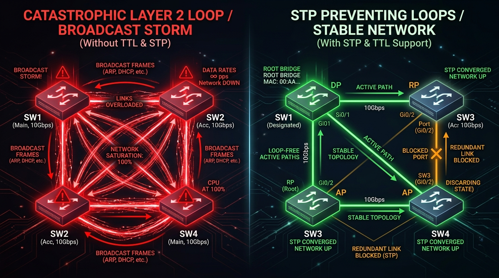
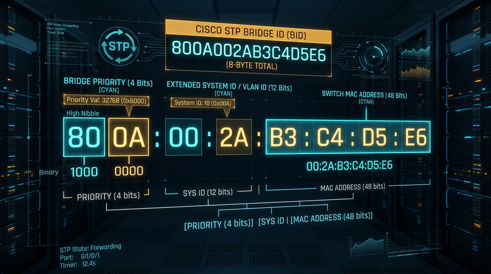
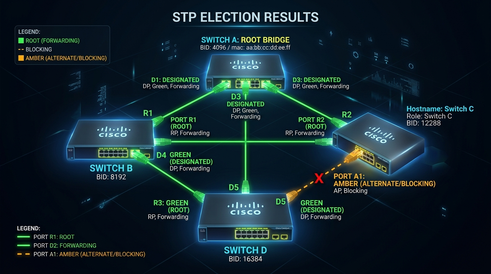

← [[Course on CCNA|Go Back to Course Hub]]

# 🌲 Day 20: STP - Part 1 (Spanning Tree Protocol Fundamentals)

Welcome to the notes for **Day 20: Spanning Tree Protocol (Part 1)** of Jeremy's IT Lab CCNA Complete Course! Ye note aapko Layer 2 Network Redundancy ke faayde aur Loops/Broadcast Storms ke khatre, STP (IEEE 802.1D) ki loop-prevention working, Bridge ID (BID) ka internal 8-byte structure, Root Bridge aur Port Roles (RP, DP, AP) ka complete 3-Step Election Process detailed real-world analogies aur premium illustrations ke sath pure Hinglish language mein samjhayega.

---

## 🌪️ 1. Network Redundancy vs Layer 2 Loops (STP Kyu Chahiye?)

Production enterprise networks mein hum hamesha switches ke beech extra backup cables (**Redundant Links**) lagate hain taaki agar ek cable cut ho jaye toh network down na ho. Lekin bina STP ke redundant links lagana ek **catastrophic disaster** ban jata hai!

### Bina STP ke Hone Wale 3 Khatarnaak Nuksaan:
1.  **Broadcast Storms (Sabse Bada Khatra):**
    *   IP Header (Layer 3) ke paas **TTL (Time to Live)** hota hai jo packet ko loop mein ghoomne se rokta hai. Lekin **Ethernet Header (Layer 2) ke paas koi TTL field nahi hoti!**
    *   Agar ek PC broadcast frame (jaise ARP request) bhejta hai, toh switches use ek doosre ko endlessly forward karte rehte hain. Kuch hi seconds mein switch ki CPU 100% ho jati hai aur poora network crash ho jata hai!
2.  **MAC Table Instability (MAC Address Flapping):**
    *   Same broadcast frame alag-alag ports se baar-baar aane par switch apni MAC Table mein source MAC address ki port mapping seconds mein hazaron baar overwrite karta rehta hai.
3.  **Multiple Frame Copies (Duplicate Frames):**
    *   Destination end devices ko same unicast frame ki multiple duplicate copies receive hoti hain jisse applications crash ho jaati hain.

#### 💡 Real-world Analogy (Udaharan):
*   **Roundabout Traffic Circle with No Exit Signs & Infinite Fuel:**
    *   Imagine kijiye ek round-about (circle) hai jisme 4 raaste aapas mein judte hain. Agar koi gaadi andar ghuse aur round-about par koi exit sign na ho, aur gaadi ka petrol kabhi khatam na ho (*No TTL*), toh gaadi gol-gol ghoomti rahegi.
    *   Peeche se hazaron nayi gaadiyan aayengi aur gol-gol ghoomne lagengi, jisse poora shehar jam ho jayega (*Broadcast Storm*).
    *   **Solution (STP):** Ek smart traffic police officer (**Spanning Tree Protocol**) ek road par temporary barrier (Blocking Port) laga deta hai taaki loop toot jaye aur traffic seedha chale!

---

## 🛡️ 2. Spanning Tree Protocol (IEEE 802.1D) Kya Hai?

**STP (Spanning Tree Protocol)** ko Radia Perlman (*"Mother of the Internet"*) ne design kiya tha.

*   **Core Working:** STP redundant links ko monitor karta hai aur loop banne wale extra physical ports ko dynamically **Blocking State (Amber Light)** mein daal deta hai.
*   **Automatic Failover:** Agar active forwarding link toot jata hai, toh STP blocked port ko detect karke use automatically **Forwarding State (Green Light)** mein transition kar deta hai!

---

## 📨 3. Bridge Protocol Data Units (BPDUs)

Switches aapas mein STP ki baatcheet karne ke liye special control frames exchange karte hain jinhe **BPDUs (Bridge Protocol Data Units)** kehte hain.

*   **Hello Interval:** BPDUs har **2 seconds** mein ek baar send kiye jaate hain.
*   **BPDU Content:** Isme Root Bridge ID, Path Cost to Root, Sender Bridge ID, aur Port ID information hoti hai.

---

## 🪪 4. Bridge ID (BID) Structure (8 Bytes / 64 Bits)

Har Cisco switch ke paas ek unique identity hoti hai jise **Bridge ID (BID)** kehte hain. Election mein yahi BID switch ki kismat decide karti hai!

### BID ke 3 Components:

| Field Name | Bit Size | Value Range / Description |
| :--- | :--- | :--- |
| **Bridge Priority** | **4 bits** | **Multiples of 4096** mein hoti hai (0, 4096, 8192, ..., 61440). **Default: 32768**. |
| **Extended System ID** | **12 bits** | **VLAN ID** ko represent karta hai (e.g. VLAN 10 ke liye value `10` hogi). |
| **Switch MAC Address** | **48 bits (6 Bytes)** | Switch ka permanent base MAC address (Unique tiebreaker). |

$$\text{Total Configured Priority} = \text{Bridge Priority} + \text{Extended System ID (VLAN ID)}$$
*Example (Default VLAN 1):* $\text{Total Priority} = 32768 + 1 = \mathbf{32769}$.

---

## 🗳️ 5. The 3-Step STP Election Process

STP network ko loop-free banane ke liye step-by-step **3 Elections** conduct karta hai:

### 🥇 Step 1: Elect ONE Root Bridge (Per Broadcast Domain / VLAN)
*   **Rule:** Poore network mein jis switch ka **Bridge ID (BID) sabse LOWEST** hoga, wo **Root Bridge** banega!
    1.  *First Compare:* Bridge Priority (Sabse chhota number jeetta hai).
    2.  *Tiebreaker:* Agar Priority same ho, toh sabse **Lowest Base MAC Address** jeetta hai.
*   **Root Bridge Rule:** Root Bridge ke **saare physical ports Designated Ports (DP)** bante hain aur hamesha **Forwarding State (Green)** mein hote hain! (Root bridge par koi bhi port block nahi hota).

---

### 🥈 Step 2: Elect ONE Root Port (RP) on Every Non-Root Switch
*   Root Bridge ko chhod kar network ke baaki sabhi switches ko **Non-Root Bridges** kehte hain.
*   Har non-root switch ko Root Bridge tak pahunchne ke liye apna **best single port** chunna hota hai jise **Root Port (RP)** kehte hain.
*   **Rule:** Wo port jiska Root Bridge tak pahunchne ka **Root Path Cost sabse LOWEST** ho, wo **Root Port (RP)** banta hai (Forwarding State).

#### 📏 Standard STP Path Costs (802.1D):
*   10 Mbps Link = Cost **100**
*   100 Mbps Link (FastEthernet) = Cost **19**
*   1 Gbps Link (GigabitEthernet) = Cost **4**
*   10 Gbps Link (TenGigabitEthernet) = Cost **2**

#### ⚖️ Cost Tiebreaker Rules (Agar Cost Same Ho):
1.  **Lowest Neighbor Bridge ID** (Sender switch ka BID).
2.  **Lowest Neighbor Port Priority** (Default: 128).
3.  **Lowest Neighbor Port Number** (Jaise `Fa0/1` jeetega `Fa0/2` se).

---

### 🥉 Step 3: Elect ONE Designated Port (DP) Per Segment
*   Do switches ke beech judne wale har physical cable link (segment) par ek port **Designated Port (DP)** banega aur doosra port **Alternate/Blocked Port (AP)** banega.
*   **Rule:** Us segment par jis switch ka Root Path Cost sabse kam hoga, uska port **Designated Port (DP - Forwarding)** banega.
*   Jo port har election haar jata hai, use **Non-Designated / Alternate Port (AP)** banaya jata hai jo **Blocking State (Amber)** mein rehta hai taaki loop block ho sake!

---

## 🚦 6. Classic STP Port States (802.1D)

Standard Spanning Tree Protocol (802.1D) mein port ko down se active forwarding hone mein **50 seconds** ka time lagta hai:

| Port State | Duration (Timer) | Sends / Receives Data Frames? | Learns MAC Addresses? | Processes BPDUs? |
| :--- | :--- | :--- | :--- | :--- |
| **Blocking** | Max Age (**20s**) | ❌ No | ❌ No | ✅ Yes (Listens only) |
| **Listening** | Forward Delay (**15s**) | ❌ No | ❌ No | ✅ Yes (Sends & Receives) |
| **Learning** | Forward Delay (**15s**) | ❌ No | ✅ **Yes** (Fills MAC Table) | ✅ Yes |
| **Forwarding** | Indefinite | ✅ **Yes** (Active Traffic) | ✅ **Yes** | ✅ Yes |
| **Disabled** | Manual | ❌ No | ❌ No | ❌ No (Port shut down) |

$$\text{Total Convergence Time} = 20\text{s (Max Age)} + 15\text{s (Listening)} + 15\text{s (Learning)} = \mathbf{50\text{ Seconds}}$$

---

## 🔍 7. Verification Commands

*   `show spanning-tree` — Switch ke saare active VLANs ka STP status, Root Bridge BID, local switch BID, aur har port ka role (RP, DP, Altn) aur state (FWD, BLK) check karne ke liye.
*   `show spanning-tree vlan [id]` — Specific VLAN ka detailed Spanning Tree election breakdown dekhne ke liye.
*   `show spanning-tree root` — Root Bridge ka MAC address, Root Path Cost, aur Hello/Max-Age timers dekhne ke liye.

---

## 📝 8. CCNA Day 20 Practice Questions

Aap yahan questions ko read karke answers verify kar sakte hain (Answer dekhne ke liye click karein):

1.  **Q1: Layer 2 Ethernet frame header ke andar Layer 3 IP header ki tarah kaun si loop-prevention field absent (gayab) hoti hai jiski wajah se broadcast storm bante hain?**
    

    
🔓 Click to Reveal Answer

    **Answer:** **TTL (Time to Live)** field.
    

2.  **Q2: Spanning Tree Protocol (STP) control messages jinhe switches har 2 seconds mein ek doosre ko exchange karte hain, unhe kya kaha jata hai?**
    

    
🔓 Click to Reveal Answer

    **Answer:** **BPDUs (Bridge Protocol Data Units)**.
    

3.  **Q3: Cisco Switch Bridge ID (BID) ka total size kitne bytes (ya bits) ka hota hai?**
    

    
🔓 Click to Reveal Answer

    **Answer:** **8 Bytes (64 Bits)**.
    

4.  **Q4: Cisco Catalyst switches par factory default settings ke under Bridge Priority ki numerical value kya hoti hai?**
    

    
🔓 Click to Reveal Answer

    **Answer:** **32768**.
    

5.  **Q5: STP Root Bridge election mein poore network ke switches mein se kaun sa switch Root Bridge elect hota hai?**
    

    
🔓 Click to Reveal Answer

    **Answer:** Jis switch ki **Bridge ID (BID) sabse LOWEST** hoti hai (Pehle Lowest Priority dekhi jaati hai, tie hone par Lowest MAC Address).
    

6.  **Q6: Root Bridge ke sabhi active physical ports mandatory taur par kis STP Port Role aur kis State mein operate karte hain?**
    

    
🔓 Click to Reveal Answer

    **Answer:** **Designated Ports (DP)** in **Forwarding State** (Root Bridge par koi port block nahi hota).
    

7.  **Q7: Standard 802.1D STP ke according, 1 Gbps (GigabitEthernet) speed wale link ki STP Path Cost value kitni hoti hai?**
    

    
🔓 Click to Reveal Answer

    **Answer:** Cost **4** (100 Mbps = 19, 10 Gbps = 2).
    

8.  **Q8: Non-Root Switch par Root Bridge tak pahunchne ke liye sabse lowest path cost wale port ko kaun sa role diya jata hai?**
    

    
🔓 Click to Reveal Answer

    **Answer:** **Root Port (RP)**.
    

9.  **Q9: Classic 802.1D STP ke under, kisi link failure ke baad ek blocked port ko active Forwarding state tak pahunchne mein total kitna convergence time lagta hai?**
    

    
🔓 Click to Reveal Answer

    **Answer:** **50 Seconds** (20s Max Age + 15s Listening + 15s Learning).
    

10. **Q10: STP ki kaun si transitional state switch ko users ka data frame forward karne se rokti hai lekin switch ko MAC address table entries learn karne ki permission deti hai?**
    

    
🔓 Click to Reveal Answer

    **Answer:** **Learning State** (Forward Delay = 15 seconds).
    

