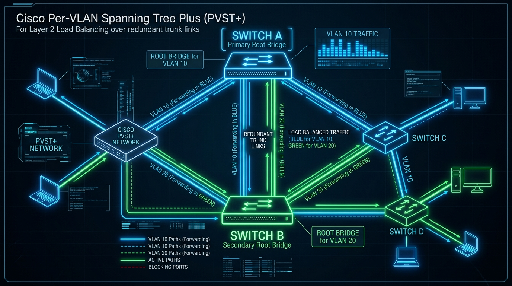
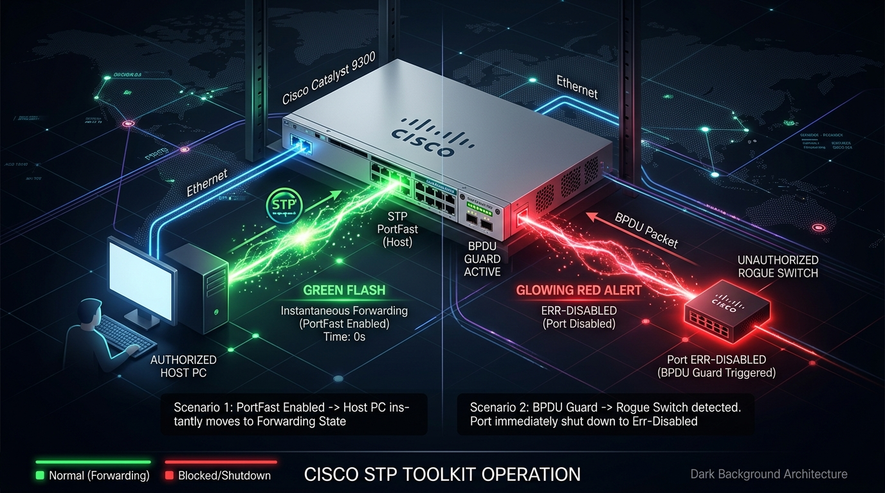
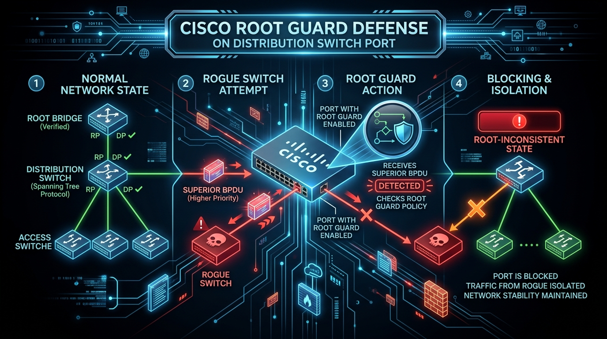

← [[Course on CCNA|Go Back to Course Hub]]

# 🌲 Day 21: STP - Part 2 (PVST+ & The STP Toolkit)

Welcome to the notes for **Day 21: Spanning Tree Protocol (Part 2) - PVST+ & The STP Toolkit** of Jeremy's IT Lab CCNA Complete Course! Ye note aapko Cisco **Per-VLAN Spanning Tree Plus (PVST+)** ke zariye Layer 2 Load Balancing, Root Primary/Secondary configuration, aur **STP Toolkit** ke 5 essential protection features—**PortFast, BPDU Guard, BPDU Filter, Root Guard, aur Loop Guard** ko detailed real-world analogies aur premium illustrations ke sath pure Hinglish language mein samjhayega.

---

## ⚖️ 1. Cisco PVST+ (Per-VLAN Spanning Tree Plus)

Standard IEEE 802.1D (CST - Common Spanning Tree) poore network ke liye sirf ek single STP instance chalata tha, jisse ek switch-to-switch link hamesha blocked rehta tha aur bandwidth waste hoti thi.

Cisco ne **PVST+ (Per-VLAN Spanning Tree Plus)** introduce kiya, jo **har ek individual VLAN ke liye alag independent STP instance** chalata hai!



### A. Layer 2 Load Balancing ka Faayda:
*   **VLAN 10 Traffic:** Hum Switch-A ko VLAN 10 ka **Primary Root Bridge** bana dete hain. VLAN 10 ka sara traffic Link 1 (Forwarding) se jayega aur Link 2 block rahega.
*   **VLAN 20 Traffic:** Hum Switch-B ko VLAN 20 ka **Primary Root Bridge** bana dete hain. VLAN 20 ka sara traffic Link 2 (Forwarding) se jayega aur Link 1 block rahega.
*   **Result:** Dono physical links simultaneously active traffic carry kar rahe hain! Koi bhi link idle baith kar waste nahi hota.

#### 💡 Real-world Analogy (Udaharan):
*   **Two-Lane Highway Traffic Distribution:**
    *   *Single STP (CST):* Ek 2-lane road hai, lekin police ne ek lane ko permanent band (block) kar diya hai. Saari gaadiyan sirf ek hi lane se ghus rahi hain jisse traffic jam ho raha hai.
    *   *PVST+ (Per-VLAN):* Police ne Lane 1 ko Trucks/Buses (**VLAN 10**) ke liye khol diya aur Lane 2 ko Cars/Bikes (**VLAN 20**) ke liye khol diya. Dono lanes ka poora use ho raha hai aur traffic fast nikal raha hai!

---

### B. Cisco CLI par Root Bridge Configure karna:

#### Method 1: Automatic Macro Commands (`root primary` / `root secondary`)
```ios
! Switch-A ko VLAN 10 ka Root Bridge banayein (Sets Priority to 24576)
Switch-A(config)# spanning-tree vlan 10 root primary

! Switch-A ko VLAN 20 ka Backup Root Bridge banayein (Sets Priority to 28672)
Switch-A(config)# spanning-tree vlan 20 root secondary
```

#### Method 2: Manual Priority Configuration (Multiples of 4096)
```ios
! Bridge Priority ko manually lowest value (e.g. 4096) par lock karein
Switch-A(config)# spanning-tree vlan 10 priority 4096
Switch-A(config)# spanning-tree vlan 20 priority 8192
```

> [!IMPORTANT]
> **Priority Increments Rule:**
> Cisco switches par Bridge Priority sirf **4096 ke multiples** mein hi set ho sakti hai (`0, 4096, 8192, 12288, 16384, 20480, 24576, 28672, 32768, 36864, 40960, 45056, 49152, 53248, 57344, 61440`). Agar aap koi beech ka number (jaise 4000) likhenge, toh Cisco IOS command reject kar dega.

---

## 🧰 2. The STP Toolkit (Optimization & Security Features)

Classic STP ke delays aur vulnerabilities ko protect karne ke liye Cisco switches mein **STP Toolkit** ke features diye gaye hain:

---

### ⚡ Feature 1: PortFast (Instant Convergence for End Hosts)
*   **Problem:** Jab koi PC ya Server switch port par connect hota hai, toh standard STP port ko 30 se 50 seconds tak Listening/Learning state mein rakhta hai. Is dauran PC ka **DHCP Request time out** ho jata hai aur user ko network nahi milta.
*   **PortFast Solution:** PortFast port ko Listening aur Learning states bypass karwa kar **0 seconds mein directly Forwarding State (Green)** mein transition kar deta hai! Saath hi port ke up/down hone par switch TCN (Topology Change Notification) BPDUs generate nahi karta.
*   **Safety Rule:** PortFast ko **sirf aur sirf End Devices (PC, Printer, Server)** se jude Access Ports par lagana chahiye. Switches se jude links par lagane se instant broadcast storm aa jayega!

```ios
! Single Port par enable karein
Switch(config)# interface gigabitethernet0/1
Switch(config-if)# switchport mode access
Switch(config-if)# spanning-tree portfast

! Global level par sabhi Access ports ke liye enable karein
Switch(config)# spanning-tree portfast default
```

---

### 🛑 Feature 2: BPDU Guard (Rogue Switch Protection)
*   **Purpose:** PortFast ports ko protect karne ke liye banaya gaya hai.
*   **Working:** Agar kisi PortFast-enabled port par achanak koi BPDU frame receive hota hai (Jaise kisi employee ne bina permission ke ghar se laaya switch connect kar diya ya hacker ne BPDU attack kiya), toh BPDU Guard turant us port ko shutdown karke **`err-disabled`** state mein daal deta hai!



```ios
! Single Port par enable karein
Switch(config-if)# spanning-tree bpduguard enable

! Global level par enable karein (Har PortFast port par automatically lag jayega)
Switch(config)# spanning-tree portfast bpduguard default
```

> [!TIP]
> **Err-Disabled Port Recovery:**
> Port ko wapas theek karne ke liye interface par jaakar `shutdown` aur phir `no shutdown` chalana padta hai, ya global command `errdisable recovery cause bpduguard` se auto-recovery timer set kar sakte hain.

---

### 🛡️ Feature 3: Root Guard (Root Bridge Hijack Protection)
*   **Problem:** Agar koi nayi unauthorized switch aati hai aur uska Priority 0 ya lowest MAC address hota hai, toh wo aapke Core Root Bridge ko hata kar khud Root Bridge ban jayegi (**Root Hijacking**), jisse sara network traffic us rogue switch se hokar guzarne lagega.
*   **Root Guard Solution:** Root Guard ko Distribution/Core switches ke un Designated Ports par lagaya jata hai jo downstream switches se jude hote hain.
*   **Working:** Agar us port par koi Superior BPDU (kam priority wala) aata hai, toh Root Guard use Root Bridge banne se rokte hue port ko **`root-inconsistent`** state (Blocking State) mein daal deta hai jab tak wo superior BPDUs aana band nahi hote!



```ios
Switch(config)# interface gigabitethernet0/24
Switch(config-if)# spanning-tree guard root      ! Root Guard enable karein
```

---

### 🚫 Feature 4: BPDU Filter
*   **Working:** Port par BPDUs ko send aur receive hone se completely block kar deta hai.
*   *Warning:* Interface level par `spanning-tree bpdufilter enable` chalane se port par STP effectively disable ho jata hai, jisse loop banne ka bohot bada risk hota hai.

---

### 🔄 Feature 5: Loop Guard
*   **Working:** Unidirectional link failure (fiber cable ka ek strand cut hone) ki wajah se agar Alternate ya Root Port ko BPDUs milna band ho jayein, toh standard STP use galti se Forwarding bana deta hai jisse loop ban jata hai. Loop Guard port ko Forwarding banne ke bajaye **`loop-inconsistent`** state mein lock kar deta hai.

---

## 📊 Summary of STP Toolkit Features:

| Toolkit Feature | Where to Configure? | What Triggers It? | Action Taken / State |
| :--- | :--- | :--- | :--- |
| **PortFast** | Access Ports (End hosts only) | Link Up event | Skips 30s delay $\rightarrow$ Immediate **Forwarding**. |
| **BPDU Guard** | PortFast Access Ports | Receiving ANY BPDU | Shuts down port into **`err-disabled`**. |
| **Root Guard** | Designated Ports (Downstream) | Receiving Superior BPDU | Blocks port into **`root-inconsistent`**. |
| **Loop Guard** | Non-Designated / Root Ports | Loss of BPDU heartbeats | Blocks port into **`loop-inconsistent`**. |
| **BPDU Filter** | Edge / Specialized ports | Outgoing/Incoming BPDUs | Stops sending/receiving BPDUs. |

---

## 🔍 3. Verification Commands

*   `show spanning-tree summary` — Switch par global PortFast, BPDU Guard, aur PVST+ active features ka quick overview dekhne ke liye.
*   `show spanning-tree inconsistentports` — Root Guard ya Loop Guard ki wajah se blocked (*root-inconsistent*) ports ki list dekhne ke liye.
*   `show interfaces status err-disabled` — BPDU Guard se shut down hue ports ka status dekhne ke liye.

---

## 📝 4. CCNA Day 21 Practice Questions

Aap yahan questions ko read karke answers verify kar sakte hain (Answer dekhne ke liye click karein):

1.  **Q1: Cisco proprietary PVST+ (Per-VLAN Spanning Tree Plus) ka Common Spanning Tree (CST) ke muqable sabse bada primary advantage kya hai?**
    <details>
    <summary>🔓 Click to Reveal Answer</summary>
    **Answer:** Har VLAN ke liye alag independent STP topology aur Root Bridge banana, jisse **Layer 2 Load Balancing** possible hoti hai.
    </details>

2.  **Q2: Cisco Catalyst switch par `spanning-tree vlan 10 root primary` command chalane par switch VLAN 10 ke liye priority value kya set karta hai?**
    <details>
    <summary>🔓 Click to Reveal Answer</summary>
    **Answer:** **`24576`** (ya current root se 4096 kam).
    </details>

3.  **Q3: Cisco Switch par manual Bridge Priority configure karte waqt priority number mandatory taur par kiske multiples mein hona chahiye?**
    <details>
    <summary>🔓 Click to Reveal Answer</summary>
    **Answer:** **4096 ke multiples** mein (e.g. 0, 4096, 8192, ..., 32768, ..., 61440).
    </details>

4.  **Q4: Switch access port par connect hone wale end PCs ko 30-second STP delay se bachakar turant Forwarding state mein laane wale feature ka kya naam hai?**
    <details>
    <summary>🔓 Click to Reveal Answer</summary>
    **Answer:** **STP PortFast** (`spanning-tree portfast`).
    </details>

5.  **Q5: PortFast enabled port par agar koi unauthorized switch jud kar BPDU packet send karti hai, toh BPDU Guard us port ke sath kya karta hai?**
    <details>
    <summary>🔓 Click to Reveal Answer</summary>
    **Answer:** Port ko instantly disable karke **`err-disabled`** state mein daal deta hai.
    </details>

6.  **Q6: BPDU Guard ke through `err-disabled` hue switch port ko dobara up karne ke liye manual CLI step kya hai?**
    <details>
    <summary>🔓 Click to Reveal Answer</summary>
    **Answer:** Interface configuration mode mein jaakar **`shutdown`** aur phir **`no shutdown`** command chalana.
    </details>

7.  **Q7: Distribution/Core switch par kisi downstream unauthorized switch ko Root Bridge banne (Root Hijacking) se rokne ke liye kaun sa feature use hota hai?**
    <details>
    <summary>🔓 Click to Reveal Answer</summary>
    **Answer:** **Root Guard** (`spanning-tree guard root`).
    </details>

8.  **Q8: Agar Root Guard enabled port par superior BPDU receive ho, toh port kis special STP state mein move ho jata hai?**
    <details>
    <summary>🔓 Click to Reveal Answer</summary>
    **Answer:** **`root-inconsistent`** state (traffic block ho jata hai).
    </details>

9.  **Q9: Unidirectional fiber link failure ki wajah se Alternate ports ko galti se Forwarding state mein aane se rokne ke liye kaun sa toolkit feature use kiya jata hai?**
    <details>
    <summary>🔓 Click to Reveal Answer</summary>
    **Answer:** **Loop Guard** (`spanning-tree guard loop`).
    </details>

10. **Q10: Switch par global level par sabhi access ports par ek sath PortFast enable karne ke liye kaun si global command use hoti hai?**
    <details>
    <summary>🔓 Click to Reveal Answer</summary>
    **Answer:** **`spanning-tree portfast default`**.
    </details>
