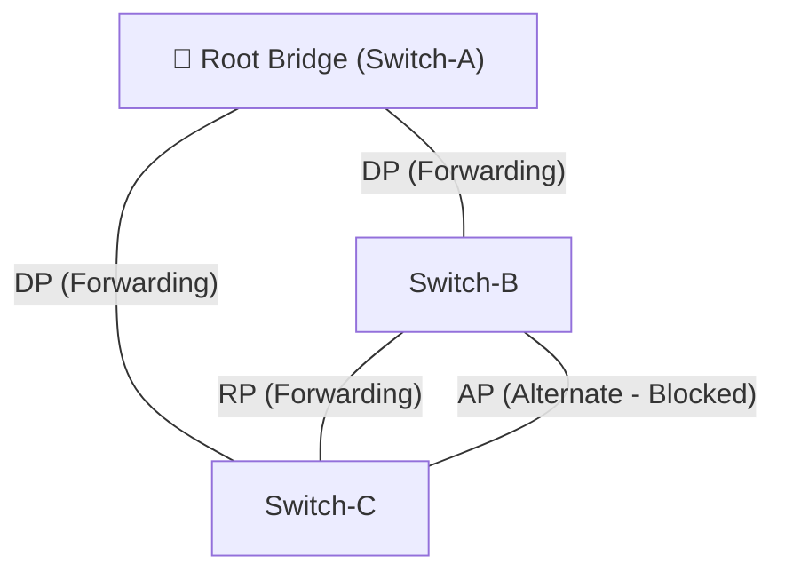
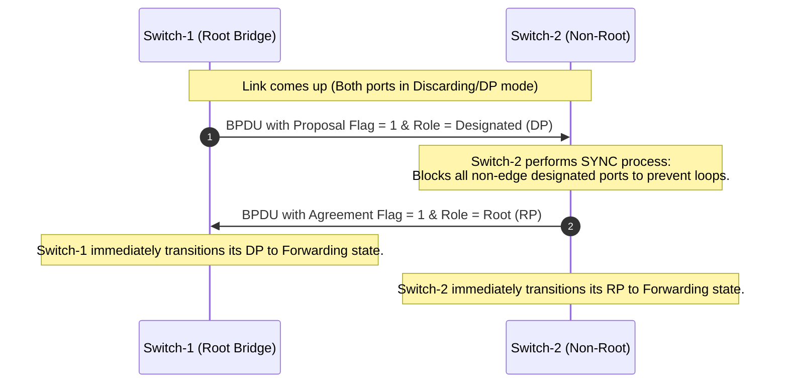

← [[Course on CCNA|Go Back to Course Hub]]

# 🌲 Day 22: Rapid Spanning Tree Protocol (RSTP)

Welcome to the notes for **Day 22: Rapid Spanning Tree Protocol (RSTP)** of Jeremy's IT Lab CCNA Complete Course! Aaj hum seekhenge ki kaise IEEE 802.1w standard (RSTP) legacy STP (802.1D) ke convergence delays ko dur karke network ko milliseconds mein recover karta hai. Ye pure lecture notes Hinglish language aur English/Latin script mein detailed explanations, real-world analogies, premium Mermaid diagrams aur CLI configurations ke sath hain.

---

## 🏎️ 1. Why RSTP? (Legacy STP vs. RSTP)

Classic STP (IEEE 802.1D) ka sabse bada problem tha uska **Slow Convergence Time**. Agar network mein koi link fail ho jata hai, ya koi naya switch connect hota hai, toh network ko normal state mein aane (converge hone) mein **30 se 50 seconds** lag jaate hain:
*   **Max Age:** 20 seconds (BPDU loss detect karne ke liye)
*   **Listening State:** 15 seconds (Forward Delay)
*   **Learning State:** 15 seconds (Forward Delay)

Aaj kal ke enterprise networks mein 30-50 seconds ka downtime tabahi macha sakta hai (VoIP calls drop ho jayengi, database connections disconnect ho jayenge). 

Is problem ko solve karne ke liye IEEE ne 2001 mein **RSTP (IEEE 802.1w)** introduce kiya. RSTP pure network loop-free topology ko **1 se 3 seconds** (sub-seconds) ke andar converge kar deta hai.

### 💡 Real-world Analogy (Udaharan):
*   **Classic STP (Legacy):** Maan lijiye aap ek highway par ja rahe hain aur achanak aage block laga hai. Police aapse kehti hai, "Rukiye! Pehle hum 15 minute map check karenge (Listening), phir 15 minute local drivers se puchenge (Learning), tab jaakar aapko bypass route se jaane denge (Forwarding)." Is dauran traffic jam ho jata hai.
*   **Rapid STP (RSTP):** Jaise hi accident hota hai, bypass route ka automatic gate instant open ho jata hai aur traffic bina ruke bypass lane par redirect ho jata hai. Kuch hi seconds mein traffic normal ho jata hai.

---

## 🔄 2. STP vs RSTP: States & Roles Comparison

RSTP ne Spanning Tree ke operations ko simplified aur dynamic banane ke liye Port States aur Port Roles ko completely redesign kiya hai.

### A. Port States Comparison:
Classic STP ke 5 states ke muqable RSTP mein sirf **3 Port States** hote hain:

| Classic STP (802.1D) State | RSTP (802.1w) State | Operational Status | MAC Learning? | Frames Forwarding? |
| :--- | :--- | :--- | :--- | :--- |
| **Disabled** | **Discarding** | Port shut down hai ya link down hai. | No | No |
| **Blocking** | **Discarding** | Port frames loop rokne ke liye block hai. | No | No |
| **Listening** | **Discarding** | Port active ho raha hai aur BPDUs check kar raha hai. | No | No |
| **Learning** | **Learning** | Port MAC address table populate kar raha hai. | **Yes** | No |
| **Forwarding** | **Forwarding** | Port traffic forward kar raha hai normal state mein. | **Yes** | **Yes** |

> [!NOTE]
> RSTP ne **Disabled**, **Blocking**, aur **Listening** states ko merge karke ek hi state bana diya hai jise **Discarding State** kehte hain. Is state mein switch port na toh data frames forward karta hai aur na hi MAC address table learn karta hai.

---

### B. Port Roles Comparison:
RSTP redundant/backup links ko manage karne ke liye specialized port roles use karta hai:



1.  **Root Port (RP):** Same as classic STP. Root Bridge tak pahunchne ka sabse lowest path cost wala port (1 per non-root switch).
2.  **Designated Port (DP):** Same as classic STP. Har segment par traffic forward karne wala primary port.
3.  **Alternate Port (AP) (Naya Role):** 
    *   Ye port **Root Port ka backup** hota hai.
    *   Agar current Root Port fail ho jata hai, toh Alternate Port **instantly Root Port ban kar Forwarding state** mein chala jata hai (bina Listening/Learning delays ke).
    *   Alternate Port ko **dusre switches** se superior BPDUs milti hain.
4.  **Backup Port (BP) (Naya Role):** 
    *   Ye port **Designated Port ka backup** hota hai.
    *   Agar ek hi switch ke multiple ports same collision domain (jaise hub ke zariye) connected hain, toh higher port ID wala port Backup Port ban jata hai.
    *   Ise **apne hi switch** se superior BPDUs milti hain.

---

## 🛠️ 3. RSTP Link Types

RSTP fast convergence tabhi achieve karta hai jab use link ke physical nature ke baare mein pata ho. RSTP links ko teen categories mein divide karta hai:

1.  **Edge Ports:**
    *   Ye ports end hosts (PCs, Servers, Printers) se connected hote hain.
    *   Cisco CLI par PortFast configure karne par wo port RSTP ke liye **Edge Port** ban jata hai.
    *   Edge Ports link up hote hi **instantly Forwarding state** mein chale jate hain.
    *   Agar edge port par achanak koi BPDU packet receive ho, toh wo edge status lose karke normal non-edge RSTP port ban jata hai (BPDU Guard enabled hone par shut down ho jata hai).

2.  **Point-to-Point Links (Non-Shared):**
    *   Wo link jo direct do switches ke beech connected ho.
    *   Ye mandatory hai ki link **Full-Duplex** mode mein chal raha ho.
    *   RSTP ka fast handshake protocol sirf Point-to-Point links par hi kaam karta hai.

3.  **Shared Links:**
    *   Wo link jo **Half-Duplex** mode mein chal raha ho (Jaise hub ke sath connection).
    *   Yahan collision hone ke chances hote hain, isliye RSTP fast handshake bypass karke classic STP ke timers par fallback karta hai.

---

## ✉️ 4. RSTP BPDU Structure & Flag Byte

RSTP BPDUs (802.1w) classic STP (802.1D) ke muqable zyada information carry karte hain aur iski structure alag hoti hai:

*   **Protocol Version:** Classic STP mein ye `0` hota hai, jabki RSTP mein ye **`2`** hota hai.
*   **BPDU Type:** Classic STP mein Configuration BPDU `0x00` aur TCN `0x80` hota hai. RSTP mein dynamic signalling ke liye ek single type **`0x02` (RST BPDU)** use hota hai.

### The Flag Byte (RSTP Flags):
Classic STP Flags byte ke sirf 2 bits (TC aur TCA) use karta tha. RSTP **Flags byte ke saare 8 bits** use karta hai:

```
Bit 7      Bit 6      Bit 5      Bit 4      Bit 3      Bit 2      Bit 1      Bit 0
+----------+----------+----------+----------+----------+----------+----------+----------+
|   TCA    | Agreement| Forwarding| Learning |   Role   |   Role   | Proposal |    TC    |
+----------+----------+----------+----------+----------+----------+----------+----------+
```

*   **Bit 0 (TC):** Topology Change.
*   **Bit 1 (Proposal):** Handshake initiation request.
*   **Bit 2 & 3 (Port Role):**
    *   `00` = Unknown
    *   `01` = Alternate/Backup Port
    *   `10` = Root Port
    *   `11` = Designated Port
*   **Bit 4 (Learning):** Port current state learning hai ya nahi.
*   **Bit 5 (Forwarding):** Port current state forwarding hai ya nahi.
*   **Bit 6 (Agreement):** Handshake configuration confirmation.
*   **Bit 7 (TCA):** Topology Change Acknowledgment (RSTP mein iska use nahi hota, classic backward compatibility ke liye hai).

---

## 🤝 5. How RSTP Achieves Fast Convergence (The Mechanisms)

RSTP legacy STP ki tarah timers (forward delay) par rely nahi karta. Wo do unique tarikon se fast convergence karta hai:

### A. The Proposal/Agreement Handshake (Point-to-Point Links)
Jab do switches ke beech link up hota hai, toh RSTP instant convergence ke liye ek negotiation start karta hai:



1.  **Proposal:** Switch-1 ka port link up hote hi **Discarding** state mein chala jata hai aur woh ek BPDU bhejta hai jisme **Proposal flag = 1** aur role **Designated Port (DP)** set hota hai.
2.  **Sync Process:** Switch-2 ko jab proposal milta hai, toh loop se bachne ke liye woh apne saare non-edge designated ports ko temporary block/discarding state mein daal deta hai (is process ko **Sync** kehte hain).
3.  **Agreement:** Sync complete hone ke baad Switch-2 Switch-1 ko ek reply BPDU bhejta hai jisme **Agreement flag = 1** aur role **Root Port (RP)** set hota hai.
4.  **Forwarding:** Agreement milte hi Switch-1 bina kisi timer wait ke instantly interface ko **Forwarding** state mein switch kar deta hai. Iske baad Switch-2 bhi apne RP ko Forwarding mein daal deta hai. Ye handshake down-the-line recursively chalta jata hai.

---

### B. Fast Aging & Neighbor Loss Detection
*   **Classic STP:** Agar Root Bridge se BPDU aana band ho jaye, toh switch **Max Age timer (20 seconds)** ke expire hone ka wait karta hai tabhi topology change process chalata hai.
*   **RSTP:** RSTP mein har switch apna khud ka BPDU send karta hai har 2 second (Hello interval) mein. Agar switch ko kisi neighbor switch se **3 consecutive hellos (yani 3 * 2 = 6 seconds)** tak koi BPDU na mile, toh switch maan leta hai ki neighbor switch down ho gaya hai aur instant convergence triggered ho jata hai.

---

### C. New Topology Change (TC) Process
RSTP mein Topology Change detect karne aur MAC tables flush karne ka tareeqa classic STP se kafi tez hai:

1.  **Detection:** Sirf **Non-Edge ports** ka **Forwarding state** mein aana hi Topology Change mana jata hai. Port down hona RSTP mein TC generate nahi karta.
2.  **Notification & Flood:** Jis switch par change hota hai, woh Root Bridge ko notify karne ka wait nahi karta. Woh khud hi saare designated aur root ports par **TC flag set karke BPDUs flood** karne lagta hai.
3.  **MAC Table Flush:** Jaise hi kisi doosre switch ko TC set BPDU milta hai, woh apne saare ports (except edge ports) par learned **MAC addresses ko instantly flush (delete)** kar deta hai taaki traffic direct updated path se route ho sake.

---

## 💻 6. Cisco CLI Configuration & Verification

Cisco switches par legacy PVST+ default enabled hota hai. Rapid PVST+ (RSTP for each VLAN) activate karne ke liye configuration steps niche diye gaye hain:

### A. Rapid PVST+ Enable Karna:
```ios
! Global configuration mode mein switchport spanning tree mode change karein
Switch(config)# spanning-tree mode rapid-pvst
```

### B. Edge Port (PortFast) Configure Karna:
```ios
! Switchport ko access interface banayein aur PortFast (Edge Port) enable karein
Switch(config)# interface fastethernet 0/1
Switch(config-if)# switchport mode access
Switch(config-if)# spanning-tree portfast
```

### C. Verify Commands:

#### 1. Detailed STP details dekhne ke liye:
```ios
Switch# show spanning-tree
```
*Output snippet:*
> Spanning tree enabled protocol **rstp** *(Confirm karta hai ki Rapid PVST+ active hai)*

#### 2. Summary details check karne ke liye:
```ios
Switch# show spanning-tree summary
```
*Output snippet:*
```text
Switch is in rapid-pvst mode
Root bridge for: none
EtherChannel misconfig guard is enabled

Name                   Blocking Listening Learning Forwarding STP Active
---------------------- -------- --------- -------- ---------- ----------
VLAN0001                      1         0        0          4          5
```

---

## 📝 7. CCNA Day 22 Practice Questions

Aap niche diye gaye questions ke answers toggles open karke self-assess kar sakte hain:

1. **Q1: RSTP (IEEE 802.1w) standard legacy STP (802.1D) ke muqable general converge hone mein kitna samay leta hai?**
   <details>
   <summary>🔓 Click to Reveal Answer</summary>
   **Answer:** **1 se 3 seconds** (sub-seconds) ke andar converge ho jata hai.
   </details>

2. **Q2: Classic STP ke Disabled, Blocking, aur Listening states ko RSTP mein kis single port state ke andar merge kar diya gaya hai?**
   <details>
   <summary>🔓 Click to Reveal Answer</summary>
   **Answer:** **Discarding State**.
   </details>

3. **Q3: RSTP mein use hone wale 'Alternate Port' (AP) role ka primary function kya hota hai?**
   <details>
   <summary>🔓 Click to Reveal Answer</summary>
   **Answer:** Ye **Root Port (RP) ka backup** hota hai. Agar Root Port down ho jaye, toh Alternate Port instantly new Root Port ban kar Forwarding state mein transition kar jata hai.
   </details>

4. **Q4: 'Backup Port' (BP) aur 'Alternate Port' (AP) mein basic difference kya hai?**
   <details>
   <summary>🔓 Click to Reveal Answer</summary>
   **Answer:** Alternate Port ko **doosre switches** se superior BPDUs milti hain, jabki Backup Port ko **apne hi switch** ke doosre port se superior BPDUs milti hain (jo redundant hub segments par hota hai).
   </details>

5. **Q5: RSTP fast handshake protocol (Proposal/Agreement) ko work karne ke liye kis physical mode aur connection type ka hona mandatory hai?**
   <details>
   <summary>🔓 Click to Reveal Answer</summary>
   **Answer:** Link ka **Point-to-Point** hona mandatory hai, jo ki hamesha **Full-Duplex** links par hi exist karta hai.
   </details>

6. **Q6: Agar kisi switch port ka mode Half-Duplex set ho, toh RSTP us link ko kis Link Type category mein rakhta hai?**
   <details>
   <summary>🔓 Click to Reveal Answer</summary>
   **Answer:** **Shared Link Type** (aur is link par RSTP fast transition skip karke legacy STP timers use karta hai).
   </details>

7. **Q7: RSTP BPDU packet ke Protocol Version field mein standard value kya hoti hai?**
   <details>
   <summary>🔓 Click to Reveal Answer</summary>
   **Answer:** **`2`** (Classic STP mein `0` hoti hai).
   </details>

8. **Q8: RSTP neighbor down status detect karne ke liye kitne Hello packets miss hone ka wait karta hai, aur isme kitna time lagta hai?**
   <details>
   <summary>🔓 Click to Reveal Answer</summary>
   **Answer:** **3 consecutive Hello packets** miss hone par (Default Hello 2s ke hisab se total **6 seconds**).
   </details>

9. **Q9: RSTP topology change process ke trigger hone par switches apne MAC table ke sath kya action lete hain?**
   <details>
   <summary>🔓 Click to Reveal Answer</summary>
   **Answer:** Edge ports ko chhodkar baki saare designated aur root ports par learned **MAC addresses ko instantly flush (delete)** kar dete hain.
   </details>

10. **Q10: Cisco Catalyst Switch par Rapid PVST+ mode enable karne ki exact global configuration command kya hai?**
    <details>
    <summary>🔓 Click to Reveal Answer</summary>
    **Answer:** **`spanning-tree mode rapid-pvst`**.
    </details>
