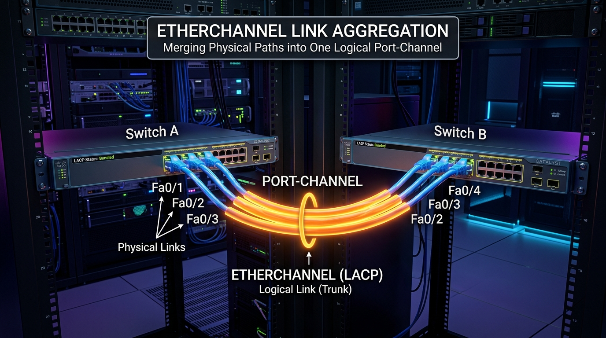

← [[Course on CCNA|Go Back to Course Hub]]

# 🔌 Day 23: EtherChannel (LACP & PAgP)

Welcome to the notes for **Day 23: EtherChannel (LACP & PAgP)** of Jeremy's IT Lab CCNA Complete Course! Aaj hum seekhenge ek aisi technology jo network bottlenecks ko khatam karti hai aur links ke beech bandwidth ko combine karke high-speed redundancy provide karti hai. Ye pure lecture notes Hinglish language aur English/Latin script mein detailed explanations, real-world analogies, premium Mermaid diagrams aur Cisco IOS CLI configurations ke sath hain.

---

## 🔗 1. What is EtherChannel? (The Concept)

Enterprise networks mein do switches ke beech high bandwidth aur redundancy provide karne ke liye hum multiple physical cables connect karte hain. Lekin standard STP (Spanning Tree Protocol) active loops ko rokne ke liye ek link ko chhodkar baki saare redundant links ko block kar deta hai. Isse humari additional links ki bandwidth waste ho jati hai.

**EtherChannel** ek aisi technology hai jo **multiple physical Ethernet links (up to 8 active links) ko group karke ek single logical/virtual link** bana deti hai! Is logical interface ko **Port-Channel** (ya EtherChannel) kaha jata hai.

```mermaid
flowchart LR
    subgraph Physical Topology
        S1_phys["Switch-A"]
        S2_phys["Switch-B"]
        S1_phys -- "Fa0/1 (100 Mbps)" --- S2_phys
        S1_phys -- "Fa0/2 (100 Mbps - BLOCKED)" --- S2_phys
    end

    subgraph Logical Topology with EtherChannel
        S1_log["Switch-A"]
        S2_log["Switch-B"]
        subgraph Port-Channel 1 (200 Mbps)
            S1_log --- S2_log
        end
    end
```



### A. Key Advantages of EtherChannel:
1.  **STP Bypass (No Blocked Ports):** STP pure Port-Channel group ko ek single logical interface ki tarah dekhta hai. Isliye individual physical links block nahi hote, aur saari link bandwidth ek sath use hoti hai.
2.  **Bandwidth Aggregation:** Agar aapne 100 Mbps ke 4 links bundle kiye hain, toh aapka logical Port-Channel interface **400 Mbps** ki throughput provide karega.
3.  **Instant Redundancy / Failover:** Agar bundle mein se koi ek physical link fail bhi ho jaye, toh traffic instantly baki active links par distribute ho jata hai (sub-second failover). STP ko lagta hai ki link abhi bhi up hai, isliye koi recalculation delay (Topology Change) nahi hota.
4.  **Simplified Configuration:** Aapko interfaces par settings baar-baar apply nahi karni padti. Aap bas Port-Channel interface par configuration karte hain, aur wo parameters automatically saare physical member interfaces par replicate ho jate hain.

### 💡 Real-world Analogy (Udaharan):
*   **Single-Lane Road vs. Multi-Lane Express Highway:**
    *   *Without EtherChannel (STP Active):* Ek doosre ke parallel teen bridges bane hain, lekin police ne security loops se bachne ke liye 2 bridges ko permanent barricade se block kar diya hai. Sirf 1 bridge se traffic ja sakta hai (Bottleneck).
    *   *With EtherChannel:* Teeno bridges ko combine karke ek single, broad **3-lane Express Highway** bana diya gaya hai. Ab gaadiyan teeno lanes se ek sath fast nikal sakti hain. Agar ek lane par repair chal raha ho, toh traffic baki do lanes par shift ho jata hai bina rasta band kiye.

---

## 📊 2. EtherChannel Load Balancing

EtherChannel member links ke beech traffic ko distribute karne ke liye dynamic **Load Balancing** hashing algorithms ka use karta hai.

> [!IMPORTANT]
> **Load Balancing is NOT Round-Robin:**
> EtherChannel traffic ko packet-by-packet distribute nahi karta (Round-Robin fashion mein nahi). Agar aisa hota toh packets network par out-of-order receive hote jo applications ko corrupt kar sakta tha.
> Iske bajaye, ye ek specific flow ke saare packets ko ek hi physical link par rakhta hai aur unique hash calculation use karta hai.

### Load Balancing Methods (Hashing parameters):
Cisco switches hume switchport frame header parameters ke base par algorithm choose karne ka option dete hain:
*   **Source MAC (`src-mac`):** Traffic ko source MAC address ke hash value par distribute kiya jata hai.
*   **Destination MAC (`dst-mac`):** Traffic ko destination MAC address ke base par split kiya jata hai.
*   **Source XOR Destination MAC (`src-dst-mac`):** Source aur Destination MAC dono ko evaluate kiya jata hai.
*   **Source IP / Destination IP (`src-ip` / `dst-ip` / `src-dst-ip`)**
*   **Source/Destination Port (`src-dst-port`):** Layer 4 TCP/UDP ports ka hash calculation.

```ios
! Global config mode mein configuration command:
Switch(config)# port-channel load-balance src-dst-mac
```

---

## 🤝 3. EtherChannel Negotiation Protocols

EtherChannel bundle banane ke liye do switches ke beech compatibility aur configuration mismatch ko detect karna zaroori hai. Iske liye do negotiation protocols aate hain aur ek static option hota hai:

| Features | PAgP (Port Aggregation Protocol) | LACP (Link Aggregation Control Protocol) | Static EtherChannel (On Mode) |
| :--- | :--- | :--- | :--- |
| **Creator / Standard** | Cisco Proprietary (Sirf Cisco switches par chalega) | Open Standard (IEEE 802.3ad / 802.1ax) | No Protocol (Manual configuration) |
| **Active Mode** | **Desirable** (Actively negotiates) | **Active** (Actively negotiates) | **On** (No negotiation packets sent) |
| **Passive Mode** | **Auto** (Waits for negotiation) | **Passive** (Waits for negotiation) | N/A |

---

### A. PAgP Modes Table (Cisco Proprietary)
| Switch-1 Mode | Switch-2 Mode | Will EtherChannel Form? | Reason / Working |
| :--- | :--- | :--- | :--- |
| **Desirable** | **Desirable** | **YES** | Dono sides actively channel form karne ka proposal send karenge. |
| **Desirable** | **Auto** | **YES** | Switch-1 actively propose karega, aur Switch-2 (Auto) accept kar lega. |
| **Auto** | **Auto** | **NO** | Dono sides passive wait karenge, koi handshake start nahi karega. |
| **On** | **Desirable / Auto** | **NO** | Mismatch mode. "On" mode koi protocol packet acknowledge nahi karta. |

---

### B. LACP Modes Table (Open Standard - Recommended)
| Switch-1 Mode | Switch-2 Mode | Will EtherChannel Form? | Reason / Working |
| :--- | :--- | :--- | :--- |
| **Active** | **Active** | **YES** | Dono switches LACP packets (LACPDU) swap karenge aur negotiation start karenge. |
| **Active** | **Passive** | **YES** | Switch-1 dynamically start karega, Switch-2 (Passive) response bhejega. |
| **Passive** | **Passive** | **NO** | Dono interfaces silent rahenge, koi handshake start nahi hoga. |
| **On** | **Active / Passive** | **NO** | Mismatch mode. LACP packets reject ho jayenge. |

---

### C. Static Mode (`channel-group X mode on`):
*   Is mode mein switches bina kisi protocol communication ke interfaces ko force-bundle kar dete hain.
*   **DANGER:** Agar remote switchport galat configure ho jaye ya physical link fail ho jaye, toh koi protocol warning nahi milti. Isse Layer 2 loop banne ka bada risk hota hai. Professional networks mein LACP recommend kiya jata hai.

---

## 📐 4. EtherChannel Configuration Requirements

Physical interfaces ko ek successfully operational EtherChannel bundle mein bind karne ke liye niche likhe parameters ka **dono switches par exact match hona mandatory hai**:

1.  **Port Speed & Duplex:** Sabhi bundled ports ki speed (e.g. 100 Mbps ya 1 Gbps) aur duplex setting (Full-Duplex mandatory) ek jaisi honi chahiye.
2.  **VLAN Mode:** Saare ports ya toh **Access mode** mein hone chahiye ya **Trunk mode** mein. Mismatch hone par Port-Channel down ho jayega.
3.  **VLAN Configuration:**
    *   *Access Ports:* Sabhi member interfaces par access VLAN configuration (e.g. VLAN 10) same honi chahiye.
    *   *Trunk Ports:* Sabhi ports par **Native VLAN** same hona chahiye aur **Allowed VLAN list** bhi exact match honi chahiye.

---

## 💻 5. Cisco CLI Configuration & Verification

### A. Layer 2 LACP EtherChannel Configure Karna (Recommended):
Hume Switch-A aur Switch-B ke `Fa0/1` aur `Fa0/2` interfaces ko Port-Channel 1 mein bundle karna hai using LACP active mode:

```ios
! Switch-A Configuration
Switch-A(config)# interface range fastethernet 0/1 - 2
Switch-A(config-if-range)# speed 100
Switch-A(config-if-range)# duplex full
Switch-A(config-if-range)# channel-group 1 mode active
Switch-A(config-if-range)# exit

! Ab hum logical Port-Channel par operational configuration karenge
Switch-A(config)# interface port-channel 1
Switch-A(config-if)# switchport mode trunk
Switch-A(config-if)# switchport trunk allowed vlan 10,20,30
```

```ios
! Switch-B Configuration
Switch-B(config)# interface range fastethernet 0/1 - 2
Switch-B(config-if-range)# speed 100
Switch-B(config-if-range)# duplex full
Switch-B(config-if-range)# channel-group 1 mode active
Switch-B(config-if-range)# exit

Switch-B(config)# interface port-channel 1
Switch-B(config-if)# switchport mode trunk
Switch-B(config-if)# switchport trunk allowed vlan 10,20,30
```

---

### B. Layer 3 (Routed) EtherChannel Configure Karna:
Layer 3 switches ya routers ke beech logical IP link bundle karne ke liye dynamic routing scenarios mein iska use kiya jata hai:

```ios
! Switch-A Layer 3 Configuration
Switch-A(config)# interface range gigabitethernet 0/1 - 2
Switch-A(config-if-range)# no switchport              ! Physical interfaces se switchport properties remove karein
Switch-A(config-if-range)# channel-group 5 mode active
Switch-A(config-if-range)# exit

Switch-A(config)# interface port-channel 5
Switch-A(config-if)# no switchport                    ! Logical link ko routed port banayein
Switch-A(config-if)# ip address 192.168.12.1 255.255.255.252
```

---

### C. Verify Commands:

#### 1. EtherChannel ka state aur protocol summary check karne ke liye:
```ios
Switch# show etherchannel summary
```
*Output snippet (Layer 2 Up State):*
```text
Flags:  D - down        P - in port-channel
        I - stand-alone s - suspended
        H - Hot-standby (LACP only)
        R - Layer3      S - Layer2
        U - in use
------------------------------------------------------------------------------
Group  Port-channel  Protocol    Ports
------+-------------+-----------+-----------------------------------------------
1      Po1(SU)          LACP     Fa0/1(P)    Fa0/2(P)
```
> [!TIP]
> **Understanding Flags:**
> *   `SU` in `Po1(SU)` means **S** (Layer 2) and **U** (In Use / Operational Up).
> *   `RU` means **R** (Layer 3 Routed) and **U** (In Use / Up).
> *   `SD` means **S** (Layer 2) and **D** (Down / Not operational).
> *   `Fa0/1(P)` indicates port is successfully **P** (In Port-Channel).

#### 2. Detailed interface configuration check karne ke liye:
```ios
Switch# show interfaces port-channel 1
```

#### 3. Member ports ki detailed negotiation stats dekhne ke liye:
```ios
Switch# show etherchannel port-channel
```

---

## 📝 6. CCNA Day 23 Practice Questions

Niche diye gaye practice questions ke answers toggles open karke review karein:

1. **Q1: EtherChannel technology ka primary purpose kya hai aur ye redundancy ke sath bandwidth waste hone se kaise bachaata hai?**
   <details>
   <summary>🔓 Click to Reveal Answer</summary>
   **Answer:** Multiple physical links ko combine karke ek single logical link (Port-Channel) banana. Isse STP pure bundle ko ek link samajhta hai aur physical links ko block nahi karta, jis se poori bandwidth utilize hoti hai.
   </details>

2. **Q2: LACP (Link Aggregation Control Protocol) aur PAgP (Port Aggregation Protocol) mein se kaun sa open-standard protocol hai aur iska IEEE specification kya hai?**
   <details>
   <summary>🔓 Click to Reveal Answer</summary>
   **Answer:** **LACP** ek open-standard protocol hai, jiska IEEE specification **IEEE 802.3ad** (ya 802.1ax) hai.
   </details>

3. **Q3: Agar Switch-1 par EtherChannel group mode 'Auto' configure kiya gaya hai, toh Switch-2 par kaun sa mode configure karne se bundle UP aayega?**
   <details>
   <summary>🔓 Click to Reveal Answer</summary>
   **Answer:** **Desirable** mode configure karna padega. (Auto aur Auto aapas mein kabhi negotiation initiate nahi karte).
   </details>

4. **Q4: LACP configuration mein bundle successfully complete hone ke liye default modes 'Active' aur 'Passive' ka correct combination kya hona chahiye?**
   <details>
   <summary>🔓 Click to Reveal Answer</summary>
   **Answer:** EtherChannel banana ke liye combinations: **Active-Active** ya **Active-Passive** hone chahiye. (Passive-Passive se link down rahega).
   </details>

5. **Q5: EtherChannel member links par traffic distribute karne ke liye load balancing algorithm kiss process par rely karta hai aur kya ye round-robin hota hai?**
   <details>
   <summary>🔓 Click to Reveal Answer</summary>
   **Answer:** Ye round-robin nahi hota. Ye header parameters (jaise source/destination MAC, IP, Ports) ke **hashing algorithm** par rely karta hai taaki frames order mein rahein.
   </details>

6. **Q6: Physical switchport ko Layer 3 routed EtherChannel interface group mein convert karne ke liye member ports par sabse pehle kaun si CLI command chalana mandatory hai?**
   <details>
   <summary>🔓 Click to Reveal Answer</summary>
   **Answer:** Interface configuration mode mein **`no switchport`** command chalana mandatory hai.
   </details>

7. **Q7: Ek single logical Port-Channel bundle ke andar total maximum kitne active physical links combine ho sakte hain?**
   <details>
   <summary>🔓 Click to Reveal Answer</summary>
   **Answer:** **8 active physical links** (aur standby links dynamic redundancy ke liye add kiye ja sakte hain).
   </details>

8. **Q8: `show etherchannel summary` command chalane par agar Port-Channel state `Po1(SD)` show kare, toh 'S' aur 'D' flags ka kya meaning hai?**
   <details>
   <summary>🔓 Click to Reveal Answer</summary>
   **Answer:** **S** ka matlab hai **Layer 2** interface, aur **D** ka matlab hai **Down** (not operational).
   </details>

9. **Q9: Agar switch interface bundle ke kuch member ports GigabitEthernet (1 Gbps) aur kuch FastEthernet (100 Mbps) hain, toh kya EtherChannel form hoga?**
   <details>
   <summary>🔓 Click to Reveal Answer</summary>
   **Answer:** **Nahi**, sabhi member interfaces ka speed aur duplex exact match hona chahiye.
   </details>

10. **Q10: Physical interfaces fastethernet 0/1 aur 0/2 ko logical port-channel group 1 mein dynamic active LACP negotiation ke sath bundle karne ki exact command kya hai?**
    <details>
    <summary>🔓 Click to Reveal Answer</summary>
    **Answer:** Interface range configuration mein **`channel-group 1 mode active`** command.
    </details>
