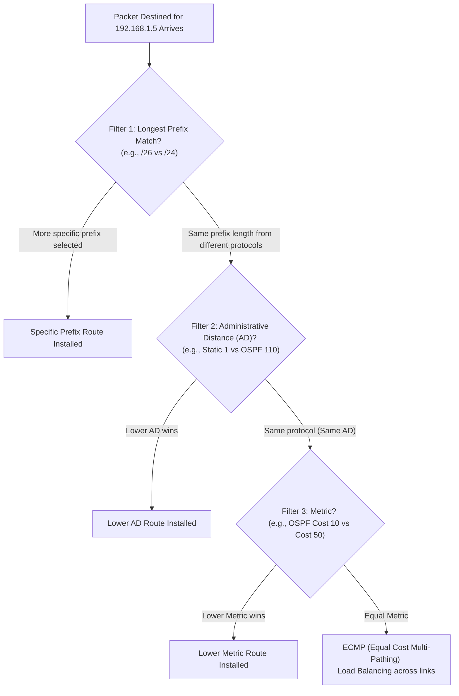
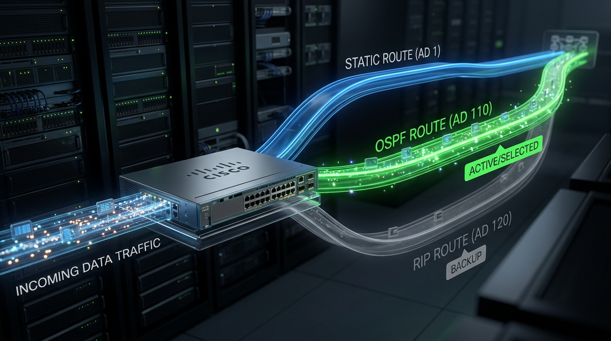
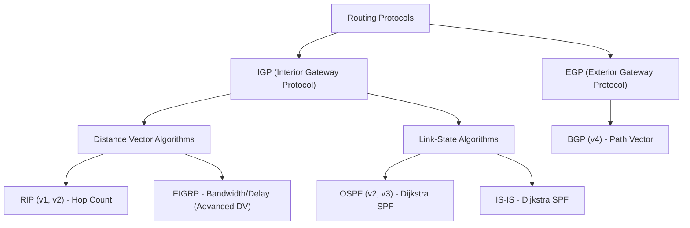

← [[Course on CCNA|Go Back to Course Hub]]

# 🛣️ Day 24: Dynamic Routing Concepts

Welcome to the notes for **Day 24: Dynamic Routing Concepts** of Jeremy's IT Lab CCNA Complete Course! Aaj hum seekhenge routing protocols ke basics, aur samjhenge ki routers dynamically kaise aapas mein networks ki information share karte hain aur path selection decide karte hain. Ye pure notes Hinglish language aur English/Latin script mein detailed explanations, real-world analogies, premium diagrams, aur CLI structures ke sath hain.

---

## 🧭 1. Static Routing vs. Dynamic Routing

Abhi tak humne static routing ke baare mein seekha jahan administrator ko manually har ek route switch/router par entry karni padti thi. Dynamic routing is process ko completely automate kar deta hai:

*   **Static Routing:**
    *   **Manual Config:** Admin manually router par routes add karta hai.
    *   **No Auto-Redundancy:** Agar koi cable cut ho jaye, toh static route automatically backup route par failover nahi kar sakta jab tak admin use physically change na kare.
    *   **Scalability Issue:** Chote networks ke liye theek hai, par agar network mein 100+ routers hain toh static routes configure karna impossible ho jata hai.
*   **Dynamic Routing:**
    *   **Automatic Learning:** Routers aapas mein **Routing Protocols** use karke network prefixes share karte hain.
    *   **Dynamic Recovery:** Agar koi link fail hota hai, toh routing protocol instantly alternative path seekh kar routing table update kar deta hai.
    *   **Scalable:** Ye hazaron routers ke network par bhi aasani se scale ho jata hai.

### 💡 Real-world Analogy (Udaharan):
*   **Static Routing (Manual Map):** Aap ek purana printed paper map lekar gaadi chala rahe hain. Agar aage highway par block milta hai, toh map khud nahi badlega. Aapko rasta badalne ke liye khud dimaag lagana padega ya naya map kharidna padega.
*   **Dynamic Routing (Google Maps):** Aap Google Maps/Waze ka use kar rahe hain. Google Maps dynamic routing protocol ki tarah real-time data exchange karta hai. Jaise hi aage heavy traffic ya accident hota hai, Google Maps instantly aapko doosra alternative green route suggest kar deta hai.

---

## 🏷️ 2. Route Selection Criteria (The Core of Routing)

Jab ek router ko alag-alag sources se ek hi destination ke liye routes milte hain, toh router **best path** select karne ke liye three filtering filters use karta hai. In filters ka hierarchy standard hai aur ye sequence mein evaluation karte hain:



---

### Filter 1: Longest Prefix Match (Sabse Pehle Apply Hota Hai)
Router hamesha us route ko select karega jiska **Subnet Mask sabse specific (sabse lamba / longest prefix)** hai. Ye rule Administrative Distance aur Metric dono ko override kar deta hai!

*   **Example Scenario:**
    *   Packet Destination IP: `192.168.1.5`
    *   Routing Table has:
        1.  `192.168.1.0/24` (Learned via Connected - AD 0)
        2.  `192.168.1.0/26` (Learned via RIP - AD 120)
    *   **Winner:** Router **`192.168.1.0/26`** select karega kyunki `/26` target address ke network portions ko ziyada precisely matches karta hai, bhale hi RIP ka AD 120 static/connected se bahut high hai.

---

### Filter 2: Administrative Distance (AD)
Agar route target prefix length **exact same** ho, lekin unhe **alag-alag routing sources (protocols)** se seekha gaya ho, toh router lowest **Administrative Distance (AD)** wale route ko trust karta hai. AD router ke source ki reliability/trustworthiness ko represent karta hai.



#### Cisco Default AD Values (ccna exam ke liye ratna zaroori hai!):

| Routing Source / Protocol | Default AD Value | Reliability Status |
| :--- | :--- | :--- |
| **Directly Connected** | **0** | Sabse zyada trusted (physical connection) |
| **Static Route** | **1** | Highly trusted (admin entry) |
| **EIGRP Summary Route** | **5** | Dynamic aggregated route |
| **External BGP (eBGP)** | **20** | Between different Autonomous Systems |
| **Internal EIGRP** | **90** | Cisco private dynamic protocol |
| **OSPF** | **110** | Popular open standard link-state protocol |
| **IS-IS** | **115** | Link-state standard protocol |
| **RIP** | **120** | Distance vector legacy protocol |
| **External EIGRP** | **170** | External redistributed routes |
| **Internal BGP (iBGP)** | **200** | Inside same Autonomous System |
| **Unusable / Unknown** | **255** | Router is route ko ignore/drop kar dega |

---

### Filter 3: Metric (Last Filter)
Agar exact same prefix aur same routing protocol (same AD) ho, toh router lowest **Metric** wale route ko select karta hai. Metric protocol-specific path calculation cost hoti hai:
*   **RIP Metric:** Hop count (maximum 15 hops, 16 is unreachable).
*   **OSPF Metric:** Cost (directly proportional to interface bandwidth: `100 Mbps / Bandwidth`).
*   **EIGRP Metric:** Composite metric (Formula uses Bandwidth and Delay parameters).

#### Equal-Cost Multi-Pathing (ECMP):
Agar router ko exact same prefix, same AD aur same Metric wale multiple paths milte hain, toh router un saare routes ko routing table mein install kar deta hai. Router traffic ko dono paths par split kar deta hai, jise **ECMP (Load Balancing)** kehte hain.

---

## 🗂️ 3. Classification of Routing Protocols

Routing protocols ko unke operations, boundary boundaries aur algorithms ke base par classify kiya jata hai:



### A. IGP vs. EGP:
*   **Interior Gateway Protocol (IGP):** Ek single **Autonomous System (AS)** (jaise ek company, bank, ya university network) ke andar routes exchange karne ke liye use hota hai. Examples: RIP, OSPF, EIGRP, IS-IS.
*   **Exterior Gateway Protocol (EGP):** Alag-alag Autonomous Systems ke beech routing karne ke liye use hota hai (jaise pure Internet backbone par traffic route karna). Example: **BGP (Border Gateway Protocol)**.

---

### B. Distance Vector vs. Link-State:
*   **Distance Vector Protocols:**
    *   **Routing by Rumor:** Router ko poore network topology ka map nahi pata hota. Woh bas apne immediate neighbor router par trust karta hai (ki destination kis direction 'vector' mein hai aur kitni dur 'distance' hai).
    *   **Updates:** Periodic intervals par poora routing table update neighbor ko send karte hain.
    *   **Examples:** RIP (Hop Count base), EIGRP (Hybrid / Advanced Distance Vector).
*   **Link-State Protocols:**
    *   **Full Topology Map:** Har router pure network map (topology database) ko store karta hai.
    *   **Dijkstra SPF Algorithm:** Har router SPF (Shortest Path First) algorithm run karke pure topology database se best loop-free paths calculate karta hai.
    *   **Updates:** Sirf tabhi update bhejte hain jab network state mein koi change hota hai (event-driven).
    *   **Examples:** OSPF, IS-IS.

---

## 🛠️ 4. Floating Static Route (Backup Routing Concept)

Ek **Floating Static Route** ek standard static route hota hai jise backup ki tarah use karne ke liye default AD se higher AD value par manually set kiya jata hai.

*   **Working Principle:** Maan lijiye dynamic routing protocol OSPF (AD 110) use ho raha hai. Agar hum ek backup static route configure karna chahte hain jo OSPF down hone par hi active ho, toh hum use **AD 120** (RIP ke barabar) ya usse zyada par set kar denge. Jab tak OSPF running hai, lowest AD (110) wala route table mein rahega. OSPF fail hote hi, static route automatic "float" up ho kar routing table mein active ho jayega.

```ios
! Standard Static Route (Default AD = 1)
Switch(config)# ip route 10.10.10.0 255.255.255.0 192.168.1.1

! Floating Static Route (AD set to 120 to backup OSPF with AD 110)
Switch(config)# ip route 10.10.10.0 255.255.255.0 192.168.2.1 120
```

---

## 💻 5. Route Verification in Cisco CLI

Routing table aur path parameters check karne ke liye standard verify commands niche hain:

### A. Full Routing Table Check Karna:
```ios
Router# show ip route
```
*Output snippet:*
```text
Codes: C - connected, S - static, R - RIP, M - mobile, B - BGP
       D - EIGRP, EX - EIGRP external, O - OSPF, IA - OSPF inter area 

Gateway of last resort is not set

      10.0.0.0/24 is subnetted, 2 subnets
C        10.1.1.0 is directly connected, GigabitEthernet0/0
O        10.2.2.0 [110/65] via 192.168.12.2, 00:05:12, GigabitEthernet0/1
S        10.3.3.0 [1/0] via 192.168.13.2
```
> [!NOTE]
> *   `O 10.2.2.0 [110/65]`: Isme `O` ka matlab route **OSPF** se learned hai, `110` interface standard **Administrative Distance** hai aur `65` is path ka calculated **Metric** (Cost) hai.
> *   `S 10.3.3.0 [1/0]`: Isme `S` ka matlab **Static** route hai jiska AD `1` aur Metric `0` hai.

### B. Specific IP Destination Route Query:
Router ke pass specific path lookup dekhne ke liye command:
```ios
Router# show ip route 192.168.1.5
```
*Isko use karke router directly show kar deta hai ki target address kis routing protocol aur network range ke through matching path select kar raha hai.*

---

## 📝 6. CCNA Day 24 Practice Questions

Practice questions ke answers toggle sections par click karke cross-verify karein:

1. **Q1: Router path selection process mein sabse pehla filter kaun sa check hota hai, jo AD aur Metric dono ko ignore kar deta hai?**
   <details>
   <summary>🔓 Click to Reveal Answer</summary>
   **Answer:** **Longest Prefix Match** (Subnet mask length jo sabse specific/long ho, e.g., `/26` is preferred over `/24`).
   </details>

2. **Q2: Dynamic Routing protocols mein 'Administrative Distance' (AD) parameter kis cheez ko represent karta hai?**
   <details>
   <summary>🔓 Click to Reveal Answer</summary>
   **Answer:** Dynamic source ya protocol ki **Trustworthiness / Reliability** ko scale `0` (most trusted) se `255` (untrusted) ke beech represent karta hai.
   </details>

3. **Q3: OSPF dynamic routing protocol aur standard Static Route ki default Administrative Distance values kya hoti hain?**
   <details>
   <summary>🔓 Click to Reveal Answer</summary>
   **Answer:** OSPF ka default AD **`110`** hota hai, aur Static Route ka default AD **`1`** hota hai.
   </details>

4. **Q4: Agar router ko RIP (AD 120) aur EIGRP (AD 90) dono se exact same IP range `172.16.1.0/24` ka path mile, toh router kis route ko routing table mein entry dega?**
   <details>
   <summary>🔓 Click to Reveal Answer</summary>
   **Answer:** **EIGRP** learned route ko, kyunki EIGRP ka AD (90) RIP ke AD (120) se kam hai.
   </details>

5. **Q5: EIGRP aur RIP routing protocols kis specific category (algorithm type) ke routing standard ke andar fall karte hain?**
   <details>
   <summary>🔓 Click to Reveal Answer</summary>
   **Answer:** **Distance Vector Protocols** category (RIP distance vector hai aur EIGRP advanced distance vector hai).
   </details>

6. **Q6: OSPF routing protocol router calculation ke liye kaun sa standard algorithm run karta hai?**
   <details>
   <summary>🔓 Click to Reveal Answer</summary>
   **Answer:** **Dijkstra SPF (Shortest Path First)** link-state algorithm.
   </details>

7. **Q7: Autonomous Systems (AS) ke boundary lines ke beech dynamic routing links swap karne wale protocol category ko kya kehte hain, aur iska example kya hai?**
   <details>
   <summary>🔓 Click to Reveal Answer</summary>
   **Answer:** **EGP (Exterior Gateway Protocol)**, aur iska standard example **BGP (Border Gateway Protocol)** hai.
   </details>

8. **Q8: Floating Static Route configure karte waqt hum normal static route commands mein extra end specification parameter kya dete hain?**
   <details>
   <summary>🔓 Click to Reveal Answer</summary>
   **Answer:** Default AD se **higher AD number** custom value represent karte hain (e.g. `120` or higher at the end of the route command).
   </details>

9. **Q9: Routing table entries mein `[110/65]` format notation ke case mein `110` aur `65` digits kya denote karte hain?**
   <details>
   <summary>🔓 Click to Reveal Answer</summary>
   **Answer:** `110` is **Administrative Distance** and `65` is **Metric** (OSPF Cost).
   </details>

10. **Q10: `show ip route` command mein `C` aur `S` indicators codes routing details mein kya indicate karte hain?**
    <details>
    <summary>🔓 Click to Reveal Answer</summary>
    **Answer:** `C` denotes **Directly Connected** networks, and `S` denotes **Static Route** entries.
    </details>
