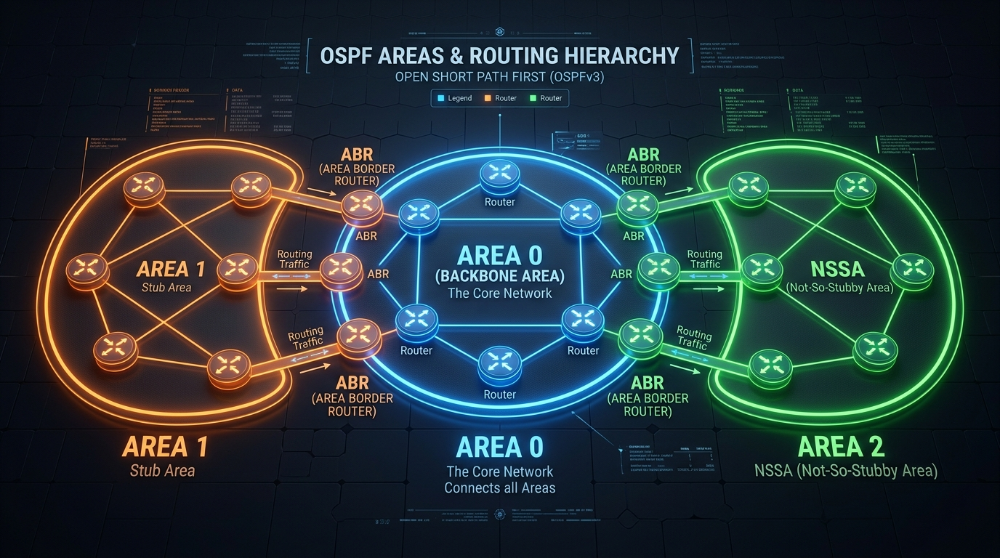

← [[Course on CCNA|Go Back to Course Hub]]

# 🌲 Day 25: OSPF - Part 1 (Fundamentals & Configuration)

Welcome to the notes for **Day 25: OSPF - Part 1 (Open Shortest Path First)** of Jeremy's IT Lab CCNA Complete Course! Aaj se hum CCNA ke sabse important aur highly tested dynamic routing protocol **OSPF** ko bilkul scratch se seekhna shuru karenge. Ye notes Hinglish language aur English/Latin script mein detailed explanations, real-world analogies, premium diagrams, aur CLI commands ke sath hain.

---

## 🌐 1. Link-State Routing Protocol Basics

OSPF ek **Link-State Routing Protocol** hai. Jaise humne Day 24 mein dekha tha, distance vector protocols ki tarah OSPF "routing by rumor" par kaam nahi karta. 

*   **Link-State working style:**
    1.  **LSA (Link State Advertisement):** Har router apne directly connected links ki state (IP address, subnet mask, bandwidth, status) ko LSA packets ke zariye advertise karta hai.
    2.  **LSA Flooding:** Ye LSAs pure area mein saare routers ko flood kiye jate hain.
    3.  **LSDB (Link State Database):** Saare routers in LSAs ko collect karke ek database banate hain jise LSDB kehte hain. Sabhi routers ka LSDB exact identical (same) hota hai.
    4.  **Dijkstra SPF Algorithm:** Har router apne local database (LSDB) par Dijkstra algorithm run karke khud ko root mankar lowest cost paths ka ek tree banata hai, aur best paths ko **Routing Table** mein install kar deta hai.

### 💡 Real-world Analogy (Udaharan):
*   **Distance Vector (Rumor based):** Aap kisi se rasta puch rahe hain aur woh aapse kehta hai, "Aage se right lo, 2 km baad market aayega." Aapko nahi pata ki rasta kaisa hai ya aage kya hai, aap bas uske bataye vector (direction) par chal rahe hain.
*   **Link-State (Map based):** Aapke haath mein poore sehar ka ek exact dynamic digital HD Map (LSDB) hai. Aapko har road, bridge aur link ka exact status pata hai. Aap khud maps par shortest route trace karke gaadi chalate hain.

---

## 🌲 2. OSPF Characteristics & Metric (Cost)

OSPF ke key technical features niche diye gaye hain:

*   **Open Standard:** IEEE standard protocol hai (RFC 2328), jo kisi bhi vendor (Cisco, Juniper, HP) ke hardware par chal sakta hai.
*   **Protocol Number:** OSPF IP header ke Protocol field mein **`89`** number use karta hai (TCP = 6, UDP = 17).
*   **AD (Administrative Distance):** Default AD **`110`** hai.
*   **Metric:** OSPF path preference calculate karne ke liye **Cost** ka use karta hai. Lower Cost is preferred!

### A. Cost Calculation Formula:
$$\text{Cost} = \frac{\text{Reference Bandwidth}}{\text{Interface Bandwidth}}$$

*   **Default Reference Bandwidth:** Cisco IOS par standard reference bandwidth **`100 Mbps` ($10^8$ bps)** set hoti hai.
*   **Cost Rounding Rule:** Cost calculation fractional nahi ho sakti, ise hamesha nearest whole number par round up kiya jata hai. Cost ki minimum value hamesha **1** hoti hai (1 se kam nahi ho sakti).

#### Default Cisco Cost Chart:
*   **Ethernet (10 Mbps):** $100 / 10 = $ **Cost 10**
*   **FastEthernet (100 Mbps):** $100 / 100 = $ **Cost 1**
*   **GigabitEthernet (1 Gbps / 1000 Mbps):** $100 / 1000 = 0.1 \rightarrow$ **Cost 1** (Rounded up to 1)
*   **10-GigabitEthernet (10 Gbps):** $100 / 10000 = 0.01 \rightarrow$ **Cost 1** (Rounded up to 1)

> [!WARNING]
> **Reference Bandwidth Mismatch Problem:**
> Kyunki formula cost minimum value को 1 par limit kar deta hai, isliye OSPF by default FastEthernet (100M), Gigabit (1G), aur 10G links ko exact same Cost (1) deta hai. Router ye detect nahi kar payega ki Gigabit link FastEthernet se faster hai!
>
> **Solution:** Hume global configurations mein reference bandwidth ko dynamic range ke liye manually change karna padta hai:
> ```ios
> Router(config-router)# auto-cost reference-bandwidth 1000  ! Sets Ref Bandwidth to 1000 Mbps (1 Gbps)
> ```

---

## 🏛️ 3. OSPF Areas (Multi-Area Hierarchical Design)

Large networks mein agar saare routers ek hi segment mein honge, toh LSDB ka size bahut bada ho jayega aur Dijkstra algorithm run karne mein routers ka CPU/RAM crash ho sakta hai. Isse bachne ke liye OSPF **Areas** concept ka use karta hai:



### OSPF Area Rules:
1.  **Backbone Area (Area 0):** OSPF design mein Area 0 (Backbone Area) primary core zone hota hai. Baki saare areas (Area 1, Area 2, etc.) ko physically ya logically Area 0 se direct connected hona mandatory hai.
2.  **Intra-area Traffic:** Same area ke andar hone wala traffic.
3.  **Inter-area Traffic:** Ek area se dusre area mein jaane wala traffic, jo hamesha Area 0 ke through pass hota hai.
4.  **ABR (Area Border Router):** Wo router jiska kam se kam ek interface Area 0 mein ho aur doosra interface kisi doosre Area (e.g. Area 1) mein ho. ABR areas ke beech route summarizing aur boundary definition ke liye responsible hote hain.

---

## ✉️ 4. OSPF Packet Types

OSPF dynamic neighbor status aur database sharing ke liye **5 Packet Types** use karta hai:

1.  **Hello (Type 1):** Neighbor discover karne, keepalive checks karne aur adjacency parameters check karne ke liye use hota hai. (Multicast Address: `224.0.0.5` on all OSPF routers).
2.  **Database Description (DBD / DD - Type 2):** LSDB ka summary header data. Ek list jo batati hai ki router ke database mein kaun-kaun se LSAs available hain, bina details ke.
3.  **Link State Request (LSR - Type 3):** Agar neighbor ke DBD se pata chale ki hamare pass koi LSA missing hai ya outdated hai, toh detail information mangne ke liye LSR send kiya jata hai.
4.  **Link State Update (LSU - Type 4):** LSR ka reply packet. Iske andar actual requested detailed LSAs contained hote hain.
5.  **Link State Acknowledgment (LSAck - Type 5):** LSU packets milne ke baad confirmations bhejta hai taaki link process reliable rahe.

---

## 🤝 5. OSPF Neighbor States (Transition States)

Do routers ke beech dynamic OSPF adjacency banne ke dauran ports standard **7 Neighbor States** se gujarte hain:

```mermaid
stateDiagram-v2
    [*] --> Down : Interface enabled with OSPF
    Down --> Init : Hello received (Neighbor does not know our ID yet)
    Init --> TwoWay : Bidirectional hello established (Our ID in neighbor's hello)
    Note over TwoWay : DR and BDR Election occurs here on Multi-access networks
    TwoWay --> ExStart : Decide Master/Slave (Using Router IDs)
    ExStart --> Exchange : Exchanging DBD packets (Headers list)
    Exchange --> Loading : Comparing databases and requesting details (LSR / LSU)
    Loading --> Full : Databases identical. Fully converged!
```

1.  **Down:** Port par OSPF activity start nahi hui hai, koi hello packets nahi mile.
2.  **Init:** Router ko neighbor se hello packet mila hai, lekin us hello packet ke neighbor list mein hamara apna Router ID listed nahi hai.
3.  **2-Way:** Bidirectional communication successfully establish ho gayi hai. Dono routers ne ek doosre ke Hello packets mein unke Router IDs dekh liye hain.
    *   *Ethernet segments (Broadcast multi-access) par DR/BDR election isi state mein complete hota hai.*
4.  **ExStart (Exchange Start):** Routers determine karte hain ki master-slave relationship mein kaun master hoga. Higher Router ID wala router master banta hai aur sync sequence numbers start karta hai.
5.  **Exchange:** Routers database description (DBD) packets swap karte hain (Header lists check hoti hain).
6.  **Loading:** Routers lists check karke missing data verify karte hain aur LSR (Link State Request) bhej kar details mangte hain, reply mein LSU (Link State Update) aur LSAck receive karte hain.
7.  **Full:** Complete synchronization done! Dono routers ke database 100% identical hain. Ye OSPF dynamic operation ki normal steady state hai.

---

## 💻 6. Basic OSPF Configuration (Single Area)

Cisco CLI par basic OSPF configuration steps niche diye gaye hain:

### A. OSPF Process Start Karna & Router ID Configure Karna:
```ios
Router-A(config)# router ospf 10                   ! 10 is Process ID (locally significant)
Router-A(config-router)# router-id 1.1.1.1         ! Unique 32-bit identifier
```

> [!IMPORTANT]
> **OSPF Router ID Election Rules:**
> Agar aap Router ID manually configure nahi karte (`router-id` command ke bina), toh router automatically elect karega:
> 1. Sabse pehle, highest active IP address on **Loopback interfaces**.
> 2. Agar loopback nahi hai, toh highest active IP address on **Physical interfaces**.

---

### B. Network Command & Wildcard Mask:
OSPF interfaces ko enable karne aur prefixes advertise karne ke liye `network` command use karta hai. Isme wildcard mask (IP mask subnet ka inverse) use hota hai:

#### Wildcard Mask calculation:
*   Subnet Mask: `255.255.255.0`
*   Inverse Calculation: `255.255.255.255 - 255.255.255.0` = **`0.0.0.255`**

```ios
! Fa0/0 interface range 192.168.12.0/24 ko Area 0 mein activate karein
Router-A(config-router)# network 192.168.12.0 0.0.0.255 area 0
```

---

### C. Passive Interface Option (Security & Optimization):
*   **Purpose:** PCs/LANs ki taraf connected interfaces par OSPF Hello packets behjna useless aur insecure hai.
*   **Solution:** In ports ko passive kar dene se in par OSPF Hello messages block ho jate hain, lekin inka subnet dynamic network databases mein share hota rehta hai.

```ios
Router-A(config-router)# passive-interface gigabitethernet 0/0
```

---

### D. Default Route Originating (Default Information Originate):
Agar is core router ke pass ISP ki taraf static gateway route (`ip route 0.0.0.0...`) configure hai aur aap chahte hain ki network ke baki saare dynamic routers ko automatic default path mil jaye, toh router command:

```ios
Router-A(config-router)# default-information originate
```

---

## 🔍 7. Verification Commands

*   **Routing protocol specifications check karne ke liye:**
    ```ios
    Router# show ip protocols
    ```
*   **OSPF neighbor table aur status details verification:**
    ```ios
    Router# show ip ospf neighbor
    ```
    *Output sample:*
    ```text
    Neighbor ID     Pri   State           Dead Time   Address         Interface
    2.2.2.2           1   FULL/BDR        00:00:34    192.168.12.2    GigabitEthernet0/1
    ```
*   **Detailed OSPF database headers dekhne ke liye:**
    ```ios
    Router# show ip ospf database
    ```

---

## 📝 8. CCNA Day 25 Practice Questions

1. **Q1: OSPF kis specific IP Protocol number ka use IP headers ke under dynamic links ke liye karta hai?**
   <details>
   <summary>🔓 Click to Reveal Answer</summary>
   **Answer:** **`89`** (Protocol field number).
   </details>

2. **Q2: OSPF standard ka default Administrative Distance (AD) value kya hota hai?**
   <details>
   <summary>🔓 Click to Reveal Answer</summary>
   **Answer:** **`110`**.
   </details>

3. **Q3: OSPF route calculations ke metrics standard ko kya kehte hain, aur default Reference Bandwidth parameters kya scale use karte hain?**
   <details>
   <summary>🔓 Click to Reveal Answer</summary>
   **Answer:** Metric ko **Cost** kehte hain aur default reference bandwidth value **`100 Mbps`** ($10^8$ bps) hoti hai.
   </details>

4. **Q4: Cisco routers par OSPF default reference bandwidth config ki wajah se GigabitEthernet (1G) aur 10-Gigabit (10G) interfaces ki costs mein redundancy mismatch problem kaise aati hai?**
   <details>
   <summary>🔓 Click to Reveal Answer</summary>
   **Answer:** Dono ki cost **1** calculated ho kar lock ho jati hai (formula round-up restriction ki wajah se). Isse router fast aur slow link mein differentiate nahi kar pata.
   </details>

5. **Q5: OSPF core backbone area boundary ka standard design designation kya hai, aur ye dynamic zones ke liye kya mandatory condition hold karta hai?**
   <details>
   <summary>🔓 Click to Reveal Answer</summary>
   **Answer:** Backbone Area **Area 0** hai. Mandatory condition hai ki baki saare areas physically ya logically Area 0 se direct connected hone chahiye.
   </details>

6. **Q6: OSPF dynamic routing updates ke packets send karne ke liye standard multicast IP Address kya use karta hai?**
   <details>
   <summary>🔓 Click to Reveal Answer</summary>
   **Answer:** **`224.0.0.5`** multicast address.
   </details>

7. **Q7: Router interface par connected subnets data ko dynamic routers table mein share karna, par us port par OSPF Hello advertisements flow ko completely switch-off karne wale command parameter feature ko kya kehte hain?**
   <details>
   <summary>🔓 Click to Reveal Answer</summary>
   **Answer:** **Passive Interface** (`passive-interface <interface-name>`).
   </details>

8. **Q8: Bidirectional check pass hone ke baad, jab dono routers details check kar lete hain, toh dynamic OSPF neighbor state transition process complete hone par state name kya update hota hai?**
   <details>
   <summary>🔓 Click to Reveal Answer</summary>
   **Answer:** **`2-Way` state** (jahan DR/BDR election bhi sequence select karta hai).
   </details>

9. **Q9: Router standard interface subnet range `/24` (Subnet mask `255.255.255.0`) ke liye correct Wildcard Mask parameters kya calculate honge?**
   <details>
   <summary>🔓 Click to Reveal Answer</summary>
   **Answer:** **`0.0.0.255`** (Inverse value).
   </details>

10. **Q10: OSPF protocol process configuration start karne aur router manual ID setup block specify karne ke command lines hierarchy kya hogi?**
    <details>
    <summary>🔓 Click to Reveal Answer</summary>
    **Answer:** Global mode mein `router ospf <process-id>` and then sub-mode config line: `router-id <ip-address>`.
    </details>
