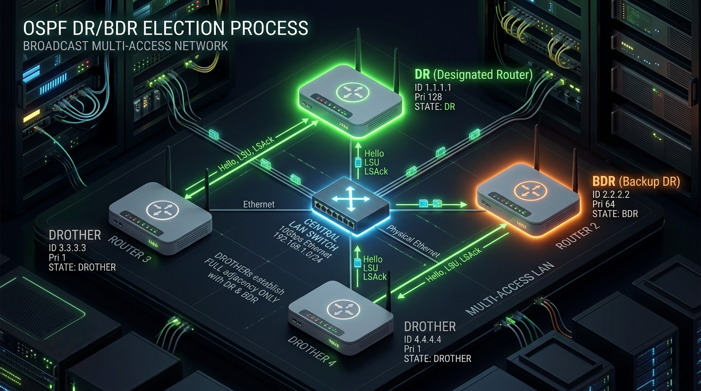

← [[Course on CCNA|Go Back to Course Hub]]

# 🌲 Day 26: OSPF - Part 2 (Network Types & DR/BDR Election)

Welcome to the notes for **Day 26: OSPF - Part 2** of Jeremy's IT Lab CCNA Complete Course! Aaj hum seekhenge OSPF ke advanced behaviours jaise Loopback interfaces, OSPF Network Types (Broadcast vs. Point-to-Point), aur multi-access networks mein network overheads ko control karne ke liye **DR (Designated Router) & BDR (Backup Designated Router) Election** kaise hota hai. Ye pure lecture notes Hinglish language aur English/Latin script mein detailed explanations, analogies, diagrams, aur CLI commands ke sath hain.

---

## 🔄 1. Loopback Interfaces in OSPF

Ek **Loopback Interface** ek virtual software-defined interface hota hai jo router ke andar internally exist karta hai. Ye kabhi physically down nahi ho sakta jab tak router khud power off na ho jaye ya admin use manually shut down na kare.

### Loopback Interfaces ka Use Case:
1.  **OSPF Router ID Stability:** Loopback interfaces ka IP address highly stable hota hai. Agar aapne manual Router ID set nahi kiya hai, toh router loopback IP ko prefer karega. Kyunki physical links down ho sakte hain, par loopback down nahi hoga, isliye Router ID stability bani rehti hai.
2.  **Testing & Management:** Ping check karne aur management access (Telnet/SSH) ke liye interfaces stimulate karne mein use hota hai.

```ios
! Loopback interface create aur configure karna:
Router(config)# interface loopback 0
Router(config-if)# ip address 10.1.1.1 255.255.255.0
```

### OSPF Loopback Advertisement Behavior (/32 Route):
> [!IMPORTANT]
> **The Loopback Host Route Rule:**
> By default, OSPF loopback interface ko ek **`/32` Host Route** (Single IP route, mask `255.255.255.255`) ki tarah advertise karta hai, bhale hi aapne use `/24` (`255.255.255.0`) configure kiya ho!
>
> **Reason:** OSPF loopback ko ek virtual end-host boundary ki tarah treat karta hai jisme aage koi sub-network connected nahi hai.
>
> **How to fix (Advertise Actual Subnet):**
> Agar aap chahte hain ki loopback link uske actual configured mask (e.g. `/24`) ke sath network par advertise ho, toh aapko loopback interface mode mein jaakar OSPF network type manual override karna hoga:
> ```ios
> Router(config)# interface loopback 0
> Router(config-if)# ip ospf network point-to-point   ! Forces OSPF to advertise the actual configured subnet mask
> ```

---

## 🔌 2. OSPF Network Types

OSPF link properties aur physical connections ke standard behavior ke base par teen key network types use karta hai:

### A. Point-to-Point (P2P) Network Type:
*   **Physical Setup:** Direct do routers ke beech hone wala serial link ya single Ethernet crossover cable link.
*   **DR/BDR Election:** **NO**. Kyunki segment par sirf 2 hi routers hain, isliye loops ka koi risk nahi hai aur na hi multi-access management ki zaroori hai. Dono routers direct full adjacency form kar lete hain.
*   **OSPF Timers:** Default Hello = **10 seconds**, Dead = **40 seconds** (Hello * 4).

### B. Broadcast Network Type:
*   **Physical Setup:** Routers jab kisi central LAN Switch ya Hub ke zariye connect hote hain (Ethernet interfaces by default broadcast mode use karte hain).
*   **DR/BDR Election:** **YES**. Segment par multiple routers ho sakte hain, isliye collision aur excessive adjacencies ko control karne ke liye election hota hai.
*   **OSPF Timers:** Default Hello = **10 seconds**, Dead = **40 seconds**.

### C. Loopback Network Type:
*   **Physical Setup:** Virtual loopback ports.
*   **DR/BDR Election:** No.
*   **Behavior:** Default `/32` subnet advertisement.

---

## 👑 3. OSPF DR & BDR Election (Multi-Access Networks)

Agar ek single Broadcast segment (jaise LAN Switch) par $N$ number of routers connected hain, aur sabhi aapas mein 1-to-1 dynamic connections (adjacencies) form karein, toh total adjacencies ka formula hota hai:

$$\text{Adjacencies} = \frac{N(N-1)}{2}$$

*   **Problem:** Agar 10 routers hain, toh total **45 adjacencies** banengi! Har router har doosre router ko LSAs flood karega jisse network redundant packets se fill ho jayega aur router resources choke ho jayenge.
*   **Solution:** OSPF is problem ko solve karne ke liye segment par ek **DR (Designated Router)** aur ek **BDR (Backup Designated Router)** elect karta hai.



### Working Logic of DR/BDR:
1.  **DROTHERs:** DR aur BDR ke alawa baki saare switches/routers ko **DROTHER** kaha jata hai.
2.  **Adjacency Rule:** DROTHERs aapas mein kabhi full adjacency (FULL state) form nahi karte. Wo sirf **2-Way state** mein rehte hain.
3.  **Central Communication:** DROTHERs apna routing updates (LSUs) sirf DR aur BDR ko send karte hain. DR in updates ko collect karke baki saare DROTHERs ko aggregate flood karta hai.
4.  **Multicast Addresses:**
    *   `224.0.0.6` (All DR/BDR routers): DROTHERs apne updates is IP par multicast karte hain (Sirf DR aur BDR ise listen karte hain).
    *   `224.0.0.5` (All OSPF routers): DR updates ko is IP par reflect/flood karta hai taaki saare routers updates receive kar sakein.

---

### A. How DR/BDR Election Happens (The Rules):
Election 2-Way state transition ke dauran niche diye gaye parameters ke order par hota hai:

#### Rule 1: Highest Interface Priority wins!
*   Default OSPF interface priority **`1`** hoti hai (range: `0` se `255`).
*   Highest priority value wala router **DR** banta hai, aur second-highest **BDR** banta hai.
*   **Ineligible Rule (Priority 0):** Agar aap kisi interface par priority **`0`** set kar dete hain, toh woh router kabhi bhi us segment par DR ya BDR election mein **part nahi le sakta (ineligible)**. Woh hamesha DROTHER rahega.

#### Rule 2: Highest Router ID wins (Tie-Breaker)!
*   Agar interface priority exact match ho (jaise default '1' sabhi par ho), toh highest manual/automatic **Router ID** wala router DR ban jata hai, aur second-highest BDR.

---

### B. Important Election Behaviors:

> [!CAUTION]
> **Election is Non-Preemptive:**
> OSPF DR/BDR election dynamic aur non-preemptive hota hai. 
> Maan lijiye network par election ho chuka hai. Agar ab koi naya router jiska Router ID ya Priority current DR se bahut zyada high hai network par connect hota hai, toh woh dynamic DR role ko **take-over (preempt) nahi kar sakta**. 
> Current DR tabhi badlega jab:
> 1. Current DR process manually clear kiya jaye (`clear ip ospf process`).
> 2. Current DR switch/router restart ya interface down ho jaye.

---

## 💻 4. Cisco CLI Configuration & Verification

### A. Interface Priority and Network Type Change:
GigabitEthernet 0/1 interface ko OSPF Priority 128 par set karna aur Network Type manually customize karna:

```ios
Router-A(config)# interface gigabitethernet 0/1
Router-A(config-if)# ip ospf priority 128            ! Sets Priority to 128 (Makes it likely to win DR)
Router-A(config-if)# ip ospf network point-to-point   ! Changes interface type to Point-to-Point (Bypasses DR election)
```

---

### B. Verify Commands:

#### 1. Interface OSPF details verify karna:
```ios
Router# show ip ospf interface gigabitethernet 0/1
```
*Output snippet:*
```text
GigabitEthernet0/1 is up, line protocol is up
  Internet Address 192.168.1.1/24, Area 0, Attached via Network Statement
  Process ID 10, Router ID 1.1.1.1, Network Type BROADCAST, Cost: 1
  Topology-MTID Cost Disabled Shutdown Topology Name
        0      1     no      no      Base
  Transmit Delay is 1 sec, State DR, Priority 128
  Designated Router (ID) 1.1.1.1, Interface address 192.168.1.1
  Backup Designated Router (ID) 2.2.2.2, Interface address 192.168.1.2
```
> [!TIP]
> *   `Network Type BROADCAST` verify karta hai ki default interface ethernet mode broadcast chal raha hai.
> *   `State DR, Priority 128` verify karta hai ki is interface ne DR position win ki hai.

#### 2. Neighbor States cross-verify karna:
```ios
Router# show ip ospf neighbor
```
*Output sample:*
```text
Neighbor ID     Pri   State           Dead Time   Address         Interface
2.2.2.2           1   FULL/BDR        00:00:36    192.168.1.2     GigabitEthernet0/1
3.3.3.3           1   2WAY/DROTHER    00:00:32    192.168.1.3     GigabitEthernet0/1
```
> [!NOTE]
> *   `FULL/BDR` means router ka neighbor ke sath complete sync database (**FULL**) hai aur neighbor switch **BDR** hai.
> *   `2WAY/DROTHER` means router neighbor ke sath bidirectional hello (**2-Way**) mein hai par data exchange locked hai, kyunki neighbor ek **DROTHER** (non-DR/BDR) hai.

---

## 📝 5. CCNA Day 26 Practice Questions

1. **Q1: OSPF virtual Loopback interfaces par by default kis standard routing mask length (/prefix) ko advertise karta hai?**
   <details>
   <summary>🔓 Click to Reveal Answer</summary>
   **Answer:** **`/32` Host Route** (`255.255.255.255`) advertise karta hai.
   </details>

2. **Q2: Loopback interface par OSPF host route behavior (/32) ko overwrite karke actual configured subnet (e.g. /24) advertise karne ke liye interface par kaun si command chalayi jaati hai?**
   <details>
   <summary>🔓 Click to Reveal Answer</summary>
   **Answer:** Loopback interface configuration mode mein **`ip ospf network point-to-point`** command.
   </details>

3. **Q3: OSPF Point-to-Point network type par kya DR/BDR election perform hota hai?**
   <details>
   <summary>🔓 Click to Reveal Answer</summary>
   **Answer:** **Nahi**, Point-to-Point links par direct full adjacencies banti hain, koi election nahi hota.
   </details>

4. **Q4: Broadcast network type links (Ethernet) par default OSPF Hello timer aur Dead timer values kya hoti hain?**
   <details>
   <summary>🔓 Click to Reveal Answer</summary>
   **Answer:** Hello timer **10 seconds** aur Dead timer **40 seconds** (Hello * 4).
   </details>

5. **Q5: OSPF broadcast multi-access segment par DR (Designated Router) kis primary reason se elect karta hai?**
   <details>
   <summary>🔓 Click to Reveal Answer</summary>
   **Answer:** Multi-access segment par dynamic adjacencies aur dynamic LSA flooding overhead ko scale/reduce karne ke liye (Adjacency count reduction).
   </details>

6. **Q6: DROTHER routers aapas mein kis specific OSPF neighbor state transition level par permanently locked rehte hain?**
   <details>
   <summary>🔓 Click to Reveal Answer</summary>
   **Answer:** **`2-Way` State** par.
   </details>

7. **Q7: DROTHER routers aapas mein updates exchange karne ke liye dynamic link updates kis dynamic Multicast IP Address par send karte hain?**
   <details>
   <summary>🔓 Click to Reveal Answer</summary>
   **Answer:** **`224.0.0.6`** IP address par (jo sirf DR/BDR listen karte hain). DR use collect karke `224.0.0.5` par reflect karta hai.
   </details>

8. **Q8: DR/BDR Election parameters mein sub-interface configuration level par priority range kya scale support karta hai, aur default priority value kya hoti hai?**
   <details>
   <summary>🔓 Click to Reveal Answer</summary>
   **Answer:** Priority range **`0 - 255`** hoti hai, aur default value **`1`** hoti hai.
   </details>

9. **Q9: OSPF Broadcast segment configuration mein agar kisi specific interface ka priority parameters `0` configure ho, toh is router ka election status kya hoga?**
   <details>
   <summary>🔓 Click to Reveal Answer</summary>
   **Answer:** Woh router kabhi bhi DR/BDR election mein part nahi le sakega aur hamesha **DROTHER** state mein rahega (Ineligible).
   </details>

10. **Q10: OSPF DR/BDR election non-preemptive kyun hota hai, aur iska kya matlab hai?**
    <details>
    <summary>🔓 Click to Reveal Answer</summary>
    **Answer:** Iska matlab hai ki agar ek baar DR select ho jaye, toh baad mein high priority/ID wala router connect hone par bhi DR tab tak change nahi hoga jab tak current DR process restart na ho ya router power down na ho. Ye link stability ke liye design kiya gaya hai.
    </details>
