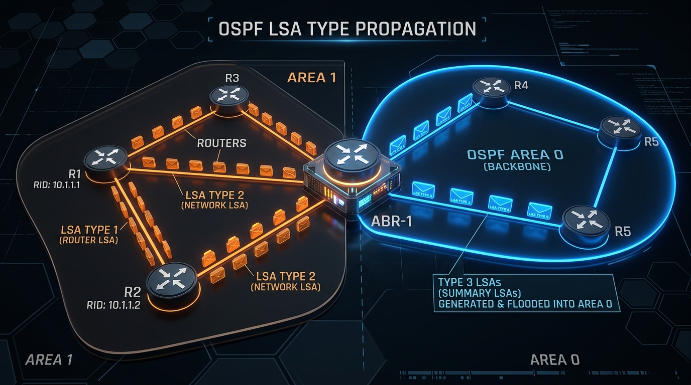

← [[Course on CCNA|Go Back to Course Hub]]

# 🌲 Day 27: OSPF - Part 3 (Adjacency Requirements & LSA Types)

Welcome to the notes for **Day 27: OSPF - Part 3** of Jeremy's IT Lab CCNA Complete Course! Aaj hum OSPF section ko wrap-up karenge aur OSPF troubleshooting ke sabse crucial topic **Adjacency Requirements** (Kaun-kaun si settings match hona zaroori hai neighbor banne ke liye) aur **LSA Types** (Link State Advertisements) ko deep detail mein premium illustrations ke sath cover karenge. Ye notes Hinglish language aur English/Latin script mein hain.

---

## 🛑 1. OSPF Neighbor Adjacency Requirements

Do routers aapas mein tabhi neighbor ban sakte hain aur dynamic routing database synchronize kar sakte hain jab unke connecting interfaces par **niche likhi settings 100% exact match** karti hon. Agar inme se ek bhi parameters mein mismatch hai, toh adjacency fail ho jayegi:

1.  **Area ID Match:**
    *   Dono routers ke connecting interfaces ka OSPF Area ID exact same hona chahiye (e.g., Dono area 0 mein ho, ya dono area 1 mein).
2.  **Subnet Match:**
    *   Connecting interfaces ka IP address exact **same subnet** range mein hona chahiye. Agar IP and Subnet mask mismatched hain, toh OSPF packets process nahi honge.
3.  **Hello & Dead Timers Match:**
    *   OSPF Hello interval (default 10s on Ethernet) aur Dead interval (default 40s) dono sides par identical set hone chahiye.
4.  **Authentication Settings Match:**
    *   Agar aapne OSPF par authentication security configure ki hai, toh type (Cleartext ya MD5) aur key-password dono sides par same hone chahiye.
5.  **Stub Area Flag Match:**
    *   Hello packets mein ek 'E-bit' (Stub option) hota hai. Agar ek router area ko stub treat karta hai aur doosra normal, toh adjacency form nahi hogi.
6.  **Unique Router ID:**
    *   Dono routers ke OSPF Router IDs unique hone chahiye. Agar duplicate Router IDs honge, toh routers neighbor status init/2-way par lock kar denge aur database sync nahi hoga.
7.  **IP MTU Size (Maximum Transmission Unit):**
    *   IP MTU size standard Ethernet par **1500 bytes** hota hai. Dono connecting interfaces par MTU exact same hona chahiye.

> [!WARNING]
> **MTU Mismatch stuck in EXSTART/EXCHANGE:**
> Agar MTU mismatched hai (Jaise Router-1 interface MTU 1500 hai aur Router-2 MTU 1400 hai), toh Hello packets swap ho jayenge (dono 2-Way state mein chale jayenge). Lekin jab dynamic database exchange (DBD packets) start hoga, toh large size DBD packets exchange nahi ho payenge.
> **Result:** OSPF neighbor relationship permanently **`EXSTART`** ya **`EXCHANGE`** state par stuck ho jayegi!
>
> **How to bypass (if necessary):**
> Interface configuration par command:
> ```ios
> Router(config-if)# ip ospf mtu-ignore            ! Ignores MTU size checking during database exchange
> ```

---

## ✉️ 2. OSPF LSA Types (Link-State Advertisements)

OSPF database (LSDB) poore network topology ko describe karne ke liye alag-alag **LSA Types** use karta hai. CCNA exam ke liye hume in **5 Key LSA Types** ko samajhna mandatory hai:



### 📊 LSA Types Summary:

| LSA Type | Standard Name | Generated By | Flooding Range (Kahan tak jaata hai?) | Content (Isme kya hota hai?) |
| :--- | :--- | :--- | :--- | :--- |
| **Type 1** | **Router LSA** | **Every Router** | Local Area ke andar hi flood hota hai (Area boundary cross nahi karta). | Router ke interfaces, IPs aur unke link state/costs ki list. |
| **Type 2** | **Network LSA** | **DR (Designated Router)** | Local Area ke segment ke andar hi flood hota hai. | Multi-access segment (e.g. switch LAN) par connected routers ki list. |
| **Type 3** | **Summary LSA** | **ABR (Area Border Router)** | Ek area se cross hokar dusre areas (Inter-area) mein flood hota hai. | Dusre areas ke networks/prefixes ki summaries (Cost details ke sath). |
| **Type 4** | **ASBR Summary LSA** | **ABR** | Poore OSPF domain mein boundary areas tak flood hota hai. | **ASBR** router tak pahunchne ka cost aur location route. |
| **Type 5** | **AS External LSA** | **ASBR (AS Boundary Router)** | Poore OSPF domain (external area) mein flood hota hai. | External networks jo OSPF mein redistribute kiye gaye hain (e.g. RIP or BGP routes). |

---

### A. Deep Dive: Type 1, 2, aur 3 LSAs (Core CCNA):

1.  **Type 1 (Router LSA):**
    *   Har ek active OSPF router ise banata hai.
    *   Router batata hai, "Main Router R1 hoon, mere pass Fa0/1 IP 10.1.1.1 aur Cost 1 hai."
    *   **Rule:** Ye LSA local area ke bahar nahi ja sakta. Area Border Router (ABR) ise drop kar deta hai.
2.  **Type 2 (Network LSA):**
    *   Sirf dynamic broadcast networks par jahan DR elect hota hai, wahan **DR** ise generate karta hai.
    *   DR batata hai, "Main is multi-access segment ka DR network segment `192.168.1.0/24` hoon, aur mujhse R1, R2, R3 connected hain."
    *   **Rule:** Ye bhi local area ke andar hi flood hota hai.
3.  **Type 3 (Summary LSA):**
    *   Jab Type 1 aur Type 2 LSAs area boundary (ABR) par pahunchte hain, toh **ABR** unhe analyze karke ek summarized route table list banata hai jise **Type 3 LSA** kehte hain.
    *   ABR batata hai, "Area 1 ke logo, Area 0 mein network range `10.2.2.0/24` exist karta hai aur mujhse cost 10 par reachable hai."
    *   **Rule:** Ye area boundary cross karke doosre areas mein propagate hota hai.

---

## 💻 3. OSPF Verification & Troubleshooting

OSPF neighbor connectivity aur database check karne ke liye niche likhi commands use ki jati hain:

### A. Dynamic Database LSA Check:
Database structures aur specific LSA details check karne ki command:
```ios
Router# show ip ospf database
```
*Output snippet:*
```text
            OSPF Router with ID (1.1.1.1) (Process ID 10)

                Router Link States (Area 0)                 ! (Type 1 LSAs)
Link ID         ADV Router      Age         Seq#       Checksum Link count
1.1.1.1         1.1.1.1         243         0x80000002 0x00A1B2 2
2.2.2.2         2.2.2.2         112         0x80000004 0x00B2C3 1

                Net Link States (Area 0)                    ! (Type 2 LSAs)
Link ID         ADV Router      Age         Seq#       Checksum
192.168.1.1     1.1.1.1         240         0x80000001 0x00C4D5

                Summary Link States (Area 0)                ! (Type 3 LSAs)
Link ID         ADV Router      Age         Seq#       Checksum
10.10.10.0      1.1.1.1         1245        0x80000001 0x00E2F5
```

---

### B. Troubleshooting stuck neighbor states:
Agar adjacency state `FULL` aane ke bajaye stuck ho jaye:
1.  **Stuck in INIT:** Hello configuration mismatch check karein, checks if neighbor is receiving our hellos (Unidirectional link issue).
2.  **Stuck in 2-WAY:** Multi-access segment par priority overrides check karein. Agar saare routers priority 0 hain, toh full adjacency form nahi ho sakti. (DROTHERs aapas mein 2-Way locked rehte hain, check parameters).
3.  **Stuck in EXSTART/EXCHANGE:** IP MTU Size check karein both interfaces par.
    ```ios
    Router# show ip interface gigabitethernet 0/1 | include MTU
    ! Default standard display: MTU is 1500 bytes
    ```

---

## 📝 4. CCNA Day 27 Practice Questions

1. **Q1: OSPF neighbor relationship mein agar database exchange ke dauran status permanently `EXSTART` ya `EXCHANGE` state par stuck ho jaye, toh iska sabse primary reason kya hai?**
   <details>
   <summary>🔓 Click to Reveal Answer</summary>
   **Answer:** Connecting interfaces ke beech **IP MTU Size Mismatch** hona.
   </details>

2. **Q2: Interface level par OSPF MTU check validation bypass karne ke liye Cisco CLI par kaun si command configure ki jaati hai?**
   <details>
   <summary>🔓 Click to Reveal Answer</summary>
   **Answer:** Interface mode mein **`ip ospf mtu-ignore`** command.
   </details>

3. **Q3: OSPF router adjacency setup ke liye Hello timers aur Dead timers ka status mismatch ho toh link behavior kya hoga?**
   <details>
   <summary>🔓 Click to Reveal Answer</summary>
   **Answer:** Routers aapas mein neighbor relationship establish nahi kar payenge, links Down hi rahenge.
   </details>

4. **Q4: Hello packets header mein duplicate Router ID parameter verification detect hone par OSPF state machine kahan par lock ho jaata hai?**
   <details>
   <summary>🔓 Click to Reveal Answer</summary>
   **Answer:** Router neighbor status **`INIT`** ya **`2-Way`** state par stop ho jayega, FULL synchronization nahi hogi.
   </details>

5. **Q5: OSPF database structure mein standard Type 1 LSA (Router LSA) kis router ke zariye generate hota hai aur iska default propagation range kya hai?**
   <details>
   <summary>🔓 Click to Reveal Answer</summary>
   **Answer:** **Every OSPF Router** generate karta hai, aur iska range sirf **local area ke andar** hi limited rehta hai (local area boundary cross nahi karta).
   </details>

6. **Q6: Type 2 LSA (Network LSA) kis dynamic node router interface se generate hota hai, aur ye kahan exchange hota hai?**
   <details>
   <summary>🔓 Click to Reveal Answer</summary>
   **Answer:** Broadcast segment ke **DR (Designated Router)** se generate hota hai aur local area segments ke andar exchange hota hai.
   </details>

7. **Q7: Ek area ke andruni routes details ko summarized karke backbone area 0 ya outside target areas mein transmit karne wale LSA Type ko kya kehte hain, aur ise kaun generate karta hai?**
   <details>
   <summary>🔓 Click to Reveal Answer</summary>
   **Answer:** **Type 3 LSA (Summary LSA)** kehte hain aur ise **ABR (Area Border Router)** generate karta hai.
   </details>

8. **Q8: External routing system prefixes (jaise RIP ya static routes jo redistribute kiye gaye hon) ko advertise karne wale OSPF LSA Type ko kya kehte hain, aur ye kahan se generate hota hai?**
   <details>
   <summary>🔓 Click to Reveal Answer</summary>
   **Answer:** **Type 5 LSA (AS External LSA)** kehte hain aur ise **ASBR (Autonomous System Boundary Router)** generate karta hai.
   </details>

9. **Q9: ABR (Area Border Router) ki location details pure network par identify karne ke liye OSPF database list mein kaun sa specific LSA Type generated show hota hai?**
   <details>
   <summary>🔓 Click to Reveal Answer</summary>
   **Answer:** **Type 4 LSA (ASBR Summary LSA)** (ise ABR router generate karta hai).
   </details>

10. **Q10: OSPF local router database header lists check karne aur LSA summaries verify karne ke liye exact operational CLI verify command kya hai?**
    <details>
    <summary>🔓 Click to Reveal Answer</summary>
    **Answer:** **`show ip ospf database`** command.
    </details>
