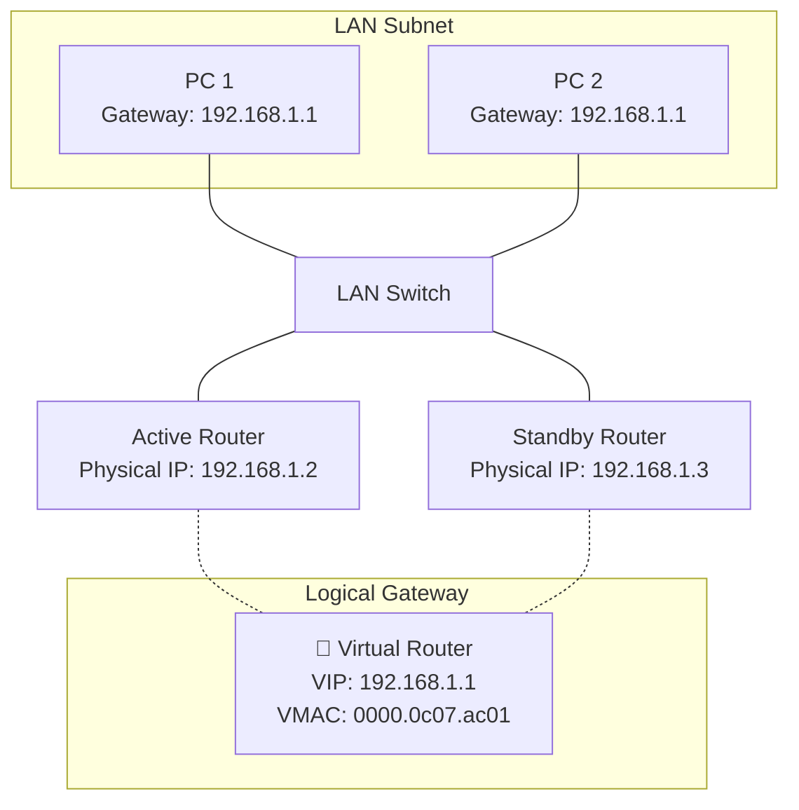
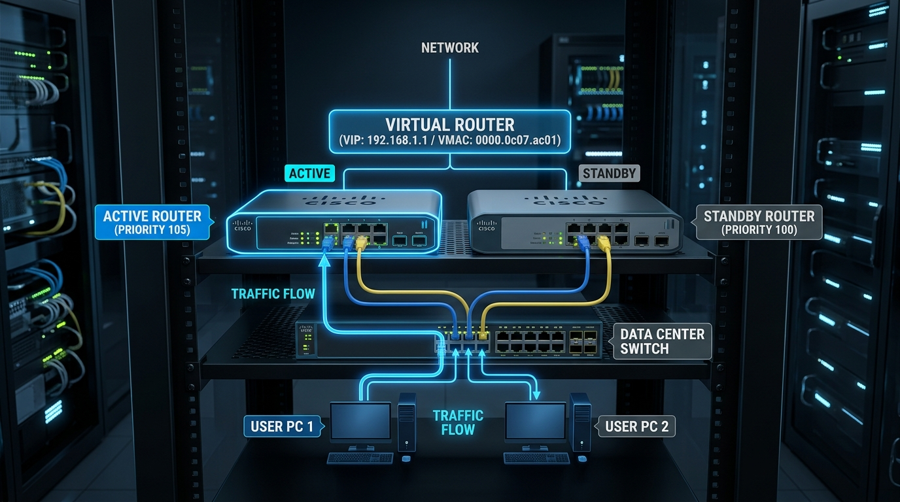

← [[Course on CCNA|Go Back to Course Hub]]

# 🛠️ Day 28: First Hop Redundancy Protocols (FHRP)

Welcome to the notes for **Day 28: First Hop Redundancy Protocols (FHRP)** of Jeremy's IT Lab CCNA Complete Course! Aaj hum seekhenge default gateway redundancy ke baare mein, aur samjhenge ki kaise multiple physical routers ko combine karke ek single virtual router banaya jata hai taaki agar primary gateway down ho jaye, toh LAN hosts ka internet/external traffic bina kisi manual configuration change ke instantly redundant link par shift ho jaye. Ye notes Hinglish language aur English/Latin script mein detailed explanations, analogies, diagrams, aur CLI commands ke sath hain.

---

## 🛑 1. The Default Gateway Redundancy Problem

Enterprise networks mein end hosts (PCs, Servers) external networks se communicate karne ke liye apne local subnet par ek **Default Gateway** config karte hain. Standard designs mein ye gateway router ka IP address hota hai.

*   **The Single Point of Failure:**
    *   Agar LAN par sirf ek hi physical router connected hai aur woh down ho jaye, toh saari external network connectivity crash ho jayegi.
    *   **Manual Backup Issue:** Agar hum network par do physical routers (Router-A aur Router-B) laga bhi dein, toh end PCs ka default gateway parameter manually configure kiya jata hai. Agar Router-A crash ho jaye, toh administrative settings mein jaakar sabhi PCs ka gateway address Router-B par manually change karna padega, jo ki large networks par practical nahi hai.

Is problem ko solve karne ke liye **FHRP (First Hop Redundancy Protocols)** ka use kiya jata hai.

---

## 🌐 2. What is FHRP? (Virtual Gateway Concept)

FHRP multi-router networks par redundancy provide karne ke liye ek **Virtual Default Gateway** create karta hai:

*   **Virtual IP (VIP) & Virtual MAC (VMAC):**
    *   Dono physical routers aapas mein communicate karke ek common **Virtual IP (VIP)** aur **Virtual MAC** share karte hain.
    *   Network administrator end PCs par default gateway address is **Virtual IP** ko set karta hai.
    *   Dono routers mein se ek router active/primary duty sambhalta hai, aur doosra backup/standby state mein rehta hai.
    *   Jab primary router down ho jata hai, toh backup router instantly virtual IP aur virtual MAC ki command hand over le leta hai. PCs ko pata hi nahi chalta ki physical hardware badal chuka hai aur traffic switchover ho jata hai.



---

## 🗂️ 3. OSPF-Style Comparison of FHRP Protocols

CCNA exam ke liye hume teen standard FHRP protocols ke differences aur details samajhna zaroori hai:

| Features | HSRP (Hot Standby Router Protocol) | VRRP (Virtual Router Redundancy Protocol) | GLBP (Gateway Load Balancing Protocol) |
| :--- | :--- | :--- | :--- |
| **Creator / Standard** | Cisco Proprietary (Cisco switches/routers only) | Open Standard (IEEE / RFC 5798 - Multi-vendor support) | Cisco Proprietary (Cisco only) |
| **Active Node Role** | **Active Router** (Forwards traffic) | **Master Router** (Forwards traffic) | **AVG** (Active Virtual Gateway) & **AVF** (Active Virtual Forwarder) |
| **Backup Node Role** | **Standby Router** (Listens/ready) | **Backup Router** (Listens/ready) | Standby AVG / AVF |
| **Preemption** | Disabled by default (Must enable manually) | **Enabled by default** | Disabled by default |
| **Load Balancing** | Cisco multi-group configuration required | Multi-group VRRP configuration required | **Automatic Load Balancing** (Active Active load share) |

---

## 🌲 4. Cisco HSRP (Hot Standby Router Protocol) - Deep Dive

HSRP Cisco networks ka sabse common redundancy protocol hai:



### A. HSRP v1 vs HSRP v2 Comparison:

| Feature | HSRP v1 | HSRP v2 (Recommended) |
| :--- | :--- | :--- |
| **Group Number Range** | `0` to `255` | `0` to `4095` |
| **Virtual MAC Address** | **`0000.0c07.acXX`** (XX = Group ID in Hex) | **`0000.0c9f.fXXX`** (XXX = Group ID in Hex) |
| **Multicast IP Address** | **`224.0.0.2`** (UDP Port 1985) | **`224.0.0.102`** (UDP Port 1985) |
| **IPv6 Support** | No | **Yes** |

*   *Example Virtual MAC calculation:* Agar aapne HSRP v1 group `1` configure kiya hai, toh Virtual MAC hoga `0000.0c07.ac01`. (Group 10 configuration par `0000.0c07.ac0a`).

---

### B. HSRP Active / Standby Election:
Hello packets exchange hone par election parameters evaluate hote hain:
1.  **Highest Priority wins:** Default priority value **`100`** hoti hai (range: `0` to `255`). Jis router ki priority sabse high hogi, woh Active banega.
2.  **Highest IP Address wins:** Priority match hone par tie-breaker ke liye connecting interface ka highest IP address check kiya jata hai.

---

### C. Preemption in HSRP (`standby X preempt`):
HSRP election by default **non-preemptive** hota hai.
*   **The Problem:** Maan lijiye Router-A (Priority 105 - Active) down ho jata hai. Router-B (Priority 100 - Standby) Active ban jata hai. Kuch der baad Router-A reboots hokar up aata hai. Kyunki preemption disabled hai, Router-A high priority hone ke bawajood Standby hi rahega, aur Router-B Active bana rahega.
*   **The Solution:** Hume interfaces par preempt features manually configure karna padta hai:
    ```ios
    Router-A(config-if)# standby 1 preempt           ! Allows higher priority router to instantly reclaim Active state
    ```

---

## 🤖 5. GLBP (Gateway Load Balancing Protocol)
HSRP aur VRRP active-standby model par chalte hain, jisse backup router ka hardware aur links tab tak idle baith kar waste hote hain jab tak active router down na ho jaye.

Cisco ne **GLBP** design kiya jo **gateway redundancy aur active load balancing** dono ek sath handle karta hai:
1.  **AVG (Active Virtual Gateway):** Group mein se ek router AVG elect hota hai. Iska kaam LAN clients ke ARP requests (default gateway queries) ko handle karna hai.
2.  **AVF (Active Virtual Forwarder):** Group ke routers (up to 4 active) dynamic AVFs bante hain. AVG har client ko router redundancy schedule ke base par alag-alag virtual MAC addresses reply karta hai. Isse client-1 ka traffic Router-1 se, client-2 ka traffic Router-2 se, aur client-3 ka traffic Router-3 se active scale ho jata hai.

---

## 💻 6. Cisco CLI HSRP Configuration & Verification

Hum Switch-A aur Switch-B ke GigabitEthernet 0/1 interfaces par HSRP Group 1 (Virtual IP `192.168.1.1`) configure karenge. Switch-A ko primary (Active) banana hai:

```ios
! Switch-A Configuration
Switch-A(config)# interface gigabitethernet 0/1
Switch-A(config-if)# ip address 192.168.1.2 255.255.255.0
Switch-A(config-if)# standby version 2               ! Use HSRP version 2
Switch-A(config-if)# standby 1 ip 192.168.1.1       ! Set Virtual IP (VIP)
Switch-A(config-if)# standby 1 priority 105          ! Priority set higher than default (100)
Switch-A(config-if)# standby 1 preempt              ! Enable Preemption
```

```ios
! Switch-B Configuration
Switch-B(config)# interface gigabitethernet 0/1
Switch-B(config-if)# ip address 192.168.1.3 255.255.255.0
Switch-B(config-if)# standby version 2
Switch-B(config-if)# standby 1 ip 192.168.1.1       ! Set same Virtual IP
Switch-B(config-if)# standby 1 preempt              ! Enable Preemption (Priority default 100 remains)
```

---

### C. Verify Commands:

#### 1. Detailed HSRP status check karne ki command:
```ios
Switch-A# show standby
```
*Output snippet:*
```text
GigabitEthernet0/1 - Group 1 (version 2)
  State is Active
    4 state changes, last state change 00:03:12
  Virtual IP address is 192.168.1.1
  Active virtual MAC address is 0000.0c9f.f001 (local)
  Local virtual MAC address is 0000.0c9f.f001 (v2 default)
  Hello time 3 sec, hold time 10 sec
  Next hello sent in 1.450 secs
  Preemption enabled
  Active router is local
  Standby router is 192.168.1.3, priority 100 (expires in 8.232 sec)
  Priority 105 (configured 105)
```

#### 2. Short and quick status check karne ki command:
```ios
Switch-A# show standby brief
```
*Output sample:*
```text
                     P indicates configured to preempt.
                     |
Interface   Grp  Version  P State    Active          Standby         Virtual IP
Gi0/1       1    v2       P Active   local           192.168.1.3     192.168.1.1
```

---

## 📝 7. CCNA Day 28 Practice Questions

1. **Q1: FHRP (First Hop Redundancy Protocols) technology networks ke kis specific area par redundancy provide karti hai?**
   <details>
   <summary>🔓 Click to Reveal Answer</summary>
   **Answer:** LAN end hosts ke **Default Gateway** redirection level par (First Hop redundancy).
   </details>

2. **Q2: HSRP (Hot Standby Router Protocol) standard kis vendor ka proprietary protocol hai?**
   <details>
   <summary>🔓 Click to Reveal Answer</summary>
   **Answer:** **Cisco Systems** (Cisco proprietary).
   </details>

3. **Q3: HSRP version 1 configuration ke case mein Virtual MAC address range ka format kya hota hai?**
   <details>
   <summary>🔓 Click to Reveal Answer</summary>
   **Answer:** **`0000.0c07.acXX`** (jahan `XX` Hexadecimal notation group ID ko denote karta hai).
   </details>

4. **Q4: HSRP version 2 Group 5 configuration ke liye calculated Virtual MAC Address value kya hogi?**
   <details>
   <summary>🔓 Click to Reveal Answer</summary>
   **Answer:** **`0000.0c9f.f005`** (v2 default MAC format `0000.0c9f.fXXX` use karta hai).
   </details>

5. **Q5: HSRP Hello packets send karne ke liye default dynamic version 1 aur version 2 mein multicast addresses kya use hote hain?**
   <details>
   <summary>🔓 Click to Reveal Answer</summary>
   **Answer:** Version 1 **`224.0.0.2`** address use karta hai aur Version 2 **`224.0.0.102`** address use karta hai.
   </details>

6. **Q6: HSRP Active/Standby election process ke parameters tie hone par default tie-breaker rule kya work karta hai?**
   <details>
   <summary>🔓 Click to Reveal Answer</summary>
   **Answer:** Connecting interface ka **Highest physical IP address** checked kiya jata hai.
   </details>

7. **Q7: HSRP mein 'Preemption' feature disable hone par high priority backup router reload hone par local active state kyu claim nahi kar paata?**
   <details>
   <summary>🔓 Click to Reveal Answer</summary>
   **Answer:** Kyunki preemption disabled hone par router current running Active router ko preempt (force status switch) karne ke liye rules skip kar deta hai.
   </details>

8. **Q8: Open-standard (non-proprietary) FHRP protocol standard ko kya kehte hain, aur isme Active/Standby roles ke equivalents name kya use hote hain?**
   <details>
   <summary>🔓 Click to Reveal Answer</summary>
   **Answer:** **VRRP (Virtual Router Redundancy Protocol)** kehte hain. Isme Active ko **Master Router** aur Standby ko **Backup Router** kaha jata hai.
   </details>

9. **Q9: GLBP (Gateway Load Balancing Protocol) network interfaces par HSRP/VRRP ke muqable default load balancing kaise achieve karta hai?**
   <details>
   <summary>🔓 Click to Reveal Answer</summary>
   **Answer:** Ye single virtual IP gateway par multiple clients ke dynamic ARP requests ko respond karne ke liye client flows ko multiple physical routers (AVFs) ke alag-alag Virtual MACs distribute kar deta hai.
   </details>

10. **Q10: HSRP current state features, active/standby router statuses, group numbers, aur virtual MAC values ko short table format mein verify karne ki command kya hai?**
    <details>
    <summary>🔓 Click to Reveal Answer</summary>
    **Answer:** **`show standby brief`** command.
    </details>
