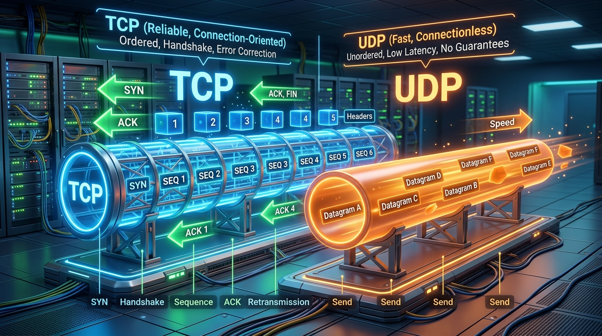
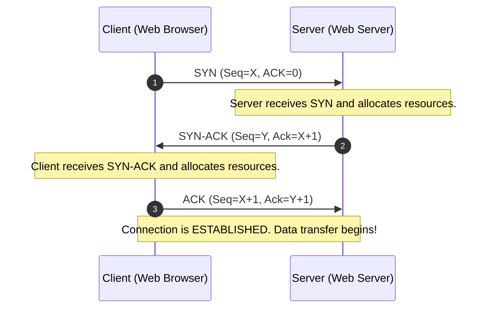
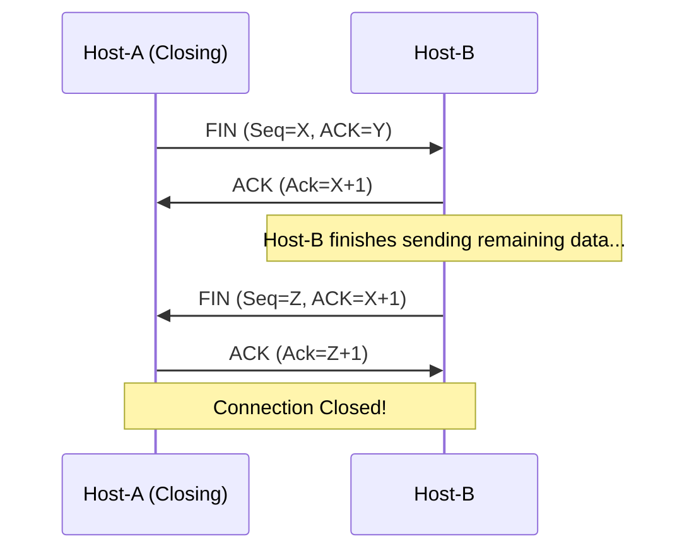

← [[Course on CCNA|Go Back to Course Hub]]

# 🔌 Day 29: TCP & UDP (Transport Layer Basics)

Welcome to the notes for **Day 29: TCP & UDP** of Jeremy's IT Lab CCNA Complete Course! Aaj hum OSI Model ke **Layer 4 (Transport Layer)** ke core concepts aur uske do sabse main protocols—**TCP (Transmission Control Protocol)** aur **UDP (User Datagram Protocol)** ke baare mein seekhenge. Ye notes Hinglish language aur English/Latin script mein detailed explanations, analogies, diagrams, aur comparisons ke sath hain.

---

## 🌐 1. Transport Layer (Layer 4) Functions

OSI Model ka **Transport Layer** (L4) data communication ke management aur reliability ke liye responsible hota hai. Iske primary functions niche diye gaye hain:

1.  **Multiplexing & Demultiplexing (Port Numbers):**
    *   Ek host par multiple applications ek sath internet use kar sakti hain (Jaise aap ek browser tab mein YouTube dekh rahe hain, doosre mein Google search kar rahe hain, aur background mein Spotify chal raha hai).
    *   L4 **Port Numbers** ka use karke ye ensure karta hai ki YouTube ka data YouTube application ko mile aur Spotify ka data Spotify ko.
2.  **Segmentation & Reassembly:**
    *   L3 (IP) packets ki max size limited hoti hai (MTU 1500 bytes). Transport layer large application data files ko chote pieces (Segments) mein divide karta hai, aur destination par unhe sequence number ke base par reassemble (dobara combine) karta hai.
3.  **Reliability & Error Recovery:**
    *   Agar transit ke dauran koi data segment corrupt ya lost ho jaye, toh Transport Layer sender se request karke use re-transmit karwata hai.
4.  **Flow Control (Windowing):**
    *   Ye ensure karta hai ki sender data ki aisi speed se send kare jise receiver absorb kar sake, aur receiver memory/buffers crash na hon.

---

## ⚖️ 2. TCP vs. UDP: The Core Concepts

Transport layer par data deliver karne ke do alag-alag tarike hote hain—ya toh hum **reliable & structured** data transport use karein, ya phir **fast & lightweight** transport.



### A. TCP (Transmission Control Protocol - RFC 793):
*   **Connection-Oriented:** Data transmission start karne se pehle sender aur receiver aapas mein handshake karke virtual logical connection establish karte hain.
*   **Reliable Delivery:** Har received segment ke badle receiver confirmation (Acknowledgment) bhejta hai. Agar acknowledgement nahi aayi, toh sender automatic re-transmit karta hai.
*   **Ordered Transfer:** Data segments par sequence numbers hote hain. Agar segments aage-piche receive hote hain, toh TCP unhe automatic re-arrange karta hai.
*   **Flow Control:** Sliding Window algorithm ke zariye network congestion ke base par buffer window size dynamically modify karta hai.

### B. UDP (User Datagram Protocol - RFC 768):
*   **Connectionless:** Bina kisi handshake ya warning ke direct datagrams send karna start kar deta hai.
*   **Unreliable (Best-effort):** Koi acknowledgment nahi hoti. Agar data lost ho gaya toh lost ho gaya, UDP re-transmit nahi karega.
*   **Unordered Transfer:** Segment re-ordering ka koi feature nahi hai.
*   **Low Overhead:** TCP ki tarah tracking mechanisms na hone ke karan ye bahut fast hota hai aur negligible network overhead create karta hai. (Lightweight).

### 💡 Real-world Analogy (Udaharan):
*   **TCP (Registered Post / Courier):** Aapne kisi ko important documents couriers kiye. Courier company aapko tracking number degi, aur delivery ke waqt signature legi (Acknowledgment). Agar post loss hoti hai, toh automatic tracking notification milegi.
*   **UDP (Normal Post / Flyer):** Kisi store ne pure lane mein discount flyers phenk diye. Unhe koi matlab nahi hai ki kisne fly receive kiya ya raste mein hawa se udd gaya (No confirmation). Ye method cheap aur fast hai.

---

## ✉️ 3. TCP & UDP Header Fields Deep Dive

TCP BPDUs aur header structures bade hote hain kyunki unhe session controls rakhne padte hain, jabki UDP header kafi compact hota hai.

### A. TCP Header Structure (20 to 60 Bytes):
TCP header standard **20 bytes** default size ka hota hai (options include karne par 60 bytes tak badh sakta hai):

```text
 0                   1                   2                   3
 0 1 2 3 4 5 6 7 8 9 0 1 2 3 4 5 6 7 8 9 0 1 2 3 4 5 6 7 8 9 0 1
+-+-+-+-+-+-+-+-+-+-+-+-+-+-+-+-+-+-+-+-+-+-+-+-+-+-+-+-+-+-+-+-+
|          Source Port          |       Destination Port        |
+-+-+-+-+-+-+-+-+-+-+-+-+-+-+-+-+-+-+-+-+-+-+-+-+-+-+-+-+-+-+-+-+
|                        Sequence Number                        |
+-+-+-+-+-+-+-+-+-+-+-+-+-+-+-+-+-+-+-+-+-+-+-+-+-+-+-+-+-+-+-+-+
|                     Acknowledgment Number                     |
+-+-+-+-+-+-+-+-+-+-+-+-+-+-+-+-+-+-+-+-+-+-+-+-+-+-+-+-+-+-+-+-+
|  Data |           |U|A|P|R|S|F|                               |
| Offset| Reserved  |R|C|S|S|Y|I|            Window             |
|       |           |G|K|H|T|N|N|                               |
+-+-+-+-+-+-+-+-+-+-+-+-+-+-+-+-+-+-+-+-+-+-+-+-+-+-+-+-+-+-+-+-+
|           Checksum            |         Urgent Pointer        |
+-+-+-+-+-+-+-+-+-+-+-+-+-+-+-+-+-+-+-+-+-+-+-+-+-+-+-+-+-+-+-+-+
|                    Options (Variable length)                  |
+-+-+-+-+-+-+-+-+-+-+-+-+-+-+-+-+-+-+-+-+-+-+-+-+-+-+-+-+-+-+-+-+
```

*   **Source / Destination Ports (16-bits each):** L4 applications identify karne ke liye.
*   **Sequence Number (32-bits):** Byte synchronization aur ordering tracking ke liye.
*   **Acknowledgment Number (32-bits):** Next expected byte tracking (confirming receipt of previous bytes).
*   **Flags Byte (Control Bits):**
    *   **SYN (Synchronize):** Connection setup phase initiate karta hai.
    *   **ACK (Acknowledgment):** Connection confirmations aur segment receipt denote karta hai.
    *   **FIN (Finish):** Connection gracefully terminate karne ki request.
    *   **RST (Reset):** Error hone par connection instantly reset/terminate karta hai.
    *   **PSH (Push):** Receiver buffer ko direct pass karke application processing mein push karna.
    *   **URG (Urgent):** Segment ke urgent pointer parameters execute karna.
*   **Window Size (16-bits):** Bataata hai ki router ek bar mein bina Acknowledgment receive kiye kitne bytes receive kar sakta hai (Flow control).

---

### B. UDP Header Structure (8 Bytes only!):
UDP header dynamic protocols se bilkul light **8 bytes** size ka locked hota hai. Isme sirf 4 fields hote hain:

```text
 0                   1                   2                   3
 0 1 2 3 4 5 6 7 8 9 0 1 2 3 4 5 6 7 8 9 0 1 2 3 4 5 6 7 8 9 0 1
+-+-+-+-+-+-+-+-+-+-+-+-+-+-+-+-+-+-+-+-+-+-+-+-+-+-+-+-+-+-+-+-+
|          Source Port          |       Destination Port        |
+-+-+-+-+-+-+-+-+-+-+-+-+-+-+-+-+-+-+-+-+-+-+-+-+-+-+-+-+-+-+-+-+
|            Length             |           Checksum            |
+-+-+-+-+-+-+-+-+-+-+-+-+-+-+-+-+-+-+-+-+-+-+-+-+-+-+-+-+-+-+-+-+
```
1.  **Source Port (16-bits)**
2.  **Destination Port (16-bits)**
3.  **Length (16-bits):** Includes UDP header + Data payload size.
4.  **Checksum (16-bits):** Standard packet error checking.

---

## 🤝 4. TCP 3-Way Handshake & Connection Termination

TCP packets reliability aur dynamic setup ke liye handshakes use karta hai:

### A. The 3-Way Handshake (Connection Establishment):
Kuch bhi actual data send karne se pehle, client aur server niche diye gaye 3 steps complete karte hain:



---

### B. The 4-Way Connection Termination:
Connection complete hone par use safely close karne ke liye 4 states run hoti hain (bhale hi FIN message client ya server koi bhi start kare):



---

## 🏷️ 5. L4 Port Number Ranges & Well-Known Ports

Port numbers total **16-bits** size range ke hote hain (yani `0` se `65535`). Inhe teen categories mein divide kiya gaya hai:

1.  **Well-Known Ports (`0 - 1023`):** Standard core services aur protocols ke liye pre-assigned ports.
2.  **Registered Ports (`1024 - 49151`):** Corporate soft-vendors (e.g. databases, Microsoft services) ke list dynamic applications ke liye registry registered ports.
3.  **Dynamic / Ephemeral Ports (`49152 - 65535`):** Jab client kisi remote server ko link query bhejta hai, toh client OS internally temporary source port choose karne ke liye is range ka use karta hai.

### CCNA Exam Core Ports List:

| Service / Protocol | Port Number | Transport Protocol | Description |
| :--- | :--- | :--- | :--- |
| **FTP (Data / Control)** | **20 / 21** | TCP | File Transfer Protocol (Bulk file uploads/downloads) |
| **SSH** | **22** | TCP | Secure Shell (Encrypted remote CLI access) |
| **Telnet** | **23** | TCP | Telecommunication Network (Unencrypted remote CLI access) |
| **SMTP** | **25** | TCP | Simple Mail Transfer Protocol (Email transmission) |
| **DNS** | **53** | **UDP & TCP** | Domain Name System (Resolves names to IPs) |
| **DHCP (Server / Client)** | **67 / 68** | UDP | Dynamic Host Configuration Protocol (IP Auto-config) |
| **TFTP** | **69** | UDP | Trivial FTP (Lightweight UDP file transfer for IOS backups) |
| **HTTP** | **80** | TCP | Hypertext Transfer Protocol (Unencrypted web traffic) |
| **POP3** | **110** | TCP | Post Office Protocol v3 (Retrieves emails from server) |
| **NTP** | **123** | UDP | Network Time Protocol (Synchronizes clocks across devices) |
| **IMAP** | **143** | TCP | Internet Message Access Protocol (Retrieves/syncs emails) |
| **SNMP (Query / Trap)** | **161 / 162** | UDP | Simple Network Management Protocol (Monitoring) |
| **HTTPS** | **443** | TCP | Hypertext Transfer Protocol Secure (Encrypted web traffic) |

---

## 📝 6. CCNA Day 29 Practice Questions

1. **Q1: Layer 4 Transport layer par dynamic application traffic separation check karne ke liye kis parameter tool ka use kiya jata hai?**
   <details>
   <summary>🔓 Click to Reveal Answer</summary>
   **Answer:** **Port Numbers** (Multiplexing / Demultiplexing).
   </details>

2. **Q2: TCP (Transmission Control Protocol) kis type ka connection architecture follow karta hai aur kyu?**
   <details>
   <summary>🔓 Click to Reveal Answer</summary>
   **Answer:** **Connection-Oriented** architecture. Kyunki data transit start karne se pehle dono endpoints aapas mein 3-Way handshake perform karte hain.
   </details>

3. **Q3: OSPF ki tarah UDP packet properties ke metric variables kya characteristics hold karte hain?**
   <details>
   <summary>🔓 Click to Reveal Answer</summary>
   **Answer:** **Connectionless** aur **Unreliable (Best-effort)**. Isme koi session setups, packet ordering, ya acknowledgment feedback loops nahi hote.
   </details>

4. **Q4: TCP 3-Way Handshake complete hone ke teen sequential steps flags sequences kya hote hain?**
   <details>
   <summary>🔓 Click to Reveal Answer</summary>
   **Answer:** 
   1. Client sends **`SYN`**
   2. Server replies **`SYN-ACK`**
   3. Client sends **`ACK`**
   </details>

5. **Q5: TCP Connection gracefully terminate close karne ke sequences steps flags count aur symbols kya use hote hain?**
   <details>
   <summary>🔓 Click to Reveal Answer</summary>
   **Answer:** **4-Way handshake** hota hai, jisme **`FIN`** and **`ACK`** flags sequence check perform hote hain.
   </details>

6. **Q6: HSRP details metrics aur standard Ethernet defaults data frames size limits check par TCP header size by default kitna hota hai?**
   <details>
   <summary>🔓 Click to Reveal Answer</summary>
   **Answer:** Minimum **20 bytes** (aur options include karne par 60 bytes tak scaling standard).
   </details>

7. **Q7: UDP header size TCP ke large header overhead variables ke muqable kitna fix size hold karta hai?**
   <details>
   <summary>🔓 Click to Reveal Answer</summary>
   **Answer:** Minimum **8 bytes** (sirf 4 fields: Source Port, Destination Port, Length, aur Checksum).
   </details>

8. **Q8: Server applications ke liye reserve kiye gaye standard 'Well-Known Ports' ki numerical range boundary limits kya hoti hain?**
   <details>
   <summary>🔓 Click to Reveal Answer</summary>
   **Answer:** **`0` to `1023`**.
   </details>

9. **Q9: Domain Name System (DNS) protocol communication standard dynamic setups ke liye kis Layer 4 protocols aur Port number ka use karta hai?**
   <details>
   <summary>🔓 Click to Reveal Answer</summary>
   **Answer:** DNS **TCP** and **UDP** dono use karta hai on **Port `53`**. (UDP query resolutions ke liye aur TCP zones transfer files syncs ke liye).
   </details>

10. **Q10: SSH (Secure Shell) aur Telnet terminal dynamic configurations ke protocols parameters defaults ports kya hote hain, aur inme safe protocol kaun sa hai?**
    <details>
    <summary>🔓 Click to Reveal Answer</summary>
    **Answer:** SSH port **`22`** aur Telnet port **`23`** use karte hain. **SSH** encrypted session credentials flows ke sath chalta hai isliye secure protocol hai.
    </details>
