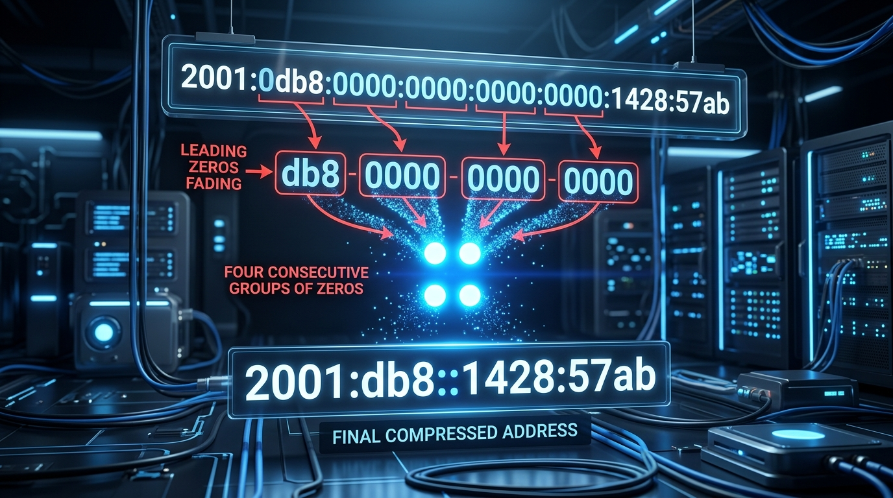

← [[Course on CCNA|Go Back to Course Hub]]

# 🌐 Day 30: IPv6 - Part 1 (Fundamentals & Address Compression)

Welcome to the notes for **Day 30: IPv6 - Part 1** of Jeremy's IT Lab CCNA Complete Course! Aaj se hum **IPv6 (Internet Protocol Version 6)** ke baare mein seekhna shuru karenge. Is first part mein hum seekhenge ki kyu hume IPv6 ki zaroorat padi, base-16 (hexadecimal) math ka review karenge, IPv6 address structure ko samjhenge, aur address compression ke rules ko practical diagrams ke sath seekhenge. Ye notes Hinglish language aur English/Latin script mein hain.

---

## 🧮 1. Hexadecimal Number System Review

IPv6 addresses ko samajhne ke liye **Hexadecimal (Base-16)** number system ko samajhna mandatory hai. Hamara normal decimal system Base-10 (0-9 digits) use karta hai aur binary system Base-2 (0 aur 1 digits) use karta hai.

*   **Hexadecimal Characters:** 
    *   0, 1, 2, 3, 4, 5, 6, 7, 8, 9 (Decimal ki tarah)
    *   **A** = 10, **B** = 11, **C** = 12, **D** = 13, **E** = 14, **F** = 15
*   **The 4-bit Rule (Nibble):**
    *   Ek single hexadecimal digit exact **4 bits (1 nibble)** ke barabar hota hai.
    *   *Example:* 
        *   Binary `1111` = Hex `F` (Decimal 15)
        *   Binary `1010` = Hex `A` (Decimal 10)
        *   Binary `0000` = Hex `0` (Decimal 0)

### 📊 Conversion Reference Chart:

| Hexadecimal | Binary | Decimal | Hexadecimal | Binary | Decimal |
| :--- | :--- | :--- | :--- | :--- | :--- |
| **0** | `0000` | 0 | **8** | `1000` | 8 |
| **1** | `0001` | 1 | **9** | `1001` | 9 |
| **2** | `0010` | 2 | **A** | `1010` | 10 |
| **3** | `0011` | 3 | **B** | `1011` | 11 |
| **4** | `0100` | 4 | **C** | `1100` | 12 |
| **5** | `0101` | 5 | **D** | `1101` | 13 |
| **6** | `0110` | 6 | **E** | `1110` | 14 |
| **7** | `0111` | 7 | **F** | `1111` | 15 |

---

## 🚀 2. Why IPv6? (The Exhaustion of IPv4)

*   **IPv4 Address Limit:** IPv4 address **32-bits** long hota hai, jisse total $2^{32} \approx 4.29 \text{ Billion}$ unique IP addresses milte hain. Internet par devices (smartphones, IoT, servers) ki exponential growth ke karan ye addresses completely exhaust (khatam) ho chuke hain.
*   **IPv6 Address Space:** IPv6 address **128-bits** long hota hai, jisse total $2^{128} \approx 3.4 \times 10^{38}$ (340 Undecillion) unique IP addresses milte hain. Ye itni badi value hai ki hum earth ke har ek single atom ko individual IP address de sakte hain tab bhi addresses khatam nahi honge!

### ❓ What happened to IPv5?
*   **Internet Stream Protocol (IPv5):** IPv5 standard ek experimental protocol tha jise voice aur video streaming ko optimize karne ke liye design kiya gaya tha. Ye kabhi commercial level par use nahi hua aur protocol specification database mein reserve ho gaya. Isliye next generation protocol ka name seedhe **IPv6** rakha gaya.

---

## 🏛️ 3. IPv6 Address Structure

IPv6 address standard **128 bits** size ka hota hai. Isko represent karne ka tarika niche likha hai:
*   Ise **8 groups** mein divide kiya jata hai, jahan har group mein **4 hexadecimal characters** hote hain.
*   In groups ko colons (`:`) se separate kiya jata hai.
*   Har group ko **Hextet** (ya Quartet) kaha jata hai.
*   **1 Hextet = 16 bits** ($4 \text{ hex characters} \times 4 \text{ bits each} = 16 \text{ bits}$).
*   Total size: $8 \text{ hextets} \times 16 \text{ bits} = 128 \text{ bits}$.

*   **Example IPv6 Address (Uncompressed):**
    `2001:0db8:85a3:0000:0000:8a2e:0370:7334`

---

## ✂️ 4. Rules for Shortening / Compressing IPv6 Addresses

128-bit ka full address likhna aur configure karna bahut cumbersome (mushkil) hota hai. Isliye IPv6 addresses ko compress karne ke liye **2 rules** diye gaye hain:



### 🔹 Rule 1: Omit Leading Zeros (Aage ke Zeros ko Hatao)
Kisi bhi individual hextet ke andar aage aane wale zeros (`0`) ko skip kiya ja sakta hai. Hextet ke peeche aane wale zeros ko nahi hataya ja sakta.
*   `0db8` becomes `db8`
*   `0370` becomes `370`
*   `0000` becomes `0`
*   *Note:* `8a20` can NOT be changed to `8a2` (peeche ka zero nahi hatega).

### 🔹 Rule 2: Double Colon (::) Replacement (Consecutive Zeros Collapse)
Agar address mein lagatar (consecutive) all-zero hextets hain (jaise `:0000:0000:0000:`), toh unhe collapse karke single **`::` (double colon)** likha ja sakta hai.
*   *Example Address:* `2001:db8:0000:0000:0000:0000:1428:57ab`
*   *Compressed Address:* `2001:db8::1428:57ab`

> [!IMPORTANT]
> **The Double Colon (::) Limit Rule:**
> Ek single IPv6 address mein double colon `::` ka use **sirf ek hi baar (ONLY ONCE)** kiya ja sakta hai. Agar aap do alag-alag jagah `::` laga denge, toh address ambiguous ho jayega aur router ye calculate nahi kar payega ki kis section mein kitne groups collapsed hain.

#### ⚠️ Compressing Ambiguity Example:
*   *Uncompressed:* `2001:0000:0000:abcd:0000:0000:0000:1234`
*   *Incorrect Compression:* `2001::abcd::1234` (This is invalid and rejected by IOS).
*   *Correct Compression:* `2001::abcd:0:0:0:1234` OR `2001:0:0:abcd::1234` (Choose the largest group of zeros to collapse using `::`).

---

## 📏 5. IPv6 Prefix Length

IPv4 mein subnet mask aur prefixes (like `255.255.255.0` or `/24`) subnet size describe karte the. IPv6 mein hum standard CIDR type notation **Prefix Length** use karte hain:

*   **Syntax:** `/Prefix-Length` (e.g. `/64`)
*   **The Standard /64 Prefix Rule:**
    *   Enterprise and LAN subnets par default prefix size hamesha **`/64`** use kiya jata hai.
    *   First 64-bits: **Network Prefix** (equivalent to Network ID in IPv4).
    *   Last 64-bits: **Interface ID** (equivalent to Host ID in IPv4).

```text
+-----------------------------------+-----------------------------------+
|     Network Prefix (64 bits)      |       Interface ID (64 bits)      |
|           (Subnet ID)             |          (MAC/Host ID)            |
+-----------------------------------+-----------------------------------+
```

---

## 💻 6. Basic Cisco CLI Configuration

Cisco router interface par static IPv6 configure karne aur routing engine activate karne ke steps:

```ios
! 1. Global mode mein IPv6 dynamic routing enable karein (Mandatory step)
Router(config)# ipv6 unicast-routing

! 2. Interface level par static address apply karein
Router(config)# interface gigabitethernet 0/1
Router(config-if)# ipv6 address 2001:db8:3c4d:1::1/64
Router(config-if)# no shutdown
```

---

## 📝 7. CCNA Day 30 Practice Questions

1. **Q1: IPv6 address total kitne bits long hota hai aur isme dynamic unique address range capacity kitni hai?**
   <details>
   <summary>🔓 Click to Reveal Answer</summary>
   **Answer:** **128 bits** long hota hai, aur isme dynamic capacity **$3.4 \times 10^{38}$** addresses ki hai.
   </details>

2. **Q2: Hexadecimal number system kis database base par chalta hai aur isme alphabet characters kya represent karte hain?**
   <details>
   <summary>🔓 Click to Reveal Answer</summary>
   **Answer:** Base-16 system par chalta hai. A=10, B=11, C=12, D=13, E=14, aur F=15.
   </details>

3. **Q3: Ek single Hexadecimal character binary system mein kitne bits size hold karta hai?**
   <details>
   <summary>🔓 Click to Reveal Answer</summary>
   **Answer:** **4 bits** (1 Nibble).
   </details>

4. **Q4: Uncompressed address `2001:0db8:0000:0003:0000:0000:0000:0001` ko complete compress rule verify karke shortest value kya banegi?**
   <details>
   <summary>🔓 Click to Reveal Answer</summary>
   **Answer:** **`2001:db8:0:3::1`** (Leading zeros skip check aur largest zero block collapse check).
   </details>

5. **Q5: IPv6 Address compression rules ke context mein double colon `::` symbols par kya restriction applicability hold hoti hai?**
   <details>
   <summary>🔓 Click to Reveal Answer</summary>
   **Answer:** Double colon `::` ka use **sirf ek hi baar** kiya ja sakta hai address configuration ke andar.
   </details>

6. **Q6: Address compression criteria check par, kya hextet group ke end (trailing) zero value ko remove kiya ja sakta hai, jaise `2001:db8:abc0::1` mein?**
   <details>
   <summary>🔓 Click to Reveal Answer</summary>
   **Answer:** **Nahi**, sirf leading (aage wale) zeros hi drop honge. Trailing (peeche wale) zeros ignore nahi kiye ja sakte, warna subnet representation collapse ho jayega.
   </details>

7. **Q7: Standard LAN aur client end interface subnets par IPv6 design rules default Prefix Length parameters kya define karte hain?**
   <details>
   <summary>🔓 Click to Reveal Answer</summary>
   **Answer:** Default **`/64`** prefix length.
   </details>

8. **Q8: IPv6 addresses structures ke case mein total number of groups (hextets) kitne discrete segments hold karte hain?**
   <details>
   <summary>🔓 Click to Reveal Answer</summary>
   **Answer:** Total **8 hextets** groups (separated by colons).
   </details>

9. **Q9: Cisco router interfaces par default dynamic IPv6 traffic routes forwarding functionality activate karne ki global configuration command kya hai?**
   <details>
   <summary>🔓 Click to Reveal Answer</summary>
   **Answer:** **`ipv6 unicast-routing`** global command.
   </details>

10. **Q10: OSPF standard parameters ki tarah, IPv5 protocol design specifications details standard systems mein kyu use nahi hoti?**
    <details>
    <summary>🔓 Click to Reveal Answer</summary>
    **Answer:** Kyunki IPv5 design experimental Voice over IP stream standard protocol tha jo commercial testing mein reject hokar reserve list mein locked reh gaya.
    </details>
