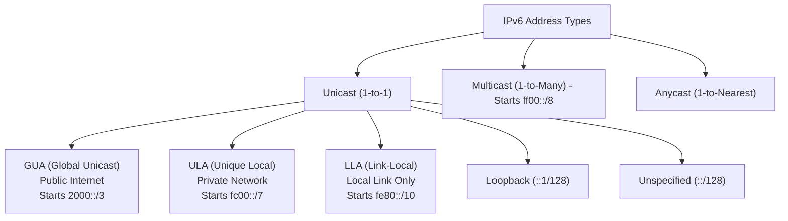
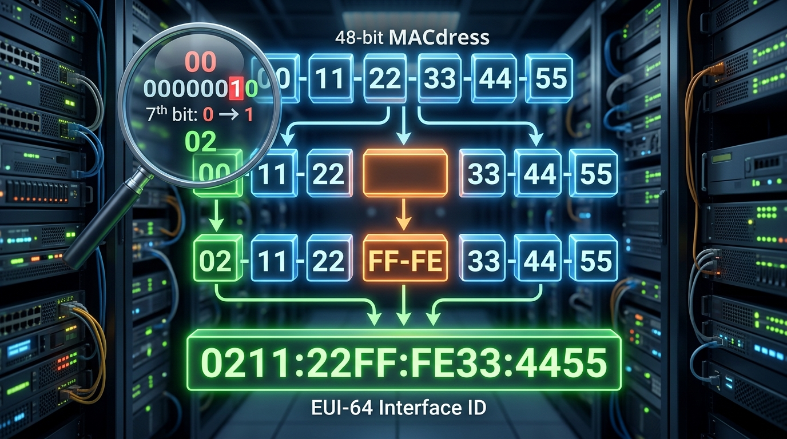

← [[Course on CCNA|Go Back to Course Hub]]

# 🌐 Day 31: IPv6 - Part 2 (Address Types & EUI-64)

Welcome to the notes for **Day 31: IPv6 - Part 2** of Jeremy's IT Lab CCNA Complete Course! Aaj hum IPv6 address categorization ke deep details seekhenge (Global Unicast, Unique Local, Link-Local, and Multicast) aur dynamic host ID generation ke mathematical framework **EUI-64** (Extended Unique Identifier) ko detail step-by-step process aur premium illustrations ke sath samjhenge. Ye notes Hinglish language aur English/Latin script mein hain.

---

## 🗺️ 1. OSPF-Style Classification of IPv6 Address Types

IPv6 mein network routing aur scopes manage karne ke liye addresses ko alag-alag segments mein categorize kiya jata hai. IPv6 mein **Broadcast addresses nahi hote**; unhe complete replace karke multicast standards ka use kiya jata hai.



---

### A. Global Unicast Address (GUA):
*   **Equivalent to:** IPv4 Public IP Address (Internet routable).
*   **Range:** Starts with binary `001` which corresponds to **`2000::/3`** (Hex range `2000::` to `3FFF:FFFF:...`).
*   **Subnet Structure:**
    *   *Global Routing Prefix (First 48-bits):* ISP ya registries (IANA/RIR) ke through company ko assign kiya jata hai.
    *   *Subnet ID (Next 16-bits):* Company internally subnets banane ke liye use karti hai. (Allows $2^{16} = 65,536$ subnets within a `/64` structure).
    *   *Interface ID (Last 64-bits):* Host portion.

```text
|<----- 48 bits ----->|<--- 16 bits --->|<----------- 64 bits ----------->|
+---------------------+-----------------+---------------------------------+
|   Global Routing    |    Subnet ID    |          Interface ID           |
|       Prefix        |                 |         (Host Address)          |
+---------------------+-----------------+---------------------------------+
```

---

### B. Unique Local Address (ULA):
*   **Equivalent to:** IPv4 Private IP Address (RFC 1918 - `10.0.0.0/8`, etc.). Ye public internet par route nahi ho sakte.
*   **Range:** Starts with **`fc00::/7`** (Hex range `FC00::` to `FDFF::`).
*   *Note:* standard specification ke according isko two parts mein divide kiya gaya hai:
    *   `fc00::/8` (IANA assigned - not in use yet).
    *   **`fd00::/8`** (Locally assigned prefix - isko hum apne private networks mein use karte hain).
*   **Structure:** `/8` prefix ke badle next 40-bits randomly generated **Global ID** choose ki jati hai taaki agar future mein do companies merge hon, toh unke private networks clash na karein.

---

### C. Link-Local Address (LLA):
*   **Scope:** Ye addresses sirf ek single local link (broadcast domain / VLAN) ke andar hi communicate karne ke liye valid hote hain. Routers in packets ko doosre interfaces par forwarding nahi karte.
*   **Range:** Starts with **`fe80::/10`** (Binary `1111 1110 10`). In practice, first 10-bits ke baad remaining 54-bits zero config hoti hain, isliye standard interface LLA hamesha **`fe80::/64`** se start hota hai.
*   **Use Cases:**
    1. OSPFv3 ya dynamic routing protocols mein **Next-Hop IP** hamesha interface Link-Local IP hi use kiya jata hai.
    2. Dynamic ARP replacements (Neighbor Discovery).
    3. DHCPv6 client queries initial request process.
*   **Auto-Generation:** Jab bhi kisi interface par IPv6 enable hota hai, router automatic apna LLA construct kar leta hai dynamically via MAC address parameters (using EUI-64 or Random algorithms).

---

### D. Multicast Address:
*   **Equivalent to:** IPv4 Multicast (Traffic sent to specific subscription groups).
*   **Range:** Starts with **`ff00::/8`** (Starts with `ff`).
*   **Well-Known IPv6 Multicast Group IPs:**
    *   **`ff02::1`:** All Nodes Multicast (LAN segment par connected saare hosts traffic receive karte hain, replaces IPv4 broadcast).
    *   **`ff02::2`:** All Routers Multicast.
    *   **`ff02::5`:** All OSPFv3 Routers.
    *   **`ff02::6`:** All OSPFv3 DR/BDR Routers.

---

## 🛠️ 2. The EUI-64 Interface ID Generation Process

**EUI-64 (Extended Unique Identifier)** ek standard mathematics calculation hai jiske zariye router dynamic interface ID (Host portion - 64 bits) generate karne ke liye interface ka physical 48-bit MAC address use karta hai.

### Step-by-Step EUI-64 Calculation:

Maan lijiye hamare interface ka physical MAC address **`00:11:22:33:44:55`** hai:



*   **Step 1: Split MAC Address in Half:**
    MAC address ko do parts (24-bits each) mein break karein:
    `0011:22` aur `3344:55`
*   **Step 2: Insert Hex `FFFE` in the middle:**
    Dono halves ke beech **`FFFE`** byte values add kar dein:
    `0011:22FF:FE33:4455`
*   **Step 3: Convert the 1st Byte (Octet) to binary:**
    1st Byte hex is `00`. Binary parameters:
    `00` $\rightarrow$ **`0 0 0 0  0 0 0 0`**
*   **Step 4: Flip the 7th Bit (Universal/Local Bit):**
    First byte ke left side se 7th bit (highlighted) ko flip (agar 0 hai toh 1, 1 hai toh 0) karein:
    `0 0 0 0  0 0` **`0`** `0` $\rightarrow$ `0 0 0 0  0 0` **`1`** `0`
*   **Step 5: Convert back to Hex:**
    Binary `00000010` is Hex **`02`**.
*   **Step 6: Combine for Final EUI-64 Interface ID:**
    1st byte `00` ko replace karke `02` likhein:
    **`0211:22FF:FE33:4455`**

> [!TIP]
> **Why Flip the 7th Bit?**
> IEEE MAC specification ke mutabik 7th bit 'Universal/Local' status note karti hai. OSPF/IPv6 engineers ke convenience ke liye isko reverse kiya jata hai taaki agar local administrator manually dynamic interfaces banaye (jaise `0200::1`), toh use bit options configure karne mein asani rahe.

---

## 💻 3. Cisco CLI Configurations & Verification

Cisco router interface par static, dynamic EUI-64, aur manual Link-Local addresses configure karna:

### A. Interface configuration commands:
```ios
Router-A(config)# ipv6 unicast-routing              ! Enable IPv6 routing engine

Router-A(config)# interface gigabitethernet 0/1
! Option 1: Static GUA address setup
Router-A(config-if)# ipv6 address 2001:db8:1:100::1/64

! Option 2: Dynamic EUI-64 address setup (Router MAC se Interface ID dynamically banayega)
Router-A(config-if)# ipv6 address 2001:db8:1:200::/64 eui-64

! Option 3: Manual Link-Local configuration (Overwrites default auto-generated LLA)
Router-A(config-if)# ipv6 address fe80::1 link-local
Router-A(config-if)# no shutdown
```

---

### B. Verify Commands:

#### 1. Interface IPv6 details aur configurations parameters check karna:
```ios
Router-A# show ipv6 interface gigabitethernet 0/1
```
*Output snippet:*
```text
GigabitEthernet0/1 is up, line protocol is up
  IPv6 is enabled, link-local address is fe80::1
  No virtual link-local address(es) exists
  Global unicast address(es):
    2001:DB8:1:100::1, subnet is 2001:DB8:1:100::/64
    2001:DB8:1:200:211:22FF:FE33:4455, subnet is 2001:DB8:1:200::/64 [EUI]
  Joined group address(es):
    FF02::1
    FF02::2
    FF02::1:FF00:1
    FF02::1:FF33:4455
```
> [!NOTE]
> *   `2001:DB8:1:200:211:22FF:FE33:4455 ... [EUI]`: Output verify karta hai ki interface dynamic ID setup **EUI-64** method parameters use karke construct kiya gaya hai.
> *   `Joined group address(es)` dynamic Multicast groups highlight karta hai jisse ye interface listen kar raha hai.

#### 2. Short interface list verification:
```ios
Router-A# show ipv6 interface brief
```

---

## 📝 4. CCNA Day 31 Practice Questions

1. **Q1: IPv6 Global Unicast Address (GUA) range default hexadecimal starting values kya represent karti hai?**
   <details>
   <summary>🔓 Click to Reveal Answer</summary>
   **Answer:** **`2000::/3`** (Hex range `2000::` to `3FFF:FFFF:...`).
   </details>

2. **Q2: IPv4 private address ranges equivalent configurations ke liye IPv6 standard range kya use ki jaati hai?**
   <details>
   <summary>🔓 Click to Reveal Answer**</summary>
   **Answer:** **ULA (Unique Local Address)** range starting with **`fc00::/7`** (specifically `fd00::/8` locally generated).
   </details>

3. **Q3: OSPFv3 aur dynamic routing protocols mein packets next-hop routing parameters set karne ke liye kis address type target use hota hai?**
   <details>
   <summary>🔓 Click to Reveal Answer</summary>
   **Answer:** **Link-Local Address (LLA)** range starting with **`fe80::/10`**.
   </details>

4. **Q4: EUI-64 Host ID generation process ke rules step 2 par, splits key halves ke beech kaun si standard hex string insert ki jaati hai?**
   <details>
   <summary>🔓 Click to Reveal Answer</summary>
   **Answer:** **`FFFE`** (16-bit hex values).
   </details>

5. **Q5: EUI-64 conversion ke step 4 mein MAC address first byte (octet) ka kaun sa specific bit flip (reverse) kiya jata hai?**
   <details>
   <summary>🔓 Click to Reveal Answer</summary>
   **Answer:** Left side se **7th Bit** (Universal/Local status bit).
   </details>

6. **Q6: Physical MAC address `00:AA:BB:CC:DD:EE` ka EUI-64 Interface ID output parameter values kya calculate hoga?**
   <details>
   <summary>🔓 Click to Reveal Answer</summary>
   **Answer:** 
   1. MAC split: `00AA:BB` | `CCDD:EE`
   2. Insert FFFE: `00AA:BBFF:FECC:DDEE`
   3. 7th bit flip: First byte `00` (binary `00000000`) becomes `02` (binary `00000010`).
   4. Final Result: **`02AA:BBFF:FECC:DDEE`**.
   </details>

7. **Q7: Local LAN segment par connected saare hosts dynamic networks ko target karne ke liye broadcast equivalents multicast group address kya define hota hai?**
   <details>
   <summary>🔓 Click to Reveal Answer</summary>
   **Answer:** **`ff02::1`** (All Nodes Multicast).
   </details>

8. **Q8: GigabitEthernet interface par OSPFv3 dynamic updates links trace karne ke liye OSPF multicast groups standard targets kya scale use hote hain?**
   <details>
   <summary>🔓 Click to Reveal Answer</summary>
   **Answer:** **`ff02::5`** (All OSPFv3 routers) aur **`ff02::6`** (All OSPFv3 DR/BDR routers).
   </details>

9. **Q9: Interface configuration par dynamic EUI-64 configurations automatically apply karne ki exact CLI configuration command syntax kya hai?**
   <details>
   <summary>🔓 Click to Reveal Answer</summary>
   **Answer:** Interface mode command: **`ipv6 address <prefix>/64 eui-64`**.
   </details>

10. **Q10: OSPFv3 adjacency setups check karne ke liye interface link-local address manual override customize karne ki command kya hai?**
    <details>
    <summary>🔓 Click to Reveal Answer</summary>
    **Answer:** Interface mode command: **`ipv6 address <address> link-local`** (e.g. `ipv6 address fe80::1 link-local`).
    </details>
