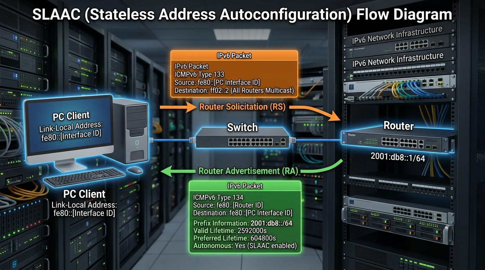

← [[Course on CCNA|Go Back to Course Hub]]

# 🌐 Day 32: IPv6 - Part 3 (Autoconfiguration & Routing)

Welcome to the notes for **Day 32: IPv6 - Part 3** of Jeremy's IT Lab CCNA Complete Course! Aaj hum IPv6 address allocation methods jaise **SLAAC** aur **DHCPv6** (Stateless & Stateful) ko samjhenge, IPv6 **Static Routing** (specifying Link-Local next hops) aur **Anycast Routing** seekhenge, aur dynamic **Multicast Scopes** ko premium diagrams ke sath cover karenge. Ye notes Hinglish language aur English/Latin script mein hain.

---

## ⚡ 1. SLAAC (Stateless Address Autoconfiguration)

**SLAAC** IPv6 ka ek unique aur highly efficient feature hai jahan client hosts ko dynamic IP address configure karne ke liye kisi DHCP server ki zaroorat nahi padti. Client router se direct subnet information seekh kar apna IP address khud construct kar leta hai.

### How SLAAC Works (RS & RA Handshake):
SLAAC **ICMPv6** protocol signaling ke dynamic messages par rely karta hai:



1.  **Router Solicitation (RS - ICMPv6 Type 133):**
    *   Client link up hote hi local link par ek multicast RS packet bhejta hai taaki active routers ko locate kiya ja sake.
    *   *Source IP:* Host ka auto-generated Link-Local Address (`fe80::...`).
    *   *Destination IP:* **`ff02::2`** (All Routers Multicast).
2.  **Router Advertisement (RA - ICMPv6 Type 134):**
    *   Routers periodic intervals (default 200s) par ya RS packet milne par replies bhejte hain.
    *   *Destination IP:* **`ff02::1`** (All Nodes Multicast) ya host ka physical LLA.
    *   *RA Packet Contains:*
        *   **Network Prefix & Prefix Length** (e.g. `2001:db8::/64`).
        *   **Default Gateway Route** (Router interface ka dynamic Link-Local address).
3.  **Host IP Construction:**
    *   Client RA packet se 64-bit Network Prefix leta hai aur end 64-bits (Interface ID) generate karne ke liye **EUI-64** (MAC standard) ya random generation algorithm run karta hai.
4.  **DAD (Duplicate Address Detection):**
    *   Naya IP address use karne se pehle host segment par check bhejta hai (using Neighbor Solicitation) to ensure ki koi doosra host exact same address use nahi kar raha.

---

## 🏷️ 2. DHCPv6 (Dynamic Host Configuration Protocol for IPv6)

Kuch enterprise networks mein admin devices par control aur specific parameters (jaise DNS server, domain name lists) trace karne ke liye DHCPv6 preferred karte hain. DHCPv6 do modes mein chalta hai:

### A. Stateless DHCPv6 (SLAAC + DHCP):
*   **Working:** Host apna IPv6 address and default gateway route **SLAAC** ke zariye configure karta hai (bina DHCP server load ke). Lekin extra options jaise DNS server IP seekhne ke liye woh DHCPv6 server ko query bhejta hai.
*   **RA Flags Configuration:**
    *   **M-Flag = 0** (Managed Address Config = Off)
    *   **O-Flag = 1** (Other Stateful Config = On)

### B. Stateful DHCPv6 (Standard DHCP):
*   **Working:** Equivalent to IPv4 DHCP. Host apna address, gateway, DNS server, aur parameters complete DHCPv6 server se request aur receive karta hai.
*   **RA Flags Configuration:**
    *   **M-Flag = 1** (Managed Address Config = On)
    *   **O-Flag = 0 / 1** (Ignored)

### C. DHCPv6 Message exchange sequence:
TCP UDP baseline par DHCPv6 communication **UDP Ports 546 (Client) aur 547 (Server)** use karti hai:
1.  **SOLICIT:** Client server search ke liye multicast address **`ff02::1:2`** (All DHCPv6 Agents) par request bhejta hai.
2.  **ADVERTISE:** DHCPv6 servers client ko offer bhejte hain.
3.  **REQUEST:** Client server se IP details lock karne ki request karta hai.
4.  **REPLY:** Server details confirm aur dynamic binding save karta hai.

---

## 🛣️ 3. IPv6 Static Routing

IPv6 static routes configure karne ka style IPv4 ke bilkul similar hota hai:

### A. Next-Hop Global IP setup:
```ios
! Standard IP static route configuration
Router(config)# ipv6 route 2001:db8:2::/64 2001:db8:1::2
```

### B. Next-Hop Link-Local IP setup (CCNA Core Warning):
> [!IMPORTANT]
> **Link-Local Next-Hop Requirement:**
> Kyunki Link-Local Addresses (`fe80::/10`) local link scope mein lock hote hain aur identical values multiple ports par exist kar sakti hain, isliye agar aap static route target next-hop mein Link-Local IP configure karte hain, toh **Cisco IOS force karta hai ki exit interface specify kiya jaye**!
>
> *Incorrect (Rejected by IOS):*
> `Router(config)# ipv6 route 2001:db8:2::/64 fe80::2`
>
> *Correct Configuration:*
> `Router(config)# ipv6 route 2001:db8:2::/64 gigabitethernet 0/1 fe80::2`

---

## 🎯 4. Anycast Routing (One-to-Nearest)

**Anycast** IPv6 ka ek highly dynamic routing feature hai:
*   **Working Concept:** Hum multiple distinct routers/servers par **exact identical (same) IPv6 address** configure karte hain.
*   **Path Selection:** Dynamic routing protocols (jaise OSPFv3) network par is address ke standard instances advertise karte hain. Jab client anycast address par data bhejta hai, toh path routing calculations cost ke basis par use closest/nearest node par route kar deti hain.
*   **Use Cases:** DNS Root servers, CDN (Content Delivery Networks) static systems.

```ios
! Interface par anycast address configure karne ki command:
Router(config-if)# ipv6 address 2001:db8:abc:1::99/64 anycast
```

---

## 🔍 5. Multicast Scopes (Address Ranges)

Multicast address (`ff00::/8`) ke structure mein **4th Hex Character** ko **Scope Field** kaha jata hai, jo batata hai ki dynamic multicast traffic network par kahan tak flow (flood) ho sakta hai:

*   **`ff01::/16` $\rightarrow$ Interface-Local:** Node ke andar hi loop-back rehta hai (external ports par transfer nahi hota).
*   **`ff02::/16` $\rightarrow$ Link-Local:** Local link (VLAN segment) tak limited. Routers is traffic ko route nahi karenge.
*   **`ff05::/16` $\rightarrow$ Site-Local:** Poore corporate local network site branch tak local routing allowed hai.
*   **`ff0e::/16` $\rightarrow$ Global Scope:** Pure public internet backbone par routing parameters allowed hain.

---

## 📝 6. CCNA Day 32 Practice Questions

1. **Q1: SLAAC host address auto-configuration flow mein client interfaces initial dynamic query bhejte waqt kis ICMPv6 Type packet use karte hain?**
   <details>
   <summary>🔓 Click to Reveal Answer</summary>
   **Answer:** **Router Solicitation (RS - ICMPv6 Type 133)**.
   </details>

2. **Q2: SLAAC process ke reply mein active routers subnet details kis message type parameter ke through flood karte hain?**
   <details>
   <summary>🔓 Click to Reveal Answer</summary>
   **Answer:** **Router Advertisement (RA - ICMPv6 Type 134)**.
   </details>

3. **Q3: Router Solicitation (RS) packet send karte waqt client destination IP address kya use karta hai?**
   <details>
   <summary>🔓 Click to Reveal Answer</summary>
   **Answer:** **`ff02::2`** (All Routers Multicast).
   </details>

4. **Q4: Stateless DHCPv6 mode run karte waqt router advertisement (RA) frame flags (M and O flags) values kis parameter scale par honi chahiye?**
   <details>
   <summary>🔓 Click to Reveal Answer</summary>
   **Answer:** **`M-Flag = 0`** (No managed IP config) aur **`O-Flag = 1`** (Other DNS config enabled).
   </details>

5. **Q5: Stateful DHCPv6 client dynamic host addressing setup start karne ke liye initial packet server discovery search kis message name ke zariye bhejta hai?**
   <details>
   <summary>🔓 Click to Reveal Answer</summary>
   **Answer:** **`SOLICIT`** message (sent to multicast address `ff02::1:2`).
   </details>

6. **Q6: IPv6 static routing table define karte waqt next-hop target IP agar Link-Local address (`fe80::...`) use kiya jaye, toh router configuration parameters mein kya include karna mandatory hai?**
   <details>
   <summary>🔓 Click to Reveal Answer</summary>
   **Answer:** Router local **exit interface name** (e.g. `gigabitethernet 0/1`) specify karna mandatory hai.
   </details>

7. **Q7: Multiple different geographic locations par connected nodes ko exact same IP standard assign karna aur routing protocols metrics ke logic par closest node select karne wale method ko kya kehte hain?**
   <details>
   <summary>🔓 Click to Reveal Answer</summary>
   **Answer:** **Anycast Routing**.
   </details>

8. **Q8: Multicast scopes verification rules ke mutabik, dynamic prefix starting boundary `ff02::/16` kis scope segment code ko denote karti hai?**
   <details>
   <summary>🔓 Click to Reveal Answer</summary>
   **Answer:** **Link-Local Scope** (local interface segment link tak limit, not routed past routers).
   </details>

9. **Q9: Client interface duplicate IPv6 checking process (DAD) validation run karne ke liye local segment interfaces par kis ICMPv6 standard query packet send karta hai?**
   <details>
   <summary>🔓 Click to Reveal Answer</summary>
   **Answer:** **Neighbor Solicitation (NS)** message.
   </details>

10. **Q10: DHCPv6 dynamic queries traffic flow client-server endpoints connectivity check karne ke liye kin dynamic UDP ports standard numbers use karta hai?**
    <details>
    <summary>🔓 Click to Reveal Answer</summary>
    **Answer:** **UDP Port 546** (for Client) and **UDP Port 547** (for Server).
    </details>
