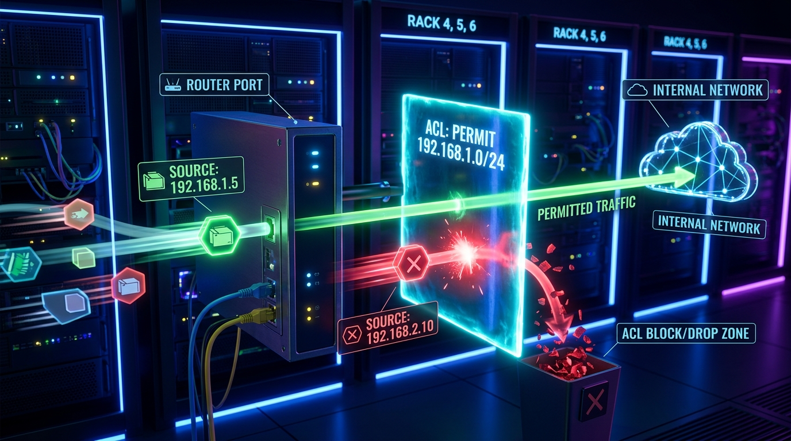

← [[Course on CCNA|Go Back to Course Hub]]

# 🔒 Day 33: Access Control Lists (ACLs) - Part 1 (Standard ACLs)

Welcome to the notes for **Day 33: Access Control Lists (ACLs) - Part 1** of Jeremy's IT Lab CCNA Complete Course! Aaj hum network security aur traffic management ka ek sabse basic aur core component seekhenge—**Access Control Lists (ACLs)**. Is lecture note mein hum seekhenge ki ACLs kya hoti hain, router unhe kaise process karta hai, aur **Standard ACLs** ki working, placement rules aur configuration ko step-by-step detail aur premium illustrations ke sath cover karenge. Ye notes Hinglish language aur English/Latin script mein hain.

---

## 🚦 1. What is an Access Control List (ACL)?

Ek **Access Control List (ACL)** rules ki ek ordered list hoti hai jise router par incoming ya outgoing IP packets ko filter (permit ya deny) karne ke liye configure kiya jata hai. 

*   **The Packet Filter:** ACLs router ke ports par ek stateless firewall ki tarah kaam karti hain.
*   **Why use ACLs?**
    1.  **Security:** External networks se dynamic attacks ya unauthorized access ko block karne ke liye.
    2.  **Traffic Control:** Specific hosts ya subnets ke traffic ko filter karne ke liye (e.g., HR department ko Finance servers ka access allow karna, par Sales ko block karna).

---

### OSPF-Style Routing / Processing Logic of ACLs:
Jab ek packet kisi aisi interface par aata hai jahan ACL applied hai, toh router niche likhe principles ke mutabik decision leta hai:



1.  **Sequential Top-Down Processing:** Router ACL ke rules ko line-by-line (from top to bottom) evaluate karta hai (Rule 10, then Rule 20, etc.).
2.  **First-Match Logic:** Jaise hi packet kisi rule se match ho jata hai, router wahi action (Permit ya Deny) le leta hai aur **baki bache rules ko read karna band** kar deta hai.
3.  **The Implicit Deny (Invisible Rule):**
    *   Har ek ACL ke end mein ek invisible (hidden) rule hota hai: **`deny any`** (ya `deny ip any any`).
    *   **Result:** Agar koi packet ACL ke kisi bhi rule se match nahi hota, toh use automatically drop/discard kar diya jata hai.
    *   *Warning:* Isliye har operational ACL mein kam se kam ek **`permit`** statement hona mandatory hai, warna saara traffic block ho jayega!
4.  **Directional Filtering:** ACLs ko interface par do directions mein apply kiya ja sakta hai:
    *   **Inbound (in):** Packet router ke interface ke andar ghusne se pehle filter hota hai.
    *   **Outbound (out):** Packet interface se exit hone se pehle filter hota hai.

---

## 🔍 2. Standard ACLs vs. Extended ACLs (Introduction)

CCNA syllabus mein ACLs ko do primary classes mein split kiya gaya hai:

1.  **Standard ACLs:**
    *   **Filtering Parameters:** Ye **sirf aur sirf Source IP Address** ke base par traffic ko filter kar sakti hain. Destination IP, protocol, ya port numbers (like port 80/443) check nahi kiye ja sakte.
    *   **Identification Ranges (Numbered):** `1 - 99` and `1300 - 1999` (expansion range).
2.  **Extended ACLs (Day 34 mein seekhenge):**
    *   **Filtering Parameters:** Source IP, Destination IP, Protocol type (TCP, UDP, ICMP), aur Port numbers (HTTP, SSH) sabhi ko filter kar sakti hain.
    *   **Identification Ranges (Numbered):** `100 - 199` and `2000 - 2699`.

---

### 📐 3. The Standard ACL Placement Rule (Most Important Concept)

> [!IMPORTANT]
> **Place Standard ACLs as close to the Destination as possible!**
> Standard ACL ko hamesha destination network ke jitna ho sake paas lagana chahiye.
>
> **Reason:** Kyunki Standard ACL sirf source IP check kar sakti hai. Agar aapne use source network ke paas hi apply kar diya, toh woh source host ka saara traffic block kar degi—jis se host na toh destination tak pahunch payega aur na hi kisi doosre allowed network tak.

#### 💡 Placement Example:
*   **Topology:** `Host-A (Source)` $\rightarrow$ `Router-1` $\rightarrow$ `Router-2` $\rightarrow$ `Server-A (Destination)` and `Server-B (Internet)`.
*   **Goal:** Block Host-A from accessing Server-A, but allow Host-A to access Server-B.
    *   *If applied on Router-1 (near Source):* Host-A ka traffic link par hi drop ho jayega. Host-A na Server-A tak ja payega, na Server-B tak (Goal failed, unnecessary blockage).
    *   *If applied on Router-2 (near Destination Server-A):* Host-A Router-1 cross karega, Server-B tak chala jayega (allowed). Lekin jaise hi Server-A ke port (Router-2 interface) par jayega, block ho jayega. Goal successfully achieved!

---

## 💻 4. Cisco CLI Configuration & Editing

### A. Numbered Standard ACL Config:
Hum ACL 10 configure karenge: Host `192.168.1.5` ko deny karna hai, subnet `192.168.1.0/24` ko permit karna hai, aur baki sabko deny (implicit).

```ios
Router(config)# access-list 10 deny host 192.168.1.5               ! Deny specific host
Router(config)# access-list 10 permit 192.168.1.0 0.0.0.255        ! Permit remaining subnet using Wildcard mask
```

---

### B. Named Standard ACL Config (Recommended):
Named ACLs configuration clear options provide karti hain aur edit karna easy hota hai.

```ios
! Named ACL create karein
Router(config)# ip access-list standard BLOCK_LAN_TRAFFIC
Router(config-std-nacl)# deny host 192.168.1.5
Router(config-std-nacl)# permit 192.168.1.0 0.0.0.255
Router(config-std-nacl)# permit any                                ! Explicitly permit everything else
```

---

### C. Interface Par Apply Karna:
Configure karne ke baad interface par application directive setup karna mandatory hai:

```ios
Router(config)# interface gigabitethernet 0/1
Router(config-if)# ip access-group BLOCK_LAN_TRAFFIC out           ! Apply outbound
```

---

### D. Editing ACLs using Sequence Numbers:
Cisco IOS standard ACL statements ko default sequence increments of **10** (10, 20, 30...) ke sath store karta hai. Agar hume rules ke beech mein naya rule insert karna ho:

```ios
Router# show ip access-lists
Standard IP access list BLOCK_LAN_TRAFFIC
    10 deny 192.168.1.5
    20 permit 192.168.1.0, wildcard bits 0.0.0.255

! Rule 10 aur 20 ke beech mein dynamic insertion:
Router(config)# ip access-list standard BLOCK_LAN_TRAFFIC
Router(config-std-nacl)# 15 deny host 192.168.1.10                 ! Inserts at sequence 15
```

---

## 🔍 5. Verification Commands

*   **Saare configured ACLs aur unke stats (match counters) dekhne ke liye:**
    ```ios
    Router# show ip access-lists
    ```
    *Output snippet:*
    ```text
    Standard IP access list BLOCK_LAN_TRAFFIC
        10 deny 192.168.1.5 (24 matches)                           ! Shows how many packets matched this rule
        15 deny 192.168.1.10
        20 permit 192.168.1.0, wildcard bits 0.0.0.255 (150 matches)
    ```
*   **Specific interface configurations ke applied access-groups check karne ke liye:**
    ```ios
    Router# show ip interface gigabitethernet 0/1
    ```
    *Output snippet:*
    > Outgoing access list is BLOCK_LAN_TRAFFIC
    > Inbound access list is not set

---

## 📝 6. CCNA Day 33 Practice Questions

1. **Q1: Router Access Control Lists (ACLs) process karte waqt sequential parsing ke kis logical principle ko follow karta hai?**
   <details>
   <summary>🔓 Click to Reveal Answer</summary>
   **Answer:** **Sequential Top-Down Processing** aur **First-Match Logic** (Jo rule pehle match hoga, uska action execute hoga aur aage ki verification skip ho jayegi).
   </details>

2. **Q2: OSPF structures ki tarah, har ek configured ACL list ke end mein automatic kaun sa invisible rule applied rehta hai?**
   <details>
   <summary>🔓 Click to Reveal Answer</summary>
   **Answer:** **Implicit Deny** (`deny any`). Jo packets kisi bhi configured statement se match nahi karte, wo drop ho jate hain.
   </details>

3. **Q3: Standard Access Control Lists (ACLs) traffic ko control ya permit karne ke liye header ke kis criteria segment ko check kar sakti hain?**
   <details>
   <summary>🔓 Click to Reveal Answer</summary>
   **Answer:** **Sirf Source IP Address** segments ko. (Destination IP, Ports, ya Protocols evaluate nahi ho sakte).
   </details>

4. **Q4: Standard numbered ACLs configure karne ke liye Cisco router par numeric address ranges kya scale support karti hain?**
   <details>
   <summary>🔓 Click to Reveal Answer</summary>
   **Answer:** **`1 - 99`** aur expansion range **`1300 - 1999`**.
   </details>

5. **Q5: Standard Access Control Lists (ACLs) ko structural topology mein kahan placement design rules ke according apply karna chahiye?**
   <details>
   <summary>🔓 Click to Reveal Answer</summary>
   **Answer:** **As close to the destination as possible** (Destination network ke paas, taaki source ka valid traffic doosre networks par block na ho).
   </details>

6. **Q6: ACL command syntax `access-list 10 permit host 10.1.1.1` mein keyword `host` kis wildcard mask parameters equivalent value hold karta hai?**
   <details>
   <summary>🔓 Click to Reveal Answer</summary>
   **Answer:** **`0.0.0.0`** (Match exact target IP address).
   </details>

7. **Q7: Access Control Lists (ACLs) rules define karne ke liye subnet parameters ke space check mein kis numeric variables format ka use karti hain?**
   <details>
   <summary>🔓 Click to Reveal Answer</summary>
   **Answer:** **Wildcard Masks** (Subnet mask ka inverse parameters representation).
   </details>

8. **Q8: Configured ACL lists ko GigabitEthernet interface par outbound flow direction mein bind karne ki exact command syntax kya hai?**
   <details>
   <summary>🔓 Click to Reveal Answer</summary>
   **Answer:** Interface configuration mode command: **`ip access-group <ACL-name/number> out`**.
   </details>

9. **Q9: Named standard ACLs statements ke beech custom sequence numbers sequence (jaise 15) par manual rules inject karne ke design command modes step hierarchy kya hogi?**
   <details>
   <summary>🔓 Click to Reveal Answer</summary>
   **Answer:** 
   1. Global config mode: `ip access-list standard <name>`
   2. Sub-mode config line: `<sequence-number> <permit/deny> <matching-criteria>` (e.g. `15 deny host 10.1.1.5`).
   </details>

10. **Q10: Routers interfaces par applied filters data flows verification aur dynamic drop match counters parameters check karne ki standard operational command kya hai?**
    <details>
    <summary>🔓 Click to Reveal Answer</summary>
    **Answer:** **`show ip access-lists`** (ya generic `show access-lists`) command.
    </details>
