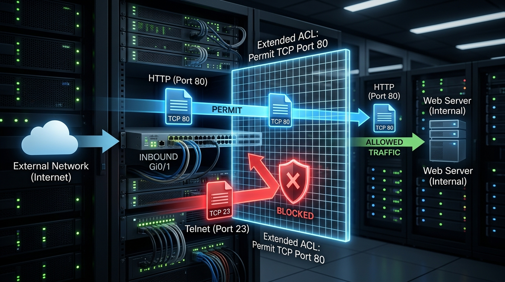

← [[Course on CCNA|Go Back to Course Hub]]

# 🔒 Day 34: Access Control Lists (ACLs) - Part 2 (Extended ACLs)

Welcome to the notes for **Day 34: Access Control Lists (ACLs) - Part 2** of Jeremy's IT Lab CCNA Complete Course! Aaj hum **Extended ACLs** ke details, granular traffic filtering (using source/destination IP, Layer 4 Protocols like TCP/UDP, and port numbers), unke placement rules, configuration commands, and ACL **Resequencing** (sequence numbers ko re-index karna) ko cover karenge. Ye notes Hinglish language aur English/Latin script mein detailed explanations, analogies, diagrams, aur CLI commands ke sath hain.

---

## 🚦 1. What are Extended ACLs?

Standard ACLs (Day 33) sirf source IP ke address par traffic permit/deny kar sakti thi, jo bahut limited aur rough configuration thi.

**Extended ACLs** hume traffic control karne ke liye high level granularity provide karti hain. Inme hum traffic ko niche diye gaye parameters ke combinations ke base par filter kar sakte hain:
1.  **Source IP Address** (Kahan se packet chal raha hai).
2.  **Destination IP Address** (Kahan packet ja raha hai).
3.  **Protocol Type** (IP, TCP, UDP, ICMP, etc.).
4.  **Source & Destination Port Numbers** (Layer 4 ports jaise HTTP 80, SSH 22, HTTPS 443).

### Numbered Identification Ranges:
*   Standard range: **`100 - 199`**
*   Expanded range: **`2000 - 2699`**

---

### 📐 2. The Extended ACL Placement Rule

> [!IMPORTANT]
> **Place Extended ACLs as close to the Source as possible!**
> Extended ACL ko hamesha **source network ke sabse paas** (close to the source) lagana chahiye.
>
> **Reason:** Kyunki Extended ACL mein source aur destination dono IP addresses mapped hote hain, isliye router ko pehle se pata hota hai ki packet kahan ja raha hai. Agar hum use source ke paas hi block kar dein, toh packet faltu mein poore network link/bandwidth ko consume karke destination router tak travel nahi karega. Isse transit links par unnecessary traffic load save hota hai.

---

## ⚙️ 3. Extended ACL Port & Protocol Filtering

Extended ACLs dynamically headers ke specific port aur protocols check karti hain:



### Cisco CLI Operators:
Port range specifications ke liye Cisco standard operators support karta hai:
*   **`eq`** (equal to): Matches specific port (e.g. `eq 80` or `eq www`).
*   **`neq`** (not equal to): Matches everything except the specified port.
*   **`gt`** (greater than): Matches ports higher than the specified number.
*   **`lt`** (less than): Matches ports lower than the specified number.
*   **`range`** (range of ports): Matches a range of ports (e.g. `range 20 25`).

---

## 💻 4. Cisco CLI Configurations

### A. Numbered Extended ACL Config:
Host `192.168.1.10` ko target server `10.1.1.5` ka Telnet (port 23) access deny karna hai, par baaki sab networks ko full IP access allow karna hai.

```ios
! Access List Number: 100
! Command structure: access-list <num> deny <protocol> <source> <destination> eq <port>
Router-A(config)# access-list 100 deny tcp host 192.168.1.10 host 10.1.1.5 eq 23

! Baaki saare IP traffic ko permit karein (Implicit deny se bachne ke liye)
Router-A(config)# access-list 100 permit ip any any
```

---

### B. Named Extended ACL Config (Recommended):
Named extended ACLs configurations clean and flexible design deti hain:

```ios
! Named Extended ACL create karein
Router-A(config)# ip access-list extended SECURE_WEB_ONLY

! Subnet 192.168.2.0/24 se Server 10.1.1.100 tak sirf HTTP (port 80) aur HTTPS (port 443) traffic permit karein
Router-A(config-ext-nacl)# permit tcp 192.168.2.0 0.0.0.255 host 10.1.1.100 eq 80
Router-A(config-ext-nacl)# permit tcp 192.168.2.0 0.0.0.255 host 10.1.1.100 eq 443

! Baaki saara traffic filter block ho jayega automatically via Implicit Deny
```

```ios
! Apply to Interface closest to Source
Router-A(config)# interface gigabitethernet 0/0
Router-A(config-if)# ip access-group SECURE_WEB_ONLY in
```

---

## 🔢 5. ACL Entry Resequencing

Default configuration mein jab aap ACL statements add karte hain, toh Cisco IOS unhe sequence numbers of **10** (10, 20, 30...) increments mein map karta hai.

Agar aapne rules dynamically edit kiye hain (jaise sequence 12, 15, 18 par custom rules inject kiye hain) aur aap rules table ko dobara clean look dena chahte hain, toh aap **Resequence** command use kar sakte hain:

### Command Syntax:
```ios
Router(config)# ip access-list resequence <acl-name-or-number> <starting-sequence> <increment>
```

### Example:
`BLOCK_LAN` ACL ke statements ko sequence 10 se start karke step-size 10 par reset karna:
```ios
Router(config)# ip access-list resequence SECURE_WEB_ONLY 10 10
```
*Iske badle saare rules dynamic order clean increments (10, 20, 30, 40...) par reset ho jayenge.*

---

## 🔍 6. Verification Commands

*   **Saare configured Extended ACLs rules aur matches data check karne ke liye:**
    ```ios
    Router# show ip access-lists SECURE_WEB_ONLY
    ```
*   **Active active-groups interface status verify karne ke liye:**
    ```ios
    Router# show ip interface gigabitethernet 0/0
    ```

---

## 📝 7. CCNA Day 34 Practice Questions

1. **Q1: Extended Access Control Lists (ACLs) Standard ACLs ke relative kyu advanced capability parameter hold karti hain?**
   <details>
   <summary>🔓 Click to Reveal Answer</summary>
   **Answer:** Kyunki Extended ACLs traffic ko source IP ke alawa **Destination IP, Protocol type (TCP/UDP/ICMP), aur Port numbers** ke combinations par fine-grained filter kar sakti hain.
   </details>

2. **Q2: Extended numbered Access Control Lists (ACLs) define karne ke liye Cisco switches/routers par starting ranges limits kya define hoti hain?**
   <details>
   <summary>🔓 Click to Reveal Answer</summary>
   **Answer:** Numbered ranges **`100 - 199`** aur expansion range **`2000 - 2699`** hoti hain.
   </details>

3. **Q3: Extended ACLs ko network topology design mein kahan placement rule ke standard par locate/apply kiya jana chahiye?**
   <details>
   <summary>🔓 Click to Reveal Answer</summary>
   **Answer:** **As close to the source as possible** (Source network ke sabse paas interface inbound par, taaki unwanted traffic local link par hi drop ho jaye aur bandwidth waste na ho).
   </details>

4. **Q4: Extended ACL syntax `access-list 101 permit tcp any host 10.1.1.1 eq www` mein keyword `www` kis dynamic port value equivalence ko denote karta hai?**
   <details>
   <summary>🔓 Click to Reveal Answer</summary>
   **Answer:** HTTP service on **TCP Port `80`**.
   </details>

5. **Q5: Extended ACL port ranges configure karte waqt, kis dynamic operator word use specify range boundaries ke liye kiya jata hai (e.g. ports 20 to 25)?**
   <details>
   <summary>🔓 Click to Reveal Answer</summary>
   **Answer:** **`range`** operator (e.g. `range 20 25`).
   </details>

6. **Q6: Extended ACL command configurations mein keyword `ip` (as a protocol) specify karne par dynamic checks kis criteria parameters logic ko verify karenge?**
   <details>
   <summary>🔓 Click to Reveal Answer</summary>
   **Answer:** **All Layer 4 Protocols** (TCP, UDP, ICMP, etc. sabhi permit/deny logic IP protocol keyword ke block matching range under verify honge).
   </details>

7. **Q7: Router configurations check mein, existing ACL lines indices (e.g., sequence 12, 17, 23) ko automatic clear step intervals (10, 20, 30...) par lock re-order karne wali command kya hai?**
   <details>
   <summary>🔓 Click to Reveal Answer</summary>
   **Answer:** Global command: **`ip access-list resequence <acl-name> <starting-seq> <increment>`**.
   </details>

8. **Q8: Extended ACL query command line `access-list 105 permit udp host 10.1.1.2 any eq domain` kis layer-4 service access ko verify kar rahi hai?**
   <details>
   <summary>🔓 Click to Reveal Answer</summary>
   **Answer:** **DNS Query (domain)** routing access on **UDP Port `53`**.
   </details>

9. **Q9: Numbered extended ACL parameters configuration block save complete hone par, implicit deny variables se dynamic traffic block safe flow secure control line statement syntax kya check karegi?**
   <details>
   <summary>🔓 Click to Reveal Answer</summary>
   **Answer:** ACL permit rule line: **`permit ip any any`** (allowing remaining IP communication).
   </details>

10. **Q10: Extended access lists data checks, interface bindings aur matched packets counters check karne ki verify command kya hai?**
    <details>
    <summary>🔓 Click to Reveal Answer</summary>
    **Answer:** **`show ip access-lists`** (ya generic `show access-lists`) command.
    </details>
