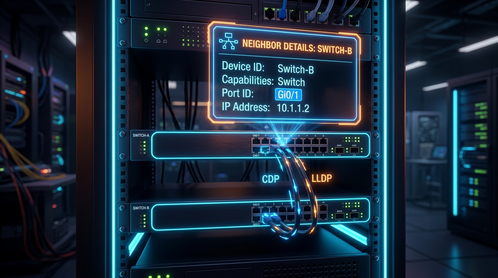

← [[Course on CCNA|Go Back to Course Hub]]

# 🌐 Day 35: Cisco Discovery Protocol (CDP) & Link Layer Discovery Protocol (LLDP)

Welcome to the notes for **Day 35: CDP & LLDP** of Jeremy's IT Lab CCNA Complete Course! Aaj hum **Layer 2 Discovery Protocols** ke baare mein seekhenge jo network engineers ko directly connected physical devices ko discover karne aur network mapping/documentation banane mein madad karte hain. Hum Cisco-proprietary **CDP** aur open-standard **LLDP** ke differences, default timers, CLI configurations, and verification tables ko step-by-step detail aur premium illustrations ke sath cover karenge. Ye notes Hinglish language aur English/Latin script mein hain.

---

## 🔍 1. Introduction to Layer 2 Discovery Protocols

Ek network administrator jab kisi naye server room ya data center mein jata hai, toh use aksar ye nahi pata hota ki kaun sa port kis switch ya switch port se connected hai. 

**Layer 2 Discovery Protocols** is issue ko dynamically solve karte hain:
*   **Layer 2 Operation:** Ye protocols **Data Link Layer (L2)** par chalte hain. Iska matlab hai ki dono switches ya routers ke connecting ports par **IP Address configure hona zaroori nahi hai**; bina IP configuration ke bhi ye aamne-saamne connected devices ki saari hardware details discover kar lete hain.
*   **Neighbor Discovery:** Apne directly connected adjacent neighbors ko periodic advertisements send karte hain. (Note: Ye intermediate switches ko bypass nahi kar sakte, sirf direct physical connection trace karte hain).

---

## 🌲 2. Cisco Discovery Protocol (CDP)

**CDP** Cisco devices ka standard proprietary protocol hai jo default settings ke sath network setup ko automatically analyze karta hai.

### A. CDP Characteristics:
*   **Cisco Proprietary:** Sirf Cisco switches, routers, firewalls, aur IP phones ke beech chalega.
*   **Status:** Cisco IOS devices par **by default globally enabled** hota hai.
*   **Timers:**
    *   **Hello Timer:** Har **`60 seconds`** mein CDP advertisement frame send karta hai.
    *   **Holdtime:** **`180 seconds`** (Hello * 3). Agar neighbor se 180s tak koi packet na mile, toh database se uski entry delete ho jati hai.
*   **CDP Versions:**
    *   *CDPv1:* Basic neighbor discovery.
    *   *CDPv2:* Advanced functionality support (duplex status mismatches, native VLAN mismatches, Voice VLAN options verify karta hai). Today, CDPv2 is standard.

---

## 🌐 3. Link Layer Discovery Protocol (LLDP)

Jab network multi-vendor (Cisco, Juniper, HP, Netgear, etc.) hardware use karta hai, toh CDP block ho jata hai. Iske liye open industry standard **LLDP (IEEE 802.1AB)** use hota hai.

### A. LLDP Characteristics:
*   **Open Standard:** Kisi bhi vendor ke switch/router par easily neighbor trace kar sakta hai.
*   **Status:** Cisco Catalyst switches par **by default globally disabled** hota hai. Admin ko ise manually start karna padta hai (`lldp run`).
*   **Timers:**
    *   **Hello Timer:** Har **`30 seconds`** mein packet send karta hai.
    *   **Holdtime:** **`120 seconds`** (Hello * 4).
*   **LLDP-MED (Media Endpoint Discovery):** 
    *   VoIP IP phones ko dynamic voice VLAN and PoE power information configurations push karne ke liye customize kiya gaya standard extension.

---

## 🗺️ 4. CDP vs LLDP: The Core Comparison



| Feature | CDP (Cisco Discovery Protocol) | LLDP (Link Layer Discovery Protocol) |
| :--- | :--- | :--- |
| **Standard Type** | Cisco Proprietary | Open Standard (IEEE 802.1AB) |
| **Default State** | **Enabled** on Cisco devices | **Disabled** on some Cisco devices |
| **Hello Advertisement Interval** | **60 seconds** | **30 seconds** |
| **Holdtime (Expiry)** | **180 seconds** | **120 seconds** |
| **Interface granularity** | Turn on/off on interface | Configure **transmit** and **receive** separately |

---

## 💻 5. Cisco CLI Configurations

### A. CDP Configurations:
CDP globally enabled hota hai, par specific ports (jaise client PCs or external ISP lines) par security ke liye ise disable karna zaroori hai.

```ios
! Globally CDP disable karna (Cisco devices par by default 'cdp run' enabled hota hai)
Router-A(config)# no cdp run

! Specific interface par CDP disable karna
Router-A(config)# interface gigabitethernet 0/0
Router-A(config-if)# no cdp enable
```

---

### B. LLDP Configurations:
LLDP ko pehle globally enable karna hota hai, aur interfaces par iske transmit (send) aur receive (read) states ko customize kiya ja sakta hai.

```ios
! Globally LLDP enable karna (Mandatory first step)
Router-A(config)# lldp run

! Specific interface par configure karna:
Router-A(config)# interface gigabitethernet 0/1
Router-A(config-if)# lldp transmit                   ! Only send LLDP frames
Router-A(config-if)# lldp receive                    ! Only process received LLDP frames

! Interface par complete LLDP disable karna:
Router-A(config-if)# no lldp transmit
Router-A(config-if)# no lldp receive
```

---

## 🔍 6. Verification Commands

### A. CDP Verification:
Directly connected switches/routers ki brief table list dekhne ki command:
```ios
Router-A# show cdp neighbors
```
*Output snippet:*
```text
Capability Codes: R - Router, T - Trans Bridge, B - Source Route Bridge
                  S - Switch, H - Host, I - IGMP, r - Repeater, P - Phone

Device ID        Local Intrfce     Holdtme    Capability  Platform  Port ID
Switch-B         Gig 0/1           154          S I       WS-C2960- Gig 0/1
Router-C         Gig 0/2           172          R         CISCO1941 Gig 0/0
```
> [!NOTE]
> *   `Device ID`: Neighbor device ka configured Hostname (e.g. `Switch-B`).
> *   `Local Intrfce`: Hamara local port jo neighbor se connected hai (e.g. `Gig 0/1`).
> *   `Holdtme`: Remaining seconds check jiske baad timer expiry hogi.
> *   `Capability`: Device type (S = Switch, R = Router).
> *   `Port ID`: Neighbor device ka interface jisse hum connect hain (e.g. `Gig 0/1`).

#### Detailed Verification (IP addresses and OS versions check):
```ios
Router-A# show cdp neighbors detail
```
*Is command se neighbor switch ka configured management **IP Address**, IOS software version, native VLAN settings, and duplex mismatch status detailed text format mein visible hota hai.*

---

### B. LLDP Verification:
LLDP neighbors brief details verification commands:
```ios
Router-A# show lldp neighbors
Router-A# show lldp neighbors detail
```

---

## 📝 7. CCNA Day 35 Practice Questions

1. **Q1: Layer 2 Discovery Protocols (CDP aur LLDP) connect ports par IP address configurations ke bina aapas mein devices details kaise read kar lete hain?**
   <details>
   <summary>🔓 Click to Reveal Answer</summary>
   **Answer:** Kyunki ye protocols **Layer 2 (Data Link Layer)** par directly physical links par frames exchange karte hain, isliye dynamic L3 (IP) setups ki zaroorat nahi hoti.
   </details>

2. **Q2: CDP (Cisco Discovery Protocol) default hello transmission interval timer aur holdtime counters limits kya hoti hain?**
   <details>
   <summary>🔓 Click to Reveal Answer</summary>
   **Answer:** Hello timer **`60 seconds`** aur Holdtime **`180 seconds`**.
   </details>

3. **Q3: Multi-vendor data networks (jaise Cisco aur HP switches combined connect hon) par neighbor detail trace karne ke liye kis open standard protocol ka use kiya jata hai, aur iska IEEE index number kya hai?**
   <details>
   <summary>🔓 Click to Reveal Answer</summary>
   **Answer:** **LLDP (Link Layer Discovery Protocol)**, jiska standard **IEEE 802.1AB** hai.
   </details>

4. **Q4: Cisco Catalyst switches par by default LLDP status (globally enabled or disabled) kya hota hai?**
   <details>
   <summary>🔓 Click to Reveal Answer</summary>
   **Answer:** **Globally Disabled** hota hai (ISE run karne ke liye global `lldp run` chalana padta hai).
   </details>

5. **Q5: LLDP default hello packet advertisements send karne ka duration timer aur holdtime expiry counter limits kya check hold karti hain?**
   <details>
   <summary>🔓 Click to Reveal Answer</summary>
   **Answer:** Hello timer **`30 seconds`** aur Holdtime **`120 seconds`**.
   </details>

6. **Q6: Interface level configuration mode par LLDP features ko dynamically and separately transmit aur receive configure karne ke command line syntaxes kya hain?**
   <details>
   <summary>🔓 Click to Reveal Answer</summary>
   **Answer:** Interface mode commands: **`lldp transmit`** (packet send) aur **`lldp receive`** (packet read).
   </details>

7. **Q7: IP Phones connectivity ke time voice VLAN settings aur PoE (Power over Ethernet) requirements share karne ke liye LLDP ke kis specific framework parameter standard extension ka use kiya jata hai?**
   <details>
   <summary>🔓 Click to Reveal Answer</summary>
   **Answer:** **LLDP-MED (Media Endpoint Discovery)**.
   </details>

8. **Q8: CDPv2 standard legacy CDPv1 ke parameters scale ke relative extra parameters karke kinke dynamic errors checks identify karne mein madad karta hai?**
   <details>
   <summary>🔓 Click to Reveal Answer</summary>
   **Answer:** Interface duplex settings mismatch, native VLAN mismatch, aur Voice VLAN properties verify karne mein.
   </details>

9. **Q9: Connected cisco neighbor routers aur switches ke management IP addresses, model platforms, aur software versions list clear detail show karne ki cisco CLI verify command kya hai?**
   <details>
   <summary>🔓 Click to Reveal Answer</summary>
   **Answer:** Operational mode command: **`show cdp neighbors detail`**.
   </details>

10. **Q10: Cisco switch interface GigabitEthernet 0/1 par CDP status packet exchange process completely switch-off karne ki dynamic command syntax kya hai?**
    <details>
    <summary>🔓 Click to Reveal Answer</summary>
    **Answer:** Interface configuration mode command: **`no cdp enable`**.
    </details>
