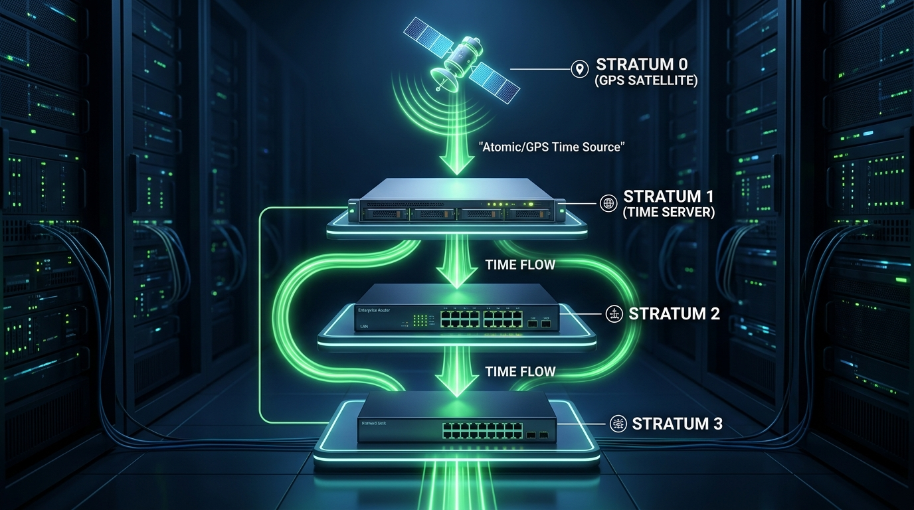

← [[Course on CCNA|Go Back to Course Hub]]

# ⏰ Day 36: Network Time Protocol (NTP)

Welcome to the notes for **Day 36: Network Time Protocol (NTP)** of Jeremy's IT Lab CCNA Complete Course! Aaj hum network devices par time synchronization ke importance ko samjhenge, aur seekhenge ki kaise **NTP** hamare switches aur routers ke clocks ko automated precision sources ke sath sync karta hai. Hum Stratum levels hierarchy, NTP operating modes, authentication, CLI configurations, and verification commands ko step-by-step detailed explanations aur premium illustrations ke sath cover karenge. Ye notes Hinglish language aur English/Latin script mein hain.

---

## 🚦 1. Why Time Synchronization is Critical

Switches aur routers par accurate clock configuration aur synchronization normal parameters ke run hone ke liye bahut crucial hai. Agar time synced nahi hai, toh niche di gayi vulnerabilities create hoti hain:

1.  **Syslog Message Correlation:**
    *   Jab network par koi error ya attack hota hai, toh devices logs generate karti hain (Syslogs). 
    *   Agar Switch-A par time `2015` chal raha ho aur Switch-B par `2026`, toh administrator ke liye dynamic log matching aur issue root-cause detect karna impossible ho jayega.
2.  **Digital Certificates (Security):**
    *   HTTPS, SSH ya VPN connectivity use karne ke liye security certificates runtime verification time parameters check karte hain. Agar switch ka time outdated hai, toh system certificate ko invalid treat karega aur connection fail ho jayega.

---

## 🌐 2. Manual Time Configuration vs. NTP

Network devices par clock update karne ke do tarike hain:

### A. Manual Clock Config:
*   Admin manually calendar setup commands run karta hai.
*   **Drawback:** Dynamic software clock router restart hone par clear ho jati hai jab tak use hardware calendar updates se sync na kiya jaye. Manual clock set karna highly scales networks par tedious hai.

### B. Network Time Protocol (NTP - RFC 5905):
*   NTP **UDP Port `123`** ka use karke clients ko trusted time server ke dynamic timing updates broadcast karta hai.
*   NTP automatically network transit delays (latency) ko calculate karke dynamic compensation adjustments perform karta hai taaki sub-millisecond precision sync maintain rahe.

---

## 🏛️ 3. NTP Stratum Levels (The Hierarchy)

NTP synchronization source ki distance aur precision measure karne ke liye **Stratum Levels** hierarchy ka use karta hai. Stratum value **`0` se `15`** ke scale par work karti hai (Lower stratum value means higher precision/trust):



### Stratum Level Breakdown:
1.  **Stratum 0 (Authoritative Reference Clocks):**
    *   Ye high-precision hardware clocks hote hain, jaise Atomic Clocks (Cesium/Rubidium) ya GPS satellites.
    *   *Note:* Stratum 0 devices ko networks par directly query/connect nahi kiya ja sakta, inke directly attached servers hi unse connect hote hain.
2.  **Stratum 1 (Primary Server):**
    *   Wo servers jo physically Stratum 0 device (GPS/Atomic Clock) se co-axial cables or serial cables se connected hote hain.
3.  **Stratum 2 (Secondary Server/Client):**
    *   Wo routers ya servers jo dynamic NTP updates network links par Stratum 1 server se receive karte hain.
4.  **Stratum 3 (Client Switch):**
    *   Wo client switches jo Stratum 2 devices se time updates sync karte hain.
5.  **Stratum 16 (Unsynchronized):**
    *   Agar kisi device ka stratum value `16` show ho, toh iska matlab hai ki time sources unreachable hain aur device **unsynchronized** state mein hai (Time reject).

---

## ⚙️ 4. NTP Operating Modes

NTP devices aapas mein data swap karne ke liye teen primary modes mein chal sakti hain:

1.  **Client / Server Mode:**
    *   Client regular intervals par query packets server ko send karta hai, server timing offsets send karta hai aur client time adjust kar leta hai. Client kabhi doosre ko time push nahi karta.
2.  **Symmetric Active / Passive Mode (Peers):**
    *   Do equal-level routers (e.g. dono Stratum 2) aapas mein time details compare aur backup sync karte hain. Agar ek router ka direct link down ho jaye, toh woh apne Peer router se backup synchronization continue rakhta hai.
3.  **Broadcast Mode:**
    *   Server continuous intervals par local segment switches ko time updates push karta hai. client queries bejhe bina auto-adjust karte hain. (Accuracy slightly low hoti hai, local switches ke liye easy hai).

---

## 💻 5. Cisco CLI Configurations & Commands

Cisco routers and switches par timezone setup, manual overrides, aur NTP server synchronization enable karne ke steps:

### A. Manual set & Time Zone Setup:
```ios
! 1. Local Time zone specify karein (e.g. EST with offset -5 hours)
Router-A(config)# clock timezone EST -5

! 2. Daylight Saving (Summer Time) configure karein
Router-A(config)# clock summer-time EDT recurring

! 3. (Optional) Manual Clock change (Admin mode)
Router-A# clock set 10:15:30 27 August 2026

! 4. Hardware Calendar clock update karein software clock ke status par
Router-A# clock update-calendar
```

---

### B. Configuring NTP Client/Server & Peer:
```ios
! 1. Configure NTP Server connection (with 'prefer' keyword to prioritize this server)
Router-A(config)# ntp server 10.1.1.100 prefer

! 2. Configure NTP Peer (Router-B IP address as peer)
Router-A(config)# ntp peer 192.168.12.2
```

---

### C. NTP Authentication (Security Configuration):
Rogue servers se wrong timing configuration accept na karne ke liye authentication enable karna highly recommended hai.

```ios
Router-A(config)# ntp authenticate                              ! Enable authentication engine
Router-A(config)# ntp authentication-key 1 md5 CISCOKEY123       ! Configure shared MD5 key
Router-A(config)# ntp trusted-key 1                             ! Trust key ID 1

! Server config line par Key binding specify karein
Router-A(config)# ntp server 10.1.1.100 key 1
```

---

## 🔍 6. Verification Commands

### A. NTP Sync status checking:
```ios
Router-A# show ntp status
```
*Output snippet:*
```text
Clock is synchronized, stratum 3, reference is 10.1.1.100
nominal frequency is 250.0000 Hz, actual frequency is 250.0000 Hz, precision is 2**24
reference time is E2BF145C.C90B0100 (10:18:20.785 EST Thu Aug 27 2026)
clock offset is 0.4125 msec, root delay is 12.45 msec
```
> [!NOTE]
> *   `Clock is synchronized`: Verify karta hai ki timing server link operational hai.
> *   `stratum 3`: Router ka stratum hierarchy levels represent karta hai (Server `10.1.1.100` stratum 2 segment par active hoga).

---

### B. Configured Servers and Synchronization state list check:
```ios
Router-A# show ntp associations
```
*Output sample:*
```text
  address         ref clock       st   when  poll reach  delay  offset   disp
*~10.1.1.100      192.168.1.5      2     42    64  377    2.12   0.412   1.21
+~192.168.12.2    10.1.1.100       3     12    64  377    4.54   1.523   2.45
```
> [!TIP]
> **Understanding NTP Association Symbols:**
> *   `*` (Master/Synchronized): Current source jisse router active timing values receive aur trust kar raha hai.
> *   `+` (Candidate): Backup trustable NTP servers jo master drop hone par take-over kar sakte hain.
> *   `~` (Configured): Router configurations mein manual command entry exist karti hai.

---

## 📝 7. CCNA Day 36 Practice Questions

1. **Q1: Switched network environment par syslog event analysis correlation ke liye time synchronization kyu mandatory hai?**
   <details>
   <summary>🔓 Click to Reveal Answer</summary>
   **Answer:** Taaki attack logs ya errors check karte waqt, multiple switches par time stamp matches exact sequence trace kar sakein (event correlation troubleshooting).
   </details>

2. **Q2: NTP (Network Time Protocol) dynamic timing signals exchange karne ke liye kis Layer 4 protocol aur Port number ka use karta hai?**
   <details>
   <summary>🔓 Click to Reveal Answer</summary>
   **Answer:** **UDP Port `123`**.
   </details>

3. **Q3: NTP 'Stratum Levels' hierarchy mein Stratum Value ranges kahan tak specify hoti hain?**
   <details>
   <summary>🔓 Click to Reveal Answer</summary>
   **Answer:** **`0` to `15`** (Value 16 is unreachable/unsynchronized).
   </details>

4. **Q4: Stratum 0 device (jaise GPS or Atomic Clock) kis configuration rule ke context par directly network query accept nahi karta?**
   <details>
   <summary>🔓 Click to Reveal Answer</summary>
   **Answer:** Kyunki Stratum 0 hardware network link ports handle nahi karte, wo serial cables or physical lines se directly connected Stratum 1 primary server ko source signal feed karte hain.
   </details>

5. **Q5: Agar do equal-priority routers network loops bypass karne ke liye mutually time table synchronize karna chahein, toh NTP kis operating mode par run hoga?**
   <details>
   <summary>🔓 Click to Reveal Answer</summary>
   **Answer:** **Symmetric Active / Passive Mode (Peers)**.
   </details>

6. **Q6: NTP dynamic time synchronization queries ke space checks mein keyword `prefer` (e.g. `ntp server 10.1.1.1 prefer`) kya specify karta hai?**
   <details>
   <summary>🔓 Click to Reveal Answer</summary>
   **Answer:** Router multiple timing sources configure hone par is server ke timing signals ko master parameter target set karega.
   </details>

7. **Q7: Router hardware clock chip configuration details check karne ke liye privilege EXEC verification command kya hai?**
   <details>
   <summary>🔓 Click to Reveal Answer</summary>
   **Answer:** **`show calendar`** (software clock check karne ke liye `show clock` use hota hai).
   </details>

8. **Q8: `show ntp associations` check command run karte waqt server IP address ke starting columns block par symbols sign `*` kya indicate karta hai?**
   <details>
   <summary>🔓 Click to Reveal Answer</summary>
   **Answer:** **Master/Synchronized status** (Router current time base isi reference server se update kar raha hai).
   </details>

9. **Q9: DHCP dynamic clients setups block check parameters par, NTP security setup authentication enable karne ki dynamic global command kya hai?**
   <details>
   <summary>🔓 Click to Reveal Answer</summary>
   **Answer:** Global configuration command: **`ntp authenticate`**.
   </details>

10. **Q10: OSPF parameters की tarah clock synchronization variables updates save status checks verify karne ke liye primary CLI command kya check parameters return karti hai?**
    <details>
    <summary>🔓 Click to Reveal Answer</summary>
    **Answer:** **`show ntp status`** command.
    </details>
