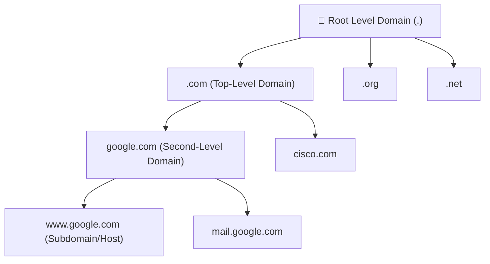

← [[Course on CCNA|Go Back to Course Hub]]

# 🌐 Day 37: Domain Name System (DNS)

Welcome to the notes for **Day 37: Domain Name System (DNS)** of Jeremy's IT Lab CCNA Complete Course! Aaj hum network connectivity aur applications ke core directory service **DNS** ke baare mein seekhenge. Hum DNS hierarchical design, query resolution process, Windows CLI diagnostic tools (`nslookup`), aur Cisco IOS configurations (static host mapping, DNS servers setup) ko step-by-step detailed explanations aur premium illustrations ke sath cover karenge. Ye notes Hinglish language aur English/Latin script mein hain.

---

## 🚦 1. The Purpose of DNS (Name to IP Resolution)

TCP/IP networks par switches, routers aur PCs aapas mein communicate karne ke liye Layer 3 IP addresses ka use karte hain. Lekin humans (insano) ke liye numerical IP addresses (e.g. `142.250.190.46`) yaad rakhna behad mushkil hai. Hum human-readable domain names (e.g. `google.com`) yaad rakhte hain.

**Domain Name System (DNS)** ek distributed directory database hai jo **Domain Names ko unke respective IP addresses mein translate** karta hai (jaise mobile phone ki contact list, jahan name check karne par number dial ho jata hai).

*   **Layer 4 Protocol & Ports:** DNS query resolutions ke liye **UDP Port `53`** ka use karta hai (Kyunki UDP lightweight aur fast hai). Agar query response size large ho (jaise zone transfers), toh DNS reliability ke liye **TCP Port `53`** par fallback karta hai.

---

## 🏛️ 2. The DNS Hierarchical Tree Structure

DNS data ek distributed tree structure form mein organize hota hai jise globally alag-alag root servers handle karte hain:



1.  **Root Level Domain (denoted by a dot `. `):** Tree structure ka top core segment. Internet par total 13 logical root server IP addresses hain (jo globally multiple redundant locations par anycast routing se chalte hain).
2.  **Top-Level Domain (TLD):** Domain type ya country code ko represent karta hai (e.g., `.com`, `.org`, `.net`, `.edu`, `.in`, `.uk`). Ise TLD name servers handle karte hain.
3.  **Second-Level Domain (SLD):** Individual organizations ya companies registries se in names ko buy/register karti hain (e.g., `google.com`, `cisco.com`, `wikipedia.org`).
4.  **Subdomain / Host Name:** Organization ke internal servers (e.g., `www.google.com`, `mail.google.com`).

---

## 🔄 3. How DNS Resolution Works

Jab aap browser mein `google.com` type karte hain, toh IP trace karne ke liye dynamic query resolution sequence execute hota hai:


### Step-by-Step Resolution Flow:
1.  **Local Cache / Hosts File Check:** PC sabse pehle apne local RAM **DNS Cache** aur **Hosts File** (`C:\Windows\System32\drivers\etc\hosts`) check karta hai. Agar wahan entry mil jaye, toh query wahi resolve ho jati hai.
2.  **Query to Local DNS Server (Resolver):** Local cache empty hone par PC apne configured local DNS server (e.g. ISP DNS or Google DNS `8.8.8.8`) ko query bhejta hai.
3.  **Recursive Search (if resolver doesn't have it):**
    *   **Root Server Query:** Local resolver Root server (`.`) se puchta hai. Root server kehta hai, "Mujhe `google.com` nahi pata, par main `.com` TLD server ka address de sakta hoon."
    *   **TLD Server Query:** Resolver TLD server se query karta hai. TLD server `.com` kehta hai, "Mujhe `google.com` ka IP nahi pata, par main iska Authoritative Name Server address de sakta hoon."
    *   **Authoritative Name Server Query:** Resolver final Server (jo company ke IP maps store karta hai) se query karta hai. Authoritative name server `google.com` ka exact public IP address resolution reply bhej deta hai.
4.  **Caching & Response:** Local DNS server IP ko apne cache database mein store karta hai aur client PC ko return kar deta hai. Browser client IP connect karke website open kar leta hai.

---

## 💻 4. Windows & Cisco IOS CLI Configurations

### A. Windows Diagnostic Commands:

#### 1. DNS Server mappings check karne ke liye manual query tool:
```cmd
C:\Users> nslookup google.com
```
*Output snippet:*
```text
Server:  google-public-dns-a.google.com
Address:  8.8.8.8

Non-authoritative answer:
Name:    google.com
Addresses:  142.250.190.46
```

#### 2. Active network interface configuration (including DNS IP) check karne ke liye:
```cmd
C:\Users> ipconfig /all
```

---

### B. Cisco IOS DNS Configurations:

Cisco routers and switches par domain-name parameters and DNS configurations setup karne ke commands:

#### 1. Enable/Disable DNS Lookup (CCNA Lab Tip):
> [!TIP]
> **Why we disable DNS lookup in labs:**
> By default, Cisco IOS par DNS lookup enabled hota hai. Agar aap CLI interface par koi typo (mistyped command jaise `confg` instead of `conf t`) type karte hain, toh router treat karta hai ki aap ping address use kar rahe hain aur dynamic DNS lookups start kar deta hai. Isse console interface 30-60 seconds ke liye hang ho jata hai (`Translating "confg"...domain server...`).
>
> **Solution:** Practice labs mein hum is behavior ko disable kar dete hain:
> ```ios
> Router(config)# no ip domain-lookup
> ```

#### 2. Configure DNS Server (Resolver IP):
```ios
Router(config)# ip domain-lookup                      ! Re-enable DNS lookup for production
Router(config)# ip name-server 8.8.8.8 8.8.4.4        ! Set primary/secondary DNS server IPs
```

#### 3. Static Host Mappings (Local Hosts File equivalent on Router):
Agar aap switches ke management interfaces IP address likhne ke bajaye direct hostname se telnet/ping karna chahte hain, toh static entries configure kar sakte hain:
```ios
Router(config)# ip host Switch-B 10.1.1.2
Router(config)# ip host Router-C 10.1.1.3
```
*Iske badle hum directly console par `ping Switch-B` or `telnet Router-C` command chala sakte hain.*

---

## 🔍 5. Verification Commands

*   **Router par configured host mappings and name servers list dekhne ke liye:**
    ```ios
    Router# show hosts
    ```
    *Output sample:*
    ```text
    Default domain is not configured
    Name/address lookup servers: 8.8.8.8, 8.8.4.4

    Host                      Port  Flags      Age Type   Address(es)
    Switch-B                  None  (temp, OK)  0   IP     10.1.1.2
    Router-C                  None  (perm, OK)  --  IP     10.1.1.3
    ```
    *Note: Flags column mein `perm` static configured hosts ko denote karta hai, aur `temp` dynamic queries ke dynamic caching values ko.*

---

## 📝 6. CCNA Day 37 Practice Questions

1. **Q1: DNS (Domain Name System) core transport protocol properties ke basic lookup query queries ke liye kis L4 Port aur protocol ka use karta hai?**
   <details>
   <summary>🔓 Click to Reveal Answer</summary>
   **Answer:** **UDP Port `53`** (for standard queries) and fallback to **TCP Port `53`** (for large payloads/zone transfers).
   </details>

2. **Q2: DNS hierarchy tree structure mein top starting node segment (.) ko kya kehte hain?**
   <details>
   <summary>🔓 Click to Reveal Answer</summary>
   **Answer:** **Root Level Domain** (Root Server zone).
   </details>

3. **Q3: Domain name ranges jaise `.com`, `.org`, `.net` dynamic DNS classifications mein kiske andruni segments (Category) mein aate hain?**
   <details>
   <summary>🔓 Click to Reveal Answer</summary>
   **Answer:** **TLD (Top-Level Domain)** server zone.
   </details>

4. **Q4: Target domain name ka absolute actual IP record mapping store karne wale final server zone classification ko kya kehte hain?**
   <details>
   <summary>🔓 Click to Reveal Answer</summary>
   **Answer:** **Authoritative Name Server**.
   </details>

5. **Q5: Client computers local networks par dynamic remote DNS queries start karne se pehle local files level par IP trace lookup kahan perform karte hain?**
   <details>
   <summary>🔓 Click to Reveal Answer</summary>
   **Answer:** Local host operating system **Hosts File** database par.
   </details>

6. **Q6: Windows command interface par configured dynamic DNS server status aur manual diagnostic queries trace karne ki tool command name kya hai?**
   <details>
   <summary>🔓 Click to Reveal Answer</summary>
   **Answer:** **`nslookup <domain-name>`** command.
   </details>

7. **Q7: Cisco IOS CLI configure karte waqt mistake commands queries hang prevent karne ke liye dynamic DNS lookup disable karne ki command kya hai?**
   <details>
   <summary>🔓 Click to Reveal Answer</summary>
   **Answer:** Global command: **`no ip domain-lookup`**.
   </details>

8. **Q8: Cisco Router par external DNS server IPs mapping configure karne ki dynamic global command kya use hoti hai?**
   <details>
   <summary>🔓 Click to Reveal Answer</summary>
   **Answer:** Global command: **`ip name-server <IP-1> <IP-2>`**.
   </details>

9. **Q9: Router static configuration tables mein direct hostname to IP address mappings (hosts database) override set karne ki static command syntax kya hai?**
   <details>
   <summary>🔓 Click to Reveal Answer</summary>
   **Answer:** Global configuration command: **`ip host <name> <IP-address>`** (e.g. `ip host Server-A 10.1.1.5`).
   </details>

10. **Q10: Active configured dynamic lookups DNS servers details aur static host entries configuration table check karne ki verify command kya hai?**
    <details>
    <summary>🔓 Click to Reveal Answer</summary>
    **Answer:** Privileged EXEC command: **`show hosts`**.
    </details>
