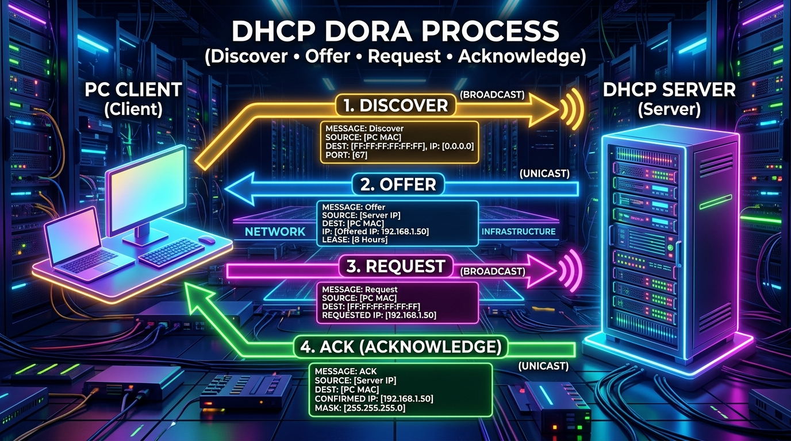

← [[Course on CCNA|Go Back to Course Hub]]

# 🔌 Day 38: Dynamic Host Configuration Protocol (DHCP)

Welcome to the notes for **Day 38: Dynamic Host Configuration Protocol (DHCP)** of Jeremy's IT Lab CCNA Complete Course! Aaj hum dynamic addressing ke standard protocol **DHCP** ke baare mein seekhenge. Hum dynamic host auto-config, the 4-step **DORA** message exchange process, UDP port parameters, **DHCP Relay Agent** (passing broadcasts across routing segments), Cisco IOS DHCP Server and Client configuration, and verification commands ko step-by-step detailed explanations aur premium illustrations ke sath cover karenge. Ye notes Hinglish language aur English/Latin script mein hain.

---

## 🚦 1. The Purpose of DHCP (Automated Addressing)

TCP/IP networks par data routing ke liye har client (PC, Printer, IP Phone) ko matching IP address, subnet mask, default gateway, aur DNS server address ki zaroorat hoti hai.

*   **Static Configuration (Manual):** Administrator ko manually har ek host par jaakar IP configure karna padta hai, jo large networks par administrative overhead aur IP conflict errors (mismatch) create karta hai.
*   **Dynamic Configuration (DHCP - RFC 2131):** DHCP server and dynamic database client hosts ko join hote hi automatically pool se free IP addresses aur standard network configurations lease par assign kar dete hain.

---

## 🏛️ 2. The 4-Step DHCP DORA Process

Jab ek client network interface up hota hai, toh dynamic IP config obtain karne ke liye dynamic **DORA** steps run hote hain. HSRP aur DNS ki tarah, DHCP communication **UDP Port 67 (Server)** aur **UDP Port 68 (Client)** use karti hai:



### Step-by-Step DORA Breakdown:

1.  **Discover (D - Broadcast):**
    *   Client network par check bhejta hai ki "Kya yahan koi DHCP server available hai?"
    *   *Source IP:* `0.0.0.0` (Client doesn't have an IP yet) | *Source Port:* `68`
    *   *Destination IP:* **`255.255.255.255`** (Layer 3 Broadcast) | *Destination Port:* `67`
    *   *MAC Destination:* `FF:FF:FF:FF:FF:FF` (Layer 2 Broadcast)
2.  **Offer (O - Unicast / Broadcast):**
    *   DHCP Server client ko IP address offer karta hai: "Haan, main available hoon. Aap IP address `192.168.1.50` use kar sakte hain."
    *   *Source IP:* Server IP | *Source Port:* `67`
    *   *Destination IP:* Offered IP (or Broadcast) | *Destination Port:* `68`
    *   *Frame Includes:* Subnet mask, lease duration time, default gateway IP, and DNS IP.
3.  **Request (R - Broadcast):**
    *   Client server ko confirm karta hai: "Thank you! Main aapka offered IP `192.168.1.50` select aur use kar raha hoon."
    *   *Source IP:* `0.0.0.0` | *Destination IP:* **`255.255.255.255`**
    *   *Why Broadcast?* Agar local link par multiple DHCP servers ne offers bheje hon, toh client broadcast request bhejta hai taaki baaki servers ko pata chal sake ki unka offer reject ho gaya hai aur unka offered IP database pool mein wapas release kiya ja sake.
4.  **Acknowledge (A - Unicast / Broadcast):**
    *   Server final receipt confirm karta hai: "Got it! `192.168.1.50` IP ab official aapka hai lease duration ke liye."
    *   *Source IP:* Server IP | *Destination IP:* Client IP (or Broadcast).

---

## 🛣️ 3. DHCP Relay Agent (Crossing Routing Boundaries)

DHCP clients initial discovery queries L3 **Broadcast** (`255.255.255.255`) ke zariye bhejte hain. Standard routing rules ke mutabik, routers broad network broadcasts ko drop (block) kar dete hain.

*   **The Problem:** Agar client Subnet-A mein hai aur actual DHCP Server Subnet-B (different routing zone) mein, toh client discovery broadcast router cross nahi kar payega aur client ko IP address configure nahi hoga.
*   **The Solution (DHCP Relay Agent):**
    *   Hum router ke local interface (Subnet-A gateway port) par **`ip helper-address <DHCP-Server-IP>`** command configure karte hain.
    *   Jaise hi router interface par client's DHCP broadcast receive hoti hai, router helper-address check karke broadcast packet ko instantly **Unicast** packet mein encapsulate karta hai, aur routing table search karke directly DHCP Server IP (Subnet-B) ko forward kar deta hai.

```ios
! Router Client-facing interface par configuration:
Router-A(config)# interface gigabitethernet 0/1
Router-A(config-if)# ip helper-address 10.10.10.100    ! Redirects DHCP Broadcasts as Unicasts to DHCP Server IP
```

---

## 💻 4. Cisco IOS DHCP Server & Client Configuration

Cisco routers ko local subnet ke liye dynamic DHCP servers configure karne ke steps:

### A. Cisco IOS DHCP Server Setup:

```ios
! 1. (CRITICAL) IP range exclude karein (taaki servers/gateways ki static IPs dynamic allocate na ho jayein)
Router-A(config)# ip dhcp excluded-address 192.168.1.1 192.168.1.10
Router-A(config)# ip dhcp excluded-address 192.168.1.254

! 2. Create DHCP Address Pool
Router-A(config)# ip dhcp pool LAN_POOL_VLAN10

! 3. Define network range and subnet mask
Router-A(dhcp-config)# network 192.168.1.0 255.255.255.0

! 4. Define Default Gateway IP
Router-A(dhcp-config)# default-router 192.168.1.1

! 5. Define DNS Server IP
Router-A(dhcp-config)# dns-server 8.8.8.8

! 6. Configure Lease time duration (Format: Days Hours Minutes)
Router-A(dhcp-config)# lease 7 0 0                     ! Lease set to 7 days
```

---

### B. Cisco IOS DHCP Client (Getting IP dynamically):
Agar aap router interface ko automatic IP seekhne ke liye client set karna chahte hain (jaise branch connections WAN link par):
```ios
Router-B(config)# interface gigabitethernet 0/0
Router-B(config-if)# ip address dhcp                   ! Request IP from local DHCP server
Router-B(config-if)# no shutdown
```

---

## 🔍 5. Verification Commands

*   **Active assigned IP addresses aur respective Client MAC table mappings dekhne ke liye:**
    ```ios
    Router-A# show ip dhcp binding
    ```
    *Output sample:*
    ```text
    IP address       Client-ID/Hardware address   Lease expiration        Type
    192.168.1.11     0100.5079.6668.01            Aug 29 2026 11:24 AM    Automatic
    ```
*   **DHCP Server Pools statistics aur free address counts check karne ke liye:**
    ```ios
    Router-A# show ip dhcp pool
    ```
*   **IP Conflicts (Duplicate IPs) log database dekhne ke liye:**
    ```ios
    Router-A# show ip dhcp conflict
    ```
    *Cisco IOS ping or Gratuitous ARP checks ke through dynamically IP conflicts detect karta hai aur duplicate range IP block table yahan enter ho jata hai.*

---

## 📝 6. CCNA Day 38 Practice Questions

1. **Q1: DHCP client dynamic IP configurations request start karne ke liye sequence steps ke kis packet flow framework (acronym) ko follow karta hai?**
   <details>
   <summary>🔓 Click to Reveal Answer</summary>
   **Answer:** **DORA** framework:
   1. **D**iscover (Broadcast)
   2. **O**ffer (Unicast/Broadcast)
   3. **R**equest (Broadcast)
   4. **A**cknowledge (Unicast/Broadcast).
   </details>

2. **Q2: DHCP communication client-server exchanges checks ke liye Layer 4 dynamic UDP ports numbers kya use karti hai?**
   <details>
   <summary>🔓 Click to Reveal Answer</summary>
   **Answer:** **UDP Port 67** (Server listens) and **UDP Port 68** (Client listens).
   </details>

3. **Q3: DHCP Discover packet send karte waqt client parameters IP source and destination variables value kya set hoti hai?**
   <details>
   <summary>🔓 Click to Reveal Answer</summary>
   **Answer:** Source IP **`0.0.0.0`** aur Destination IP **`255.255.255.255`** (Layer 3 Broadcast).
   </details>

4. **Q4: DORA step 3 par, client server selected IP confirmation request (DHCP Request) unicast ke bajaye broadcast kyu bhejta hai?**
   <details>
   <summary>🔓 Click to Reveal Answer</summary>
   **Answer:** Taaki segment par active baki DHCP servers ko notify kiya ja sake ki unka offer reject ho gaya hai aur unka offered IP database pool mein wapas release ho sake.
   </details>

5. **Q5: DHCP broadcasts ko routers drop interfaces se protect karke remote subnets DHCP server tak redirect karne wale configuration node command setup ko kya kehte hain?**
   <details>
   <summary>🔓 Click to Reveal Answer</summary>
   **Answer:** **DHCP Relay Agent** (configured via `ip helper-address` interface command).
   </details>

6. **Q6: Cisco Catalyst router interface GigabitEthernet 0/1 par incoming DHCP broadcasts ko IP `10.10.10.5` par redirect karne ki interface command configuration kya hogi?**
   <details>
   <summary>🔓 Click to Reveal Answer</summary>
   **Answer:** Interface mode command: **`ip helper-address 10.10.10.5`**.
   </details>

7. **Q7: Cisco IOS DHCP Pool define karne se pehle statically assigned IPs (servers/routers IP) dynamic allocation range limits se hatane ke liye access command kya hai?**
   <details>
   <summary>🔓 Click to Reveal Answer</summary>
   **Answer:** Global command: **`ip dhcp excluded-address <low-ip> <high-ip>`** (or single address).
   </details>

8. **Q8: Cisco IOS Router local DHCP Server setup parameters pool create karne aur gateway target specify karne ke dynamic command sub-modes sequences commands lines kya hain?**
   <details>
   <summary>🔓 Click to Reveal Answer</summary>
   **Answer:** 
   1. `ip dhcp pool <name>`
   2. `network <subnet> <mask>`
   3. `default-router <gateway-IP>`.
   </details>

9. **Q9: DHCP Server dynamic bindings database, dynamic IP to MAC address mappings parameters check karne ki privilege EXEC command kya hai?**
   <details>
   <summary>🔓 Click to Reveal Answer</summary>
   **Answer:** Privileged EXEC command: **`show ip dhcp binding`**.
   </details>

10. **Q10: OSPF parameters की tarah network client duplicate IP detections conflicts checking details router table check karne ki verify command name kya hai?**
    <details>
    <summary>🔓 Click to Reveal Answer</summary>
    **Answer:** Privileged EXEC command: **`show ip dhcp conflict`**.
    </details>
