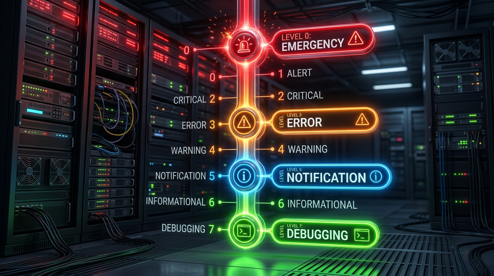

← [[Course on CCNA|Go Back to Course Hub]]

# 📋 Day 40: Syslog (System Logging Protocol)

Welcome to the notes for **Day 40: Syslog** of Jeremy's IT Lab CCNA Complete Course! Aaj hum network devices ke standard audit system **Syslog** ke baare mein seekhenge. Hum log formats, system facility subsystems, mnemonic event codes, and standard **Severity Levels (0-7)** ko explore karenge. Iske sath hi hum console line synchronization configuration (`logging synchronous`), remote syslog server setup, VTY session logging viewing (`terminal monitor`), aur verification commands ko detailed explanations aur premium illustrations ke sath cover karenge. Ye notes Hinglish language aur English/Latin script mein hain.

---

## 🚦 1. What is Syslog?

**Syslog (System Logging Protocol - RFC 5424)** ek network standard protocol hai jiska use network devices (Routers, Switches, Firewalls) log messages (system events, warnings, errors) generate aur centrally store karne ke liye karti hain.

### Key Logging Destinations (Locations):
1.  **Console Line:** Default setup jahan logging output directly serial console interface terminal par print hota hai.
2.  **Terminal Lines (VTY):** SSH ya Telnet session terminals. (Note: In par default logs visible nahi hote jab tak manual parameter run na kiya jaye).
3.  **Buffered Logging (RAM):** Logs router ke physical RAM cache buffer mein local memory mein store hote hain. Device reboot hone par ye logs delete ho jate hain.
4.  **Syslog Server:** Logs network link par centrally external Syslog Server database par store hote hain using **UDP Port `514`** (Highly recommended for production).

---

## 🏛️ 2. Syslog Message Format

Cisco IOS par generate hone wala log message ek specific syntactic structure follow karta hai:

```text
%LINK-5-CHANGED: Interface GigabitEthernet0/1, changed state to administratively down
```

*   **`LINK` (Facility):** Subsystem ya software category jo log generate kar rahi hai.
*   **`5` (Severity Level):** Urgency factor index number. Lower number means more critical.
*   **`CHANGED` (Mnemonic):** Event unique identifier uppercase code.
*   **`Interface GigabitEthernet0/1...` (Message Text):** Human-readable event explanation detail.

---

## 🛑 3. Syslog Severity Levels (0 - 7)

Cisco and standard networking systems log levels ko **0 se 7** levels mein classify karte hain:



### Severity Level Details:
*   **Level 0 - Emergency (system unusable):** Device hardware failure ya kernel crash state.
*   **Level 1 - Alert (immediate action needed):** High-priority alerts like temperature limits cross.
*   **Level 2 - Critical (critical conditions):** Core dynamic system failure (e.g. flash memory crash).
*   **Level 3 - Error (error conditions):** Normal operations error (e.g., interface down due to error disabled).
*   **Level 4 - Warning (warning conditions):** Potential threat notice (e.g., duplicate IP address detected).
*   **Level 5 - Notification (normal but significant):** Routing adjacencies changes, interface UP/DOWN status updates.
*   **Level 6 - Informational (informational messages):** Standard admin updates (e.g., configuration changes via console).
*   **Level 7 - Debugging (debugging output):** Output of active `debug` commands (high CPU consumption warnings).

> [!TIP]
> **CCNA Exam Memory Trick for Severity Levels:**
> Aap levels ko is sentence ke capital letters se sequence-wise learn kar sakte hain:
> **E**very **A**ngry **C**at **E**ats **W**et **N**oodles **I**n **D**isgust.
> (0-**E**mergency, 1-**A**lert, 2-**C**ritical, 3-**E**rror, 4-**W**arning, 5-**N**otification, 6-**I**nformational, 7-**D**ebugging).

---

## 💻 4. Cisco IOS CLI Configurations

### A. Logging Targets & Severity Settings:
```ios
! 1. RAM buffer logging size set karein 8192 bytes aur up to level 6 (Informational) filter karein
Router-A(config)# logging buffered 8192 informational

! 2. Console port logging limit set to level 3 (Errors only - console clutters check reduce)
Router-A(config)# logging console error

! 3. Log timestamps format enhance karein (Adds exact Date, Time, Milliseconds)
Router-A(config)# service timestamps log datetime msec
```

---

### B. Remote Syslog Server Configuration:
Router logs ko dynamic TCP/IP path se remote server target server par forward karna:
```ios
Router-A(config)# logging host 10.10.10.100              ! Set remote Syslog server IP
Router-A(config)# logging trap notifications             ! Send all logs of level 5 (Notifications) and below (0 to 5)
```

---

### C. CLI Output Synchronization & VTY session viewing:

#### 1. Synchronous Logging Config (Life-saving CLI Command):
Default setup mein jab switch koi log generate karta hai, toh command line text ke beech mein hi warning print kar deta hai, jisse dynamic typing line split ho jati hai:
```ios
Router-A(config)# line console 0
Router-A(config-line)# logging synchronous               ! Re-aligns your CLI typing line after log interrupts
Router-A(config)# line vty 0 4
Router-A(config-line)# logging synchronous
```

#### 2. View logs on SSH/Telnet sessions:
SSH/Telnet logins par default console events alerts screen par trigger nahi hote:
```ios
Router-A# terminal monitor                              ! Enables logging display on current SSH/Telnet terminal
! Disabling command: terminal no monitor
```

---

## 🔍 5. Verification Commands

*   **Syslog status configurations, buffer sizes, targets, and stored logs verify karne ke liye:**
    ```ios
    Router-A# show logging
    ```
    *Output details:*
    > Syslog logging: enabled (0 messages dropped, 0 messages discarded)
    > Console logging: level error, 23 messages logged
    > Monitor logging: level debugging, 0 messages logged
    > Buffer logging: level informational, 102 messages logged (8192 bytes buffer)
    > Logging Exception size (4096 bytes)
    > Log Buffer (showing actual log logs lines...)

---

## 📝 6. CCNA Day 40 Practice Questions

1. **Q1: Syslog (System Logging Protocol) remote logging destinations targets configurations ke liye standard kis port and Layer 4 protocol ka use karta hai?**
   <details>
   <summary>🔓 Click to Reveal Answer</summary>
   **Answer:** **UDP Port `514`**.
   </details>

2. **Q2: Syslog severity levels scale checks mein, Level number `5` kis category of events warning signals ko denote karta hai?**
   <details>
   <summary>🔓 Click to Reveal Answer</summary>
   **Answer:** **Notification** (Normal but significant events, jaise interface up/down change state or OSPF adjacency status changes).
   </details>

3. **Q3: Client logs check memory parameters variables levels target logic ke according, Level `0` kis event status ko represent karta hai?**
   <details>
   <summary>🔓 Click to Reveal Answer</summary>
   **Answer:** **Emergency** (system is unusable, typical kernel crashes or absolute hardware faults).
   </details>

4. **Q4: Cisco routers par SSH session connections terminal interfaces lines par dynamic syslog events log verify karne ke liye kis operational EXEC command ka use kiya jata hai?**
   <details>
   <summary>🔓 Click to Reveal Answer</summary>
   **Answer:** **`terminal monitor`** command.
   </details>

5. **Q5: Syslog message pattern `%LINEPROTO-5-UPDOWN: Line protocol on Interface...` mein term `LINEPROTO` kya status denote karti hai?**
   <details>
   <summary>🔓 Click to Reveal Answer</summary>
   **Answer:** **Facility** (subsystem code jo log message generate kar raha hai).
   </details>

6. **Q6: CLI terminal interfaces line control inputs ke time router commands typing split blocks protection re-align line synchronise config sets command kya hai?**
   <details>
   <summary>🔓 Click to Reveal Answer</summary>
   **Answer:** Line configuration command: **`logging synchronous`**.
   </details>

7. **Q7: Router RAM memory logging cache parameter (Buffered Logging) enable karne aur specific size set parameter apply karne ki command kya hai?**
   <details>
   <summary>🔓 Click to Reveal Answer</summary>
   **Answer:** Global command: **`logging buffered <size-in-bytes> [severity-level]`** (e.g. `logging buffered 8192`).
   </details>

8. **Q8: Remote syslog server host IP target set setup configurations apply karne ki global interface command configure logic kya hogi?**
   <details>
   <summary>🔓 Click to Reveal Answer</summary>
   **Answer:** Global command: **`logging host <Syslog-Server-IP>`** (e.g. `logging host 192.168.1.100`).
   </details>

9. **Q9: Remote syslog server par dynamic trap forwarding levels details control settings notifications set parameters syntax query kya check options degi?**
   <details>
   <summary>🔓 Click to Reveal Answer</summary>
   **Answer:** Global command: **`logging trap <level-name>`** (e.g. `logging trap notification` targets levels 0 to 5 updates forwarding).
   </details>

10. **Q10: Active local RAM logs checks, buffer overflow status variables aur active logging interfaces parameters verify karne ki standard command kya hai?**
    <details>
    <summary>🔓 Click to Reveal Answer</summary>
    **Answer:** **`show logging`** command.
    </details>
