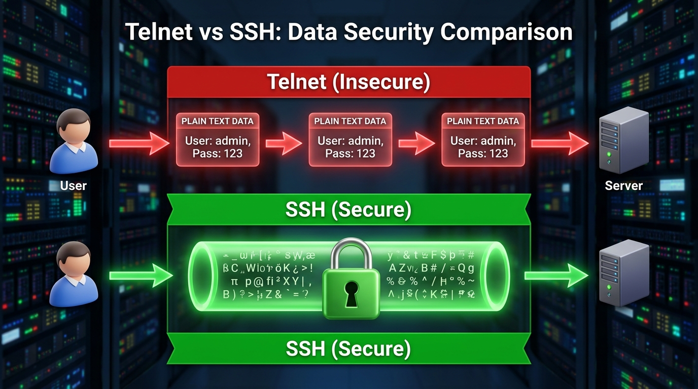

← [[Course on CCNA|Go Back to Course Hub]]

# 🔒 Day 41: Secure Shell (SSH)

Welcome to the notes for **Day 41: Secure Shell (SSH)** of Jeremy's IT Lab CCNA Complete Course! Aaj hum network devices ke secure remote administration ke standard method—**SSH (Secure Shell)**—ke baare mein seekhenge. Hum seekhenge ki kyun Telnet unsafe hai aur kaise SSH asymmetric/symmetric encryption standards ke zariye data transmission ko protect karta hai. Iske sath hi hum Cisco IOS par SSH configure karne ke mandatory prerequisites, VTY lines setup, version selections, timeout parameters, aur verification commands ko detailed explanations aur premium illustrations ke sath cover karenge. Ye notes Hinglish language aur English/Latin script mein hain.

---

## 🚦 1. Telnet vs. SSH: The Security Comparison

Switches aur routers ko configure karne ke liye do primary remote access protocols ka use kiya jata hai:

### A. Telnet:
*   **Layer 4 Port:** **TCP Port `23`**.
*   **Security:** **No Encryption (Plain Text)**.
*   **The Risk:** Telnet data packets (including usernames and passwords) ko clear text format mein send karta hai. Agar koi attacker network link par Wireshark capture run kar raha hai, toh woh easily passwords extract kar sakta hai (Security Breach).

### B. SSH (Secure Shell):
*   **Layer 4 Port:** **TCP Port `22`**.
*   **Security:** **Highly Encrypted**.
*   **The Feature:** SSH client aur device ke beech ek encrypted cryptographical tunnel establish karta hai, jisse dynamic login data aur management commands safe flow hote hain.



---

## 🏛️ 2. SSH Configuration Prerequisites on Cisco IOS

Cisco devices par default state mein SSH active nahi ho sakta jab tak aap niche diye gaye **4 Mandatory Steps** configure na karein:

1.  **Configure a unique Hostname:**
    *   Device par default hostname (e.g. `Router` or `Switch`) ke badle custom name configure hona zaroori hai.
2.  **Configure an IP Domain Name:**
    *   RSA encryption keys generated host-names aur domain-name strings ko hash karke dynamic identities construct karti hain (e.g., `cisco.com`).
3.  **Generate Cryptographic RSA Keys:**
    *   Asymmetric encryption ke liye public/private key pair generate karna zaroori hai. (CCNA recommend karta hai ki key modulus size minimum **1024 bits** ya higher configure kiya jaye taaki SSHv2 run ho sake).
4.  **Create Local User Database:**
    *   VTY lines par authentication check karne ke liye at least ek admin credential exist karna zaroori hai (`username` and `secret`).

---

## 💻 3. Step-by-Step Cisco CLI Configurations

Cisco router par secure SSHv2 setup aur Telnet completely block karne ke CLI command details:

### Step 1: Hostname aur Domain Name setup karein:
```ios
Router(config)# hostname Switch-Core
Switch-Core(config)# ip domain-name study.local
```

### Step 2: Cryptographic RSA Keys generate karein:
```ios
Switch-Core(config)# crypto key generate rsa
! Console prompt asks: How many bits in the modulus [512]:
! Type 1024 or 2048 for high encryption and SSHv2 support
Choose key size: 2048
```
*Output snippet:*
> % The name for the keys will be: Switch-Core.study.local
> % Generating 2048 bit RSA keys, keys will be non-exportable...[OK]

### Step 3: Local User Database setup karein (Privilege level 15 - Admin access):
```ios
Switch-Core(config)# username admin privilege 15 secret StudyPass99!
```

### Step 4: Configure VTY (Virtual Terminal) Lines:
```ios
Switch-Core(config)# line vty 0 15                              ! Select all VTY lines
Switch-Core(config-line)# login local                            ! Force authentication using local user database
Switch-Core(config-line)# transport input ssh                    ! Force SSH access only (instantly disables Telnet)
Switch-Core(config-line)# exit
```

---

## 🛠️ 4. SSH Customizations & Tweaks

SSH security parameters ko fine-tune karne ke commands:

```ios
! 1. Force SSH Version 2 (Obsolete Version 1 ko disable karne ke liye)
Switch-Core(config)# ip ssh version 2

! 2. Configure SSH Timeout (Router will disconnect idle sessions after 60 seconds)
Switch-Core(config)# ip ssh time-out 60

! 3. Configure Authentication Retries (Session drops after 2 failed password attempts)
Switch-Core(config)# ip ssh authentication-retries 2
```

---

### Connecting to a remote SSH target from Cisco CLI:
Agar aap Switch-Core par login hain aur doosre remote router (`10.1.1.5`) par login karna chahte hain:
```ios
Switch-Core# ssh -l admin 10.1.1.5                              ! Syntax: ssh -l <username> <target-IP>
```

---

## 🔍 5. Verification Commands

*   **Router par active SSH configurations, timeouts, and versions options verify karne ke liye:**
    ```ios
    Switch-Core# show ip ssh
    ```
    *Output snippet:*
    ```text
    SSH Enabled - version 2.0
    Authentication timeout 60 secs; Authentication retries 2
    Minimum size of RSA keys is 1024 bits
    ```
*   **Device par active incoming remote SSH sessions list track karne ke liye:**
    ```ios
    Switch-Core# show ssh
    ```
    *Output snippet:*
    ```text
    Connection Version Mode Encryption  Hmac         State           Username
    1          2.0     IN   aes256-ctr  hmac-sha1    Session-Started admin
    ```

---

## 📝 6. CCNA Day 41 Practice Questions

1. **Q1: Telnet (TCP Port 23) remote switches configuration and management ke liye highly insecure kyu hai?**
   <details>
   <summary>🔓 Click to Reveal Answer</summary>
   **Answer:** Kyunki Telnet plain text (no encryption) mein saara payload data transmission karta hai, jisse cleartext usernames aur passwords network sniffing through intercept kiye ja sakte hain.
   </details>

2. **Q2: SSH (Secure Shell) core communications parameters setup check karne ke liye standard Layer 4 port aur protocol kya use karta hai?**
   <details>
   <summary>🔓 Click to Reveal Answer</summary>
   **Answer:** **TCP Port `22`**.
   </details>

3. **Q3: Cisco router par active state mein SSH capability allow karne ke liye kin 4 items ka configured hona mandatory hai?**
   <details>
   <summary>🔓 Click to Reveal Answer</summary>
   **Answer:** Hostname, IP Domain-name, RSA Crypto Keys, aur local user database user setups.
   </details>

4. **Q4: Cisco IOS par RSA public/private keys generate karne ki global configuration command syntax kya hai?**
   <details>
   <summary>🔓 Click to Reveal Answer</summary>
   **Answer:** Global command: **`crypto key generate rsa`**.
   </details>

5. **Q5: SSHv2 version features capabilities support enable karne ke liye minimum key size modulus configuration limit kya select karni chahiye?**
   <details>
   <summary>🔓 Click to Reveal Answer</summary>
   **Answer:** Minimum **`1024 bits`** (2048 is highly recommended for security).
   </details>

6. **Q6: VTY lines configuration lines par incoming Telnet sessions bypass block karke sirf SSH allow karne ki configuration command kya use hoti hai?**
   <details>
   <summary>🔓 Click to Reveal Answer</summary>
   **Answer:** Line VTY mode command: **`transport input ssh`** (forces SSH only).
   </details>

7. **Q7: Router par dynamic user logins check local database parameters redirect verify karwane ke liye line configurations command kya apply karenge?**
   <details>
   <summary>🔓 Click to Reveal Answer</summary>
   **Answer:** Line VTY command: **`login local`**.
   </details>

8. **Q8: Default SSHv1 configuration bypass override karke safe SSHv2 standard enforce karne ki cisco global configuration command syntax kya hai?**
   <details>
   <summary>🔓 Click to Reveal Answer</summary>
   **Answer:** Global command: **`ip ssh version 2`**.
   </details>

9. **Q9: Switch configuration console terminal se remote router host IP `192.168.1.5` ko username `netadmin` se SSH connectivity start karne ki command line execution kya hogi?**
   <details>
   <summary>🔓 Click to Reveal Answer</summary>
   **Answer:** Command execution: **`ssh -l netadmin 192.168.1.5`**.
   </details>

10. **Q10: SSH active version limits, configured authentication retries counters aur timeout values verification check options trace karne ki standard command kya hai?**
    <details>
    <summary>🔓 Click to Reveal Answer</summary>
    **Answer:** Privileged EXEC command: **`show ip ssh`**.
    </details>
