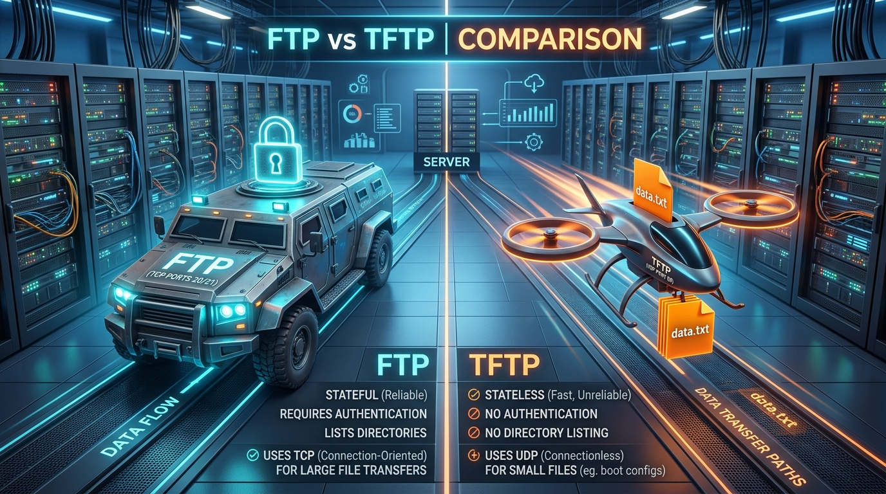

← [[Course on CCNA|Go Back to Course Hub]]

# 💾 Day 42: File Transfer Protocols (FTP & TFTP)

Welcome to the notes for **Day 42: FTP & TFTP** of Jeremy's IT Lab CCNA Complete Course! Aaj hum Cisco IOS systems, configs, aur images ko store/transfer karne ke liye standard protocols—**FTP** (File Transfer Protocol) aur **TFTP** (Trivial File Transfer Protocol)—ke baare mein seekhenge. Hum seekhenge ki dono protocols TCP/UDP layer par kaise check perform karte hain, unke dynamic port usage (FTP Ports 20 & 21, TFTP Port 69), authentication levels, Cisco router par backup CLI operations, aur complete verification ko premium illustrations ke sath cover karenge. Ye notes Hinglish language aur English/Latin script mein hain.

---

## 🚦 1. Need for File Transfer Protocols in CCNA

Switches aur Routers ke configurations (`startup-config`) NVRAM par aur unka operating system (Cisco IOS `.bin` files) Local Flash memory par store hote hain.

Agar device crash ho jaye ya hume multi-device IOS upgrade perform karna ho, toh network links par central server se files load/copy karni parti hain. Is operation ke liye hum **FTP** aur **TFTP** file transfer engines use karte hain.

---

## 🏛️ 2. FTP (File Transfer Protocol) Details

**FTP (RFC 959)** ek robust, connection-oriented stateful file transfer protocol hai.

*   **Layer 4 Transport:** **TCP** (Reliable delivery using windowing and acknowledgments).
*   **Dual-Port Mechanism:** FTP operations ke liye do separate TCP connections use karta hai:
    1.  **TCP Port `21` (Control Connection):** Commands send karne aur password authentication verification parameters exchange karne ke liye. (Ye connection session duration tak active rehta hai).
    2.  **TCP Port `20` (Data Connection):** Actual files transfer transfer karne ke liye dynamically open aur close hota hai. (Note: passive mode FTP setup mein data port dynamically choose kiya jata hai above 1023 range).
*   **Authentication:** Username aur Password verification check include karta hai (although ye data wire par clear text plain formats mein travel karta hai).
*   **Features:** Directory listing (like `dir`, `ls`) aur directory paths traversal (`cd`) support karta hai.

---

## 🗺️ 3. TFTP (Trivial File Transfer Protocol) Details

**TFTP (RFC 1350)** ek lightweight, simple file transfer tool hai jo low-memory devices or boot setups par use kiya jata hai.

*   **Layer 4 Transport:** **UDP** (Unreliable, connectionless. Payload checking dynamic windowing control checks application level stop-and-wait confirm method se handle hoti hai).
*   **Port:** **UDP Port `69`**.
*   **Security:** **No Authentication (No username/password)**. Koi security checks nahi hote.
*   **Limitations:**
    *   Sirf single read (GET) aur write (PUT) operations support karta hai.
    *   Directory structures read/browse karne ka option nahi hota (Aap remote file structure lists display nahi kar sakte).
    *   File size transfers historically 32MB / 4GB range limits tak bounded hote hain depending on block size configurations.

---

## 📐 4. FTP vs. TFTP: Comparative Table



| Feature | FTP (File Transfer Protocol) | TFTP (Trivial File Transfer Protocol) |
| :--- | :--- | :--- |
| **Layer 4 Protocol** | **TCP** (Connection-Oriented) | **UDP** (Connectionless) |
| **Port Numbers** | **Port 21** (Control), **Port 20** (Data) | **Port 69** |
| **Authentication** | **Required** (Username & Password) | **None** (Anonymous access) |
| **Directory Navigation** | **Supported** (`ls`, `cd`, `pwd`) | **Not Supported** (Only file pull/push) |
| **Speed / Overhead** | High overhead, highly reliable | Low overhead, very fast, less reliable |
| **File Size Limit** | Virtually unlimited | Limited (Max 4GB / historically smaller) |

---

## 💻 5. Cisco IOS CLI Configurations & File Operations

### A. Backing up running-config to TFTP Server:
Maan lijiye hamare segment par TFTP server IP `192.168.1.100` chal raha hai:

```ios
Router-A# copy running-config tftp:
! Prompt 1: Address or name of remote host []?
Address or name of remote host: 192.168.1.100
! Prompt 2: Destination filename [Router-A-confg]?
Destination filename [Router-A-confg]: Backup-RouterA.cfg
```
*Output snippet:*
> Writing Backup-RouterA.cfg !!!! [OK - 1204 bytes]
> 1204 bytes copied in 0.124 secs (9709 bytes/sec)

---

### B. Backing up running-config to FTP Server:
Kyunki FTP username/password check evaluate karta hai, isliye commands run karne se pehle config mode par credentials specify karna zaroori hai:

```ios
! 1. Define FTP username and password globally
Router-A(config)# ip ftp username ciscoadmin
Router-A(config)# ip ftp password StudyPass123!
Router-A(config)# exit

! 2. Execute copy command
Router-A# copy running-config ftp:
Address or name of remote host []? 192.168.1.100
Destination filename [Router-A-confg]? Backup-RouterA.cfg
```

---

### C. Using Cisco Router as a TFTP Server:
Cisco router local flash memory file settings par local hosts access ke liye khud TFTP daemon active kar sakta hai:
```ios
Router-A(config)# tftp-server flash:c2960-lanbasek9-mz.150-2.SE4.bin
```
*Is command se doosri devices is router ke IP se target IOS bin file fetch download kar sakti hain.*

---

## 📝 6. CCNA Day 42 Practice Questions

1. **Q1: FTP (File Transfer Protocol) control signals check aur commands transmission ke liye standard kis Port aur Layer 4 protocol ka use karta hai?**
   <details>
   <summary>🔓 Click to Reveal Answer</summary>
   **Answer:** **TCP Port `21`** (Control Connection).
   </details>

2. **Q2: TFTP (Trivial File Transfer Protocol) data transfer queries exchange check target run karne ke liye kis L4 Port and protocol parameters par work karta hai?**
   <details>
   <summary>🔓 Click to Reveal Answer</summary>
   **Answer:** **UDP Port `69`**.
   </details>

3. **Q3: Active FTP mode configurations mein, actual file bytes data transmission check targets flow karwane ke liye kis TCP port ka specify use kiya jata hai?**
   <details>
   <summary>🔓 Click to Reveal Answer</summary>
   **Answer:** **TCP Port `20`** (Data Connection).
   </details>

4. **Q4: TFTP transfer logic checks mein data reliability verify karne ke liye kis protocol logic or standard methods checks use kiye jate hain?**
   <details>
   <summary>🔓 Click to Reveal Answer</summary>
   **Answer:** Application layer level **Stop-and-Wait acknowledgment** check parameters method. (Har data block transmission ke baad client confirmation bhejta hai).
   </details>

5. **Q5: Multi-vendor networks backups par FTP server connectivity options parameters configuration par passwords plain transfer intercept prevent karne wale alternative protocols kya hain?**
   <details>
   <summary>🔓 Click to Reveal Answer</summary>
   **Answer:** **SFTP (SSH File Transfer)** or **FTPS (FTP over SSL/TLS)**.
   </details>

6. **Q6: Cisco IOS client CLI par, backup command run karne se pehle global config level par FTP login username set karne ki precise configuration command kya hai?**
   <details>
   <summary>🔓 Click to Reveal Answer</summary>
   **Answer:** Global command: **`ip ftp username <username>`**.
   </details>

7. **Q7: Router flash storage memory par active local files listing check, dynamic startup and config updates files details trace check query verify karne ki CLI verify command kya hai?**
   <details>
   <summary>🔓 Click to Reveal Answer</summary>
   **Answer:** Privileged EXEC command: **`show flash:`** (or simply `dir`).
   </details>

8. **Q8: TFTP client queries check mein, directory listings view verify karne and paths create folders change links features details execution output options permit na hone ki reasons kya hain?**
   <details>
   <summary>🔓 Click to Reveal Answer</summary>
   **Answer:** Kyunki TFTP ke functional design commands options mein directory listing (`dir`, `ls`) and structure navigations built-in features completely unavailable hote hain.
   </details>

9. **Q9: Cisco IOS router ke Local Flash memory par store `.bin` file image ko directly local TFTP server targets par download access open host enable karne ki command syntax configure kya hogi?**
   <details>
   <summary>🔓 Click to Reveal Answer</summary>
   **Answer:** Global configuration command: **`tftp-server flash:<file-name>`**.
   </details>

10. **Q10: Active configurations data backups client copy command setups ke configuration files dynamic transfer start verification check execution syntax parameters command command mode kya hoga?**
    <details>
    <summary>🔓 Click to Reveal Answer</summary>
    **Answer:** Privileged EXEC command: **`copy running-config tftp:`** (or `copy startup-config ftp:`).
    </details>
