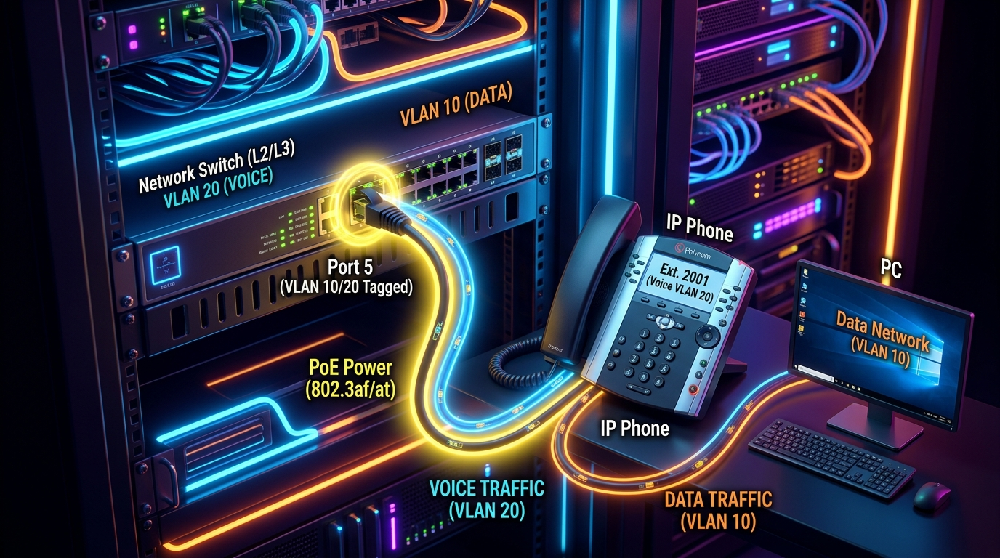

← [[Course on CCNA|Go Back to Course Hub]]

# 🌐 Day 45: Quality of Service (QoS) - Part 1

Welcome to the notes for **Day 45: QoS - Part 1** of Jeremy's IT Lab CCNA Complete Course! Aaj hum **Quality of Service (QoS)** ke fundamental metrics ko explore karenge. Hum seekhenge ki kyun real-time voice/video traffic ko normal data traffic par priority dena zaroori hai. Iske sath hi hum Voice VLAN setup, Power over Ethernet (PoE) standards, Queuing mechanisms (FIFO, WFQ, CBWFQ, LLQ), aur congestion avoidance systems jaise TCP Global Synchronization aur RED/WRED ko step-by-step detailed explanations aur premium illustrations ke sath cover karenge. Ye notes Hinglish language aur English/Latin script mein hain.

---

## 🚦 1. The Need for Quality of Service (QoS)

Default state mein, routers aur switches **FIFO (First-In, First-Out)** principle par kaam karte hain. Iska matlab hai ki jo packet pehle aayega, wahi pehle process hokar forward hoga.

### The Problem:
Kuch networks par time-sensitive (real-time) traffic aur non-time-sensitive traffic dono chalte hain:
*   **Time-Sensitive Traffic (Voice/Video):** Inhe delay accept nahi hota. Agar latency badhe, toh voice break hone lagti hai.
*   **Non-Time-Sensitive Traffic (Web, Email, FTP):** Agar email aane mein 2 second delay ho jaye, toh hume farq nahi padta.
*   *Result:* Congestion hone par agar Voice packets dynamic calculations buffer queue mein backup data packets ke peeche phas jayein, toh call quality kharab ho jati hai.

### Standard Voice Traffic Requirements (CCNA Core Numbers):
*   **One-Way Latency (Delay):** $\le$ **`150 ms`**
*   **Jitter (Variation in Delay):** $\le$ **`30 ms`**
*   **Packet Loss:** $\le$ **`1%`**

---

## 🏛️ 2. IP Phone Daisy-Chain & Voice VLANs

Switches par cabling load reduce karne ke liye Cisco IP Phones **Daisy-Chain** topology use karte hain:

```text
+-----------------------+      Single Cable      +------------------+      Single Cable      +-------------------+
| Network Switch (Core) | ---------------------- |  Cisco IP Phone  | ---------------------- |    Desktop PC     |
|   VLAN 10 / VLAN 20   |   PoE Power + Trunk    | (Ext. 2001 / L2) |       Data Only        | (Windows/Linux)   |
+-----------------------+                        +------------------+                        +-------------------+
```

### How Voice VLAN Works:
Switch port par IP phone aur PC dono ka data single interface port se enter hota hai:



1.  **Tagging:** IP Phone apne voice frames ko 802.1Q header insert karke **VLAN 20 (Voice)** tag ke sath switch ko forward karta hai. PC ka standard data untagged status par **VLAN 10 (Data)** default treat hota hai.
2.  **Cisco CLI Configuration:**
    ```ios
    Router-A(config)# interface gigabitethernet 0/5
    Router-A(config-if)# switchport mode access                      ! Enforce Access port mode
    Router-A(config-if)# switchport access vlan 10                   ! Access VLAN for PC Data
    Router-A(config-if)# switchport voice vlan 20                    ! Voice VLAN for IP Phone Voice
    ```

---

## ⚡ 3. Power over Ethernet (PoE)

**Power over Ethernet (PoE)** standard ethernet cables (RJ45 Cat5e/Cat6) par data transmission ke sath-sath **DC electrical power** carry karne ki ability hai, jisse IP phones or Access points ko power brick ki zaroorat nahi padti.

*   **PSE (Power Sourcing Equipment):** Power supply karne wali device (e.g. PoE Switch).
*   **PD (Powered Device):** Power consume karne wali device (e.g. IP Phone, IP Camera, AP).

### PoE Standards Comparison:
*   **PoE (IEEE 802.3af):** Provides up to **`15.4 W`** per port.
*   **PoE+ (IEEE 802.3at):** Provides up to **`30 W`** per port.
*   **UPOE (IEEE 802.3bt Type 3):** Provides up to **`60 W`** per port.
*   **UPOE+ (IEEE 802.3bt Type 4):** Provides up to **`90 W`** per port.

---

## 📝 4. Queuing Mechanisms

Jab egress interface bandwidth capacity se zyada packets dynamic drop hone ke danger par queue ho jayein (Congestion), toh switches niche diye queuing protocols run karte hain:

1.  **FIFO (First-In, First-Out):** No QoS. Default queue model.
2.  **WFQ (Weighted Fair Queuing):** Flows are automatically classified and packets with lower bandwidth applications are prioritized automatically. Custom classification options nahi hote.
3.  **CBWFQ (Class-Based Weighted Fair Queuing):**
    *   Admin manually classes create karta hai (e.g., Class-VoIP, Class-Web) aur unhe specific guaranteed bandwidth percentages allocate karta hai.
4.  **LLQ (Low Latency Queuing):**
    *   CBWFQ ke top par ek **Strict Priority Queue (PQ)** add ki jati hai.
    *   *Usage:* Voice packets ko strict priority queue mein dala jata hai. Router is queue ko hamesha pehle process karega before any other class queues. (Best practice for Voice over IP).

---

## 📉 5. Congestion Avoidance & TCP Global Synchronization

Jab queues full ho jati hain, toh default routing drop behavior **Tail Drop** apply hota hai (incoming new packets drop ho jate hain).

### TCP Global Synchronization Problem:
1.  Tail drop ke karan multiple parallel TCP sessions ke packets ek sath drop ho jate hain.
2.  Dono hosts TCP congestion avoidance trigger karte hain aur automatic apna window size dynamically scale down (halved) kar dete hain, jis se bandwidth utilization suddenly zero level par drop ho jata hai.
3.  Phr dono speed ramp up karte hain, link dobara congested hota hai, aur drop cycle repeat hoti hai. Ise network efficiency drop hoti hai.

### Congestion Avoidance Solutions:
*   **RED (Random Early Detection):** Queue full hone se pehle hi router randomly selective packets drop karna start kar deta hai. Isse selective TCP sessions slow down hote hain aur global synchronization bypass ho jata hai.
*   **WRED (Weighted RED):** WRED random drops **IP Precedence / DSCP** priority values ke base par karta hai (low priority packets are dropped first).

---

## 📝 6. CCNA Day 45 Practice Questions

1. **Q1: Voice over IP (VoIP) packets smooth configurations flow ke liye network one-way latency levels kya standards cross nahi karni chahiye?**
   <details>
   <summary>🔓 Click to Reveal Answer</summary>
   **Answer:** One-way latency hamesha **$\le$ `150 ms`** honi chahiye.
   </details>

2. **Q2: Timing variations dynamic packet arrivals limits check variables metrics ko kya kehte hain aur iski Voice values rules limit kya hai?**
   <details>
   <summary>🔓 Click to Reveal Answer</summary>
   **Answer:** **Jitter**, jiski max limit Voice calls ke liye **$\le$ `30 ms`** honi chahiye.
   </details>

3. **Q3: IP Phone interface switch port configurations par 802.1Q tagging options ke bina voice traffic classify kyu ho pata hai?**
   <details>
   <summary>🔓 Click to Reveal Answer</summary>
   **Answer:** Kyunki dynamic command `switchport voice vlan` use karne par, port internally 802.1Q tagged frames ko Voice VLAN par route karta hai, aur untagged packets ko Data VLAN par access port mode par maintain rakhta hai.
   </details>

4. **Q4: PoE standards comparisons ke status par, 802.3at (PoE Plus) switch port maximum dynamic wattage ranges parameters kya deliver kar sakta hai?**
   <details>
   <summary>🔓 Click to Reveal Answer</summary>
   **Answer:** Up to **`30 Watts`** per port.
   </details>

5. **Q5: Cisco switches par PoE setups indicators check parameters options par PSE aur PD terms kis physical hardware elements ko refer karti hain?**
   <details>
   <summary>🔓 Click to Reveal Answer</summary>
   **Answer:** **PSE (Power Sourcing Equipment)** is Switch, and **PD (Powered Device)** is IP Phone/Access Point.
   </details>

6. **Q6: Egress interfaces congestion buffering setups checks ke andruni options mein real-time voice priority allow karne wala optimum standard scheduling model kya hai?**
   <details>
   <summary>🔓 Click to Reveal Answer</summary>
   **Answer:** **LLQ (Low Latency Queuing)** (which is CBWFQ plus a Strict Priority Queue).
   </details>

7. **Q7: Router egress queue interface buffer lines complete full hone par dynamic packets drop methods checks ko network terminology mein kya bolte hain?**
   <details>
   <summary>🔓 Click to Reveal Answer</summary>
   **Answer:** **Tail Drop**.
   </details>

8. **Q8: Tail Drop behavior ke chalte, link overutilization aur underutilization cyclic behavior variables dynamics check triggers settings error ko kya bolte hain?**
   <details>
   <summary>🔓 Click to Reveal Answer</summary>
   **Answer:** **TCP Global Synchronization**.
   </details>

9. **Q9: Network queues full limits reach hone se pehle dynamic random selective TCP packet drop methods checks ko apply karne wale logic rules ko kya bolte hain?**
   <details>
   <summary>🔓 Click to Reveal Answer</summary>
   **Answer:** **RED (Random Early Detection)**.
   </details>

10. **Q10: Class-based packet discard priority levels checks variables (IP Precedence or DSCP) analyze karke congestion bypass avoidance systems configure metrics ko kya bolte hain?**
    <details>
    <summary>🔓 Click to Reveal Answer</summary>
    **Answer:** **WRED (Weighted Random Early Detection)**.
    </details>
