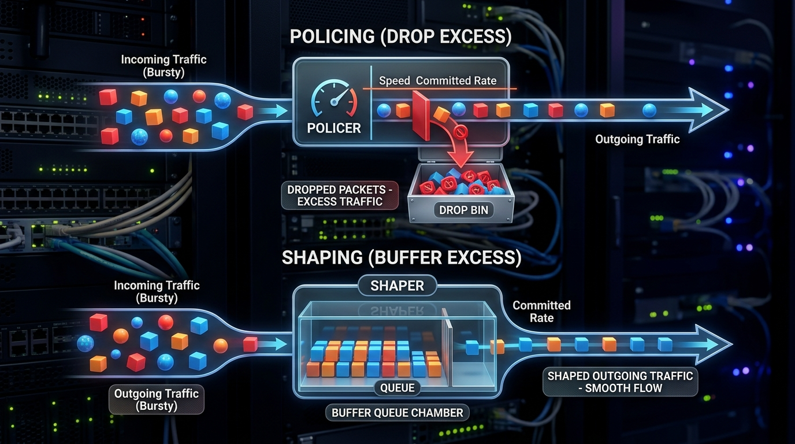

← [[Course on CCNA|Go Back to Course Hub]]

# 🌐 Day 46: Quality of Service (QoS) - Part 2 (Classification, Marking & Traffic Conditioning)

Welcome to the notes for **Day 46: QoS - Part 2** of Jeremy's IT Lab CCNA Complete Course! Aaj hum QoS ke core operational techniques—**Classification & Marking**—aur **Traffic Conditioning (Shaping vs Policing)** ke details seekhenge. Hum Layer 2 CoS, Layer 3 IP Precedence/DSCP headers, Assured Forwarding (AFxy) class value calculations, trust boundaries, aur switches/routers par rates limit handle karne ke mechanisms ko detailed step-by-step math aur premium diagrams ke sath cover karenge. Ye notes Hinglish language aur English/Latin script mein hain.

---

## 🚦 1. Classification and Marking

Packets ko proper queues mein route karne se pehle, switches aur routers ko unhe identify aur labels assign karne padte hain:

1.  **Classification:**
    *   Network traffic ko identify karna aur specific classes mein split karna (e.g. OSPF dynamic protocols, HTTP web access, VoIP voice).
    *   Classification ACLs, source/destination IPs, or port numbers ke standard inspect check par rely karta hai.
2.  **Marking:**
    *   Jaise hi traffic classify ho jata hai, router packet header ke specific field mein ek numeric value write/stamp (mark) kar deta hai.
    *   *Benefits:* Downstream (next-hop) switches aur routers ko dobara dynamic deep packet classification calculations nahi karni parti; wo sirf header tag read karke forward decision le lete hain.

---

### A. Layer 2 Marking (PCP / CoS):
*   **Location:** 802.1Q VLAN Trunk Header (data link layer).
*   **Field:** **PCP (Priority Code Point)**, jise generic networks mein **CoS (Class of Service)** bhi kehte hain.
*   **Size:** **3 bits** (Values range: **`0 - 7`**).
*   **Limitation:** CoS tag sirf trunk links par exist karta hai. Jaise hi frame access link par enter hota hai ya routing boundaries cross karta hai (L3 router strips L2 header), CoS tags strip (delete) ho jate hain.

---

### B. Layer 3 Marking (IP Precedence & DSCP):
L3 markings permanent hoti hain aur source device se final destination target tak end-to-end travel karti hain. Ye IPv4/IPv6 headers ke **ToS (Type of Service)** byte (8-bits) par write hoti hain:

#### 1. IP Precedence (Legacy Standard):
*   Uses first **3 bits** of the ToS byte (Values range: **`0 - 7`**).

#### 2. DSCP (Differentiated Services Code Point - Modern Standard):
*   Uses first **6 bits** of the ToS byte (Values range: **`0 - 63`**). Last 2 bits Congestion Notification (ECN) ke liye use hoti hain.

```text
IPv4 ToS Byte:
|<----------------------- 6 bits ----------------------->|<--- 2 bits --->|
+---+---+---+---+---+---+---+---+
|       DSCP (Class & Drop Precedence)                  |      ECN       |
+---+---+---+---+---+---+---+---+
```

---

## 🏛️ 2. DSCP Marking Classes (CCNA Exam Core)

Cisco networks par classification ko simplify karne ke liye pre-defined DSCP categories bani hain:

1.  **Default Forwarding (DF):**
    *   Standard Best-Effort traffic jiska DSCP value **`0`** (`000000` in binary) hota hai. (e.g. normal web surfing).
2.  **Expedited Forwarding (EF):**
    *   Low Latency, low jitter traffic ke liye reserved class. Iska DSCP value **`46`** (`101110`) hota hai. **Hamesh voice traffic ke liye use hota hai**.
3.  **Class Selector (CS):**
    *   CS1 se CS7 values jo legacy IP Precedence backward compatibility support karti hain.
4.  **Assured Forwarding (AF):**
    *   AF standard class structure check **`AFxy`** format mein hota hai:
        *   **`x` (Class 1 to 4):** Priority Queue level (Higher number means better queue: AF4 > AF3 > AF2 > AF1).
        *   **`y` (Drop Preference 1 to 3):** Congestion hone par packet drop hone ki similarity (Higher number means higher chance of packet drop: AF43 is dropped before AF41).

#### How to Calculate AFxy Decimal Value:
> [!TIP]
> **The AF Formula:**
> $$\text{DSCP Decimal} = 8x + 2y$$
>
> *Example 1 (AF41):*
> $$\text{DSCP} = 8(4) + 2(1) = 32 + 2 = 34 \quad (\text{Binary: } 100010)$$
>
> *Example 2 (AF32):*
> $$\text{DSCP} = 8(3) + 2(2) = 24 + 4 = 28 \quad (\text{Binary: } 011100)$$

---

## 🛡️ 3. QoS Trust Boundary

Ek switch port network endpoints se aane wale traffic markings ko trust karega ya nahi, ise **Trust Boundary** decide karta hai:

```text
[IP Phone (Marked: EF)] ---> [Switch Port (Trusted)] ---------------------> [Router (Applies LLQ)]
[PC Client (Self-Marked)] --> [Switch Port (Untrusted -> Reset to DSCP 0)] -> [Router (Best-Effort)]
```
*   **Trusted:** Agar endpoint trusted hai (like Cisco IP Phone), toh switch use allow karta hai aur header settings maintain rakhta hai.
*   **Untrusted:** PC or external user end interfaces. Agar switch untrusted settings receive karta hai, toh dynamic policy se saare markings ko reset karke **DSCP 0** (Best effort) kar deta hai taaki malicious users dynamic network priority chori na kar sakein.

---

## 📈 4. Traffic Conditioning: Shaping vs. Policing

Jab traffic bandwidth contract limits (CIR - Committed Information Rate) ko cross karta hai, toh switch/router dynamic traffic conditioning apply karte hain:



### A. Policing:
*   **Action:** Limits se upar jane wale packets ko instantly **drop** (discard) kar deta hai ya re-mark karke lower priority set kar deta hai.
*   **Result:** Traffic rate dynamic sawtooth wave banta hai. **No delay is introduced** (kyunki packets wait nahi karte).
*   **Usage:** Ingress ports, ISP limits boundaries, security checks.

### B. Shaping:
*   **Action:** Excess burst traffic ko discard karne ke badle software **Queue (Buffer)** memory mein hold kar leta hai aur interface limits ke range scale par steady rate se smooth output send karta hai.
*   **Result:** Outgoing traffic flow smooth curve baintan hota hai. **Introduces Latency (Delay)** (kyunki packets queue mein wait karte hain).
*   **Usage:** Egress ports, WAN links connecting HQ to branch.

---

## 📝 5. CCNA Day 46 Practice Questions

1. **Q1: PCP/CoS (Class of Service) values layer 2 frames par kahan inject hoti hain aur inka modulus bit size kya hota hai?**
   <details>
   <summary>🔓 Click to Reveal Answer</summary>
   **Answer:** **802.1Q Tag header** parameters par, aur inka bit size **3 bits** (values 0-7) hota hai.
   </details>

2. **Q2: Layer 3 IPv4 header par QoS markings specify karne ke liye kis complete byte space and parameters value set ka use kiya jata hai?**
   <details>
   <summary>🔓 Click to Reveal Answer</summary>
   **Answer:** **ToS (Type of Service)** byte, jisme modern standard ke under **DSCP (Differentiated Services Code Point - 6 bits)** use hota hai.
   </details>

3. **Q3: DSCP values rules ke check points segment par, 'Expedited Forwarding (EF)' decimal value target kya scale follow karta hai aur ye kis traffic category ke liye optimal hai?**
   <details>
   <summary>🔓 Click to Reveal Answer</summary>
   **Answer:** Value **`46`** (Binary: `101110`). Hamesh real-time **Voice Traffic (VoIP)** ke setup ke liye use hota hai.
   </details>

4. **Q4: Assured Forwarding `AF32` classification ka exact decimal DSCP value equivalent kya calculate hoga?**
   <details>
   <summary>🔓 Click to Reveal Answer</summary>
   **Answer:** Formula: $8x + 2y$ where $x=3$, $y=2$.
   Calculation: $8(3) + 2(2) = 24 + 4 =$ **`28`**.
   </details>

5. **Q5: Assured Forwarding classes comparison parameters par, `AF43` aur `AF41` mein se interface congestion time kis frame status ko router pehle drop karega?**
   <details>
   <summary>🔓 Click to Reveal Answer</summary>
   **Answer:** **`AF43`** ko, kyunki iska drop preference value $y = 3$ higher hai, jiska matlab hai dynamic congestion time drops checks me iske drop chances zyada hain.
   </details>

6. **Q6: Assured Forwarding `AF21` class ka equivalent decimal DSCP lookup values key parameters calculate kya check output dega?**
   <details>
   <summary>🔓 Click to Reveal Answer</summary>
   **Answer:** $8(2) + 2(1) = 16 + 2 =$ **`18`**.
   </details>

7. **Q7: QoS rules control check ke logic par, dynamic user end terminals ke self-marked packets ko block reset kar security options set check ko kya bolte hain?**
   <details>
   <summary>🔓 Click to Reveal Answer</summary>
   **Answer:** **Trust Boundary** (untrusted inputs are reset to DSCP 0).
   </details>

8. **Q8: Excess interface packets bandwidth limit exceed hone par, buffers queue me hold karne ke bajaye directly drop (discard) karne wale system parameters conditioning ko kya bolte hain?**
   <details>
   <summary>🔓 Click to Reveal Answer</summary>
   **Answer:** **Policing**.
   </details>

9. **Q9: Outgoing burst traffic ko software queues buffer memory hold options configure smoothen limits parameters setup control check function ko kya bolte hain?**
   <details>
   <summary>🔓 Click to Reveal Answer</summary>
   **Answer:** **Shaping** (smooth flow egress links).
   </details>

10. **Q10: Class-Selector (CS) DSCP markings default parameters scale kis system backward compatibility models features support karne ke liye configure mappings hold karte hain?**
    <details>
    <summary>🔓 Click to Reveal Answer</summary>
    **Answer:** Legacy **IP Precedence (3-bits)** standards options mappings ke validation checks.
    </details>
