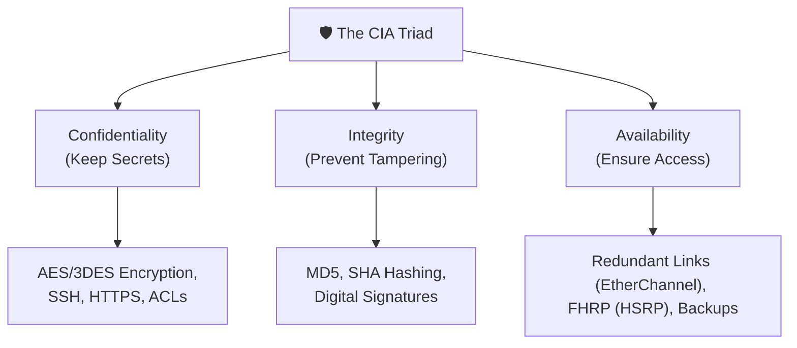
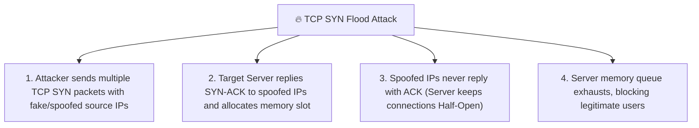

← [[Course on CCNA|Go Back to Course Hub]]

# 🔒 Day 47: Security Fundamentals

Welcome to the notes for **Day 47: Security Fundamentals** of Jeremy's IT Lab CCNA Complete Course! Aaj hum network security ke absolute baseline rules—**The CIA Triad** (Confidentiality, Integrity, Availability)—ko seekhenge. Iske sath hi hum dynamic security definitions (Vulnerabilities, Threats, and Exploits) ko real-world analogies ke sath samjhenge, aur networks par hone wale key attacks jaise **DoS/DDoS (SYN Floods, Reflection/Amplification)**, **Spoofing (MAC/IP)**, **Man-in-the-Middle (MitM)**, aur **DHCP Starvation** ko step-by-step detailed explanations aur diagrams ke sath cover karenge. Ye notes Hinglish language aur English/Latin script mein hain.

---

## 🏛️ 1. The Core Foundation: The CIA Triad

Information security ka base teen primary objectives par khada hai jise **CIA Triad** kaha jata hai. Network par hone wali koi bhi security policy inhi teen elements ko protect karne ke liye design hoti hai:

---

### A. Confidentiality (Gopniyata):
*   **Definition:** Ye ensure karna ki sensitive data sirf authorized users hi read kar sakein. Kisi bhi unauthorized entry or system leakage ko block karna.
*   **How to achieve Confidentiality:**
    *   **Encryption:** Plaintext data (padhne layak) ko ciphertext (garbage values) mein convert karna. (e.g. Asymmetric encryption like RSA, Symmetric encryption like AES/DES).
    *   **Secure Protocols:** Connection lines par cleartext protocols (like Telnet, HTTP) ko disable karke secure encrypted options (like SSH, HTTPS) use karna.
    *   **Access Controls:** Access Control Lists (ACLs) apply karna taaki restricted subnets sensitive servers ko ping na kar sakein.

---

### B. Integrity (Akhandta):
*   **Definition:** Ye guarantee karna ki data transmission (safar) ke dauran alter (modifie / change) na ho. Sender ne jo data bheja hai, receiver ko exact wahi data mile.
*   **How to achieve Integrity:**
    *   **Hashing Algorithms:** Message par cryptographic hash functions run kiye jate hain (e.g., MD5, SHA-256). Hash value block message ke content se banti hai. Agar hacker packet mein 1 single bit bhi change kar de, toh hash code match fail ho jata hai aur receiver packet ko drop kar deta hai.
    *   **Digital Signatures:** Cryptographic keys se packets verify karna.

---

### C. Availability (Upalabdhta):
*   **Definition:** System resources aur services authorized users ke liye hamesha accessible (upalabdha) rahein, chahe network congestion ho, link failure ho ya hardware down ho.
*   **How to achieve Availability:**
    *   **Redundancy:** Single point of failure se bachne ke liye redundant physical hardware lagana (e.g., dual firewalls, dual power supplies).
    *   **Redundancy Protocols:** Dynamic link switchover protocols use karna (e.g., HSRP/VRRP, EtherChannel link bundling).
    *   **Backups:** System config files aur IOS database back-ups external server repositories (FTP/TFTP) par maintain karna.

---

## 🗺️ 2. Vulnerabilities, Threats, and Exploits

Security industry mein in teen keywords ko dynamic combinations ke sath use kiya jata hai:

> [!NOTE]
> **🚪 The House Analogy:**
> *   **Vulnerability (Kamzori):** Aapke ghar ka purana door lock jo bina key ke bhi easily twist karne par khul sakta hai.
> *   **Threat (Khatra):** Gali mein ghumne wala thief (chor) jise ghar mein enter hokar stealing karni hai.
> *   **Exploit (Fayda uthana):** Thief dwara ek wire hook or crowbar use karke us loose lock ko crack kar lena aur room ke andar enter ho jana.

*   **Vulnerability (Kamzori):** System software code, configuration or physical policy mein koi bug ya loophole (e.g., outdated IOS version, open unmonitored ports, default weak passwords).
*   **Threat (Khatra):** Koi bhi potential event ya group jo hamare network ko harm pahuncha sakta hai (e.g., malicious hackers, malware codes, natural disasters).
*   **Exploit (Fayda uthana):** Wo process, code segment, or tool jiske zariye threat vulnerability ka use karke network par unauthorized ingress achieve karta hai (e.g., dynamic script run karke router crash kar dena).

---

## 💥 3. Common Network Attacks

Enterprise systems par dynamic calculations aur attacks ko scale kiya jata hai:

### A. Denial-of-Service (DoS) and DDoS:
*   **DoS:** Ek single malicious source target device ko crash karne ya server CPU exhaust karne ke liye continuous queries bhejta hai.
*   **DDoS (Distributed DoS):** Attacker multiple infected systems (called **Bots** / **Zombie army**) ka group control karta hai aur ek hi time par thousands of targets coordinate karke request flood bhejta hai, jisse system line down ho jati hai.

*   **TCP SYN Flood:**
    *   TCP 3-way handshake process ko target karta hai. Attacker fake IPs (spoofed source) se continuously **SYN** packets bhejta hai. Server response mein **SYN-ACK** bhejkar client key check ke liye connection memory buffer mein hold kar leta hai (Half-Open connection). Attacker kabhi final **ACK** reply nahi bhejta. Buffer block hone par new logins close ho jate hain.
*   **Reflection / Amplification Attack:**
    *   Attacker target system ka IP spoof karke multiple open DNS or NTP servers ko request bhejta hai. Request choti hoti hai par response size large (amplified) hota hai. Saare replies target client device par flood ho jate hain, jisse uska access blocking frame ho jata hai.

---

### B. Spoofing Attacks (IP & MAC):
*   **MAC Spoofing:** Attacker apne local card physical address ko overwrite karke network switch/DHCP filter bypass karne ke liye authorized MAC use karta hai.
*   **IP Spoofing:** Packet headers ke Source IP address ko faking custom address set karna (e.g., routing filters or firewall ACL check bypass karne ke liye standard local network IP faking).

---

### C. Man-in-the-Middle (MitM) Attacks:
*   Attacker dynamic networks connections ke path par directly client aur actual gateway router ke flow lines ke physical position or logical tables intercept par locate ho jata hai.
*   Dono endpoints ko lagta hai ki wo direct secure communicate kar rahe hain, par attacker packets ko silently capture, read, and manipulate (alter) kar raha hota hai.

---

### D. DHCP Starvation Attack:
*   **Method:** Attacker virtual software tool (jaise Gobbler) use karke thousands of fake MAC addresses generate karta hai aur network switch ports par server ko flood of **DHCP Discover** requests send karta hai.
*   **Result:** DHCP Server dynamically har request ko pool se IP allocate kar deta hai. Pura **IP Address Pool exhaust** (khali) ho jata hai.
*   **The Next Stage (Rogue DHCP Server / MitM):**
    *   Jaise hi standard pool khali hota hai, attacker apna personal **Rogue DHCP Server** (nakli server) network par activate kar deta hai.
    *   Jab koi real client login details dynamic requests bhejega, toh rogue server use IP assign karega aur default gateway address switch/router ke badle apne laptop IP ko push kar dega.
    *   *Result:* Client ka saara traffic router par jaane se pehle attacker ke PC se hokar jayega (MitM attack successfully achieved!).

---

## 📝 5. CCNA Day 47 Practice Questions

1. **Q1: CIA Triad mein element 'Confidentiality' (Gopniyata) ko networks par protect karne ke liye primary tool kya use kiya jata hai?**
   

   
🔓 Click to Reveal Answer

   **Answer:** **Encryption** (Plaintext ko encrypted ciphertext format mein convert karna, e.g. using AES).
   

2. **Q2: Transmitted packets data integrity guarantee karne ke liye receiver side par kaun si mathematical calculations use ki jati hai?**
   

   
🔓 Click to Reveal Answer

   **Answer:** **Cryptographic Hashing** (e.g., MD5, SHA-256).
   

3. **Q3: Network redundancies protocols (jaise HSRP, EtherChannel, and backups setups) CIA triad ke kis section scope ko satisfy karne ke liye design hain?**
   

   
🔓 Click to Reveal Answer

   **Answer:** **Availability** (Devices aur services hamesha accessible rahein, link fail hone par backup path active ho).
   

4. **Q4: Security terms checks mein, vulnerability aur threat ke beech logical difference kya hai?**
   

   
🔓 Click to Reveal Answer

   **Answer:** **Vulnerability** system code ya policy mein kisi bug ya kamzori (loophole) ko bolte hain, jabki **Threat** koi bahari dangerous entity ya attack agent hota hai jo system ko damage kar sakta hai.
   

5. **Q5: Attacker dwara target parameters checks bypass karne ke liye hardware layer 2 address modify karke unauthorized target impersonation setup ko kya kehte hain?**
   

   
🔓 Click to Reveal Answer

   **Answer:** **MAC Spoofing**.
   

6. **Q6: TCP SYN Flood DoS attack router/server memory ke kis state behavior ko target karta hai?**
   

   
🔓 Click to Reveal Answer

   **Answer:** TCP **Half-Open connections** queue limit buffer ko. (SYN queries bhej kar client SYN-ACK server locks open chhod deta hai).
   

7. **Q7: IP address faking or spoofing targets use karke large payload responses target systems par redirect coordinate karne wale attacks class kya hai?**
   

   
🔓 Click to Reveal Answer

   **Answer:** **Reflection / Amplification Attacks** (e.g. DNS Reflection).
   

8. **Q8: Two valid endpoints (client and server) ke communication path par transparent intercept access dynamic reads/modifications perform karne wale attacks class kya hai?**
   

   
🔓 Click to Reveal Answer

   **Answer:** **Man-in-the-Middle (MitM)** attack.
   

9. **Q9: DHCP Starvation attack ka main core goal kya hota hai aur isse pure pool exhaust hone par attacker dynamic setup kya execute karta hai?**
   

   
🔓 Click to Reveal Answer

   **Answer:** Server ke complete IP Pool addresses exhaust karna aur network par **Rogue DHCP Server** launch karke target clients default gateways bypass maps intercept (MitM) karna.
   

10. **Q10: DHCP Starvation flow attacks parameters control check switch settings par check block protection run ke liye standard prevention methods kya develop kiye gaye hain?**
    

    
🔓 Click to Reveal Answer

    **Answer:** **DHCP Snooping** aur Layer 2 security standard **Port Security** (Jo multi-MAC spoof queries drop/discard entries check maintain karta hai).
    

