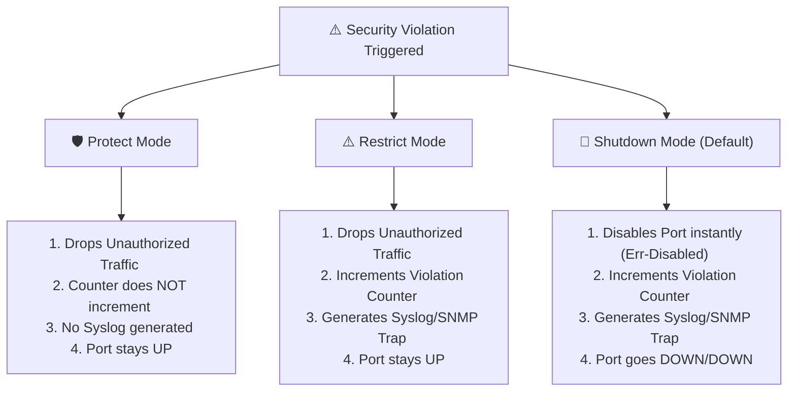

← [[Course on CCNA|Go Back to Course Hub]]

# 🔒 Day 48: Port Security (Switch Port Access Protection)

Welcome to the notes for **Day 48: Port Security** of Jeremy's IT Lab CCNA Complete Course! Aaj hum Layer 2 switch security ke ek sabse core feature—**Port Security**—ke baare mein seekhenge. Hum seekhenge ki kaise switches par fake MAC addresses attach hone se block kiya jata hai, MAC learning methods (Static, Dynamic, aur popular Sticky MACs) kya hain, Port Security ke 3 Violation Modes (Shutdown, Restrict, aur Protect) ke key differences kya hain, aur Cisco CLI configurations aur verification commands ko step-by-step detail mein cover karenge. Ye notes Hinglish language aur English/Latin script mein hain.

---

## 🚦 1. What is Port Security?

By default, network switches local segment par connected hosts ke dynamic MAC addresses ko automatic learn karke MAC Address Table (CAM Table) mein save kar lete hain. Koi bhi person apna laptop kisi bhi switch port par plug karke communication start kar sakta hai.

**Port Security** ek Layer 2 switch feature hai jiske zariye admin **switch interfaces par target allowed MAC addresses aur unki maximum count (limits) ko control** kar sakta hai. 

*   *Rule:* Sirf authorized MAC addresses ko traffic forward karne diya jayega, aur baki unauthorized hosts ko connect karte hi packet drop or port shutdown warning trigger ho jayegi.
*   *Prerequisite:* Port Security sirf **static access or static trunk ports** par chal sakti hai. Ye ports dynamic negotiations modes (`dynamic desirable` or `dynamic auto`) par enabled nahi hone chahiye.

---

## 🏛️ 2. MAC Address Learning Methods

Switch par allowed hosts ke MAC addresses mapping fill karne ke teen methods hain:

1.  **Static Configuration:**
    *   Admin manually configuration mode par target interface security MAC specify karta hai.
    *   *Command:* `switchport port-security mac-address <MAC-Address>`
    *   *Status:* Running-config mein permanently write ho jata hai.
2.  **Dynamic Configuration:**
    *   Switch port par pehla frame receive hote hi client ka source MAC dynamically learn kar leta hai aur use temporary secure table mein load kar deta hai.
    *   *Drawback:* Entry sirf RAM database address table mein save hoti hai. Switch restart hone par ya link status down hone par dynamic entries delete ho jati hain.
3.  **Sticky Configuration (Recommended):**
    *   Switch dynamically frames se source MAC learn karta hai aur use instantly static entry ki tarah switch configuration memory (running-config) mein auto-write (stick) kar deta hai.
    *   *Command:* `switchport port-security mac-address sticky`
    *   *Status:* Agar aap config update save kar dein (`write memory`), toh reboot ke baad bhi entries active rehti hain.

---

## 🚫 3. Security Violation Modes

Jab switch port par maximum allowed MAC limit cross hoti hai ya koi unrecognized/unauthorized host packet bhejta hai, toh switch interface par **Security Violation** trigger hoti hai. Cisco switches par 3 violation modes available hain:



### Violation Modes Comparison:

| Feature | Protect Mode | Restrict Mode | Shutdown Mode (Default) |
| :--- | :---: | :---: | :---: |
| **Drop Traffic?** | **Yes** | **Yes** | **Yes** (Port goes down) |
| **Log/Syslog Message?** | No | **Yes** | **Yes** |
| **SNMP Alert / Trap?** | No | **Yes** | **Yes** |
| **Increment Counter?** | No | **Yes** | **Yes** |
| **Port State** | **Up** (Active) | **Up** (Active) | **Down / Err-Disabled** |

---

## 💻 4. Cisco IOS CLI Configurations

Core Switch `Switch-A` ke interface `GigabitEthernet 0/1` par: Max 2 hosts allowed hain, sticky MAC method use karna hai, aur violation hone par Restrict mode trigger karna hai.

### Step-by-Step Configuration:
```ios
Switch-A(config)# interface gigabitethernet 0/1

! 1. Force interface to be an Access Port (Mandatory prerequisite)
Switch-A(config-if)# switchport mode access

! 2. Enable Port Security globally on this port (Without this, port-security features remain disabled!)
Switch-A(config-if)# switchport port-security

! 3. Configure maximum allowed MAC addresses (Default limit is 1)
Switch-A(config-if)# switchport port-security maximum 2

! 4. Configure MAC address learning method to STICKY
Switch-A(config-if)# switchport port-security mac-address sticky

! 5. Set Violation Mode to Restrict (Default is shutdown)
Switch-A(config-if)# switchport port-security violation restrict
Switch-A(config-if)# no shutdown
```

---

### B. How to Recover from Err-Disabled (Shutdown) State:
Jab default shutdown mode violation trigger hota hai, interface output status `down/down (err-disabled)` state par block ho jata hai. Ise recover karne ke do methods hain:

#### Method 1: Manual Reset (Config Mode):
Admin manually configuration mode par interface reset command chalata hai:
```ios
Switch-A(config)# interface gigabitethernet 0/1
Switch-A(config-if)# shutdown                            ! First administratively shut down the port
Switch-A(config-if)# no shutdown                         ! Re-enable the port (flushes err-disabled lock)
```

#### Method 2: Auto-Recovery (Recommended):
Router/Switch ko automatic timeout logic par interface dynamic up karne ke liye configure karna:
```ios
Switch-A(config)# errdisable recovery cause psecurity-violation  ! Auto-recover from port security locks
Switch-A(config)# errdisable recovery interval 300                ! Wait 300 seconds (5 minutes) before re-enabling
```

---

## 🔍 5. Verification Commands

*   **Switch par configured Port Security features brief summary dekhne ke liye:**
    ```ios
    Switch-A# show port-security
    ```
*   **Specific interface configurations, secure MAC count, current violation counters check ke liye:**
    ```ios
    Switch-A# show port-security interface gigabitethernet 0/1
    ```
    *Output snippet:*
    ```text
    Port Security              : Enabled
    Port Status                : Secure-up
    Violation Mode             : Restrict
    Aging Time                 : 0 mins
    Maximum MAC Addresses      : 2
    Total MAC Addresses        : 1
    Configured MAC Addresses   : 0
    Sticky MAC Addresses       : 1
    Last Source Address:Vlan   : 0011.2233.4455:10
    Security Violation Count   : 0
    ```
*   **Database tables mein stored secure physical addresses dekhne ke liye:**
    ```ios
    Switch-A# show port-security address
    ```

---

## 📝 6. CCNA Day 48 Practice Questions

1. **Q1: Port Security features access configurations perform karne ke liye switch interface port mode prerequisite kya hai?**
   <details>
   <summary>🔓 Click to Reveal Answer</summary>
   **Answer:** Interface ko static configured **Access Mode** (`switchport mode access`) ya standard **Trunk Mode** par hona mandatory hai. Ports dynamic trunking negotiation status par nahi hone chahiye.
   </details>

2. **Q2: Sticky MAC configurations dynamic methods dynamic learn physical MACs ko router start hone par permanently secure database mein kaise maintain rakhti hai?**
   <details>
   <summary>🔓 Click to Reveal Answer</summary>
   **Answer:** Dynamic frames se MAC auto-learn karke switch running-config memory parameters par write/append kar deta hai. Jab admin configuration copy save (`write memory` or `copy run start`) karta hai, toh entries permanently nvram startup parameters par lock ho jati hain.
   </details>

3. **Q3: Port Security default maximum allowed MAC address count standard interface limit values kya hoti hai?**
   <details>
   <summary>🔓 Click to Reveal Answer</summary>
   **Answer:** By default **`1`** host address allowed hota hai.
   </details>

4. **Q4: Target security violation modes checks variables mein se, 'Protect' aur 'Restrict' modes ke beech main operations difference kya hai?**
   <details>
   <summary>🔓 Click to Reveal Answer</summary>
   **Answer:** Dono cases mein port UP state mein rehta hai aur unauthorized packets drop hote hain, lekin **Restrict Mode** violation counter increment karta hai aur instant Syslog event logs & SNMP traps send karta hai, jabki **Protect Mode** ye steps skip (silent drop) kar deta hai.
   </details>

5. **Q5: Default violation mode execution status checks switch configuration parameters par kya update check hold karta hai?**
   <details>
   <summary>🔓 Click to Reveal Answer</summary>
   **Answer:** **Shutdown Mode** (Port is instantly put into err-disabled state, shutting down physically).
   </details>

6. **Q6: Port security active switch interface par maximum MAC address count update parameters value limits specify check set karne ki command kya hai?**
   <details>
   <summary>🔓 Click to Reveal Answer</summary>
   **Answer:** Interface mode command: **`switchport port-security maximum <number>`**.
   </details>

7. **Q7: Switch port security violation details checking indicators me active port err-disabled state se clean up recover dynamic manually karne ke step rules command kya hain?**
   <details>
   <summary>🔓 Click to Reveal Answer</summary>
   **Answer:** Interface mode commands: First **`shutdown`** (set port admin down) aur uske baad **`no shutdown`** (re-activate link interface).
   </details>

8. **Q8: Port security violations checks auto-recovery cause dynamically switch globally active timer setup enable karne ki command syntax configure kya hogi?**
   <details>
   <summary>🔓 Click to Reveal Answer</summary>
   **Answer:** Global command: **`errdisable recovery cause psecurity-violation`**.
   </details>

9. **Q9: Switch database table checks mein dynamic sticky mapping MAC addresses configuration entries lists status display checking command verification kya run hoti hai?**
   <details>
   <summary>🔓 Click to Reveal Answer</summary>
   **Answer:** Privileged EXEC command: **`show port-security address`**.
   </details>

10. **Q10: OSPF indicators ki tarah specific interface port configuration values, current violation counters, maximum scale limit values check targets verify command checks outputs query key kya use hogi?**
    <details>
    <summary>🔓 Click to Reveal Answer</summary>
    **Answer:** **`show port-security interface <interface-ID>`** (e.g. `show port-security interface gigabitethernet 0/1`).
    </details>
