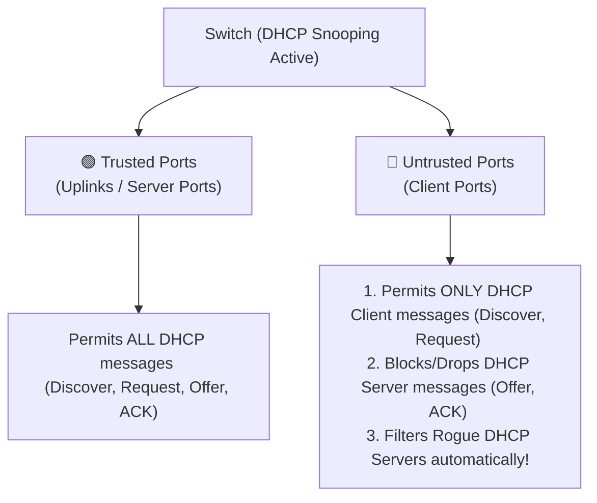

← [[Course on CCNA|Go Back to Course Hub]]

# 🔒 Day 49: DHCP Snooping (DHCP Attack Mitigation)

Welcome to the notes for **Day 49: DHCP Snooping** of Jeremy's IT Lab CCNA Complete Course! Aaj hum switches par DHCP-based attacks ko mitigate karne ke standard dynamic feature—**DHCP Snooping**—ke baare mein seekhenge. Hum seekhenge ki kaise switches rogue DHCP servers ko block karte hain, Trusted vs Untrusted ports ka architecture kya hota hai, DHCP Snooping **Binding Table** kaise build hoti hai, dynamic rate-limiting kaise lagate hain, aur Option 82 insertion issues ko CLI commands ke sath detail mein cover karenge. Ye notes Hinglish language aur English/Latin script mein hain.

---

## 🚦 1. The Threats: DHCP Spoofing & DHCP Starvation

DHCP protocol by default unauthenticated hai. Iska matlab hai ki koi bhi host local link par queries bhej kar network configurations modify or exhaust kar sakta hai:

1.  **DHCP Starvation Attack:**
    *   Attacker software tool (like Gobbler) se multiple spoofed MAC addresses generate karke switch port par millions of DHCP Discover packets flood kar deta hai.
    *   *Result:* DHCP Server saare available IP addresses in fake MACs ko lease out kar deta hai, aur pool exhaust (khali) ho jata hai. Ab legitimate users ko IP address nahi mil pata.
2.  **DHCP Spoofing (Rogue DHCP Server Attack):**
    *   Attacker local segment par apna ek unauthorized **Rogue DHCP Server** run kar deta hai.
    *   Jab clients DHCP IP request karte hain, toh rogue server unhe address client assign kar deta hai.
    *   *The Trap:* Attacker DNS server IP ko apne control server par point kar deta hai ya **Default Gateway IP** ko apne laptop address par. Isse target users ka saara traffic router par jaane ke bajaye attacker ke PC se forward hota hai (**Man-in-the-Middle** attack).

---

## 🏛️ 2. What is DHCP Snooping?

**DHCP Snooping** ek Layer 2 security feature hai jo switch ports ko **Trusted** aur **Untrusted** interfaces mein split karke rogue servers aur spoofing messages ko filter karta hai.



*   **Trusted Ports:**
    *   Wo switch interfaces jo genuine DHCP Server ya hamare internal backbone core uplinks (other trusted switches) se connected hote hain.
    *   *Rule:* In ports par **saare DHCP messages (both client and server replies)** flow ho sakte hain.
*   **Untrusted Ports:**
    *   Wo switch interfaces jahan normal client hosts (PCs, Printers, user terminals) connected hote hain.
    *   *Rule:* In ports par **sirf client requests (Discover, Request)** allow hote hain. Agar in untrusted ports par koi **DHCP Server messages (Offer, ACK, NACK)** receive hota hai (jo rogue server bhej raha hai), toh switch use **instantly block and drop** kar deta hai aur security alarm raise karta hai.

---

### 🗃️ 3. The DHCP Snooping Binding Table (Database)

Jab DHCP Snooping active hota hai, toh switch untrusted ports par dynamic DORA process traffic read (snoop) karta hai aur RAM memory mein ek dynamic **Binding Database** save karta hai:

| MAC Address | IP Address | Lease Time (sec) | VLAN | Interface Port |
| :--- | :--- | :--- | :--- | :--- |
| `0011.22aa.bbcc` | `192.168.10.15` | `86400` | `10` | `GigabitEthernet 0/2` |
| `0050.56b3.cc11` | `192.168.10.20` | `43200` | `10` | `GigabitEthernet 0/3` |

> [!IMPORTANT]
> Ye table switch memory ka sabse core component hai. Is database ka use other security features jaise **Dynamic ARP Inspection (DAI)** aur **IP Source Guard (IPSG)** client identities verify karne ke liye karte hain.

---

## 💻 4. Cisco IOS CLI Configurations

Switch `Switch-Core` par DHCP Snooping active karna, VLAN 10 enable karna, server port Gi0/1 ko trust set karna aur client interfaces par rate-limiting lagana:

### Step-by-Step Configuration:
```ios
Switch-Core(config)# ip dhcp snooping                            ! 1. Enable DHCP Snooping globally
Switch-Core(config)# ip dhcp snooping vlan 10                    ! 2. Enable snooping on VLAN 10 (Mandatory)

! Step 3: Configure Server-facing interface as TRUSTED
Switch-Core(config)# interface gigabitethernet 0/1
Switch-Core(config-if)# ip dhcp snooping trust                   ! Trust port

! Step 4: Configure client ports (Gi0/2 to 24) with Rate-Limiting
! (DHCP Starvation script flood drop karne ke liye limit to 10 packets-per-second)
Switch-Core(config)# interface range gigabitethernet 0/2 - 24
Switch-Core(config-if-range)# ip dhcp snooping limit rate 10     ! Set rate limit
```

---

### ⚠️ Option 82 configuration warning:
Cisco switches default state mein frames forward karte waqt DHCP requests mein **Option 82 (Relay Agent Info)** parameter values inject karte hain. 

Agar client local router (DHCP server) se dynamic IP request karta hai aur switch Option 82 inject kar de, toh Cisco Router request discard (drop) kar sakta hai jab tak use manually trust-all rules set na kiya jaye.
*   **Fix on Switch (Option 82 insertion completely turn-off):**
    ```ios
    Switch-Core(config)# no ip domain-lookup
    Switch-Core(config)# no ip dhcp snooping information option      ! Turn off Option 82 injection
    ```

---

## 🔍 5. Verification Commands

*   **DHCP Snooping operational status, enabled VLANs list aur trusted interface list check karne ke liye:**
    ```ios
    Switch-Core# show ip dhcp snooping
    ```
*   **Dynamic MAC to IP bindings database (Binding Table) status inspect karne ke liye:**
    ```ios
    Switch-Core# show ip dhcp snooping binding
    ```
    *Output snippet:*
    ```text
    MacAddress          IpAddress        Lease(sec)  Type           VLAN  Interface
    ------------------  ---------------  ----------  -------------  ----  --------------------
    00:11:22:AA:BB:CC   192.168.10.15    86320       dhcp-snooping  10    GigabitEthernet0/2
    ```

---

## 📝 6. CCNA Day 49 Practice Questions

1. **Q1: DHCP Spoofing ya Rogue DHCP Server attack ke chalte attackers target users ka traffic kaise intercept (MitM) kar lete hain?**
   <details>
   <summary>🔓 Click to Reveal Answer</summary>
   **Answer:** Attacker rogue server se client requests ko fake configuration replies bhejta hai jahan default gateway aur DNS parameters ko attacker ke local machine target machine IP par redirect kiya jata hai.
   </details>

2. **Q2: DHCP Snooping active hone par switch interfaces par default status (trusted or untrusted) kya hota hai?**
   <details>
   <summary>🔓 Click to Reveal Answer</summary>
   **Answer:** Saare switch interfaces globally **Untrusted** set ho jate hain jab tak admin manually command se trust configure na kare.
   </details>

3. **Q3: Untrusted interface par incoming DHCP dynamic replies (Offer/ACK/NACK) receive hone par switch ka actions behavior kya hota hai?**
   <details>
   <summary>🔓 Click to Reveal Answer</summary>
   **Answer:** Switch use instantly **block/drop** kar deta hai aur security logs generate karta hai (Rogue server protection).
   </details>

4. **Q4: Switch par dynamic entries binding database (DHCP Snooping Binding Table) mein kin indicators key elements ka relation track kiya jata hai?**
   <details>
   <summary>🔓 Click to Reveal Answer</summary>
   **Answer:** Client MAC Address, leased IP address, lease duration time, VLAN ID, aur Switch Port interface ID.
   </details>

5. **Q5: DHCP Starvation attacks scripting flood ko untrusted ports par limit karne ke liye interface range commands standard configurations kya provide ki jati hai?**
   <details>
   <summary>🔓 Click to Reveal Answer</summary>
   **Answer:** **`ip dhcp snooping limit rate <packets-per-second>`** (e.g. limit rate 10).
   </details>

6. **Q6: Cisco switches dwara client DHCP Discover packets me default format information inject option variables ko kya bolte hain?**
   <details>
   <summary>🔓 Click to Reveal Answer</summary>
   **Answer:** **Option 82** (Relay Agent Information Option).
   </details>

7. **Q7: Switch level par Option 82 configuration parameters injection bypass block check apply command switch globally line kya hogi?**
   <details>
   <summary>🔓 Click to Reveal Answer</summary>
   **Answer:** Global command: **`no ip dhcp snooping information option`**.
   </details>

8. **Q8: Global configuration terminal par DHCP snooping service globally start karne ki command kya hai?**
   <details>
   <summary>🔓 Click to Reveal Answer</summary>
   **Answer:** Global command: **`ip dhcp snooping`** (Note: Iske baad dynamic VLAN scope set karna bhi mandatory hai, e.g. `ip dhcp snooping vlan 10`).
   </details>

9. **Q9: Switch physical interfaces GigabitEthernet 0/1 core router/uplink segment interface ko trusted state par set karne ki interface config command set kya check limits degi?**
   <details>
   <summary>🔓 Click to Reveal Answer</summary>
   **Answer:** Interface mode command: **`ip dhcp snooping trust`**.
   </details>

10. **Q10: Active MAC to IP mappings binding database tables dynamic logs checks verify parameters trace karne ki privileged EXEC verification command name kya hai?**
    <details>
    <summary>🔓 Click to Reveal Answer</summary>
    **Answer:** Privileged EXEC command: **`show ip dhcp snooping binding`**.
    </details>
