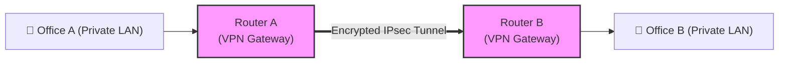

← [[Course on CCNA|Go Back to Course Hub]]

# 🌐 Day 52: WAN Architectures

Welcome to the notes for **Day 52: WAN Architectures** of Jeremy's IT Lab CCNA Complete Course! Aaj hum Wide Area Network (WAN) ki layouts, historical connections, modern broadband solutions, VPN types, aur network design concepts like **Underlay vs Overlay** ko detailed step-by-step concepts, diagrams, aur exam guidelines ke sath cover karenge. Ye notes Hinglish language aur English/Latin script mein hain.

---

## 🚦 1. LAN vs. WAN: Core Differences

*   **LAN (Local Area Network):**
    *   *Scale:* Choti geographical area (office room, building, home).
    *   *Ownership:* Pura network equipment infrastructure organization ka apna hota hai. No monthly rent to anyone.
*   **WAN (Wide Area Network):**
    *   *Scale:* Badi geographical area (connecting different cities, countries, or continents).
    *   *Ownership:* Infrastructure organization ka nahi hota. Telecom operators (Service Providers like Jio, Airtel, AT&T) se links **lease (rent)** par liye jate hain. monthly recurring costs hote hain.

---

## 🏛️ 2. Traditional WAN Technologies

### A. Dedicated Leased Lines:
*   **Concept:** Ek point-to-point private connection jo customer ke do remote offices ko directly connect karta hai via service provider cloud.
*   **Layer 2 Protocols:** Serial interfaces par **HDLC** (High-Level Data Link Control) ya **PPP** (Point-to-Point Protocol) encapsulation run hota hai.
*   **Pros:** Dedicated bandwidth (no sharing), highly secure, reliable.
*   **Cons:** Bohot expensive (per mile billing), rigid/hard to scale (dynamic capacity add nahi ho sakti).

### B. Metro Ethernet (MetroE):
*   **Concept:** Ethernet technology (jo hum LAN mein use karte hain) ko pure city or WAN range tak extend karna.
*   **Benefit:** Customers ko WAN connectivity ke liye serial cables aur cards ki zaroorat nahi padti. Standard RJ45 Ethernet copper wire ya Fiber optics ports switch ke through connect ho jate hain. configuration bohot simple ho jati hai.

---

## 🧭 3. Broadband WAN Technologies

Public Internet bandwidth badhne ke baad enterprises traditional costly lines ke badle regular internet links ko WAN connections ki tarah use karne lage hain:

1.  **DSL (Digital Subscriber Line):**
    *   Gharon aur offices mein aane wali normal telephone copper lines par high-frequency digital signals carry karta hai.
    *   *ADSL (Asymmetric DSL):* Download speed upload speed se faster hoti hai. (Home networks standard).
2.  **Cable Internet:**
    *   TV Cable operator ke coaxial cabling structures se internet bandwidth access karna. Bandwidth local neighbors ke beech share hoti hai (Peak hours par speed low ho sakti hai).
3.  **Wireless WAN:**
    *   *Cellular (3G/4G/5G):* Small branches ya remote nodes jahan physical cables nahi pahunch sakte. Backup link ki tarah standard use hota hai.
    *   *Satellite (e.g. Starlink):* High latency par extreme remote geographical places (forests, ships, mountains) par useful.

---

## 🛡️ 4. VPN Technologies (Virtual Private Networks)

Kyunki public Internet completely unsecure hai, isliye company data encrypt karne ke liye **VPN (Virtual Private Network)** use karti hai.



### A. Site-to-Site VPN:
*   Do permanent offices ke WAN routers ke beech internet par ek permanent secure path (**IPsec Tunnel**) create kiya jata hai. Both LANs seamlessly communicate karte hain bina kisi end-host level configurations change ke.

### B. Remote Access VPN (Client-to-Site):
*   Ghar se kaam karne wale employees (Work from Home) apne laptop par security agent (jaise Cisco AnyConnect) run karte hain. Laptop aur office firewall ke beech secure tunnel banti hai.

### C. DMVPN (Dynamic Multipoint VPN):
*   *The Problem:* Agar hub-and-spoke site-to-site model mein 50 branch offices hain, toh har branch ko doosri branch se baat karne ke liye central Hub se hokar jana padta hai (latency increases). Ya phir admin ko manually thousands of tunnels map karni padti hain.
*   *The Solution:* **Cisco DMVPN** ek dynamic technology hai. Jab Branch-A Branch-B ko direct traffic bhejti hai, toh dynamic dynamic GRE tunnel dono branches ke beech **on-demand direct** ban jati hai, aur traffic complete hone par automatic tear down (delete) ho jati hai. (Uses NHRP protocol).

---

## 🕸️ 5. Underlay vs. Overlay Networks

Network virtualization aur Software-Defined Networking (SDN) mein ye dono terms critical hain:

```text
  +-------------------------------------------------------------+
  |              OVERLAY NETWORK (Virtual Tunnel)               |  <-- Virtual Topology
  |    [Branch Router A] ========= GRE Tunnel =========> [Hub]  |      (Packets encapsulated)
  +-------------------------------------------------------------+
                                 ||
                                 || Built on top of
                                 \/
  +-------------------------------------------------------------+
  |             UNDERLAY NETWORK (Physical Path)               |  <-- Physical Infrastructure
  |    [Router A] ---> [ISP Switch] ---> [Router B] ---> [Hub]  |      (Standard Routing/IPs)
  +-------------------------------------------------------------+
```

1.  **Underlay Network:**
    *   Actual **physical network devices aur cabling infrastructure** (routers, switches, WAN connections, internet backbone).
    *   Underlay ka kaam standard IP packet delivery ensure karna hai using base routing protocols (OSPF, BGP, static routing).
2.  **Overlay Network:**
    *   Underlay network ke top par build hone wala **virtual network logical layer**.
    *   Tunnels (GRE, IPsec, VXLAN) ke dynamic encapsulation se direct virtual paths map kiye jate hain.
    *   *Example:* Do branches physical path (underlay) par 10 routers door ho sakti hain, par VPN tunnel (overlay) mein wo directly connected single hop show karti hain.

---

## 📝 6. CCNA Day 52 Practice Questions

1. **Q1: LAN aur WAN ke beech ownership control aur billing scales ke parameters par standard difference kya hai?**
   <details>
   <summary>🔓 Click to Reveal Answer</summary>
   **Answer:** LAN hardware infrastructure organization ka own hota hai (no recurring fees), jabki WAN links third-party Service Providers se lease/rent par liye jate hain (monthly/annual recurring charges apply).
   </details>

2. **Q2: Traditional serial leased lines par running data link layer Layer 2 framing encapsulation protocols name kya hain?**
   <details>
   <summary>🔓 Click to Reveal Answer</summary>
   **Answer:** **HDLC** (High-Level Data Link Control) aur **PPP** (Point-to-Point Protocol).
   </details>

3. **Q3: Leased serial lines ke mukabik, customers ko Standard RJ45 interface fiber links par WAN integration permit karne wali popular Ethernet standard technology kya hai?**
   <details>
   <summary>🔓 Click to Reveal Answer</summary>
   **Answer:** **Metro Ethernet (MetroE)**.
   </details>

4. **Q4: Broadband connections checks par 'ADSL' term asymmetric profile behaviour kya define karta hai?**
   <details>
   <summary>🔓 Click to Reveal Answer</summary>
   **Answer:** Download transmission speed upload transmission speed se significantly high/faster hoti hai.
   </details>

5. **Q5: Public internet lines par dynamic encryption apply karke private security paths create karne ko kya bolte hain?**
   <details>
   <summary>🔓 Click to Reveal Answer</summary>
   **Answer:** **VPN (Virtual Private Network)**.
   </details>

6. **Q6: Permanent corporate locations (Headquarters and Branch) ke VPN connections mapping structures ko kis category mein divide kiya jata hai?**
   <details>
   <summary>🔓 Click to Reveal Answer</summary>
   **Answer:** **Site-to-Site VPN**.
   </details>

7. **Q7: Remote branches ke beech mesh network routing automatically link connections tunnels on-demand create karne wali Cisco proprietary framework feature kya hai?**
   <details>
   <summary>🔓 Click to Reveal Answer</summary>
   **Answer:** **DMVPN (Dynamic Multipoint VPN)**.
   </details>

8. **Q8: Virtual tunnels configurations (Overlay) create karne ke base par run hone wale physical networks routers physical cables paths ko network virtualization terminology mein kya bolte hain?**
   <details>
   <summary>🔓 Click to Reveal Answer</summary>
   **Answer:** **Underlay Network**.
   </details>

9. **Q9: Base physical network routers check parameters bypass karke logical endpoints (like IPsec, GRE, VXLAN tunnels) direct link mappings ko kya bolte hain?**
   <details>
   <summary>🔓 Click to Reveal Answer</summary>
   **Answer:** **Overlay Network**.
   </details>

10. **Q10: DMVPN networks par actual dynamic IP destinations matching routing resolve mapping target hold karne wale service helper protocol name kya hai?**
    <details>
    <summary>🔓 Click to Reveal Answer</summary>
    **Answer:** **NHRP (Next Hop Resolution Protocol)**.
    </details>
